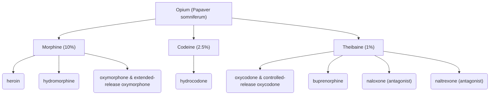

>[!abstract] Learning Objectives:
>- Learn about the historical uses of opium and opium extracts as analgesics, and the introduction of heroin in the late 19th century
>- Appreciate the contemporary use of opium and its major extracts and synthetic forms in the U.S.
>- Learn about the pharmacokinetic properties of some opioids, using morphine and heroin as examples

## Origin and Sources

### [[Designer Opioids]]

>"Designer" drugs are modified versions of controlled substances

Designer opioids improve upon the original formulation in terms of potency and price, and exist outside the purview of law
	e.g. [[Krokodil]], derived from codeine (desomorphine)
		known as "Russian heroin", it is a powerful analgesic that (due to its amateur chemistry makeup) when consumed, can result in gangrenous, scaly wounds

## History

__Early civilization__: called the poppy plant "hul gil" (joy plant), probably used for medicinal purposes
__9th Century__: Traders bring opium to China from other parts of Asia and the Mediterranean, originally also used for medicinal purposes
__1830s__: Opium addiction leads to the [[Opium Wars]] between Britain and China
__Mid-1800s__: Widespread use in Britain and the United States at all levels of society
	Was originally advertised as "cures", widely available (even by mail)
__1803__: [[Morphine]] was identified as the main active ingredient in opium
__End of the 19th century__: [[Heroin]] was introduced by the [[Bayer Company]] in Germany
	marketed as a cough suppressant lacking the addictive effects of morphine
	led to its banning in __1924__ due to evidence that it was just as addictive
__Early 20th century__:
- The misuse potential of morphine and heroin was realized
	Estimates of opioid-dependent people in the United States in __1900__ was about 250,000, but was likely triple that number
__1960s__:
- The Vietnam War led to American soldiers being introduced to heroin
- Cultural shifts resulted in greater public acceptance of drug experimentation
__1970 - Present__: Opioids are one of the most prescribed drugs

>Opioid prescriptions have been declining in recent years

>Despite this, we are still in the middle of an opioid epidemic in the U.S.

>A whopping 64% of ALL drug overdose deaths in the U.S. from April 2020 through April 2021 were specifically attributable to synthetic opioids, such as fentanyl

__During the COVID-19 Pandemic Lockdowns__:
- Growth in drug overdose deaths in 2020 was due to synthetic opioids like [[Fentanyl]] (more than 50% from 2019-2020)
- [[Psychostimulants]] (in particular [[methamphetamine]]) also increased in overdose deaths (almost 50% withinin a similar time period)

>Methamphetamine trafficked into the U.S. today is generally considered more potent and is often contaminated with, or used alongside synthetic opioids, raising the risk of fatal overdoses

## Pharmacokinetics
### Absorption

__Morphine__ is weak base with a pH of 8.5
- is poorly absorbed from the [[Gastrointestinal Tract]]

__Heroin__ can be consumed through:
- injection (IV), rarely used nowadays
- snuff ("chasing the dragon")
- smoked

Heroin passes through the [[Blood Brain Barrier]] easily, unlike morphine
- Heroin and codeine alike must be metabolized to morphine to act on the opioid receptor

Only about 15% of morphine gets absorbed when consumed orally

### Distribution
>Many opioids are bound to blood proteins, which extend their half lives