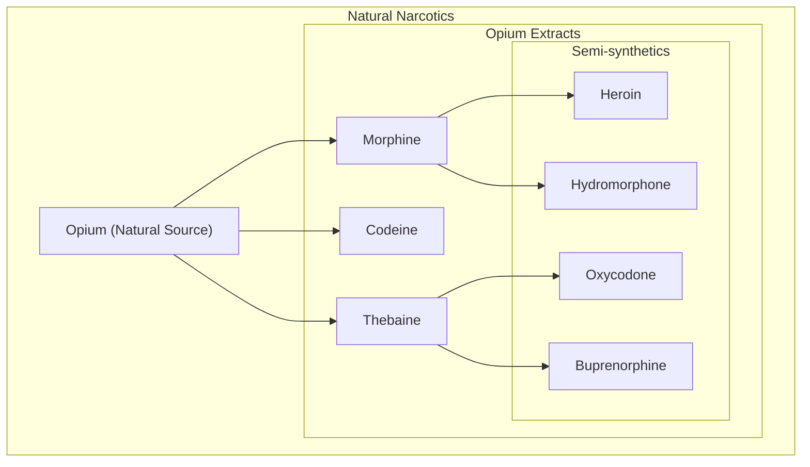
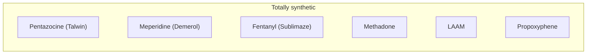

>[!abstract] Learning Objectives:
>- Discover the neuropharmacology of the opioid system, receptors, endogenous ligands, agonists/antagonists, and mechanisms of action on neural systems
>- Understand the *three principle effects* of opioids:
>	- Analgesia
>	- Euphoria
>	- Respiratory Depression

>We know [[Opioid]]s are highly reinforcing, so how do they work in the brain?

## Research on Opioid Receptors
>After a long search, opioid receptors were discovered in 1973.

There are four primary types of said receptors (all metabotropic):
- mu
- kappa
- delta
- ORL1 (nociception receptors)

>Endogenous opioid neuropeptides were discovered two years after opioid receptors

__[[Endorphin]]s__ - "[[morphine]] within"
>Originally isolated in the __1960s__ from 500 camel pituitary glands by a biochemist who studied fat metabolism

__[[Enkephalin]]s__ - "in the head"
>greatest affinity for delta receptors - discovered in __1975__

__[[Dynorphin]]s__ __(1979)__
	bind to the kappa receptor

__[[Nociceptin]]__ __(1995)__
	bind to the ORL1 receptor

### Forms of Opioids

>Neuropeptides are generally large molecules made up of many amino acids

### Distribution

>Opioid receptors are found throughout the brain, but are concentrated in the midbrain (periaqueductal gray - pain perception), thalamus, hippocampus, striatum, and olfactory bulbs

>The mu receptor is widely distributed throughout the brain adn spinal cord and is the most important opioid receptor for analgesia (reducing pain)

>Less is known about the functions of the delta and kappa receptors, except that they occur only in certain regions

>[!important]
>The principle effects of opioids are on analgesia (PAG), euphoria/reinforcement (VTA/NAc), and vital life functions (acting on brainstem regions controlling breathing, vomiting and coughing)

>[!important]
>Almost all exogenous opioid drugs with addictive properties act on the mu opioid receptor to exert their analgesic, euphoric, and sedating/brainstem effects

## Effects on Neurons

### Mu Opioid Receptor(s)

__Post-synaptically__: can activate a variety of K+ channels to hyperpolarize neurons (K+ flow out of the neuron), leading to a reduced firing rate of the neuron

__Pre-synaptically__: receptors inhibit voltage-gated calcium channels by activating G-proteins that close Ca2+ channels, leading to the inhibition of different neurotransmitters like [[Glutamate]], [[GABA]], [[Dopamine]], and [[Acetylcholine]]
	Opioids are therefore also __inhibitory neuromodulators__

>Overall effects are __*inhibitory*__

### Dopamine Reinforcement

>Beta-endorphins (and many esogenous opioids) bind to presynaptic mu-opioid receptors to inhibit Ca2+ channels and therefore block GABA release in the [[Ventral Tegmental Area]], which disinhibits dopamine neurons, leading to increased dopamine release in the [[Nucleus Accumbens]]

### Competitive MOR

#### Agonists
Agonists include [[Morphine]], [[Methadone]], [[LAAM]], [[Fentanyl]], and many more...

They possess mild/moderate binding affinity to mu-receptors

Short-acting forms (that give a strong "rush") include:
- heroin
- morphine
- fentanyl

Longer-acting forms (with a weaker "rush") include:
- codeine
- methadone
- LAAM

Their primary effects include analgesia and euphoria

Their side effects include:
- Respiratory depression (which can lead to death)
- Nausea and vomiting (emesis)
- Constipation (treatable with laxatives)
- Tolerance and physical dependance from chronic use
#### Antagonists
Antagonists include [[Naloxone]] and [[Naltrexone]]
	Antagonists work by competing for opioid binding sites and preventing exogenous opioid agonists (like heroin and fentanyl) from binding to MORs

These antagonists don't have any effect on their own

Naloxone has a high affinity for binding to MORs
- has a short half-life
- rapid onset when administered (usually IV/intranasally)
- often used to treat opioid overdose

Naltrexone has a longer duration of action
- blocks euphoric effects of opioids and similar drugs
- used to treat many substance disorders

## "Big Three" Effects
- Analgesia
- Euphoria/Reinforcement
- Respiratory Depression

>CNS effects are primarily euphoria and analgesia (due to enhanced dopamine release in the [[Nucleus Accumbens]])