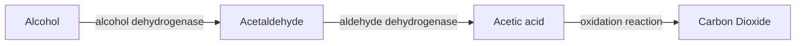
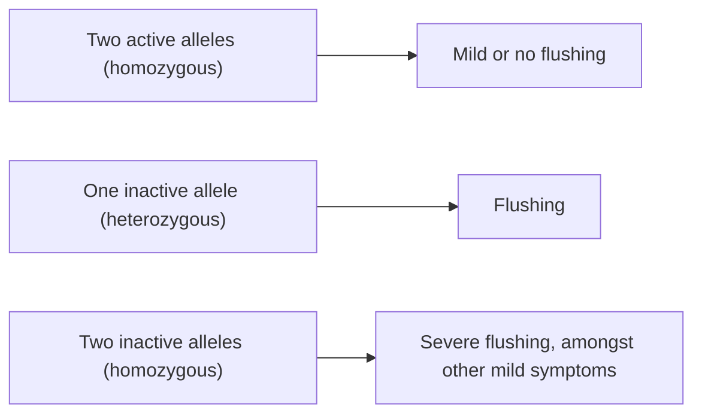

>[!abstract] Learning Objectives:
>- Learn about the absorption, distribution, metabolism, and excretion of alcohol (pharmacokinetics)
>- Discover the role of GABAA receptors and NMDA receptors in some of the physiological, subjective and behavioral effects of alcohol (pharmacodynamics)

## Pharmacokinetics
### Absorption
>Alcohol has somewhat unusual pharmacokinetic properties

Ethanol (found in alcohol) is a "small, neutrally charged molecule" that cannot be ionized
	However, it mixed with water and is easily absorbed in all parts of the gastrointestinal tract, capillaries, and the brain
- Ethanol is rapidly absorbed from the stomach (in about 1-2 minutes), leading to rapid brain accumulation

It takes about an hour for 90% of the alcoholic content of a drink to get into the brain
	This process is slowed down by the presence of food

#### Blood Levels of Alcohol After Oral Administration
>On average, biological females have lower levels of alcohol dehydrogenase (ADH) in their stomach than biological males - thus, on average, less alcohol is broken down and more enters the blood

The presence of food slows absorption and prevents a sharp peak in blood level

### Distribution
>Distribution depends on levels of body fat

>Alcohol distributes in water (more soluble) not in fat (less soluble)

### Metabolism
>About 15-17 mg of alcohol per 100mL of blood is metabolized per hour

>[!note]
>alcohol dehydrogenase + alcohol -> acetaldehyde (produces nausea)
>
>acetaldehyde dehydrogenase + acetaldehyde -> CO2 and H2O

#### Genetic Differences in aldehyde dehydrogenase gene (ALDH2)

### Elimination
Alcohol is eliminated at a constant rate

## Pharmacodynamics
>Two key neurotransmitter systems are involved in ethanol's subjective effects and the development and dependence with chronic use

- __[[GABA]]-A__ Receptors: Inhibitory
	ionotropic GABA receptor, which ethanol is an agonist of
- __[[NMDA]]__ (N-methyl D-aspartic acid) Receptors: Excitatory
	an ionotropic glutamate receptor, which ethanol is an antagonist of

### Effects on [[GABA]]
>Alcohol is a noncompetitive agonist of GABA-A receptors

Alcohol is a positive allosteric modulator, meaning it enhances the inhibitory effects of GABA by increasing teh frequency and duration of chloride channel openings, while decreasing the duration of its closing

Through the GABA-A receptor, alcohol has an effect on:
- __[[Prefrontal Cortex]]__: deficits in decision making and inhibition
- __Subcortical regions__: changes in arousal, attention, memory, and mood
- __[[Cerebellum]]__: loss of balance, coordination, and motor control

>Alcohol produces __anxiolytic__ and __sedative__ effects through potentiating GABA-A receptor activity

This leads to a down-regulation of some GABA receptor subtypes
### Effects on [[NMDA]]
>Alcohol (ethanol) also acts on specific glutamate receptors called __NMDA__ receptors (NMDAR)

NMDARs are in the brain and spinal cord
	they play an important role in learning and memory, as well as general cortical function

>NMDARs are ion channels that permeate Ca++, Na+, and K+ ions (ionotropic receptors)

>Alcohol is a noncompetitive antagonist of NMDARs

Ethanol molecules block the central pore of the receptor
	When NMDARs are blocked by ethanol, long-term potentiation cannot take place
	- this process is fundamental to memory formation
- Ethanol also prevents the formation of new neurons in the hippocampus
	this explains the memory impairments observed with alcohol use
