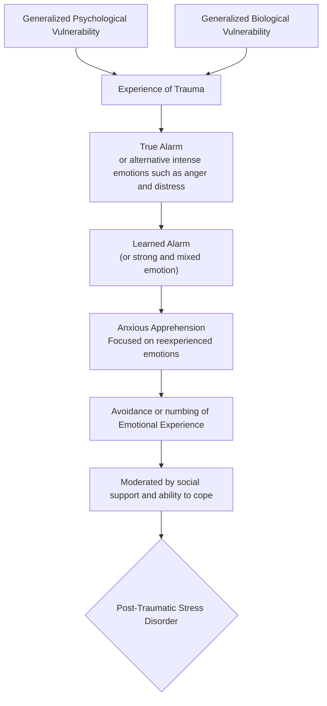

## Overview of Stress Disorders
### [[Post-Traumatic Stress Disorder]]
- __Trauma Exposure__ is necessary
>Must be significant sequelae affecting *avoidance, alterations in cognition/mood, arousal, reactivity*
- Must continue for at least a month after the trauma

>3.5% annual prevalence; 6.8% lifetime prevalence

>[!important]
>>Most people who experience traumatic events do _not_ develop PTSD
>
>This can be due to mitigating factors such as the type of trauma and the proximity to said trauma

#### Criteria
- __Trauma Exposure__
- (1 or more) __Intrusion__ symptom
	- Recurrent, distressing memories
	- Recurrent dreams
	- Dissociative reax, eg flashbacks
	- Distress at exposure to rel. content
	- Phys. reax to symbolic cues of event
- (1 or more) __Avoidant__ symptom
	- Avoidance of memories
	- Avoidance of external cues
- (2 or more) __Negative Alterations in Cognition/Mood__
	- - Amnesia for aspects of event
	- Neg. beliefs re: self/world/others
	- Distorted cog. re: cause
	- Neg. emot. state
	- Reduced interest in activities
	- Detachment from others
	- Unable to experience pos. emotions
- (2 or more) __Alterations in Arousal/Reactivity__
	- Irritable, angry behavior
	- Reckless, self-destructive behavior
	- Hypervigilance
	- Exaggerated startle
	- Problems with consciousness
	- Sleep disturbances
- Symptoms __last longer than one month__
- __Significant impairment in social and occupational functioning__

### Complex Post-Traumatic Stress Disorder
> Complex PTSD involves the core symptoms of PTSD plus additional groups of symptoms

Additional symptoms include:
- difficulty in regulating emotions
- altered attention and consciousness
- difficulties in relationships
- somatic stress
- hyperarousal
- avoidance of reminders and triggers
- flashbacks, nightmares, reexperiencing
- belief systems affected
### [[Acute Stress Disorder]]
May be diagnosed in first month after trauma
- Was added to the [[DSM-5]] to increase access to treatment
	If treatment is accessed earlier it can lead to a better prognosis
- its basic symptoms are similar to that of 

### A Model of the Causes of PTSD

### Treatment of PTSD
- [[Judith Herman]]'s Model (Trauma and Recovery)
	1. __Stabilization__
	2. __Integration__
	3. __Reconnection__
- Bottom-Up (brain-based model)
	1. __Regulate__
	2. __Relate__
	3. __Reason__
- __Cognitive-behavioral__ treatment
	- Exposure treatment
	- Increase positive coping skills
	- Increase social support
		Considered highly effective
- __Medication__
	targets symptoms, not the disorder
- [[SSRI]]s
- [[Benzodiazepine]]
- Sleep medications (to help with disrupted sleep)

### Alternative Diagnoses Related to Stress
#### [[Prolonged Grief Disorder]]
>prolonged adaptation to the loss of a loved one; grief may even intensify with time 
#### Adjustment Disorder(s)
>anxious or depressive reactions to life stress that are generally milder than would be seen in acute stress disorder or PTSD but still impairing
#### Attachment Disorder(s)
>disturbed and developmentally inappropriate behaviors in children
- __Reactive Attachment Disorder__: lack of bonding between child and caregiver
- __Disinhibited Social Engagement Disorder__: child shows no inhibitions around adults
## Dissociative Disorders

>Severe alterations or detachments from reality
>	Affect personality, memory, and/or consciousness

These disorders involve __depersonalization__ and __derealization__

Types of dissociative disorders (according to the [[DSM-5]])
- __[[Depersonalization/Derealization Disorder]]__
- __[[Dissociative Amnesia]]__
	* (may involve dissociative fugue*)
- __[[Dissociative Trance]]__
- __[[Dissociative identity Disorder]]__
### More on DID
DID was formerly known as multiple personality disorder or "split personality"

DID's defining feature is the dissociation of personality
>- Adoption of several new identities (as many as 100; may be just a few; average is 15
>- Identities display unique behaviors, voice, and postures
>- **Alters** – different identities or personalities
>- Host – the identity that keeps other identities together
>- Switch – quick transition from one personality to another
>- Mutually amnesic, mutually cognizant, or one-way amnesic relationships between alters

As far as prevalence, remains at less than two percent of the population
	It's more common in females
	Commonly onset in childhood or adolescence

DID has high comorbidity rates with other psychological disorders

Typically follows lifelong, chronic course