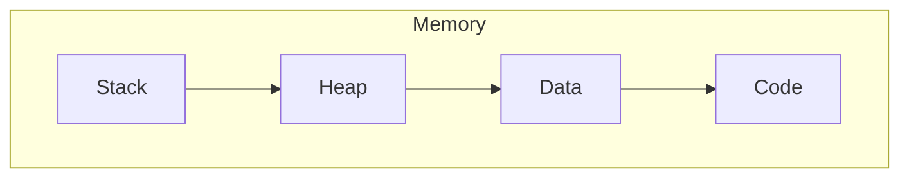

__RAM__ (Memory):
- Super-fast
- Temporary
- Small

__Memory__: Organized into different neighborhoods

__Stack Frame__: Holds all the data for a function call such as
- Function parameters
- Local variables
- Return address

__Stack Overflow__: When a stack has too many "plates"

| Stack                                                 | Heap                             |
| ----------------------------------------------------- | -------------------------------- |
| Fixed size, known at compile time                     | Variable size                    |
| Super fast access                                     | Slower access                    |
| Automatic cleanup (plates removed when function ends) | Manual management needed         |
| Limited space                                         | Lots of space                    |
| Scalar types, arrays, tuples                          | `String`, `Vec`. `HashMap`, etc. |
__String__: Contains the metadata on the stack (pointer, length, capacity)
- The actual text lived on the heap

__&str__: A pointer and length of the stack, where the actual text is borrowed from another String

