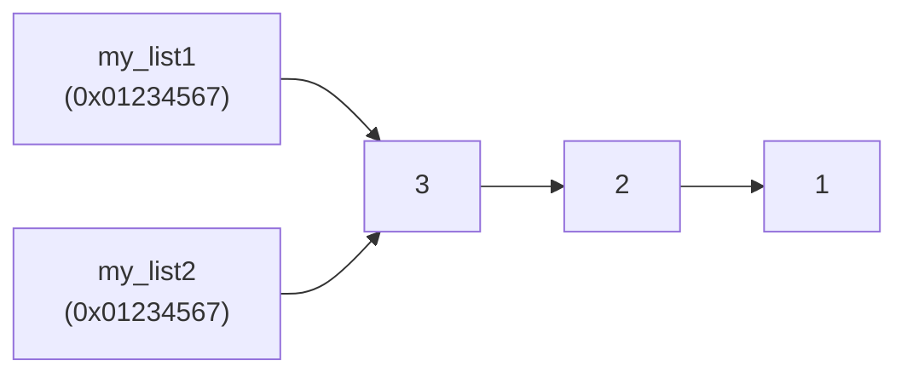
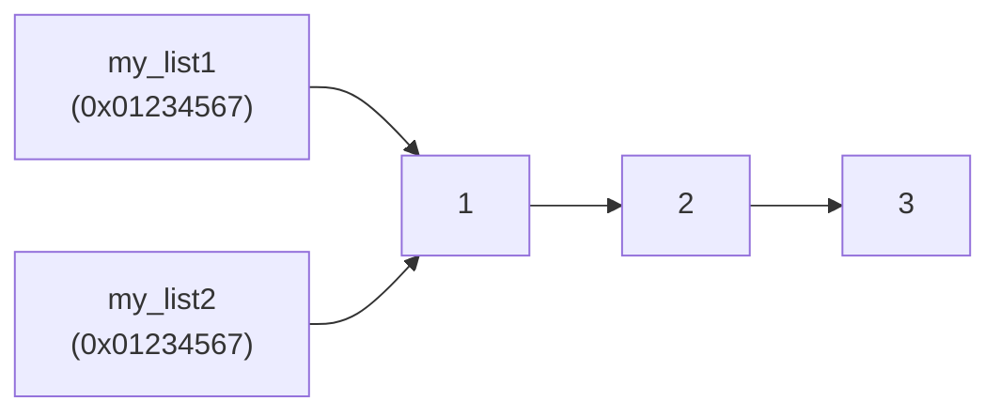

__While Loops__: Keep the program running while condition(s) remain true

__Lists__: Package together an arbitrary number of values

## While Loops
```run-python
string = input('Enter a number: ')

while string != 'stop':
    print(string + ' squared is ' + str(int(string) ** 2))
    string = input('Enter a number: ')
print('Done.')
```

>*A while loop allows a program to keep going by circling back to an earlier point in the program*
>
>*When the line with while is reached, the condition is checked*
>	*If it's True, we proceed to execute the while's indented block*
>	*If it's False, execution jumps to after the while block*

__Iteration__: A single pass through the while block's code

__Iterate__: To pass through said while block multiple times

```python
# commonly used short hand
variablename += 1

# ... is short for
variable = variable + 1
```

## Lists

__Lists__: data structures that hold multiple piece of data

>*Lists are objects, bundles of data with associated functions called methods*

## Memory
>*When a variable pointing to a list is assigned to another variable, the address is copied, and both variables will be holding that same address. So if something like a sort() changes that list, both variables will see the change*

```python
my_list1 = [3, 2, 1]
my_list2 = my_list1
my_list1.sort()

print(my_list1)
print(my_list2)
```

__Before sorting:__

__After sorting:__

>*If this is undesirable and you want to creat a new copy of the list that changes separately, my_list.copy() returns a copy of the new list*

```run-python
my_list1 = [3, 2, 1]
my_list2 = my_list1.copy()

my_list1.sort()

print(my_list1)
print(my_list2)
```
