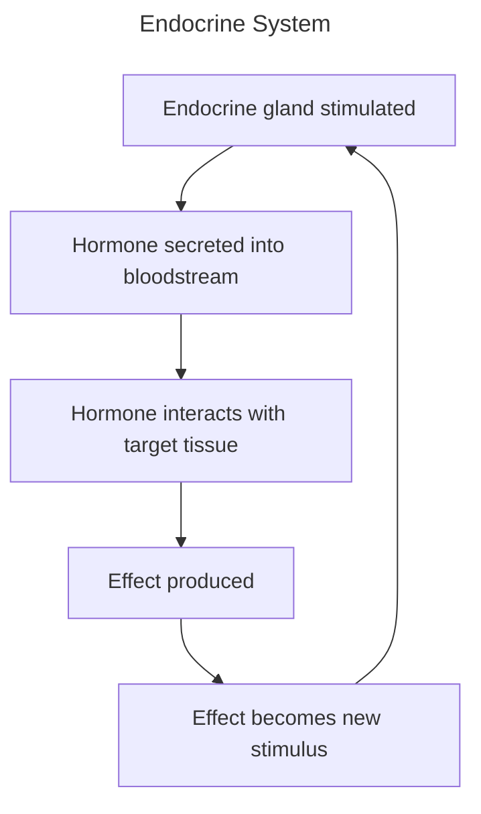
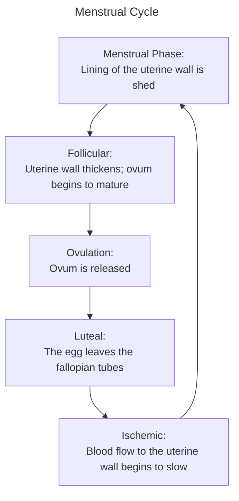

# EMS Systems
__EMS__: The first medical professionals to see, assess, and treat; function as a rescuer and transporter

__EMS System__: A team of health care professionals that provide emergency care and transport
- Governed by state and local laws

__Emergency Medical Responder__ (EMR): Trained to initiate immediate care and to assist EMTs upon arrival
- Law enforcement, firefighters, park rangers, ski patrol

__Emergency Medical Technician__ (EMT): Have essential knowledge and skills for basic emergency care in the field with a focus on immediate stabilization and transport to definitive care, including training in
- Defibrillation
- Airway adjuncts
- Assisting patients with some medications

__Advanced EMT__ (AEMT): An EMT with additional knowledge and skills in advanced life support such as:
- Intravenous (IV) access
- Advanced airway adjuncts
- Administration of some medications

__Paramedic__: Extensive training in advanced life support skills as the highest level of prehospital provider, possessing skills in
- Advanced airways
- IV therapy management
- Cardiac monitoring
- Medication/drug administration

__Public Safety Access Point__ (PSAP): The point of contact after 911

__Medical Director__: Authorizes EMTs to provide medical care in the field by creating a set of protocols for each injury or illness encountered in the field

__Off-line/Standing Orders__: Protocols developed by medical directors prior to clinical interactions

__Online Direction__: Protocol developed by medical directors upon or during clinical interaction

__Health Insurance Portability and Accountability Act of 1996__ (HIPAA): Related to patient privacy and data distribution standards

__Emergency Medical Treatment and Active Labor Act__ (EMTALA): Ensures equal access to emergency care regardless of financial status

__Affordable Care Act__ (ACA): Regulates access to healthcare, informing EMS call volume and distribution

__Health System Integration__: Prehospital care is coordinated with hospital care, such that integration ensures comprehensive continuity of care for the patient

__Mobile Integrated Health Care__: A method of delivering health care on the prehospital spectrum

__Evaluation__: Quality control within EMS, where quality improvement and patient safety are the criteria for proper evaluation

__Continuous Quality Improvement__ (CQI): A proactive process of self-evaluation based on capitalizing on strengths and addressing challenges through review and audits to identify areas of improvement and/or assign remedial training with the ultimate goal of minimizing errors
- Uses a Plan-Do-Study-Act Cycle

__Errors__: Three different kinds
- Rule-Based: Acting outside of protocols and scope of practice
- Knowledge-Based: Acting erroneously within scope due to lack of education
- Skill-Based: Equipment or techniques not used correctly due to lack of understanding

__Prevention__:
- Primary: Reducing or preventing injury, illness, or disaster from happening
- Secondary: Reducing the effects of injury, illness, or disaster

__Evidence-Based Medicine__: Focusing on procedures that have proven useful in improving patient outcomes

__EMT-B Responsibilities__:
- Keep vehicle and equipment ready
- Remain familiar with emergency vehicle operation
- Ensure safety and patient privacy
- Provide on-scene leadership
- Perform scene evaluation and patient assessments
- Call for additional resources as needed
- Gain patient access
- Give emergency medical care while awaiting additional medical resources
- Give emotional support
- Maintain continuity of care
- Resolve emergency incidents
- Uphold medical and legal standards
- Give administrative support
- Constantly continue professional development
- Cultivate and sustain community relations
# Medical Terminology
## Topographical Anatomy

__Standard Anatomical Position__ is:
- standing
- facing forward
- arms at side
- palms facing forward
>*This position is the basis of anatomical position*

__Proximal__: closer towards the heart

__Distal__: farther away from the heart

__Fowler's Position__: Seated upright, legs may be bent

__Prone Position__: facing down

__Supine Position__: Face up

__Trendelenburg Position__: 45 degree incline

>[!important]
>*Make sure to secure patient above the shoulders to prevent them from sliding off*

__Modified Trendelenburg Position__: Supine, with legs elevated

__Lateral Recumbent Position(s)__: On their left/right side
## Directional Terms

__Planes of the Body__: Imaginary straight lines that divide the body into sections that are used as anatomical reference point

>[!important]
>*Right and left refer to the patient's right and left sides*

__Anterior__ (ventral): Front surface of their body

__Posterior__ (dorsal): Back surface of the body

__Midaxillary__: An imaginary vertical line from the middle of the armpit to the ankle

__Midline__: imaginary line through the middle of the body, dividing the body into left and right

__Midclavicular__: imaginary vertical line through the midportion of each clavicle

__Medial__: towards the midline

__Lateral__: towards the midclavicular

__Superior__: closer to the head

__Inferior__: farther from the head 

__Superficial__: closer to the surface of the skin

__Deep__: farther into the skin

__Apices__: Tip or topmost portion of a structure (usually lungs/heart)

__Bases__: bottom portion of a structure

__Bilaterally__: appearing on both sides of the midline

__Unilaterally__: appearing on one side of the midline
## Cells to Systems

__Cells__: basic units of function and life in the human body
- every cell in the body requires oxygen, nutrients, and the removal of wastes to survive
- cells produce energy to survive

__Tissues__: cells that share a common function

__Organs__: groups of tissues that perform similar or interrelated jobs

__Body systems__: organs with similar function working together

### Cellular Metabolism

__Aerobic metabolism__: uses oxygen
- makes lots of ATP efficiently
- Produces CO2 (diffused into blood) and water (combines with CO2, travels to lungs and separates again) as waste

__Anaerobic metabolism__: does not use oxygen
- makes only a bit of ATP
- Produces lactic acid as waste

__Perfusion__: the process of delivering fluids, such as blood, to an organ or tissue

__ATP is the__: Basic energy molecule used in nearly every cellular process

__CO2__: Diffuses out of cells into the blood, combining with water to form acid.

__Respiration rate will vary to__: Carefully control the amount of acid in the blood

__Perfusion__: A process where:
1. Respiratory system brings in oxygen and removes carbon dioxide
2. Digestive system extracts sugars, proteins, and fats from food
3. Circulatory system transports nutrients to and wastes from cells

__Factors Required for Survival__:
- composition of ambient air
- patency of the airway
- mechanics of ventilation
- regulation of respiration
- ventilation/perfusion ratio
- transport of gases
- blood volume
- effectiveness of the heart as a pump
- vessel size and resistance
- effects of acids on cells and organs
## Human Body

__Parts of the Human Body__:
- head
- neck
- thorax
- abdomen
- pelvis
- extremities

__Systems of the Human Body__:
- Musculoskeletal
- Respiratory
- Circulatory
- Nervous
- Integumentary (skin)
- Digestive
- Endocrine
- Urinary
- Reproductive

__Thorax__: Includes the:
- heart
- lungs
- aorta, superior and inverior venae cavae
- esophagus
- diaphragm

__Abdominal Cavity__: includes
- ![[Pasted image 20250127183749.png]]
__Skeletal System__: Composed of 206 bones, it gives the body its shape. protects fragile organs. allows for movement, stores calcium, and helps create blood cells

__Axial Skeleton__: Includes the:
- Skull 
- Facial Bones
- Spinal Column
- Rib Cage

__Appendicular Skeleton__: Made up of:
- Joints
- Upper Extremity
- Pelvis
- Lower Extremity

__Skull__: Made up of:
- Cranium
- Facial Bones (14 different bones)

__Cranium__: Made up of the frontal (forehead), parietal (sides/crown of head), temporal (lateral portion of cranium), and occiput (posterior part of cranium) bones

__Sphenoid__: Basilar Skull (in between)

__Spinal Column__: 33 bones (vertabrae)
- 7 cervical bones
- 12 thoracic bones (and 12 pairs of ribs)
- 5 lumbar bones
- 5 sacrum
- 4 coccyx

__Lumbar Spine__: largest, strongest in body
- Spinal cord ends at L1-2 and extends as individual nerves to pelvis/legs

__Sacrum__: used by 16-18 

__Coccyx__:

__Spinal Column__: central supporting structure of the body
- encases and protects the spinal cord
- intervertebral discs are between vertebrae
- nerves branch from the spinal cord between vertabrae to form the motor and sensory nerves of the body

### Thoracic Bones

__Sternum__: consists of three bones
- manubrium (upper quarter)
- body (middle)
- Xiphoid process (interior portion)

__Ribs__:
- ribs 1-10 are attached to the sternum
- ribs 11/12 are floating

__Upper Extremity__: from pectoral girdle to fingertips
- arms
- forearms (radius and ulna)
- hands
- fingers
- humerus
- radius on lateral side
- ulna on medial side

__Bones of the Hand__:
- phalanges (14)
- (metacarpals (5) (bones of the hand)
- carpals (8) (bones of the wrist)
- carpometacarpal joint

__Pelvls__:
- sacrum
- coccyx
- two coxae (hip bones)
- pelvic bones formed by fusion of ilium, ischium, pubis
- posteriorly (ilium and ischium)
- anteriorly (pubis symphasis joins the two pubis)

__Femur__: longest bone in the body
- greater and lesser trochanter (where the major muscles of the thigh connect to the femur)

__Hip joint__: greater trochanter of the femur

__Bones of the foot__:
- 7 tarsal bones
- 5 metatarsal bones
- Toes are formed by phalanges

__Joints__: formed where bones connect to other bones
- most allow motion
- some are fused (skull)
- bone ends of a joint are held together by ligaments
- joints with fewer ligaments will be freer to move (like the shoulder)

__Finger__: hip joint

__Knee__: hinge joint

__Hip Joint__: ball and socket

__Special joints__: Atlas and Axis (pivot joints)

__Saddle Joint__:

__Condyloid__:

__Gliding__:

## Musculoskeletal System
Includes bones, muscles, and connective tissue, helps give the body shape, support upright posture, protects internal organs, and provides for movement

__Tendons__: muscle to other tissue

__Ligaments__: non-muscle tissue

__Cartilage__: structural tissue

__Types of muscle anatomy__: involuntary and voluntary
- involuntary: smooth and cardiac
- voluntary: skeletal

__Involuntary Muscles__: carry out automatic muscular functions of the body, respond automatically to stimuli
- found in the walls of tubular structures of:
	- gastrointestinal tract
	- urinary system
	- blood vessels
	- bronchi
- controls the flow of contents through these structures
- contrats when the muscle contracts

__Cardiac Muscle__:
- works from gestation to death

__Voluntary Muscle__:
- attached to bones by tendons
- major muscle mass of the body
- body movement results from voluntary muscle contraction and relaxation
- controlled by the brain and nervous system
- supplied with nerves, veins, and arteries
- electrical impulses travel from the brain to each muscle via the spinal cord and peripheral nerves

__Flexation__: reduces the angle between bones

__Extension__: increases the angle between bones

__Adduction__: motion towards the midline of body

__Abduction__: motion away from the midline

__Supination__: rotation of the forearm so that the palm faces anteriorly

__Pronation__: rotation of the forearm so that the palm faces posteriorly

__Dorsiflextion__: flextion of the entire foot superiorly

__Plantarflexion__: flextion of the entire foot inferiorly

__Inversion__: Movement of the sole towards the midline

__Eversion__: Movement of the sole away from the midline

## Respiratory System

__Upper Airway Anatomy__: includes
- nose
- mouth (oral cavity)
- tongue
- jaw (mandible
- larynx
- pharynx
- trachea
- __Hyoid bone__: supports tongue, makes speech possible
- __Thyroid cartilage__: Adam's apple
- __Cricoid cartilage__: the only full ring of cartilage in the upper airway

__Trachea__: lower airway
- supported by incomplete rings of cartilage
- ends at carina and divides into right and left main bronchi

__Lower Airway Anatomy__: Includes:
- Thyroid cartilage
- Adam’s apple 
- Cricoid cartilage: immediately below the thyroid cartilage
- Cricothyroid membrane 
- Trachea 
- Ends at carina, dividing into right and left bronchi leading to bronchioles

__Lungs__:
- held in place by the trachea, arteries/veins, and pulmonary ligaments
- divided into two lobes
	- the right lung has an upper, middle, and lower lobes
	- the left lung only has upper and lower lobes

__Bronchi__:
- branches within the lungs into increasingly smaller airways
- each bronchus supplies air to one lobe of the lung

__Pulmonary Arteries__:
- leave the right side of the heart carrying blood to the lungs
- blood exchanges carbon dioxide for oxygen in alveolar capillaries
- pulmonary veins return blood to left side of heart

__Diaphragm__: dome-shaped muscle divides abdomen from thorax
- control is both involuntary and voluntary

>[!important]
>The brain and nervous system can only survive 4-6 minutes without oxygen

>*Diaphragm is the primary muscles of breathing*

>The cervical, pectoral, intercostal, and abdominal muscles are also involved

When you breathe
- air flows into the lungs
- diaphragm moves downward
- ribs move upward and outward
- thoracic cavity size increases
	- lung pressure decreases
- air moves into lungs

When you _exhale_:
- diaphragm and intercostal muscles relax
- thorax cavity size decreases
	- lung pressure increases
- air flows out of lungs

__Respiration__: The exchange of oxygen and carbon dioxide in the alveoli and tissues

__Diffusion__: Passive process in which molecule move from an area of higher concentration to an area of lower concentration

__During the exchange of CO2 and O2__:
1. Oxygen-rich air enters alveoli during each inspiration
2. Oxygen-poor blood in capillaries passes around the alveoli
3. Oxygen enters the blood as carbon dioxide enters the alveoli
4. Oxygen-rich blood exits in the pulmonary veins

In healthy individuals: CO2 levels increase or decrease proportionally to the respiratory rate

__CO2 increases__: Acidity in blood, which is detected by the brain, causing signaling to the respiratory muscles to contract

__Ventilation__: Simple air movement into and out of the lungs through chest rise and fall

__Tidal Volume__: Amount of air moved into or out of the lungs during a single breath

__Residual Volume__: The gas that remains in the lungs to keep the lungs open

__Inspiratory Reserve Volume__: The deepest breath one can take after a normal breath

__Expiratory reserve Volume__: The maximum amount of air that can be forcibly expelled after a normal breath

__Dead Space__: The portion of the respiratory system that has no alveoli and where little or no exchange of gas between air and blood occurs
- The average adult has about 150mL of dead space

__Minute Volume__: The amount of air that moves in and out of the lungs in a minute
- Used to assess ventilation adequacy
- Equal to Respiratory Rate x Tidal Volume

## Circulatory System

__Circulatory System__: A complex arrangement of connected tubes, composed of arteries, arterioles. capillaries, venules, and veins that transports nutrients, wastes, water, hormones, and heat
- Separated into two circuits: systemic (body) and pulmonary (lungs) circulation

__The heart makes sounds when its valves close__:
- A "lub" when the ventricles contract
- A "dup" when the ventricles relax

__Signal conduction in the heart__:
1. Impulse begins in the right atrium at the sinus (SA) node
2. Impulse travels to the atrioventricular (AV) node
3. Impulse moves from the AV node moves through the Purkinje fibers to the myocardium of the ventricles
4. This system can be disrupted if the heart is deprived of oxygen, injured, or dies

__ECG Waves__: A visualization tool where each contraction is associated with two electrical processes
- __Depolarization__: Electrical charge activates heart cells
- __Repolarization__: Heart returns to resting state

__The heart's normal resting rate is at__: 60-100 bpm

__Stroke Volume__: Amount of blood moves by one beat

__Cardiac Output__: Amount of blood moved in minute
- Calculated by Heart Rate x Stroke Volume

__Capillaries__: About the thickness of a single red blood cell, exchange gases, nutrients, wastes and hormones

__Arteriole__: Connects arteries to capillaries

__Artery__: Carries blood away from the heart

__Vein__: Returns blood to the heart
- Increase in size as they get closer to the heart

__Major veins of the heart include the__:
- Superior and inferior vena cava
- Jugular
- Pulmonary

__Venule__: Connects veins to capillaries

__Aorta__: A part of the heart that branches into:
- Coronary
- Carotid
- Hepatic
- Renal
- and Mesenteric Arteries

__Pulmonary Artery__: Carries oxygen-poor blood to the lungs

__Arteries branch into__: Smaller arteries and then into arterioles
- They branch into a series of increasingly smaller vessels until they connect to the capillaries

__Spleen__: Organ located under the rib cage in the left upper quadrant of the abdomen that filters worn-out blood cells, foreign substances, and bacteria from the blood
- Is highly vascular and is particularly susceptible to injury from blunt trauma

__Plasma__: Composed of water, electrolytes, and hormones, it is a fluid that carries blood cells and nutrients

__Blood__: Composed of plasma (about 55%) and other cells (about 45%), which includes erythrocytes (red blood cells), leukocytes (white blood cells), and platelets, as well as other nutrients, cellular waste, and other hormones. Its main functions are to:
- Fighting infection, transporting oxygen
- Transporting carbon dioxide
- Controlling pH
- Transporting waste and nutrients
- Clotting (coagulation)

__Erythrocytes__: Filled with hemoglobin (which binds to oxygen and gives it color), used to carry oxygen to the organs

__Leukocytes__: A part of the body's immune system, it fights infections and removes toxins

__Platelets__: Essential for the formation of blood clots

### Resistance and Pressure

__Resistance__: Reducing the diameter of arteries and veins which increases the resistance to blood flow

__Pressure__: The flow of blood against resistance

__The body's primary means to increase blood pressure is through__: Constriction of vessels

__Systemic Vascular Resistance (SVR)__: The state of the blood vessels
- Normal blood flow is characterized by low pressure and high volume

__Systolic Blood Pressure__: Pressure within the artieries when the heart is contracting

__Diastolic Blood Pressure__: Pressure within arteries when the heart is at rest

__Pulse Pressure__: The main difference between systolic and diastolic blood pressure

__Preload__: Amount of blood returning to the heart

__Afterload__: Pressure to be overcome when the left ventricle contracts

__Pulse__: Occurs when the left ventricle contraction sends a pressure wave of blood through the arteries, occurs stronger in larger vessels and closer to the heart
- Can be palpated when an artery is near the skin surface

__Blood vessels have _ adrenergic receptors__: Alpha

__The heart and lungs have _ adrenergic receptors__: Beta-1 and 2

__Baroreceptors__: Sense pressure in the blood vessels

## Nervous System

__Nervous System__: The most complex organ in the body, it is divided into the central and peripheral nervous system

__Cerebrum__: Occupies nearly all of the cranial cavity, controlling sensation, thought, conscious movement, and associative memory

__Cerebellum__: Coordinates muscle activity and balance

__Brainstem__: Maintains basic vital life functions such as respiration, cardiac function, and vasomotor centers

__Lobes of the Brain__:
- Frontal: in charge of problem solving, planning, word production, behavioral control, and emotino
- Parietal
- Temporal: Emotional memory and word understanding
- Occipital: Vision

__Cerebrospinal Fluid__: Cushions and protects the brain and spinal cord

__Circulation in the head__: Oxygenated blood is supplied via carotid arteries, and deoxygenated blood is drained by the internal and external jugular veins

__Spinal Cord__: Connects the brain to the rest of the body as a bundle of nerves from the foramen magnum to the lumbar spine
- Ends between the first and third lumbar vertebrae as smaller nerve branches

__Kinds of nerves__:
- Cranial: Carry information from within the brain directly to muscle, glands, and internal organs
- Somatic Sensory: Carry information fro the body to the spinal cord and brain
- Somatic Motor: Carry information from the brain and spinal cord to the body
- Autonomic: Carry information to the regulation of essential body functions

__Autonomic Nervous System__: In charge of involuntary essential body functions such as heart rate and blood pressure

__Neurotransmitters__: Chemical signals that are released by neurons to send message to other cells

__Hormones__: Chemicals that travel through the bloodstream to send messages

__Receptors__: Molecules in tissue that receive chemical messages

## Integumentary System

__Integumentary System__: The skin and largest organ in the body. made to protect the body from the environment, regulate body temperature, and transmit information from the environment to the brain
- Epidermis:
	- Stratum Corneum: Outer layer of dead cells that is waterproof, preventing microorganism invasion
	- Germinal Layer: Where new cells grow and pick up pigment
- Dermis: Contains the vital systems of the skin, including
	- Blood vessels
	- Sweat glands
	- Nerves
	- Hair follicles
	- Sebaceous glands
- Subcutaneous: Contains adipose tissue (composed of elastin, collagen fibers, microphages, and more blood vessels)
## Gastrointestinal System

__Gastrointestinal System__: Composed of

__Abdomen__: Containing the major organs of digestion and excretion, it is divided into four main quadrants
- Right-Upper: Contains the
	- Liver
	- Gallbladder
	- Colon
	- Right Kidney
	- Pancreas
- Right-Lower: Contains the
	- Appendix
	- Colon
	- Bladder
	- (in women) Ovaries
- Left-Upper: Contains the
	- Stomach
	- Spleen
	- Colon 
	- Left Kidney
	- Pancreas
- Left-Lower: Contains the
	- Colon
	- (in women) Ovaries

__Saliva__: Made up of approximately 98% water and 2% mucus, salts, and other organic compounds

__The pathway of the digestive system is__:
1. Mouth: Processes food
	- Lips. cheeks, gums, teeth, and tongue
	- Salivary glands: Two sets on each side of the mouth and in front of each ear.
2. Esophagus: Covers the trachea and esophagus, which prevents the inhalation of food
3. Stomach: A hollow organ that recieves food, stores it, and provides its movement into the bowel
	- Secretes acid to help break down food
	- Contracts to mix with gastric juices and break into smaller particles
4. Small intestine
5. Large intestine
6. Rectum

__Pancreas__: Flat, solid organ that lies below and behind the liver and stomach. It is divided into the:
- Exocrine: Secretes pancreatic juice containing enzymes that aid in digestion of fat, starch, and protein
- Endocrine (islets of Langerhans): Produces insulin and glucagon

__Liver__: Large solid organ located immediately beneath the diaphragm in the lower quadrants, filtering harmful substances, forming the factors needed for blood clotting and normal plasma production, and storing sugar or starch for immediate use by the body for energy

__Gallbladder__: Stores bile between meals

__Bile ducts__: Connecting the liver to the intestine, carries bile from the liver to the gallbladder to the duodenum

__Intestine__: Divided into two parts:
- Small Intestine: Mainly absorbs nutrients and water
	- Divided into the duodenum, jejunum, and ileum
- Large Intestine: Absorbs the rest of the water and condenses wastes into feces
	- Divided into the cecum, colon, and rectum

__Appendix__: A 3-4 inch long tube that opens into the cecum in the Right-Lower Quadrant of the abdomen

__Rectum__: Stores feces for excretion

## Lymphatic System

__Lymphatic System__: Its main role is ot support the circulatory and immune systems, Includes the
- Spleen
- Lymph and its vessels and nodes
- Thymus gland

__Lymph__: A thin, straw-colored fluid that carries oxygen and nutrient to cells and waste products away

__Spleen__: Helps get rid of toxins and harmful material from the body

## Endocrine System

__Endocrine System__: A complex message and control system, it integrates many body functions such as the
- Hypothalamus
- Pituitary
- Other related glands

__Hypothalamus__: Connects the brain to the endocrine system, controlling body temperature, hunger, thirst, and circadian cycles

__Pituitary__: Controls the rest of the endocrine system

__Glands of the Endocrine System__: Includes the:
- Adrenals: Produces epinepherine
- Thymus: Directs the development of the immune system before puberty
- Pancreas (Islets of Langerhans): Secretes insulin
- Testes/Reproductive: Male/female reproductive organs
- Parathyroid: Regulates calcium and phosphorus in bones
- Thyroid: Controls rate of metabolism, growth and development

## Immune System

__Immune System__: Provides protection against extraneous and invasive bacteria and viruses, composed of three lines of defense
- Anatomic Barriers: Skin and mucosae
- Inflammatory Response: Internal and nonspecific
- Immune Response: Internal and specific

__Active Immunity__: A form of long-term immunity resulting from the formation of memory cells after infection (vaccine-induced or otherwise)

__Passive immunity__: A form of short-term immunity resulting from antibodies provided to the individual

__Spleen__: Center of the immune system concentrated with lymphocytes

## Urinary System

__Urinary System__: In charge of removing wastes fromt eh blood, as well as control fluid balance in the body and controlling pH balance

__Kidneys__: Two solid organs that lie in the retroperitoneal space that rid the blood of toxic waste products and control the balance of water and salt in the body

__Ureter__: Passes from each kidney to drain into the urinary bladder

__Bladder__: Located immediately behind the pubic symphysis in the pelvic cavity, composed of smooth muscle which empties into the urethra
- A healthy adult forms about two liters of urine a day

__Urethra__: Pushes urine out

## Reproductive System

__Reproductive System__: Varies widely in anatomy between men and women, but in general in charge of producing gametes and sex hormones
- This system is in charge of regulating development and maturation

__Male Reproductive System__: Largely lies outside the pelvic cavity (except for the prostate and seminal vesicles)
- Testicles
- Epididymis
- Vasa deferntia
- Prostate gland
- Seminal vesicles
- Penis

__Female Reproductive System__: Contained almost entirely within the pelvic cavity (except for the clitoris and labia)
- Ovaries
- Fallopian tubes
- Uterus
- Cervix
- Vagina

# Pathophysiology
## Respiratory Compromise

__Homeostasis__: maintaining a relatively stable internal state by regulating physiological processes

Severe disruption of homeostasis for which the body is not able to immediately compensate can lead to damage, disease, or death

__Disease__: disruption/dysfunctions of physiologic processes

__Trauma__: physical disruption of physiologic function

__Factors under Homeostatic Control__ include:
- Composition of ambient air
- Patency (unobstruction) of the airway
- Mechanics of ventilation
- Regulation of respiration
- Ventilation/Perfusion ratio
- Transport of gases (across alveoli, to tissues)
- Blood volume
- Effectiveness of the heart as a pump
- Vessel size and resistance
- Control of acid in cells and organs

__Hypercarbic drive__: too much CO2 in the body

__Hypercarbic drive works by__ monitoring O2 levels instead of CO2 levels

__Hypercarbic Drive is usually active in__: chronically ill patients (e.g. emphysema)

__Hypoxic drive__: too little O2 in the body

__Respiratory Compromise__: an inability of the body to move gas effectively

__Respiratory Compromise can lead to__:
- __Hypoxia__: decreased level of oxygen in the body
- __Hypercarbia__: elevated levels of carbon dioxide

__Causes of Respiratory Compromise include__:
- Ventilation
	- Blocked airway
	- Impairment of the muscles of breathing
	- Neuromuscular disease
	- Trauma
	- Airway is obstructed physiologically (eg, asthma attack)
	- Drug overdose, trauma to the chest wall, allergic reaction
- Respiration
	- Composition of ambient air (oxygen present)
	- High altitudes
	- Transport of gases
	- Ventilation/perfusion ratio

__Airway Patency__: air must be able to enter and exit the airway
	Obstructions at any level will prevent adequate ventilation

>Energy is required to expand the thorax during inspiration.

__Plural Space__: a fluid-filled cavity between the lungs and the chest wall, prevents collapsing of the lung

__Brain stem regulates ventilation__ through:
- signaling CO2 as acid
- elevated acids can cause hyperventilation
- Physical feedback signals (from the chest walls/muscles helps regulate ventilation)

__Changes in the composition of air can__: have profound effects on respiration

__At high altitudes, there is__ less pressure/air, and oxygenation will decrease

__Toxic gases like carbon monoxide__: can damage hemoglobin, preventing oxygen-carrying

__Gases cross the alveolar wall through__ passive diffusion
	This process can be impaired if the wall is thickened

__Only the alveoli__ participates in gas exchange

__Dead space__: trachea, bronchi, and bronchiole volume

__Tidal volume - Dead Space =__ Alveolar Ventilation

__Minute Ventilation__: quantity of air available for O2 and CO2 exchange

__Volume x Rate__ = Minute Ventilation

__Ventilation__: movement of air into the lungs

__Ventilation (V) is greatest at__: the top of the lungs

__Perfusion (Q)__: circulation of blood through the lungs

__Perfusion is greatest at__: the bottom of the lungs

__If V = 0__: No gas exchange will occur in alveoli with the blood

__If Q = 0__: No blood will circulate through the capillaries for gas exchange

__Tripod Position__: leaning forwards, arms on knees

__Signs of Inadequate Breathing__:
- labored breathing
- pale, cool, clammy skin
- Nasal flaring
- Pursed lips
- Tripod position

__Respiratory Compromise__ causes:
- Oxygen levels fall and carbon dioxide levels rise
- Respiratory rate increases
- Blood becomes more acidic
- The brain sends commands to the body to breathe
- Cells move from aerobic to anaerobic metabolism
## Cardiovascular Compromise

__Perfusion Triangle__: Circulation depends on pump, pipes, and volume

__Pump__: effectiveness of the heart

__Pipes__: vessel size and resistance

__Volume__: Blood volume and red blood cell count

__Preload__: amount of blood at the beginning of a contraction

__Contractability__: how hard the heart beats

__Stroke Volume__ Increases with preload and contractibility

__Afterload__: resistance in the blood vessels against blood flow, measured by blood pressure

__Cardiac Output__: amount of blood moved in one minute

__Stroke Volume x Heart Rate__ = Cardiac Output

__When the Sympathetic System is activated, the heart__:
- Stronger contractions
- Faster heart rate
- Shorter heart beats
- Less time

__When the Parasympathetic System is activated, the heart__:
- reduces contractility
- slower heart rate
- more preload per heart beat

__Pump failure__ caused by
- too high/too low heart rate reduces cardiac output
- Too little blood will prevent filling and effective contraction
- Too much resistance also reduces output

__Damage to the heart caused by trauma or disease will__ reduce the heart’s ability to contract

__Rhythm disturbances can__: compromise cardiac output

__Constricting Vessels can__: increase pressure to compensate for blood loss

__Inappropriate dilation will__: reduce blood pressure

__Trauma to vessels will__: reduce blood pressure

__Blood volume must be sufficient to__: maintain circulation

__A loss of >10% will cause__: symptoms of shock

__Loss of >40%__: is fatal if untreated

__Too few Red Blood Cells__: will not carry enough O2

__Cardiac Output x Resistance__ = Blood Pressure

__Systolic Blood Pressure__: Maximum pressure during cardiac contraction

__Diastolic Blood Pressure__: Minimum pressure during cardiac relaxation

__Mean Arterial Pressure__ (MAP): indicated average arterial pressure during systolic and diasolic

__Heart Rate x Stroke Volume x Systemic Vascular Resistance =__ MAP = Cardiac Output x Heart Rate

__Baroreceptors__: help maintain blood pressure
- In low pressure, constrict vessels and increase vessels
- in high pressure, dilate vessels decrease heart rate

__Plasma oncotic pressure__: 

__Hydrostatic pressure__: 

__Hydrostatic pressure > Plasma oncotic pressure__ = Fluid leaves capillary

__Hydrostatic pressure > Plasma oncotic pressure__ = Fluid enters capillary

## Shock

__Shock__: When organs and tissue do not receive enough oxygen

__Impaired oxygen delivery causes__: cellular hypoxia

__Effects of shock on the body include__:
- The level of oxygen supplied to the tissues falls
- Cells engage in anaerobic metabolism
- Severe metabolic acidosis ensues
- Baroreceptors initiate the release of epinephrine and norepinephrine
- The heart rate increases
- Interstitial fluid moves into the capillaries
## Impairment of Cellular Metabolism

__When there is inadequate oxygen, cells will create energy through__: Anaerobic metabolism

__Anaerobic metabolism__: can result in metabolic acidosis and takes more energy than using glucose for fuel

__Brain cells cannot__: use alternative fuels

## Lifetime And Development

__Life Stages__:
- Neonates (Birth-1 month)
- Infants (1 month-1 year)
- Toddlers (1-3 years)
- Pre-Schoolers (4-6 years)
- School-age children (6-12 years)
- Adolescents (13-18 years)
- Early adults (19-40 years)
- Middle adults (41-60 years)
- Older adults (61+ years)

__Neonates__: newborn

__Vital Signs of Neonates__:
- 100-180 bpm
- respiration of 30-60/min
- systolic blood pressure 50-70 mmHg
- average weigh of 6-8lbs at birth
- growth of 1oz per day
- head accounts for 25% of body weight
- 12-16lbs by 6 months, 18-24lbs by one year

__Neonatal/Infant Physiology__:
- Cardiovascular: change from maternal to independent circulation
- Respiratory:
	- nose-breathers and belly-breathers
	- Infants <6 months are prone to nasal congestion
	- Infants have larger tongues and shorter, narrower airways, so airway obstruction is more common than in older children or adults
	- Early lung under-development creates risk of trauma with ventilations
- Immune system:
	- Maternal antibodies protect against many illnesses for first 6 months (passive immunity)
	- Vaccinations prevent many serious illnesses during early years (active immunity)

__Neonatal Nervous System__:
- Rapidly develops after birth

__Skull growth in neonates causes__: closure of fontanelles (spaces where the brain)

__Posterior fontanelle fuses by__: 3 months

__Anterior fontanelle fuses__: between 9 and 18 months

__Babies sit/crawl/walk__: within the first year

__Baby reflexes include__:
- Moro reflex: neonate opens arms wide, spread fingers, and seem to grab at things
- Palmar grasp: occurs when an object is placed into the neonate's palm
- Rooting reflex: neonate instinctively turns head when something touches its cheek
- Sucking reflex: occurs when a neonates lips are stroked

__Neonates by__:
- 2 months can recognize familiar faces and track objects with eyes
- 6 months can sit upright in a chair and make monosyllabic sounds
- 12 months can walk without help and know their own name

__Neonatal psychosocial development__:
- Communication is limited to crying
- Form secure attachment to caregivers, bonding
- Separation anxiety is common in older infants
- Trust and mistrust are the two modes of interaction

__Toddler Vitals__:
- Heart rate at 90-150 bpm
- Respiration rate at 20-30 rpm
- Systolic Blood Pressure at 80-100 mmHg

__Preschooler Vitals__:
- Heart rate at 80-140 bpm
- Respiratory rate at 20-25/min
- Systolic Blood Pressure at 80-100 mmHg

__Physiology of Toddlers/Preschoolers__
- Respiratory: Lungs (alveoli number) increase
- Musculoskeletal: Bone and muscle mass increases
- Elimination: Ability to control bowel patterns by 28 months
	- Genetically influenced?
- Nervous system: brain reaches 90% adult size and walking/motor skills develop
- Immune system: Maternal protection lost
- Frequent minor infections lead to greater immunity
- Airway: Anatomy in a child is proportionally smaller and less rigid
	- Nose and mouth are much smaller
	- Larynx, cricoid cartilage, trachea are smaller, softer, more flexible
	- Tongue takes up more space in mouth proportionally than adults

__Cognitive development in Toddlers/Preschoolers__:
- Learn to speak and express themselves
- Separation anxiety begins at around 10-18 months
- Understand cause and effect by 2 years
- Basic language mastered by 3 years

__Social Development in Toddlers/Preschoolers__:
- Interact and play games with other children
- Can follow simple rules
- Learn social interactions by observing role models

__School Age Children__:
- get their permanent teeth
- continue to mature at a rapid rate (growth of 4lbs and 2.5 inches each year)
- brain activity increases in both hemispheres
- social interaction and reasoning develop
- Self-concept and self-esteem are established

__School-Age Children Vitals__:
- Heart rate at 90-150 bpm
- Respiratory rate at 20-30/min
- Systolic Blood Pressure at 80-100 mmHg

__Adolescents__:
- Growth spurts
- Complete by 16 in girls, 18 in boys
- Sexual maturation

__Adolescent Vital Signs__:
- Heart rate at 60-100 bpm
- Respiratory rate at about 12-20 /min
- Systolic Blood Pressure at about 90-110 mmHg

__Adolescent Development of identity__
- Self-consciousness and peer pressure influence decisions
- Body image a major concern
- Rebellious behavior and conflicts with family
- Privacy becomes an issue
- Self-destructive behaviors and experimentation begin
- Adolescents may struggle to create their own identity
- Antisocial behavior and peer pressure peak at age 14 to 16 years
- Smoking, illicit drug use, unprotected sex
- Eating disorders
- Code of ethics develops based partly on parents’ ethics and values and partly by their peers and personal experience
- High risk of suicide and depression

__Early Adults Vitals__:
- Heart Rate: 60-100 bpm
- Respiratory rate of 12-20/min
- Systolic Blood Pressure of 90-130 mmHg

__Early Adult Psychosocially__:
- Health and physiologic function initially at optimal level (between 19-25 years)
- Lifelong habits are solidified
- Psychosocial concerns are primarily work and family
- Strive to create a place for themselves in world
- Many do everything they can to “settle down”
- Despite amount of stress and change, this is one of the more stable periods of life

__MIddle Adults__:
- Physical changes create risk of health problems
- Medications to prevent or reduce symptoms of disease are common

__Middle Adult Physiology__:
- Vulnerable to vision and hearing loss
- Cancer incidence increases
- Menopause occurs in late 40s or early 50s
	- Menopause increases risk of cardiovascular disease equals to men
- Diabetes, hypertension, and weight problems are common
- Exercise and healthy diet can diminish the effects of aging

__Middle Adult Psychosocial__:
- Concerns are directed towards achieving life goals
- Readjust lifestyle as children leave home
- Generally have the physical, emotional, and spiritual reserves to handle life's issues
- Finances become a concern
- May be caring for both children leaving for college and aging parents

__Middle Adult Vitals__:
- Heart rate at 60-100 bpm
- Respiratory rate at 12-20/min
- Systolic Blood pressure

# Lifespan Development

__Life Stages__:
- Neonates (Birth - 1 month)
- infants (1 month - 1 year)
- Toddlers (1-3 years)
- Preschooler (4-6 years)
- School-age children (6 - 12 years)
- Adolescents (13 - 18 years)
- Early Adults (19 - 40 years)
- Middle Adults (41 - 60 years)
- Older Adults (61+ years old)
## Neonates/Infants

__Vitals__:
- Heart rate: 100-180 bpm
- Respirations: 30-60 rpm
- Systolic Blood Pressure: 50-70 mmHg
- Weight: 6-8 lbs at birth
	- 1oz of growth a day
	- 12-16 lbs at 6 months old
	- 18-24 at one year old

__Physiology__:
- Cardiovascular: The biggest single change for neonates is self-reliance instead of relying on maternal circulation
- Respiratory
	- Infants less than 6 months old are more prone to nasal congestion
	- Airway obstruction is more common due to proportionally larger tongues and shorter/narrower airways
	- Larger risk of trauma due to the fragility of underdeveloped lungs
- Immune System
	- Maternal antibodies protect against illness
	- Vaccinations can prevent major illnesses during early years
- Nervous System: Develops rapidly after birth
	- Skull growth causes closure of fontanelles (gaps in the skull)
		- Posterior fontanelle fuses by 3 months
		- Anterior fontanelle fuses between 9 and 18 months
	- Reflexes
		- __Moro Reflex__:
			- Open arms wide
			- Spreads fingers
			- "Grabs" at things
		- __Palmar Reflex__: Grabs an object placed into a neonate's palm
		- __Rotting Reflex__: Turns head when something touches its cheek
		- __Sucking Reflex__: Attempts to suck when a neonate's lips are stroked

__The neonatal stage of development is characterized by__: Rapid development
- By 2 months:
	- Recognizes familiar faces
	- Tracks objects with eyes
- By 6 months:
	- Sits upright in a chair
	- Makes one-syllable sounds
- By 12 months:
	- Walks with help
	- Knows their own name

__Psychosocial Skills__:
- Main form of communication is crying
- Forms secure attachment to caregivers through bonding
- Separation anxiety more common in older infants

## Toddlers/Preschoolers

__Toddler Vitals__;
- Heart Rate: 90-150 bpm
- Respiratory Rate: 20-30 rpm
- Systolic Blood Pressure: 80-100 mmHg

__Preschooler Vitals__:
- Heart Rate: 80-140 bpm
- Respiratory Rate: 20-25 rpm
- Systolic Blood Pressure: 80-100 mmHg

__Physiology__:
- Respiratory: Develop continues similar to neonates/infants
- Musculoskeletal: Bone and muscle mass increases
- Bowel: Control bowel movements by 28 months
- Nervous System
	- Brain reaches 90% adult size
	- Walking and motor skills develop
- Immune System: Maternal protection is lost, self-developed immunity develops due to frequent infections
- Airway continues to be proportionally smaller and less rigid than adults

__Cognitive Development__:
- Learning to speak and express themselves
- Separation anxiety can occur at around 10-18 months old
- Cause-and-effect learned by 2 years old
- Basic language mastered by 3 years old

__Social Development__: Learned through role models
- Interact and play games with others
- Can follow simple rules

### School-Age Children

__School-aged children's development is characterized physiologically by__:
- A fast maturation rate (growth of 4 lbs and 2.5 inches per year)
- Permanent teeth
- Increased brain activity
- Social interactions and reasonings become more complex
- Self-concept and self-esteem become relevant

__Vital Signs__;
- Heart Rate: 90-150bpm
- Respiratory Rate: 20-30 bpm
- Systolic Blood Pressure: 80-100 mmHg

### Adolescents

__Adolescence is characterized by__: Sexual maturation and continued growth spurts
- Axilary and pubic hair development
- Menarche
- Secondary sexual development takes place
- Voices start to change
- Menstruation begins
- Acne occurs

__Vital Signs__:
- Heart rate: 60-100 bpm
- Respiratory Rate: 12-20 rpm
- Systolic Blood Pressure: 90-110 mmHg

__Psychosocial Changes__: Primarily the (struggling) development of self-identity through
- Self-consciousness and peer pressure influences decisions
- Body image becomes a major concern
- Rebellious behavior may become a conflict with family
- Self-destructive behaviors and experimentation begin
- Antisocial behavior and peer pressure peak between ages 14-16
- Ethical thinking matures
- Higher risk of suicide and depression

### Early Adults

__Vitals__:
- Heart Rate: 60-100 bpm
- Respiratory Rate: 12-20 rpm
- Systolic Blood Pressure: 90-130 mmHg

__Young adults are characterized by__: Reaching their peak of physiologic health (between 19-25 years old)

__Psychosocial Changes__:
- Primarily based in work and family
- Striving to create a place for themselves in the world
- A stable time despite stress and change

### Middle Adults

__Middle adulthood is characterized by__: Physical changes creating the risk of health problems, such that medication is often taken to prevent or reduce symptoms

__Physiological Development__:
- Vulnerable to vision and hearing loss
- Cancer incidence increases
- Menopause occurs in late 40s/early 50s
- Common issues include
	- Diabetes
	- Hypertension
	- Weight problems

__Psychosocial Development__:
- Concerns are directed towards achieving life goals
- Readjust lifestyle as children leave home
- Generally have the physical, emotional, and spiritual reserves to handle life's issues
- Finance becomes a concern
- May be caring for both children leaving for college and aging parents

__Vital Signs__; (ideally same as early adults)
- Heart Rate: 60-100 bpm
- Respiratory Rate: 12-20 rpm
- Blood Pressure: 90-130 mmHg

### Older Adults

__Life Expectancy in the United States is__: 78 years

__Vital Signs__:
- Heart Rate: 60-100 bpm
- Respiratory Rate: 12-20 rpm
- Blood Pressure: 90-130 mmHg

__Changes in older adults are characterized by__:
- Heart rate and cardiac output decline
- Atherosclerotic disease stiffens arteries and increases resistance
- Blood volume decreases as does ability to make new blood cells
- Respiratory changes
	- Stiffening of the lungs and chest walls make respirations more difficult
	- Size of airway increases
	- Alveoli surface area decreases
	- Lung capacity decreases continuously with age
	- Cough and gag reflexes diminish along with the ability to clear secretions
	- Smooth muscles of the lower airway weaken causing airway collapse on inhalation
- Nervous system changes
	- Brain shrinks 10-20%
	- Motor and sensory pathways get slower
		- Hearing is reduced
		- Close-range vision becomes impaired
		- Smell and taste become less acute
		- Peripheral sensory changes may impair balance and gait
		- Pain perception is diminished
		- Slowdown in reflexes and decreased kinesthetic sense may contribute to falls and trauma
	- Sleep patterns change, may become biphasic
- Gastrointestinal/Urinary Systems
	- Reduced sense of taste and smell may diminish urge to eat
	- Saliva secretion decreases
		- Loss of teeth may make eating more difficult
	- Change in bowel function and blood flow reduces nutrient extraction from food
	- Changes in smooth muscle may lead to incontinence
	- Gallstones become increasingly common
- Endocrine Changes
	- Metabolism decreases
	- Hormone production decreases
	- Renal Changes
		- Kidneys gradually decline in function
		- Kidney mass decreases

__Psychosocial Changes__:
- 95% of older adults live at home and many are active in their communities
- Financial limits may restrict access health care or medications
- Concerns include
	- Self-worth
	- Decline well-being
	- Financial burdens
	- Death or dying of companion

__Older adults are more likely to have__: Multiple existing medical conditions and be on multiple prescription medications

# Airway and Breathing

__Inhaled Atmosphere Air__:
- 21% Oxygen
- 78% Nitrogen
- 1% Trace gases
__Exhaled Atmosphere Air__:
- 16% Oxygen
- 79% Nitrogen
- 3-5% Carbon Dioxide

__Inhalation__:
- Active part of breathing
- Diaphragm and interocstal muscles contract, allowing the lungs to expand
- The decrease in pressure allows lungs to fill
- Air travels to the lungs and fills alveoli

__Exhalation__:
- Diaphragm and intercostal muscles relax
- Does not normally require muscuar effort
- The thorax decreases in size, allowing the ribs and muscles to assume the normal position
- The increase in pressure forces air out

__Hypoxic Drive Mechanism__:
- Brain (via chemoreceptors) becomes desensitized over time to the constantly-increasing CO2 levels due to the underlying respiratory disease
- Body starts to react to states of relative hypoxia, which occurs later and is a less-specific/less-sensitive signal

__Ventilation/perfusion ratio mismatch__:
- Failure to match is the cause of most abnormalities of oxygen and carbon dioxide exchange
## Normal Breathing
__Respiratory Rates__
- Adults: 12-20 BPM
- Child: 15-30 BPM
- Infant: 25-40 BPM
- Neonates: 40-60 BPM
## Abnormal Breathing
__Abnormal breathing symptoms are__:
- Fewer than 12 breaths/min
- More than 20 breaths/min
- Irregular rhythm
- Diminished, absent, or noisy auscultated breath sounds
- Reduced flow of expired air at nose and mouth
- Unequal or inadequate chest expansion
- Increased effort of breathing
- Shallow depth
- Skin that is pale, cyanotic, cool, or moist
- Skin pulling in around ribs or above clavicles during inspiration
- Labored or increased work of breathing
- Use of accessory muscled for breathing
- In children specifically:
	- Nasal flaring
	- See-saw breathing
	- Grunting
	- Belly breathing
### Forms of Abnormal Respiration

__Agonal Respirations__: Completely irregular respirations that may occur with brainstem damage or after cardiac arrest
	Not considered to be true respirations or life-sustaining

__Cheyne-Strokes Respirations__: Breathing with increased rate and depth of respirations followed by apnea
	Often seen in patients with stroke or head injury

__Ataxic Respirations__: Irregular or unidentifiable pattern
	May follow serious head injuries

__Kussmaul Respirations__: Deep, rapid respirations
	Common in patients with metabolic acidosis
## Assessing the Airway
### Beginning of Emergency Medical Care

__Emergency medical care of the airway begins with__: Ensuring an open airway

__Rapidly assess whether__: An unconscious patient has an open airway and is breathing adequately
	Positioning the patient in the supine position is the most effective

__Open Airway__ (Patent airway): Upper airway is open, maintained, and clear of obstructions

__A patient who is unresponsive or who has an altered level of consciousness__: cannot protect their own airway

>(In children) Avoid excessive hyperextension
>- In infants: neutral position
>- In children: just past neutral
>- Can just be supported with a towel under a torso

1. __Position the patient__: Position in either the recovery or supine positions
2. __Manually open the airway__ by doing a head tilt/chin lift and (when considering spine trauma) performing a jaw thrust
3. __Look__ for movement of the chest and abdomen, __Listen__ for breath sounds, and __Feel__ for air movement
### Opening the Mouth
>Even if the airway is opened, the mouth may be closed

#### Cross-Finger Technique
1. Place the tips of your index finger and thumb on the patient's teeth
2. Push your thumb on the lower teeth
3. Push index finger on the upper teeth
4. The index finger and the thumb cross over each other
### Suction Devices/Techniques
__The purpose of suctioning is to__: Remove blood, other liquids, and food from the airway

>When you hear gurgling, suction!

__Kinds of Suction Units__:
- Mounted
- Electric-Powered
- Hand-powered

__Every suction unit should have__:
- A wide-bore, thick-walled, nonkinking tubing
- Plastic, rigid pharyngeal suction tips
- Nonrigid plastic catheters
- A nonbreakable, disposable collection bottle
- Water supply for rinsing the tips

__Suction pressure must achieve a minimum pressure of__: 300 mmHg
	Adjust for lower pressures in pediatrics (150-200 mmHg)
#### Suctioning Technique
1. Check unit/turn it on
2. Select and measure proper catheter to use
3. Ventilate before and after suctioning
4. Turn patient to side if possible to prevent the patient from choking
5. Open the patient's mouth while protecting your fingers and insert tip
6. Without suctioning, insert hard catheter to base of tongue
7. Once tip of catheter is in place, apply suction
8. Suction as you withdraw catheter
	- Never for more than 15 seconds for adults

>For children, insert soft catheter only as far as the distance from the lips to the earlobe

__To not oversuction, make sure to__:
- Preoxygenate
- In adults, suction for no longer than 15 seconds at a time
- In children, suction for no more than 10 seconds at a time
- In infants, suction for no more than 5 seconds at a time
- Then reoxygenate

__When patients have secretions or vomitus that cannot be suctioned easily, you must__:
- Remove the catheter from the patient's mouth
- Log roll the patient to the side
- Clear the mouth carefully with a gloved finger

__When patients are producing frothy sputum__:
- Remove the suction device as fast as you can
- Ventilate for 2 minutes and repeat suctioning
## Managing the Airway (Basic Airway Adjuncts)
#### Oropharyngeal Airway
__Oropharyngeal Airway (OPA)__: Prevent obstruction by the tongue and allow for the passage of air and oxygen to the lungs
- Used on unconscious patients without a gag reflex
- Allows for easier suctioning of the airway

__OPA is used when the patient__: is unresponsive without a gag-reflex, or apneic being ventilated with a Bag-Valve mask

__OPA must not be used when the patient is__: Alert and oriented (conscious) or has a gag reflex
##### Insertion
1. Select the proper size airway
2. Open the patient's mouth and airway
3. Hold the OPA upside down or sideways and insert it in the patient's mouth
4. Rotate the OPA 180 degrees
5. Insert until the flange rests on the patient's lips

__Alternatives include__:
- Using a tongue depressor (used when difficulty inserting into the oral airway is encountered) (preferred method for pediatric patients to prevent soft tissue injury)
	1. Pull the tongue into the anterior of the mouth
	2. Insert the airway right-side-up
#### Nasopharyngeal Airway

__Nasopharyngeal Airway (NPA)__: Used on conscious or unconscious patients who can't maintain their own airway
- Can be used with a gag reflex

>[!warning]
>*Never force the NPA in-place (stop if you feel resistance*

__Use an NPA with patients that are__:
- Semiconscious or unconscious with an intact gag reflex
- Unable to tolerate OPA

__Do not use an NPA with patients with__:
- Severe head injury with blood in the nose
- History of fractured nasal bone

>[!warning]
>*Use extreme caution if inserting an NPA on a patient that has sustained severe trauma to the head or face*
##### Insertion
1. Select the proper size airway by measuring from nostril to the tragus of the ear
2. Lubricate the airway
3. Push the nostril open (right nostril tends to be bigger)
4. Insert the airway with the bevel turned towards the septum until the flange touches the nostril
## Supplemental Oxygen
__Always give oxygen to patients who are__: Hypoxic
- Some tissues and organs need a constant supply of oxygen to function normally

__When pulse oximetry is available__: Tailor oxygen therapy by administering the minimum amount necessary to maintain oxygen saturation at or above 94%

__Give oxygen to patients who are__:
- Cyanotic
- Cool and/or clammy
- Feeling short of breath
- Showing signs of inadequate breathing
- Exhibiting ischemic pain
- In cardiac arrest
- In any respiratory or cardiac emergency

>As recommended by the American Heart Association,
>- Oxygen should be given to patients when clinically indicated (ie. experiencing respiratory distress)
>- For cardiovascular or stroke emergencies supplemental oxygen should be given only to obtain an oxygen saturation of 94%

### Equipment

#### Oxygen Cylinders

__The length of time you can use an oxygen cylinder depends on__: The pressure in the cylinder and the flow rate

__The most commonly used portable oxygen cylinder is__: A D cylinder at 425L (2015 PSI)

__A D cylinder must have minimum PSI of__: 200
	At 500 psi it is advised to replace, and it is full at 2000 psi

__Safety considerations of said gas cylinders includes__:
- Making sure the correct pressure regulator is firmly attached before transport
- Securing cylinders when stored on ambulance and when in use during transport
- Make sure the area is adequately ventilated
- Never leaving an oxygen cylinder standing unattended

__Pin-indexing Safety System__:
### Oxygen-Delivery Equipment
#### Non-Rebreather Mask

__Non-rebreather masks are the__: Preferred way to give oxygen in the prehospital setting

__Non-rebreather masks__:
- Provide up to 80-90% oxygen
- used at 10-15 lpm

__The reservoir bag of a non-rebreather mask should stay__: Full or at least 3/4 full the entire time
##### Application
1. Make sure the reservoir bag is full before placing the mask on the patient
2. Adjust the flow rate so the bag does not collapse when the patient inhales
3. When oxygen therapy is discontinued, remove the mask
#### Nasal Cannula

__Nasal Cannula__: Deliver oxygen through two small, tubelike prongs that fit into the nostrils
- Provide 24-44% oxygen
- Used at 2-6 lpm

__Nasal cannula is used in patients with__: Mild hypoexemia or patients that cannot tolerate a non-rebreather mask

__Nasal cannula should not be used in patients that__: Breathe through their mouth, or have a nasal obstruction

#### Partial Rebreathing Mask
>Similar to non-rebreathing mask

__The main difference between a non-rebreathing and partial rebreathing mask is that__: There is no one-way valve between the mask and the reservoir, and the patient. rebreathes a small amount of exhaled air

__Partial rebreathing masks are useful if__: PaCO2 is to be increased

__Partial rebreathing masks__:
- Flow rate is 6-10 lpm
- Provides 80-90% oxygen
#### Simple Face Mask
>Similar to nonrebreathing masks

__The main difference between a non-rebreathing and partial rebreathing mask is that__: There is no reservoir (bag)

__Face mask__:
- Flow rate at 6-10 lpm
- Provides 35-60% oxygen
#### Tracheostomy 

__Tracheostomy Mask__: Cover the tracheostomy hole and have a strap that goes around the neck
	Can be improvised by slinging a face mask placed at the tracheostomy opening
#### Bag-Valve Mask
__Bag-Valve Mask__:
- Flow rate of 15 lpm
- With adequate seal, the BVM can deliver almost 100% oxygen
- Total volume of air for adult BVM is 1200-1600 mL
- Squeeze bag just enough to cause noticeable rise of the patient's chest
- Squeeze bag every 6 seconds for an adult, 2-3 seconds for children

__When using the BVM with two people__:
- It is the most effective way
- One provider focuses solely on the mask seal
- The second provider to squeeze the BVM appropriately

__When using the BVM with one person__:
- Less effective, only used when resources are limited
- One person does both the seal and squeezes the bag

__Steps for using the BVM (with two people)__:
1. Open the airway with the head-tilt/chin-lift technique
2. Suction as needed and insert OPA/NPA
3. Select mask of correct size
4. Position yourself behind the patient's head (or to the side)
5. Hold the mask with your thumbs over the nose and your fingers over the chin (C/E Grip)
6. Place the top of the mask over the nose and the bottom over the mouth and chin
7. Use your ring and little fingers to maintain the head tilt/chin lift
8. Have an assistant squeeze the bag once every 5 seconds

__In patient with ongoing CPT with an advanced airway in place, use a ventilatory rate of__: 1 breath every 6 seconds

__In patients with no advanced airway, ventilate at__: 30:2 compression to breath ratio and deliver breaths over 1 second each
## Administering Oxygen
### Choosing an Oxygen Adjunct
Consider patient condition: High or low concentration?
#### Administration
1. Explain procedures to patient and attach tubing to regulator
2. Place mask on patient
3. Secure tank
4. Attach proper delivery device to flow meter
5. Adjust flow meter to desired liter flow
6. Apply the oxygen device to the patient
7. When done, discard the delivery device
## Artificial Ventilation

__When is Ventilary Support Needed?__: Two main situations:
1. Assisted Ventilations: When the patient is still breathing on their own but it's inadequate
	- Patient can be conscious or unconscious
	- It's main purpose is to improve overall oxygenation and ventilatory status
	- Signs include:
		- Acute mountain sickness
		- Shallow breathing
		- Excessive accessory muscle usage
		- Fatigue from labored breathing
2. Artificial Ventilations: When the patient is not breathing on their own, most likely unconscious
	1. Its main purpose is to improve overall oxygenation and ventilate the patient for the patient

__Artificial Ventilation Methods__:
- Mouth to mouth (with barrier device)
- Mouth to mask
- Bag-Valve Mask
- Non-invasive ventilation
- Automated ventilator

__CPR Microshield and Pocket Mask can only be used when__: Off-duty and when there is no BVM available

__Signs of Adequate Ventilation__:
- Chest rises and falls
- Rate is about 12 for adults and about 20 for children and infants
- Skin color may return to normal
- Heart rate returns to normal
- Oxygen Saturation >94%

__Signs of inadequate Ventilation__:
- Chest does not rise and fall
- Heart rate does not return to normal
- Gastric distention
- Oxygen saturation <94%

__Positive Pressure Ventilation__: Generated by a device that forces air into the chest cavity
- Increased intrathoracic pressure causes compression of the vena cava and reduces cardiac return, which reduces cardiac output
- More volume is required to have the same effects as normal breathing, which pushes the airway out of their normal anatomic shape
- Air is forced into the stomach, causing gastric distention that could result in vomiting and aspiration

__Normal Ventilation__; The diaphragm contracts and negative pressure is generated in the chest cavity

__With PPV, it is imperative that the EMT regulates__: The rate and volume of artificial ventilations to help prevent drop in cardiac output

__Gastric Distention__: Occurs when artificial ventilation fills the stomach with air
- Most likely to occur when you ventilate the patient too forcefully and too rapidly, or when the airway is obstructed

__If the stomach appears distended__: Recheck and reposition the head and perform rescue breathing

__Passive Ventilation__ (Passive oxygenation/apneic oxygenation): Air movement into and out of the chest cavity occurs passively as a result of compressing on the chest
- When the chest is compressed, air is forced out of the thorax
- As the chest recoils following compression, a negative pressure is created within the chest, which results in a vacuum
- Air is sucked into the chest cavity, similar to what occurs with the muscle contraction during active inhalation

__Passive Ventilation can be enhanced by__: Inserting an OPA and providing supplemental oxygen (like a nasal cannula under the BVM mask at a high flow rate)

## Other Artificial Ventilation Devices
__Automatic Transport Ventilation__ (Resucitator): Attached to a control box that allows the variables of ventilation to be set (constant reassessment of the patient is necessary)
- Frees the EMT to perform other tasks

__Continuous Positive Airway Pressure Device (CPAP)__: Provides pressure to aid oxygen flow to the lungs as an air splint fo the airway allowing continued respiration
- Applies constant positive pressure into the airway
- CPAP increases pressure in the lungs
- Therapy is delivered through a face mask held to the head with a strapping system
- Uee caution with patients with potentially low blood pressure

__Indications for CPAP__:
- Patient is alert and able to follow commands
- Patient displays obvious sins of moderate to severe respiratory distress
- Respiratory distress occurs after a submersion incident
- Patient is breathing rapidly
- Pulse oximetry reading is less than 90%

__Contraindications for CPAP__:
- Patient in respiratory arrest
- Patient is hypoventilating
- Patient cannot speak
- Patient is unresponsive or cannot follow verbal commands
- Patient cannot protect his or her airway
- Patient has hypotension

__A pressure of _ is generally an acceptable therapeutic range__: 7-10cm H2O

__Steps for using CPAP__:
1. Check indications/contraindications and gather equipment
2. Connect face mask to circuit tubing
3. Connect tubing to oxygen tank
4. Place patient in High Fowler Position and inform patient how the mask will go on
5. After mask is in place, secure with strapping and ensure adequate seal of mask
6. Adjust PEEP according to protocol and monitor patient

__Complications of CPAP__:
- Pneumothorax (due to high volume of pressure generated by CPAP)
- Hypotension (due to high pressure in the chest)

## Special Considerations
__In pediatrics__: 
- A pediatric BVM should be used
- Gastric distention is more common in children

__In facial injuries__:
- Severe swelling can occur from facial injuries, so control bleeding with direct pressure with suction as necessary

__With stomas__: Oxygen delivery devices should cover the stoma

__If the patient has a tracheostomy tube__: Ventilate through the tube with a BVM

## Airway Obstruction
__The most common airway in an unconscious patient is__: The tongue

__Mild Airway Obstruction__: Patients can still exchange air but will have varying degrees of respiratory distress

__As long as the patient can _ , you should not interfere with the patient's efforts to expel the foreign object on his or her own__: Breathe, cough forcefully, or talk

__Severe Airway Obstruction__: Patients cannot breathe, talk, or cough
### Foreign Body Airway Obstruction Care
### Conscious
__When conscious__:
- Perform a head tilt-chin lift maneuver to clear a tongue obstruction
- Large obstructions should be swept forward out of the mouth with your gloved index finger
- Abdominal thrusts are the most effective of dislodging and forcing out an object
- Always perform suction to maintain a clear airway

__When unconscious__:
- Perform a head tilt-chin lift maneuver to clear a tongue obstruction
- Reassess to confirm apnea and inability to ventilate
- Begin CPR, except also pulling the jaw/mouth open and looking at the back of the oropharynx for any foreign objects at the end of the 30:2
- Attempt to ventilate if object is removed or if no object was seen or repeat until able to ventilate

# Medical, Legal, and Ethical Issues
### Legal and Ethical Principles

- Do no further harm
- Act competently within your scope of practice
- Act in good faith

### Ethical Responsibilities

- Make a patient's needs a priority
- Be a patient advocate
	- Ensure that your patient receives proper care
	- Respects privacy
	- Keep track of valuables
	- Help patient's family get to hospital (directions)
- Maintain skills, knowledge
- Critically review performance and seek ways to improve
- Prepare honest report (i.e. not making up vitals when you haven't taken them)

### Scope of Practice
- A collective set of rules and duties that define your role as an EMT and the care your may provide
- __Scope of practice is defined by__: the USDOT EMT National Standard Curriculum and state law

__Medical Director__: Develops day-to-day guidelines
	Authorizes provided care via online and offline medical control

__Carrying out procedures outside the scope of practice can be considered__: Negligence and a criminal offence

### Duty to Act
__Responsibilities when on duty__:
- Respond to a call
- Ambulance service requires you to stop at the scene of an emergency
- You are obligated to provide care whether you think the patient(s) needs an ambulance or not
- Provide care whether one thinks the patient needs an ambulance or not

__Responsibilities when off-duty__:
- Bystanders have no duty to act
- EMT responsibilities vary from state to state
	- In MA, off-duty EMTs are not legally bound to stop for an emergency

### Standard of Care

Care that is expected of an EMT with similar training managing a patient in a similar condition

__Reasonable Person Standard__: 

__Standards of care are established by__:
- Local Custom (locally-accepted protocols)
- Statutes, ordinances, administrative guidelines, and/or case law
- EMT Textbooks, USDOT EMT National Standard Curriculum
- Professional or institutional standards
- Recommendations published by organizations such as:
	- The American Heart Association
	- BLS - CPR
	- ACLS
- Specific rules and procedures outlined by the service or oganization with which you are affiliated

#### By Law

__Medical Practices Act__: EMTs act under medical direction and are not licensed medical professionals

__Certification and Licensure__: The process of evaluation and recognition of meeting certain predetermined standards that ensure safe and ethical care

### Negligence

__Negligence__: Deviation from accepted standard of care, resulting in injury to a patient
	"Failure to provide the same care that a person with a similar training would provide in the same or a similar situation"
- __Simple__
	- EMT fails to perform care
	- A mistake  made in treatment
- __Gross__
	- Willful, wanton, or reckless care
	- Far beyond careless
	- Intentional injury to 

__Common Complaints Against EMTs filed with MA OEMS include__:
- Soliciting a patient refusal
- Failure to use a short spine board (KED) for seated MVA patient where rapid extrication was used but not necessary
- Allowing/encouraging a patient to walk to stretcher or ambulance
- Rolling a stretcher in the high position and/or without both EMTs having both hands on stretcher

__Components of Negligence include__:
- Duty to act
	- Did you fail to act when required?
	- Did you fail to act within expected and reasonable standard of care?
- Breach of duty (standard of care)
	- Did your care follow the local standard as established by training and protocols?
	- __Reasonable Person Test__: Failure to provide the same care that a person with similar training would provide in a similar situation
- Injury or damages (physical or psychological)
	- Did the patient suffer a physical or emotional injury?
- Causation or proximate cause (often the result of the EMT operating outside of "scope of practice" or not following the "standard of care")
	- Injury to the patient is a direct result of your actions or inaction
>[!important]
>All four must exist for negligence to apply

__Res ipsa loquitur__: The cause of the injury was in the control of the EMT, generally does not occur unless there is negligence

__Negligence per se__: The conduct of the defendant is alleged to that occurred in clear violation of a statute

__Torts__: Civil wrongs

### Abandonment

__Abandonment__: Termination of care of a patient without assuring continuation of care at the same level or higher level without patient's documented consent

__Abandonment includes__:
- Termination of care without:
	- Patient's consent
	- Provisions for continued care
	- Someone of equal or higher training taking over

__Abandonment may take place__: At the scene and/or in the emergency department

>[!warning]
>It is never okay to abandon a patient

### Consent

__Consent__: Permission given by the patient authorizing the EMT to provide care

__The foundation of consent lies in__: the patient's decision-making capacity
- Can they understand the information provided?
- Can they make informed choices regarding medical care

__Patient Autonomy__: The right of the patient to make decisions about their life

__Consent must be__:
- Voluntary
	- Patient must be willing to receive care
	- Patient cannot be unconscious or be coerced
- Informed
	- Patient must be told what care they are consenting to
- Understood
	- Patient must be able to understand what is being done
#### Decision Making Capacity

__Factors determining a patient's decision-making capacity includes__:
- Is the patient's intellectual capacity impaired by a mental limitation or dementia?
- Is the patient of legal age?
- Is the patient impaired by alcohol, drugs, serious injury, or illness?
- Does the patient appear to be experiencing significant pain?
- Does the patient have a significant injury that could distract him or her from a more serious injury?
- Are there any apparent hearing or visual problems?
- Is there a language barrier?
- Does the patient appear to understand what you are saying? Does the patient as rational questions that demonstrate an understanding the information you are trying to share?
#### Expressed Consent

__Expressed consent occurs when__: The patient authorizes you to provide care. The patient:
- Must be of legal age and rational
- Patient must be informed of all procedures
- Consent must be obtained from a conscious, competent adult before treatment
#### Ongoing Consent

__Ongoing Consent (Emergency Doctrine)__: Consent is a process, not a one time event, meaning it can be revoked at any time
- Consent may be given for some but not all treatments and interventions
#### Implied Consent

__Implied Consent__: Occurs when the patient cannot voluntary, informed, and understood consent.

__Implied consent applies to patients who are__:
	Unconscious
	Otherwise incapable of making an informed decision

__EMT provides care under the assumption that__: if the patient could consent, the patient would consent

__Implied consent should never be used unless__: There is a threat to life or limb

__Consent can also be gotten from__: A spouse or relative

#### Involuntary Consent

__Involuntary Consent__: Consent given by guardian/conservator

__Involuntary Consent applies ot patients who are__:
- Mentally ill
- In a behavioral crisis
- Developmentally delayed

#### Consent from Minors

__Minors' consent__: Require a parent or guardian's expressed consent
- Teachers and school officials may act in place of parents

__Implied consent only applies in__: life-threatening emergencies in absence of a parent/guardain

__Pediatric consent relies on__: "good faith" interpretations

__Exceptions to minors' consent includes__:
- Emancipated minor
- Court-ordered treatment (with court paper)
- Pregnant minor/minor with child
- Minor in the military
- Married, widowed, divorced

#### Forcible Restraint

__Statutes allow the EMT to__: Restrain and transport the patient against his or her will

>[!warning]
>Once apples do not remove restraints en route unless they pose a risk to the patient

__Section 12 (MA)__: Allows transport, along with other statutes that allow restraint by EMTs

__Section 12 may be completed by__:
- Physician
- Psychologist
- Psychiatric nurse
- Police officer

__Section 12 criteria requires__:
- Mental illness
- Substantial risk of serious harm if the person is not restrained

#### Contact without Consent

__Assault__: Placing a person in fear of immediate bodily harm

__Battery__: Volitional, unwanted touching

__Kidnapping__: Seizing, confining, abducting, or carrying away by force

__False imprisonment__: Unauthorized confinement of a person

#### Defamation

__Defamation__: Communication of false information that damages a person's reputation
- __Libel__ if written
- __Slander__ if spoken
- Can arise from false statements on reports or inappropriate comments about patients

### Patient's Right To Refuse Treatment

#### Patient Refusal

Mentally competent adults: __have the right to refuse care or revoke consent at any time__
- The patient must be informed of and understand the risks, benefits, treatments, and alternatives
- Patients who can consent to treatment (VIUC) can refuse treatment, even if the result is death or serious injury
- Contact medical direction as directed by local protocol
- The patient must be informed of all the risks and consequences associated with the refusal
- EMT should never be encouraging a refusal

Assessing the patient's ability to make an informed decision includes:
- Asking and repeatig questions
- Assessing the patients answers
- Observe the patients behavior

__If the patient appears confused or delusional__: you cannot assume that the decision to refuse is an informed refusal

Providing treatment is a much more defensible position than failing to treat a patient

__Before you leave a scene where the patient, parent, or caregiver has refused care__:
- Encourage the individual again to allow care
- Ask the individual to sign a refusal of care form
- A witness is valuable in these situations
- Document all refusals

__To document a refusal, you must throughly document__:
- Assessment
- Care given
- Persuasion attempts
- Risks and consequences outlined for the patient
__as well as__
- Have a witness sign the form
- Follow local agency protocols

__Advance Directive__: written documentation that specifies medical treatment for a competent person should they be unable to make a decision

__Examples of Advance Directives include__:
- Living wills
- Health care proxy
- Health care directive
- Do Not Resuscitate/Do Not Intubate orders

__Living Wills cover general health issues and include instructions for__:
- Long term life support
- Ventilators
- Feeding tubes

__Physicial/Medical Orders for Life-Sustaining Treatment__ (POLST/MOLST): Explicitly describe acceptable interventions for the patient
- Must be signed by an authorized medical provider

__Health Care Proxy__: Designated decision person for the signer should they be unable to decide for themselves
- Commonly found in hospitals and long-term care facilities

__Do Not Resuscitate Order__: Patient's right to refuse resuscitative efforts
- Require written physician order

__DNR orders must meet the following requirements__:
- Statement of the patient's medical problems
- Signature of the patient or legal guardian
- Signature of physician or health care provider
- Not expired

__EMTs in MA require a Comfort Care form or MOLST__: in order to honor a DNR

__Comfort Care Protocol__: The method for verifying DNR orders, claryfing the role and responsibilities of EMS personnel at the scene and during transport
- Standardized
- Statewide (MA)

__Any patient with a current, valid DNR order__: is eligible for a CC/DNR Order Verification

__A CC/DNR Order Verification includes__:
- Name, address, and age of the patient
- Name of the guardian or health care agent
- Verification by the ordering clinician of an existing current, valid DNR order
- Signature of the attending physician
- Expiration date of the DNR order
- Authorization of EMS personnel to act according to the Comfort Care protocol

__Upon activation, EMS personnel must__:
- Confirm the identity of the patient with the CC/DNR Order Verification
- Confirm that the form is current and valid

#### Patient Care
##### Cardiac Arrest and Comfort Care

- Do not insert an oropharyngeal airway (OPA)
- Do not artificially ventilate the patient (mouth-to-mask, BVM, positive pressure, etc.)
- Do not initiate advanced airway measures such as endotracheal intubation
- Do not administer CPR
- Do not administer chest compressions
- Do not administer cardiac resuscitation drugs
- Do not defibrilate
- Do not transport

##### Palliative Care
- Suction airway
- Administer oxygen
- Application of cardiac monitor
- Initiate IV line
- Control bleeding
- Splint
- Emotional support
- Position for comfort
- Contact medical control, if appropriate, for further orders, including necessary medications

##### Other Conditions

__If the patient is not in respiratory or cardiac arrest__: EMS personnel shall provide full treatment

#### Discontinuing Resuscitation

__If efforts are initiated prior to confirmation of a current, valid CC/DNR Order Verification, discontinue the following resuscitative measures upon verification:__
- CPR
- Ventilatory Assistance
- Cardiac Medications
- Advanced Airway Measures
__Established IVs and advanced airways should remain in place__

__CC/DNR Order Verification should be documented by EMS personnel with the following information__:
- CC/DNR Order Verification is present, current & valid
- Expiration date, if any
- Care provided to the patient

__If there is any question as to the validity of a CC/DNR Order Verification__:
- Verify with the patient, if able to respond
- Provide full treatment
- Contact Medical Control for further orders

- If EMS personnel have a good faith basis to doubt the continued validity of the CC/DNR Order Verification, EMS personnel should resuscitate

__Upon witnessing or verifying a revocation__: document the revocation to ensure inclusion in the patient’s medical record at the medical facility. Revocation should be also documented by ambulance personnel on the trip record.

##### Special Cases

__EMT should not begin resuscitation if__: There is trauma inconsistent with survival or condition indicating biological death (regardless of DNR)

__EMT may stop resuscitation and transport the body to the nearest hospital for pronouncement of death if__: One or more signs is determined to be present such as:
- decapitation
- Transection of the torso
- Complete destruction of the brain or heart
- Incineration
- Cardiac arrest clearly and unequivocally caused by significant blunt or penetrating trauma

### Confidentiality

__Health Insurance Portability and Accountability Act of 1996__ (HIPAA):
- Defines confidential information for EMS
- Limits movement of information that could affect future care of patients
- May deny EMS personnel details of exposure to communicable diseases

__Failure to abide by the provisions of HIPAA laws can result in__: civil and/or criminal action
- Fines for HIPAA violations can range from $100 - $2,000,000

__Patient's Confidential Information includes__: 
- Patient history
- Assessment findings
- Treatment rendered
- Disclosing confidential information is considered a breach of confidentiality

__A written release is required__: to release information

__One may share information about your patient for__:
- Treatment: with other medical professionals who are involved in that patient’s care
- Payment: for billing and claims
- Healthcare operations: your patient care report can be used for quality improvement and research
- If the patient signs a release
- If a legal subpoena is presented
### Signs of Death

__it is the responsibility of the physician to__: Pronounce death and determine the cause of death

__Death__: Absence of circulatory function and irreversible cessation of all functions of the brain

__Definitive Signs of Death includes__:
- Complete decomposition or putrefaction
- Dependent lividity: Blood settling to the lowest point of the body, causing discoloration of the skin
- Rigor mortis (stiffening): Occurs between 2-12 hours after death
- Algor mortis: Cooling of the body until it matches the ambient environment
### Organ Donation

__Organ donation requires__: a signed donor form
### Medical Identification Insignia

__Medical Identification Insignia__: Can be a bracelet, necklace, keychain, or card indicating:
- A DNR order
- Allergies
- Conditions like diabetes, epilepsy, or another serious condition

>Some patients wear a medical bracelet with a USB flash drive

>Many smart devices have an emergency ID accessible through the lock screen
### Medical Examiner Cases

__Medical Examiners will be involved to__: determine cause of death in the following cases:
- Dead on arrival
- Death without previous medical care
- Suicides
- Violent deaths
- Poisoning
- Death resulting from an accident
- Suspicion of a criminal
- Infant and child deaths

> In most states, the ME or coroner must be NOTIFIED in the even of the above cases
### Records and Reports

__EMS must__: compile a record of all incidents involving sick or injured patients
- There are important safeguards against legal complications

__Courts consider__:
- An action not recorded was not performed
- Incomplete or untidy reports is evidence of poor emergency medical care

>[!warning]
>If you didn't write it, it didn't happen

### Good Samaritan Law

__Good Samaritan Law__: Offers general immunity from liability

__If a person reasonably renders care without receiving compensation (including volunteer EMS), the person is not liable for__: any civil action due to errors or omissions (unless the person acts in a willful and wanton or reckless manner in providing care, advice, or assistance)
- Does not apply to a person rendering emergency care, advice, or assistance while receiving compensation

__In order for said law to apply, the Good Samaritan must act in__:
- Good faith
- Without expectation of compensation
- Within scope of training
- Did not act in grossly negligent manner

__The Good Samaritan Law does not__:
- Apply to people acting in a professional capacity
- Protect you from a lawsuit
- Protect anyone from wanton, gross, or willful negligence
### Rescue Statues

__Rescue Statutes__ (also known as "Other Good Samaritan Laws"): As long as a person can assist without danger or peril to self or others, that person must render assistance, which may include summoning medical personnel or law enforcement
### Crime Scenes

__General guidelines for crime scenes include__:
- Do not disturb any items at the scene unless required for medical treatment
- Observe and document anything unusual at the scene
- If possible, don’t cut through holes in clothing resulting from gunshots or stabbing
- Don’t untie knot in a hanging
- You may be asked to return to a scene to point out where you stepped and what you touched
- Avoid opinions
- Use objective statements
- Place the words of others in quotes

__Situations that require reporting include__:
- Abuse/neglect of children, elderly, and others
- Injury during the commission of a felony
- Assault
- Sexual Assault or rape
- Domestic Violence
- Attempted suicides
- Mentally incompetent
- Transport of patients in restraints
- Scene of a crime
- Drug related injury
- Childbirth
- Infectious disease exposure
- Dog Bites
- Death
### Court Cases

>EMTs may be witnesses or defendants in civil or criminal cases

__If you are subpoenaed, notify__: Your service director and legal counsel

# 
# The Wellbeing of the EMT
__Wellness__: Active pursuit of a state of good health

__Resilience__: The capacity of an individual to cope with and recover from distress
## Infectious and Communicable Diseases

__Infectious disease__: Caused by organisms with the body

__Communicable Disease can be spread__:
- From person to person
- From one species to another

__Disease risk can be minimized by__:
- Handwashing
- Protective techniques
- Immunizations

__Infectious organisms pass from one person to another__:
- Directly
- Indirectly
- Airborne
- Foodborne
- Vector-bourne

>All EMTS are trained in handling bloodborne pathogens according to the Occupational Safety and Health Administration (OSHA)

__Standard Precautions__: Developed by the CDC:
- Hand hygiene
- Personal Protective Equipment
	- Gloves
	- Gown
	- Mask, eye, and face shields

__Infections are caused by__: Growth or spread of microorganisms such as
- Bacteria
- Viruses
- Fungi
- Protozoa
- Helminths
1. Exposure
2. Incubation period

__Microorganisms take time to__: Grow and cause illness
	- Salmonella and other bacteria take days to grow
	- Hepatitis B takes months to develop
	- HIV/Tuberculosis can take years to show

__Infection treatments include__:
- Vaccines
	- After infection, the body can often recognize and prevent future infections
- Antibiotics: __Most effective against bacteria__

__Herpes is spread by__: contact with the infected person (can be asymptomatic, but always contagious)

__Herpes infects__: the mouth and genitals, causing blister-like lesions

__HIV__: A viral infection that is spread through body fluids

__The real risk of HIV infection is limited to the exposure of__: An infected patient's blood or when deposited on a mucous membrane

__Hepatitis A is spread by__: Food contamination by an infected person (fecal-oral)

__Hepatitis B and C are spread by__: Blood (highly infectious)

__Signs of Hepatitis Infection__:
- Fever
- Loss of appetite
- Inflammation of the liver
- Jaundice
- Fatigue

__Meningitis__: Inflammation of the meningeal coverings of the brain

__Symptoms of meningitis includes__:
- Fever
- Headache
- Stiff neck
- Altered mental status

__Meningitis is spread by__: Oral and nasal secretions

__Bacterial meningitis is__: The most severe infection, but antibiotics are very effective

__Viral meningitis__: A less severe infection, but antibiotics are not as effective

__Syphilis__: A bacterial infection transmitted by sexual contact or by contact with blood (very treatable with antibiotics)

__Initial infection with syphilis causes__: Chancre (genital ulcer)

__Tuberculosis__: A bacterial infection that is caused by *Mycobacterium tuberculosis*
- Infects lungs
- Causes minor symptoms in the first infections
- Reinfection or reactivation causes severe illness

__Tuberculosis in the lungs is spread by__: Droplets that are coughed into the air and remain suspended

__Skin Tuberculin Test__: Determines if you have been infected
- It takes at least 6 weeks for bacteria to show up on lab tests

__MRSA__ (Methicillin-Resistant *Staphylococcus Aureus*): Based on bacteria that lives on the skin
- Resistant to most S. Aureus medication for staph infections

__VRE__ (Vancomycin Resistant Enterococcus): Antibiotic resistant strain of a bacteria that normally lives in the GI and urinary tracts
- Causes systemic infections

__C-diff__ (Clostridium Difficile): Bacterial infection that causes foul-smelling, mucous-textured diarrhea
- Can form spores which will survive extreme conditions

__Whopping Cough__ (Pertussis): Airborne disease caused by bacteria, usually occuring in children less than 6 years old
- Preventable by vaccination

__Hantavirus__: Spread by rodent urine causing acute pulmonary failure

__West Nile Virus__: Spread by mosquitoes, causes severe infection that can lead to acute brain swelling

__MERS__ (Middle East Respiratory Syndrome): Caused by the coronavirus, leads to fever, cough, and shortness of breath
- High fatality rate

__SARS__ (Severe Acute Respiratory Syndrome): Related to the common cold with a 50% fatality rate in patients older than 65 years old

__SARS-Cov-2__: Similar to MERS, less fatal

## Precautions

__Body Substance Isolation__ (BSI): An infection control concept and practice designed to apprach all body fluids as being potentially dangerous
- Designed to protect both EMTs and patients by OSHA and local policy

__BSI protects against__:
- Oral contamination
- Surface contamination
- Blood and fluid splash
- Needle exposure

__Proper Handwashing Technique__: using soap and water, rub hands together for at least 10-15 seconds
- Alternatives include using a waterless hand sanitizer

__Personal Protective Equipment__ (PPE): Used to prevent exposure to infectious substances by contact, airborne, and splash particles

__Per OSHA, PPE includes__;
- Vinyl and latex gloves
- Heavy-duty gloves for cleaning
- Protective eyewear
- Masks such as HEPA respirators
- Cover gowns
- Devices for respiratory assistance

__Donning__: Putting on full PPE
__Doffing__: Removing all PPE

__Gloving Etiquette__:
- Use gloves when making contact with blood/bloody body fluids
- Use double gloves if exposed to large volumes of body fluids
- Remove gloves
	- Between patients
	- Using certain equipment

__Gown Etiquette__:
- Use gowns when in situations such as
	- Working with aerosols
	- Field delivery
	- Major traumas

__Eyewear Etiquette__:
- Wear goggles in case of blood or fluid splatter
- Prescription glasses are inadequate by themselves

__Mask Etiquette__:
- Surgical masks are used to
	- Prevent blood splatter when used by care provider
	- Prevent airborne disease when used by the patient
- High-Efficiency Particulate Air (HEPA) respirators protect from tuberculosis

__When using respirators with an infected patient, use a__: Pocket or Bag Mask device

__When exposed to fluids, you should__:
1. Hand off care to another EMS provider
2. Clean the exposed area with soap and water
	- Rinse eyes with water for 20 minutes
3. Activate the local infection control plan
4. Complete an exposure report
- Prophylaxis is more effective if it is administered quickly

__Exposure Control Plan Components__:
- Determination of Exposure Risk
- Education and training
- PPE
- Cleaning/Disinfection practces
- Tuberculin Skin/Fit Testing
- Hepatitis B Vaccination Program

## Scene Safety
__Scene Safety__: Safety begins as soon as 
# Lifting and Moving
## Principles of Safe Lifting and Carrying
__When moving and lifting__:
- Always keep your back in a straight and upright position, using abdominal muscles
- Spread legs about 15" apart
- Bring upper body down by bending legs
- Grasp device with palms up
- Adjust position until weight is balanced and centered between arms
- Reposition feet as necessary
- When lifting, adjust position until weight is balanced and centered between arms
- Force should be exerted straight down the spine

__Power-Lift Position__:
- Legs should be spread about 15" apart (shoulder width)
- Place feet so the center of gravity is balanced
- With your back held upright, bring your upper body down by bending the legs
- Grasp the patient/stretcher
__Power-Grip__: Gets maximum force from the hands
- Palms up, hands about 10 inches apart, where all fingers are the same angle, and the palms support the handle on the curved palm

## Principles of Safe Reaching and Pulling

__Body Drag__:
- Kneel when pulling a patient on the ground, minimizing the distance for leaning over
- Back should always be locked and straight
- Extend your arms to no more than 15-20" in front of you and grasp the patient
- Keep feet shoulder-width apart
- Pull slowly by flexing your arm
- When you can pull no further, stop, move back, reposition, and repeat
- Use a sheet or blanket when dragging

__Log Roll__:
- Kneel as close as possible to the patient
- Keep your back straight and lean forward from the hips
- Roll the patient without stopping until the patient is resting on their side
## Carrying Techniques

__Diamond Carry__: A rescuer each at the head, foot, and lateral sides of the board

__Steps for Diamond Carry__:
1. Position yourself facing the patient
2. Providers at each side turn the head-end hand palm down and release other hand
3. Providers at each turn towards the foot end, provider at foot end turns towards face end

__Side Carry__: Two rescuers each at the head and foot of the boards

__Steps for Side Carry__:
1. Face each other and use both hands in the power grip position
2. Lift the board to carrying height
3. Turn in direction to walk and switch to using one-hand
## Types of Moves

__Emergency Move__: Occurs when:
- There is potential danger to the patient
- It is necessary to reach another patient needing lifesaving care
- You are unable to properly assess the patient due to location

__Urgent Move__: Occurs when:
- Necessary to move patient with an altered level of consciousness, inadequate breathing, signs of shock, or in extreme weather conditions
- Patients seated in a vehicle which can be moved using the rapid extrication technique in a minute or less

__Non-Urgent Move__: Occurs when both the scene and patient are stable

__Kinds of Emergency Moves__:
- Clothing Drag: Pull on the patient's clothing in the neck and shoulder area
- Blanket Drag: Place the patient on a blanket or other item that can be pulled
- Arm Drag: Raise the patient's arms over their head and drag the patient from the wrists
- Arm-to-Arm Drag: Grasp the patient under the armpits and drag them while grasping the patient's arms
- Removing a Patient from a Vehicle alone:
	1. Move the patient's legs clear of the pedals
	2. Rotate the patient so the back is toward the open car door
	3. Place your arms through the armpits and support the head against your body
	4. Drag the patient from the seat to a safe location
- One-Rescuer:
	- Front Cradle
	- Walking Assist
	- Firefighter's Carry
	- Shoulder/Packstrap Carry
	- Firefighter's Drag
- Two-Rescuer Moves

__When to use Rapid Extrication__:
- Vehicle or scene is unsafe
- Patient cannot be properly assessed
- Patient requires immediate care
- Patient's condition requires immediate transport
- Patient is blocking access to another seriously injured patient

__Non-Urgent Moves__ (must be on patients without spinal injury):
- Direct Ground Lift: Done by three EMTs side by side, used to carry the patient some distance to a stretcher
- Extremity Lift: Done by two EMTs (one at head, one at feet), used to carry patients through narrow passages

## Tranferring the Patient to a Stretcher

__Transfer Moves__:
- Direct carry
- Draw sheet method
- Backboard
- Scoop Stretcher
## Patient-Moving Equipment
- Wheeled Ambulance Stretchers
	- Bariatric and Electronic
- Portable/Folding Stretchers
- Flexible Stretchers (SKED, Reeves)
- Backboards
- Short Spine Board
- KED
- Basket Stretchers
- Scoop Stretchers
- Stair Chair
- Vacuum Matrresses
- Neonatal Isolette

__When rolling a stretcher__: Make sure it is only as elevated as is neccessary to move the patient
- Pull the stretcher from the foot end with your arm close to your body, keep the line of pull through the center of your body by bending at the knees
- Never push with arms extended in a straight line and elbows locked
- Don't push from an overhead position

__When loading a stretcher__:
1. Lift stretcher into load position, and place the patient into the patient compartment with wheels on the floor and the safety bar latched on hook
2. Second EMT on the side of the stretcher releases the undercarriage lock and lifts the undercarriage to collapse it
3. Roll stretcher into the back of the ambulance
4. Secure the stretcher to the clamps mounted in the ambulance

__Bradford/Folding Stretcher__: Used in areas that are difficult to reach

__Flexible Stretcher__: Excellent for storage. carrying, and confined spaces

__Backboards__: Long and flat (6-7 feet), and used to carry and immobilize patients with suspected spinal injury or other trauma
- Commonly used for patients found lying down
- Used to move patients out of awkward places

__When carrying a backboard on stairs__:
1. Strap patient securely, making sure one strap is tight across upper torso, under arms, and secured to handles to prevent patient from sliding
2. Carry patient down stairs with foot end first, always keeping head elevated. Hands usually secured for safety

__Vest-Type Extrication Device__: Used to immobilize seated patients

__Basket Stretcher__: Used for patient removal in remote locations

__Scoop Stretcher__: Splits into two/four pieces, fits around patient who is lying on flat surface

__When loading onto a scoop stretcher___:
1. Adjust length of scoop stretcher (to extend slightly past heels)
2. Lift patient slightly and slide stretcher into place, one side at a time
3. Lock stretcher ends together
4. Secure patient to scoop stretcher and transfer to wheeled stretcher

__Stair Chair__: Used to carry a conscious patient up or down a flight of stairs

__When loading onto a stair chair__:
1. Position and secure the patient on a chair with straps
2. Take place at the head and foot of the stair chair
3. Lower the chair to roll on landings and for transfers to the stretcher

__If the patient is sitting and cannot assist to be on the stair chair__: Transfer them to a stair chair with an extremity lift

__Vacuum Mattress__: Alternative to backboards for immobilizing geriatric and pediatric patients, providing immobilization, comfort, and thermal insulation

__Neonatal Isolette__: Keeps the neonate warm, protecting the child from noise, draft, infection, and excessive handling

# The Team Approach to Health Care
__A key goal of the EMS Agenda 2050 is__: An inherently safe EMS system that
- Minimizes exposure to injury, infections, illness, and/or stress
- Culture of safety and justness

__Special Teams__:
- Fire
- Rescue
- Hazmat
- Tactical EMS
- Special event EMS
- EMS bike team
- In-hospital patient care technicians
- MIH technicians

__EMS Group__: Consists of individual health care providers working independently to help the patient through
- Triaging
- Treatment
- Transport

__Guidelines for smooth transfer of care__:
- Uninterrupted critical care
- Minimal interference
- Respectful interaction
- Common priorities
- Common language or system

__Stages of the decision making process__:
- Prearrival
  Arrival
- During the call
- After the call
# Patient Assessment
>*Patient assessment is the basis for decisions regarding treatment and transport*

>*Every patient you encounter will require some form of assessment*

## Patient Assessment Process
Five main components of Patient Assessment Process
- Scene size-up
- Primary assessment
- History taking
- Secondary Assessment
- Reassessment
### Scene Size-Up
__Scene size-up__: An ongoing assessment of the scene and surroundings that will provide you with information about scene safety
- Is it safe to approach the patient?
- If the scene is not safe, can it quickly be made safe?
- Are additional resources necessary?
### Standard Precautions
-__Body Substance Isolation__: Using gloves, eye protection, masks, and gowns as appropriate to ensure contact safety
- Assess how many patients require care
	- More than one seriously ill or injured patient will require additional resources
	- __Triage__: the preliminary assessment of patients or casualties in order to determine the urgency of their need for treatment and the nature of treatment required
### Calling for Assistance
>Calls for assistance can be categorized as medical conditions, traumatic injuries, or both

__Mechanism of Injury__: The physical event that caused an injury. MOI considers:
- Amount of force applied to the body
- Length of time force was applied
- Area(s) of body involved

__Kinds of Trauma__:
- Blunt: A force that occurs over a broad area, where the skin is not broken but the tissues and organs below the area of impact may be damaged
- Penetrating: A force that occurs at a small point, resulting in an open wound that is susceptible to infection

__Nature of Illness__: The medical condition or complaint causing suffering. NOI considers the patient's:
- Symptoms
- Medical history
- Surroundings

__Mechanism of Injury__ and __Nature of Illness__ are used to:
- Predict the extent of injury or cause of illness
- Dictate what equipment to bring to the patient
- Decide what type of assessments to make

__Advanced Life Support__: Serves as a common resource for EMT basics for critical patients, where ALS providers can administer more advanced interventions and medications
### Primary Assessment
__Primary Assessment begin when__: The patient is greeted

__The goal of a primary assessment is to__: Identify and initiate treatment of immediate or potential life threats

__Begin a primary assessment by physically examining and assessing__: Level of unconsciousness and ABCs (Airway, Breathing, Circulation)

__General Impressions to gather include__:
- Age, Sex, Race
- Levels of Distress (Stable, Questionable, Unstable?)
- Overall Appearance
	- Needs spinal immobilization?
	- Trauma?
	- Position of body?
	- Pooling of blood
	- Movement?
	- Sick versus not sick

>Uncontrolled external bleeding takes priority over other assessments

__Uncontrolled Bleeding__: Generally suggested by a large amount of bleeding that is squirting, gushing, has soaked through clothing, or is pooling under the patient

__Life threatening bleeding should be__: Controlled before the primary assessment continues

__Manual stabilization should be considered if__: There is any head/neck/back trauma suspected, or if the patient is found unconscious

__Consciousness__: Alertness and responsiveness to external stimuli

__Orientation__: Thought process and memory function
- Person: Knows their name
- Place: Knows where they are
- Time: Knows the year, month, approximate, day of the week
- Event: Knows what happened/why 911 was called

__AVPU__: Useful for assessing levels of consciousness
- Alert
	if not then do they respond to:
	- Verbal stimulus
	- Painful stimulus
		if not then they are 
		- Unresponsive

__A meaningful response to verbal or painful stimuli could include__: the patient moving, moaning, or speaking

__Chief Complaint__: The symptom bothering the patient most

__Assessing the airway__: Listen to the patient speak/visually inspect the patient's airway
- Patent (Adequate): Open, clear, and maintained

__Methods for opening the airway__:
- Head-tilt chin lift (for non-compromised spine)
- Modified jaw thrust (for compromising spine injuries)

__Methods for maintaining airway__:
- Oropharyngeal Airway (OPA): For unconscious patients
- Nasopharyngeal Airway (NPA): For conscious patients

__Assess breathing__: Look, listen and feel
- Rate, Rhythm, and Quality
- Injuries

__Oxygenation goals__: O2 saturation around 94-99%

__Assessing respiration__: Observe a patient's chest rise/fall and feel for air being expelled
- Chest rise should be even on both sides of the chest

__Noisy Respirations__:
- Bubbling or gurgling: Fluid in the airway
- Stridor: High-pitched crowing sound indicative of partial upper airway obstruction
- Snoring

__Tachypnea__: Rapid respirations
__Hyperpnea__: Abnormal rapid or deep breathing
__Dyspnea__: Shortness of breath/difficulty breathing
__Apnea__: Absence of breathing

__Skin__: Easily observed indicator of
- Peripheral circulation and perfusion (in fingernail beds, mucous membranes in the mouth, lips, underside of the arm/hand, conjunctiva)
- Blood oxygen levels
- Body temperature
- Indicative color
	- Bluish-gray: Cyanosis
	- Flushed skin: Heat illness
	- Yellow/orange: Jaundice (liver disease or dysfunction)

__History Taking__: For Investigating the chief complaint
- History of Present Illness (HPI):
	- Onset (sudden/gradual)
	- Provocation/Palliation
	- Quality
	- Radiation/Region
	- Severity
	- Time (acute/chronic)
- SAMPLE
	- Signs/Symptoms
		- Loss of consciousness
		- Headache
		- Dizziness
		- Chest pain
		- Shortness of breath
		- Nausea/Vomiting/Diarrhea
		- Weakness
		- Tingling
	- Allergies
	- Medication
	- Pertinent medical history
	- Last oral intake
	- Events leading up to chief complaint

__Secondary Assessment__: Primarily to perform a systematic physical examination of the patient through inspection, palpation, and ausculation.
- May be performed on-scene, in the back of the ambulance en route to the hospital, or not at all
- Can be focused

### Abnormal Respirations

__Cheyne Stokes__: Gradual increases and decreases in respirations with periods of apnea

__Biot's__: Abnormal pattern of rapid, shallow inspirations (gasps) followed by periods of apnea
- Poor prognosis

__Kussmaul__ (air hunger): Rapid, deep, and labored breathing

__Hyperpnea__: Faster or deeper breathing than necessary

__Apneustic__: Full inspiration followed by a brief, insufficient expiration
- Poor prognosis

__Rhonchi__: Coarse inspiratory and expiratory crackles

__Rales__: Fine inspiratory crackles

### Abnormal Pupil Conditions
Anisocoria: Unequal pupil size due to a variety of different conditions or normal physiological difference
# Communications and Documentation

__Communication__: Transmission of information to another person

__Communication can be__:
- Verbal (written or oral)
- Non-verbal (body language)

__Verbal communication is__: Essential to emergency care, including the patient's assessment, incident management, and transfer of care

__Documentation__: A part of the patient's permanent medical record

__Documentation demonstrates__: Exactly what assessments were performed and care was provided and can show appropriate care was delivered. In other words, it communicates the patient's "story" for future care

__Complete documentation records are necessary to__:
- Guarantee proper transfer of responsibility
- Comply with health department regulations
- Fulfill organizational/administrative needs

__Therapeutic communication (based on verbal and non-verbal techniques) can__: Encourage open communication with patients, as well as foster a positive relationship with patients

__Shannon-Weaver Communication Model__:
1. Sender has a thought
2. Encoding turns thoughts into words
3. The message is spoken/written
4. Receiver reads or hears the message
5. Receiver responds to the sender

__Ethnocentrism__: Considering one's own cultural values more important than others

__Cultural Imposition__: Forcing one's own values onto others

__Avoid contact with the__ _ __as a means of communication__: Face, chest, or torso

__Asking questions is__: A fundamental aspect of prehospital care.

__Ask _ questions for a detailed response and whenever possible, and _ questions whenever specific information is needed__: Open-ended, closed-ended

__Communication Techniques__:
- Facilitation ("Can you tell me more?")
- Clarification ("What do you mean by down?")
- Reflection ("I understand that youre feeling sad")
- Confrontation ("Please tell me about your pain. We can talk about your other problems in a moment")
- Interpretation ("If i understand, the pain started suddenly today, and you've never felt it before")
- Silence (allow the patient to respond)
- Empathy
- Explanation (inform your patient what you're doing and why youre doing it)
- Summary (explain to your patient your planning)

__Communication Techniques to Avoid__:
- False assurance
- Unsolicited advice
- Authoritative Language
- Jargon
- Asking leading or biased questions
- Talking too much
- Interrupting
- Using "why" questions

__Techniques to develop Good Rapport__:
- Using the patient's name
- Address the patient properly
- Modulate your voice
- Be professional, yet compassionate
- Know what you're doing and why
- Use kind, calm expression

__Golden Rules for Communication__:
- Provide your name and use the patient's proper name
- Maintain eye contact
- Speak clearly and distinctly
- Allow time for your patient to answer and respond to questions
- Tell the patient the truth
- Use language the patient can understand
- If the patient is hearing-impaired, fae the person so that he or she can read your lips
- Be careful of what you say about the patient to others
- Be aware of your body language
- Act and speak in a calm, confident manner while caring for the patient
__Communicating with Other Health Care Professionals__:

## Medical Emergencies

__Life threatening emergencies can be caused by__: Trauma or illness

__Systemic Emergencies__: Medical emergencies often occur in systems

__A patient assessment will focus on__: Nature of illness, Symptoms, and Chief Complaint

__Tunnel Vision__: Focusing on or assessing only the complaint that appears worst initially

__Challenges in Assessments include__:
- Uncooperative/hostile patients
- Confused/fearful/angry bystanders
- Chronic callers
# Shock

__If blood pressure begins to drop__: The body must compensate to maintain blood flow by constricting vessels (increase resistance), increase cardiac output (heart beats faster and harder), and increase respirations (to maintain oxygenation)

__Compensating reactions are effective for up to__: 1L of volume loss in a healthy adult

__Perfusion Triangle__:
- Heart (Pump function)
- Blood Vessels (Container Function)
- Blood (Content function)

__Shock__ (hypoperfusion): A state of collapse and failure of the cardiovascular system that leads to inadequate circulation
- __Compensated__: When the physiological response is adequte to maintain blood pressure
- __Decompensated__: When the body's natural responses cannot maintain cardiac output and perfusion
- __Irreversible__: When more than 40% blood is lost, and no resuscitative effort will preserve life
- __Hemorrhagic__: Results from an inadequate amount of blood or volume in the circulatory system (internal or external damage to blood vessels)
- __Hypovolemic__: A kind of hemorrhagic shock, results from acute loss of fluid or volume without bleeding (suck as from vomiting, diarrhea, burns)
- __Cardiogenic__: Another kind of hemorrhagic shock, results from the heart being injured and unable to pump blood
- __Obstructive__: Another kind of hemorrhagic shock, occurs when blood flow returning to the heart is blocked by a mechanical obstruction
- __Distributive__: Another kind of hemorrhagic shock, occurs from widespread dilation of small aterioles, small venules, or both
- __Neurogenic__: Another kind of hemorrhagic shock, occurs when a spinal injury blocks/severs neurologic input to blood vessels
- __Psychogenic__: Results from stressful stimulus that temporarily causes inappropriate vasodilation
- __Septic__: A esults from widespread dilation of vessels in combination with plasma loss through the vessel walls from toxic chemicals in the circulation
- __Anaphylactic__: Results from a severe allergic reaction

__Indications for shock__:
- Multiple severe fractures
- Abdominal/chest injury
- Spinal injury
- A severe infection
- A major heart attack
- Anaphylaxis

__Treatments for shock__:
- Provide high-flow oxygen and monitor patient's breathing
- Place blankets under and over the patient
- Control all obvious bleeding
- Maintain heat
- Request ALS
- Maintain open airway
- Do not provide any food or drink (NPO)
# Pharmacology

__Pharmacology__: The science of drugs or medications and its ingredients, preparation, uses, and actions on the body

__Drug__: Non-specific term for chemical that alter the function of the body

__Medications are intended to__: Treat and prevent disease or relieve pain

__Pharmacodynamics__: Process by which medications work in the body
- __Agonist__: Activates functions
- __Antagonists__: Stop/reduce functions

__Therapeutic Effect__: The action of the drug; what the drug is supposed to do
__Side Effect__: Any other actions caused by the medication even when administered properly

__Dose__: Amount of medication given to a patient to cause the intended effect
- Dependent on age, size, and effect

__Route__: Means of entry into the body

__Pharmacokinetics__: Defined by its
- Onset of action
- Duration
- Elimination
- Peak effect point/period

__Indication__: Reasons or conditions for giving a particular medication

__Contraindication__: Reasons or conditions for not giving a particular medication, either
- Administration would have no positive effect on the patient, or
- Administration would harm the patient

__Adverse Effect__: Any drug behavior other than its desired effects
- Unintended: Undesirable but pose little risk to the patient
- Untoward: Action that can be harmful to the patient

__Classification__: The broad group to which a drug belongs to

__Factors Affecting Drug Response__:
- Age (Liver and kidney functions)
- Body Mass (Volume available to dilute the drug
- Gender (Body masses and distributions/amounts of body fat)
- Pathologic State (Progression of pertinent diseases)
- Time of administration
- Genetic factors
- Environmental milieu
- Psychologic factors

## Naming
__Chemical Name__: Describes chemical structure

__Generic Name__: Non-proprietary, assigned to drug before becoming officially listed
- Not capitalized

__Trade Name__: Brand name used by the manufacturer of the drug

__Official Name__: Given by the US Pharmacopoeia/National Formulary
- Usually the generic name followed bu U.S.P. or N.F.
## Categories

__Prescription__: Given by pharmacists according to clinician's order

__Over the Counter__ (OTC): Available without a prescription

__Supplements__: Vitamins, herbal, and "enhancements"

__Street Drugs__: Usually sold illicitly

## Routes

__Enteral__: Absorbed slowly through the GI tract, can be pills or a liquid
- Can take as long as an hour for absorption to occur

__Parenteral__: Absorbed quickly outside the GI tract
- Usually liquids

__Buccal__: Between the cheek and gum, delaying swallowing and allowing for massive exposure to absorptive tissue

__Orogastric/Nasogastric__ (OG/NG): Mouth/nose tube to the stomach

__Rectal__ (PR): Administration by rectum, providing reliable absorption and easy administration

__Sublingual__ (SL): Absorbed through the capillaries under the tongue

__Intravenous__ (IV): Directly into the circulatory system via veins
- Fastest way for a medication to enter the bloodstream

__Umbilical__: An IV via the umbilical vein and/or artery

__Intraosseous__ (IO): Access by drilling into the marrow space of the bone
- Reserved for patients who are unconscious as a result of cardiac arrest or shock

__Intramuscular__ (IM): Injection into the muscle, absorbed quickly through the muscle's capillaries
- Can cause muscle damage and uneven, unreliable absorption

__Subcutaneous__ (SC,SQ, SubQ); Injection into the tissue between skin and muscle, with slower and longer-lasting effects due to fewer blood vessels

__Intradermal__: A form of SC between the dermal layers

__Inhalation/Nebulized__: Medication inhaled into the lungs, quickly absorbed into the blood
- Used for medications that are meant to act specifically in the lungs

__Endotracheal__ (ET): Through the lungs via an endotracheal tube

__Topical__: Directly onto the skin

__Transcutaneous__ (Transdermal): Absorbed through the skin through a patch on the skin
- Slower and longer-lasting, similar to SC

__Intranasal__: Via the nose

__Instillation__: Generally a liquid drop form or through a catheter into a body space/cavity such as eyes, ears, or nose

## Forms
__Pills/Tablets__: Powders compressed into a disk form

__Capsule__: Gelatin-containers filled with powder or tiny pills

__Solution__: Liquid mixture of one or more substances that cannot be separated simply

__Tincture__: Solution prepared using alcohol

__Suspension__: A mixture containing substances ground into fine particles, separating if they stand/are filtered
- Must be shaken before administration

__Gas__: Inhaled by face mask or nasal cannula

__Gel__: Semi-liquid substance administered orally through capsules or plastic tubes

__Spray__: From bottles producing a mist of fine droplets
- Absorbed through the sublingual capillaries

__Metered-Dose Inhaler__ (MDI): Miniature spray canisters that directly administer substances through the mouth into the lungs
- Consistent delivery

__EMTs can only administer or help administer medications if__:
- Medical control gives a direct online order to administer a medication and/or local medical protocols permit the administration
- Local offline and/or standing orders permit the administration under defined situations

__Before administering medications (except for oxygen)__: Vitals must be taken

__The Rights of Medication__: Is it the right...
- Patient?
- Medication?
- Dose?
- Time?
- Route?
- Documentation?
Additionally, the patient has the right to...
- Education
- Refuse
- Respond and evaluate

__When administering medication, it is important to know__:
- Indications
- Contraindications
- Dose
- Route
- Actions
- Side effects
- Medical direction

## Toxicology Medications
__Activated Charcoal__: An adsorbent sometimes mixed with a laxative (sorbitol)
- MOA: Adsorbs and binds toxic substances from the GI tract
- PK: Onset is in about 30 minutes, acting until its excretion
- Indications: Some oral poisoning/medication overdoses
- Contraindications:
	- Unconscious
	- Unable to swallow
	- Ingestion of 
		- Alkali poisons
		- Hydrocarbon
		- Petroleum Distillate
		- Corrosive substance
		- Cyanide
		- Ethanol/Methanol
		- Iron
		- Lithium
		- MIneral acids
		- Organic solvents
		- Arsenic
		- Heavy metals
	- Simultaneous administration with other oral drugs
- Side effects
	- Black tarry stools
	- Nausea
	- vomiting
	- Constipation
- Supplied: In a tube or dry powder
- Dose: 1g/kg
	- Mix powder 1:4 charcoal/water
- ROA: Oral

__Naloxone__ (Narcan):
- MOA: Blocks the actions of opioids entirely
- PK: Onset in less than 2 min, lasts 30-60 minutes
	- Peak effect depends on opioid, body mass, etc
- Indications: (must be careful with narcotic-dependent patients that may experience withdrawal)
	- Opioid use
	- Coma of unknown origin
- Contraindication:
	- Hypersensitivity
- Side Effects:
	- Withdrawal symptoms
	- Tachycardia
	- Hypotension
	- Dysrhythmias
	- Nausea
	- Vomiting
	- Diaphoresis
- Considerations:
	- Naloxone quickly changes the patient's status, requiring constant monitoring
	- One dose may not be enough depending on the opioid
	- Can be administered alongside CPR in patients with cardiac arrest secondary to a narcotics overdose
- *Nasal Naloxone*
	- Supplied: Mucosal Atomizer Device (MAD) (a wedge-shaped device put on a syringe to create a mist)
	- ROA: Nasal spray
	- Dose: 2.0 mg nasal via atomizer, 1.0 mg per nostril
- *Intramuscular Naloxone*
	- Supplied: Auto-injector
	- ROA: Intramuscular
	- Dose: 0.4-2mg
## Endocrine Medication
__Oral Glucose__: A hyperglycemic
- MOA: Provides glucose to increase blood glucose levels
- PK: Onset within 5-10 minutes, duration and peak is variable
- Indications:
	- Conscious
	- Suspected hypoglycemia with a history of diabetes
	- Altered level of consciousness
	- Confirmation of hypoglycemia based on blood glucose level (<80)
- Contraindications:
	- Unconcious
	- Unable to swallow
	- Suspected stroke
- Side Effects: Nausea, vomiting
- Supplied via glucose gels and pastes
- Dose: Typically 15g, administered slowly until clinical improvement noted
- ROA: Buccal, oral
- *Glucagon* (Glycogenolytic agent)
	- MOA: Causes liver to release stored sugar to the blood
	- Onset: 8-10 minutes, with a peak after 15 minutes and a duration of 15-30 minutes
	- Supplied: Via auto-injector or intranasally
	- Routes of Administration: IM or IN
	- Dose:
		- <20kg: 0.5mg IM/IN
		- >20kg: 1mg IM/IN
	- Special Consideration: Be aware of stroke symptoms
	- May be used if the patient is unable to swallow or unconscious
## Cardiac Medication

__Aspirin__: A platelet inhibitor, antipyretic (fever reducer, analgesic, anti-inflammatory agent
- MOA: Prostaglandin inhibition
- PK: Onset of 30-45 minutes, with variable peak and duration times
- Indications: Chest pain suggestive of acute myocardial infarction
- Contraindications:
	- Hypersensitivity
	- Bleeding disorder
	- recent bleeding
	- Unable to safely swallow
	- Pediatric patient (Reye syndrome)
- Side effects
	- Heartburn
	- GI bleeding
	- Stomach pain
	- Nausea
	- Vomiting
	- Wheezing in allergic patients
	- Prolonged bleading
- Supplied: Tablets (chewable/oral)
- ROA: Orally, usually chewable
- Dose: 2x162/325mg
	- Adult aspirin is 325, Baby aspirin is 81 mg
- Special Consideration: Not reccomended for pediatrics, only for anginal chest pain

__NItroglycerin__: (Vasodilator)
- MOA: Relaxes vascular, bronchial, uterine, intestinal, and coronary smooth muscle, reducing the workload of the heart and and myocardial oxygen demand
- PK: Onset of 1-3 minutes, peak effect at 5-10 minutes, and lasts about 20-30 minutes
- Indications:
	- Acute angina pectoris
	- Ischemic chest pain
- Contraindications:
	- Hypotension
	- Hypovolemia
	- Intracranial head injury
	- Phosphodiesterase inhibitor use (such as ED meds) within 24-48 hours
- Side Effects:
	- Headache
	- Hypotension
	- Syncope
	- reflex tachycardia
	- Flushing
	- Nausea
	- Vomiting
	- Diaphoresis
	- Muscle twitching
	- Burning sensation under tongue
- Supplied: As a tablet or spray
- ROA: Sublingual
- Dose: Tablet: 0.3 - 0.4mg, Spray: 0.4mg
	- Max of 3 doses 5-10 minutes apart (including doses prior to EMS arrival)
- Special considerations
	- Patients must use their own prescription
	- In pregnant patients, can only be used if the potential benefit justifies the risk to the fetus
	- Hypotension is more common in geriatric populations
	- Must be kept in its original, dark, airtight container due to its nature of decomposing under light or heat exposure
	- Phosphodiesterase inhibitors are prescribed not only as ED medication

## Analgesic Medication

__Acetaminophen__: An antipyretic and analgesic
- MOA: Prostaglandin synthesis inhibitor
- PK: Onset of 30-45 minutes, with a peak effect at 30-60 minutes and a duration fo 4-6 hours
- Indication:
	- Relief of mild pain or fever
	- Headache
	- Muscle Ache
- Contraindications:
	- Hypersensitivity
	- Unable to safely swallow
	- Liver failure
- Side effect: Allergic reaction
- Supplied: Pill or liquid solution
- ROA: Orally
- Dose: 500-1000 mg every 4 hours
- Special Considerations:
	- There are weight-based dosages for pediatric patients nationally
	- take caution with patients suffering liver disease or overdosing

__Ibuprofen__: Non-steroidal anti-inflammatory drug (NSAID)
- MOA: Inhibition of COX-1/2 enzymes
- PK: Onset of 30-60 minutes, peak effect at 1-2 hours, and duration of 4-6 hours
- Indications:
	- Relief of mild pain or fever
	- Headache
	- Muscle aches
- Contraindications
	- Hypersensitivity
	- Unable to safely swallow
	- Head injury
	- Chest pain
	- Abdominal pain
	- Potential for bleeding, ulcers, or renal injury
	- Likely to need surgery
- Side effects:
	- Nausea
	- Vomiting
	- Stomach pain
	- Bleeding
	- Allergic reaction
- Supplied: By pill, liquid solution
- ROA: Orally
- Dose: 200-400 mg every 4-6 hours
- Special considerations:
	- Do not give with aspirin or for pain caused by trauma
	- Pediatric dose is based on weight
## Allergic Reaction Medication

__Dyphenhydramine__ (Benadryl): Antihistamine
- MOA: Blocks histamine
- PK: Onset of 30-60 minutes, peak effect at 2-3 hours, duration of 3-9 hours
- Indication: Mild allergic reaction
- Contraindication:
	- Hypersensitivity
	- Asthma
	- Glaucoma
	- Pregnancy
	- Hypertension
	- Infant patient
	- Monoamine oxidase inhibitor (MAO) usage
	- Alcohol use
	- Inability to swallow
- Side Effects:
	- Sleepiness
	- Dry mouth/throat
	- Some people may experience the opposite of the above side effects
- Supplied: By pill or liquid solution
- ROA: Oral
- Dose: 25-50mg every 4-6 hours for adults
	- 1mg/kg for 2+ year olds up to 25mg (25kg)
- Special ConsiderationsL
	- Do not give with MAO inhibitors or alcohol
	- Can be used after epinephirine in extreme allergic reactions

__Epinephirine__: Sympathomimetic
- MOA: Direct acting alpha and beta agonist, vasoconstrictor, bronchodilator
- PK: Onset of less than a minute, peak effect minutes after, lasts about 5 minutes total
- Indication:
	- Anaphylaxis
	- Signs of acute allergic reaction
	- Prescribed to patient
	- Medical direction authorizing on-board epinepherine
- Contraindication: None when used for anaphylaxis
	- Consult medical control when patient has a history of heart disease/acute coronary syndrome
	- Consult medical control if patient is less than 6 months old or greater than 65 years old
- Side Effects
	- Hypertension
	- Tachydcardia
	- Headache
	- Burning at injection site
	- Anxiety
	- Sweating
	- Pale skin
	- Headache
	- Palpations
	- Dizziness
- Supplied: By autoinjector (check-and-inject via 1mg/mL vial)
- ROA: IM
- Dose:
	- 0.3mg for an adult (>66lbs), 0.15mg otherwise (children)
	- Can change to >/< 55 lbs in MA
- Special Considerations:
	- In pregnant patients, should only be given if it justifies the risk to the fetus
	- Can cause syncope in asthmatic children
## Respiratory Medication

__Albuterol__: Sympathomimetic and bronchodilator
- MOA: Selective beta2 agonist which stimulates adrenergic receptors of the sympathetic nervous system, causing smooth muscle relaxation in the bronchial tree and its peripheral vasculature
- PK: Onset in 5-15 minutes, peak effect in 30 - 2 hours, with a duration of 3-4 hours
- Side Effects
	- Restlessness
	- Tremors
	- Dizziness
	- Palpitations
	- Tachycardia
	- Nervousness
	- Peripheral vasodilation
	- Nausea
	- Vomiting
	- Hyperglycemia
	- Increased blood pressure
	- Paradoxical bronchospasm
- Special Considerations:
	- In pregnant patients, should only be given if it justifies the risk to the fetus
	- Antagonized by beta-blockers which may precipitate angina pectoris and dysrhythmias

__Ipratroprium Bromide__: Bronchodilator
- MOA: Anticholinergic blocking muscarinic receptors, causing smooth muscle relaxation in the bronchial tree with a longer effect than albuterol
- PK: Onset in 15 minutes, peak effect in 1-2 minutes, with a duration of 4-5 hours
- Side effects:
	- Restlessness
	- tachycardia
	- Anxiety
	- Hypertension
	- Chest pain of cardiac origin
- Special Considerations:
	- In pregnant patients, should only be given if it justifies the risk to the fetus
	- Careful with patients with bromide hypersensitivity
	- Can precipitate arrhythmias

__Metered Dose Inhaler__ (MDI): A miniature spray canister that directs substances through the mouth into the lungs
- Must be shaken hard before use
- Activated by pressing the canister into the adapter as the patient inhales

__Rescue MDI__:
- Indications:
	- Treatment of bronchospasm in patients with reversible obstructive airway disease (COPD/Asthma)
	- Current prescription for a rescue inhaler
	- Signs and symptoms of shortness of breath
- Contraindications
	- Patient is unable to help coordinate inhalation with depression of MDI or is too confused to effectively administer MDI
	- Patient is not prescribed an inhaler
	- Maximum dose already administered before EMS arrives
- Dose: 1-2 puffs up to prescribed dose, each dose separated 5 minutes apart

__Nebulizer__:
# Medical Emergencies
__Medical Assessment__:
- Scene safety
- Primary Assessments
	- Rapid Scans
	- History Taking (OPQRST/SAMPLE)
- Secondary Assessments
	- Vitals
	- Focused assessment by 
		- Region: Where are the symptoms worst? What adjacent structures are involved?
		- System: What is the primary system affected? What other systems might be affected?
	- In unresponsive patients, perform a Full Body Scan
- Reassessment
# Respiratory Emergencies

__Reactive Airway Disease__: When air passages become obstructed

__Pulmonary Edema__: When gas exchange between blood and alveoli is impaired

__Pulmonary Embolism__: When blood flow to the lungs is obstructed

__Pneumo/hemothorax__: When the pleural space is filled with excess air (pneumothorax) or fluid (hemothorax), which causes the collapsing of the lung

__Dyspnea__: A symptom meaning breathing difficulty or abnormal respiration
	Occurs when the chief complaint of a patient is their feeling of labored or difficult breathing

__Apnea__: The absence of breathing

## Assessment of Breathing

__The main aspects to note in the assessment of breathing is__:
- Rhythm
	- Adequate: regular breathing pattern
	- Inadequate: irregular breathing
- Quality and Depth
	- Adequate: Breath sounds present and equal
	- Inadequate: Absent or diminished breath sounds, abnormal sounds, shallow or irregular respirations
- Effort
	- Adequate: Minimal/no accessory muscle use
	- Inadequate: Signs of increased effort, such as:
		- the use of accessory muscles
		- pursed lips
		- nasal flaring
		- intercostal or supraclavicular retractions
- Quality
	- Adequate: Good, clear breathing
	- Inadequate: Signs such as:
		- Shortness of breath
		- Inability to speak/clustered speaking
		- Tripod position
		- Poor perfusion
		- O2 saturation under 94%
		- (in infants/children): Nasal flaring, retractions, see-saw breathing, and diaphragmatic breathing)
## Assessment of Circulation
__The main goal of a circulation assessment is to__:
- Assess pulse rate, rhythm, and quality
- Evaluate for shock and bleeding
- Assess perfusion by evaluating skin color, temperature and condition

__Pulse oximetry normal ranges are__: Between 94% and 98%. SpO2 < 94% with other clinical findings or instability should receive supplemental oxygen
## Respiratory Emergencies
### Dyspnea
__The main causes of dyspnea are__:
- Allergic reactions
- Infection of the upper or lower airway
- Chronic lung disease
- Cardiovascular complications
- Airway obstruction
- Nerologic
- Trauma
- Environmental exposures
- Pulmonary edema
- Hay fever
- Pleural effusion
- Drug overdose
- Hyperventilation Syndrome

__In dyspnea caused by allergies__: Allergens trigger the immune system, increasing swelling and mucus production which impairs breathing.

__Dyspnea caused by allergies can increase in severity with comorbidities such as__:
- Hay fever
- Asthma
- Anaphylactic shock

__Treating the symptom of dyspnea includes__:
- Identifying respiratory distress
	- Provide supplemental oxygen and assist ventilations as necessary, though some patients may need CPAP
- Identifying indications and contraindications for medical therapy
- Identify and treat other potential causes of dyspnea
- Reassess respiration and interventions

### Allergic Rhinitis
__Allergic Rhinitis (Hay Fever/Seasonal Allergies)__: Causes a mild allergic reaction with cold-like symptoms

__With allergic rhinitis, the patient is__: More sensitive to pet dander, pollen, mold, or other environmental antigens

### Asthma
__Asthma is a__: Chronic allergic condition where the patient produces excessive mucus and are at risk for asthma attacks

__Asthma attacks are caused by__: Acute bronchiole constriction; inspiration remains normal, but expiration is much more difficult. Additionally, wheezing can be heard during exhalation
### Anaphylaxis
__Anaphylaxis is a__: severe, life-threatening allergic reaction. It can happen seconds or minutes after you've been exposed to something you're allergic to.
### Infection
__Infectious diseases may affect__: All parts of the airway.

__Respiratory infections are spread through__: Secretions and droplets that are aerosolized by coughing
#### Common Cold
__The common cold is caused by__: Stuffiness and congestion with mild dyspnea
#### Influenza
__Influenza is a__: Viral infection whose symptoms include fever, cough, sore throat, muscle aches, headache, and fatigue.

__Influenza can lead to__: Pneumonia, dehydration, or death
#### Croup
__Croup is a__: Common infection of the upper airway in children 6 months to 3 years of age, with a slow onset of cold-like symptoms accompanied by a low grade fever.

__Croup causes__: Swelling below the glottis and progressively narrows airway, with a characteristic "seal bark" cough

__To treat croup, one must__: Administer humidified O2 immediately
#### Swollen Epiglottis
__A swollen epiglottis is caused by a__: Bacterial infection, usually in 3-7 year old children, resembling croup.

__A swollen epiglottis causes__: A rapid onset of a high fever and difficulty swallowing.

__To treat a swollen epiglottis__:
- Transport immediately
- Do not attempt to suction the airway or place an oropharyngeal airway
- Position the patient comfortably

#### Bronchitis
__Bronchitis is a__: Viral illness often caused by RSV, usually affecting newborns and toddlers

__Bronchitis causes__: Inflammation of bronchi, swelling and filling up with mucus

__Productive cough brings up__: fluid and mucus buildup that obstructs airways

__To treat bronchitis__: Provide oxygen therapy and frequently reassess patient

#### Pneumonia
__Pneumonia is an__: Infection that damages lung tissue, causing the swelling of alveoli and buildup of fluid and pus, which impairs oxygen transport oxygen transport across alveoli

__Pneumonia is caused by__:
- Bacteria, causing a quick onset and a high fever
- Viruses, which causes a slower onset and less severe symptoms
- Fungi

__To treat pneumonia, especially chronically ill patients__:
- Assess temperature
- Provide airway support and supplemental oxygen
- Administer humidifies oxygen
- Do not attempt to suction the airway or place an oropharyngeal airway
- Position comfortably and transport promptly

#### Respiratory Syncytial Virus
__RSV causes__: Infection in the lungs and its passages

__To treat RSV, one must__:
- Look for signs of dehydration
- Treat the airway and breathing problems
- Administering humidified oxygen is helpful

#### Pertussis
__Pertussis is__: An airborne bacterial infection that mostly affects children younger than 6 years

__Pertussis causes__: Fever and a "whoop sound" on inspiration after a coughing attack

__To treat pertussis__:
- Assess temperature
- Provide airway support and supplemental oxygen
- Administer humidified oxygen
- Position comfortably
- Transport promptly
#### Tuberculosis
__Tuberculosis__: A bacterial infection that most often affects the lungs

__Tuberculosis can be treated by__:
- Assessing temperature and providing airway support and supplemental oxygen
- Administer humidified oxygen
- Position comfortably and transport immediately
#### Pulmonary Edema
__Pulmonary Edema__: A condition characterized by excess fluid accumulation in the air sacs (alveoli) and tissues of the lungs

__Causes of pulmonary edema include__:
- The heart is injured and cannot circulate blood normally
- Inflammation and fluid leakage from inhaling large quantities of smoke or toxic chemicals
- Traumatic chest injury forcing blood through alveolar walls
#### Chronic Obstructive Pulmonary Disease
__Chronic Obstructive Pulmonary Disease__ (COPD): A group of lung diseases that block airflow and make it increasingly difficult to breathe
- Chronic Bronchitis: Causes swelling of airways and mucus production
- Emphysema: A loss of elastic material in the lungs
#### Cystic Fibrosis
__Cystic Fibrosis__: A genetic disorder that affects the lungs and GI tract
#### Pneumothorax
__Pneumothorax__: When air is in the pleural space, can cause chest pain and collapsed lungs

#### Pleural Effusion
__Pleural Effusion__: Occurs when fluid collects outside the lung on one or both sides of the chest, can stem from irritation, infection, heart failure, or cancer
### Treatments
#### Oxygen
__Indications to provide oxygen include__:
- Confirmed or suspected hypoxemia
- Respiratory insufficiency
- Suspected CO poisoning

__Contraindications to provide oxygen include__:
- Untreated pneumothorax
- High fever
#### Ventilations
__Indications to provide ventilations include__:
- Absent respirations
- Inadequate ventilation due to increased respiratory effort

__When ventilating, you must__:
- Provide breaths every 5-6 seconds, while inflating lungs only until the chest rises
- Be prepared to suction

#### Inhaler
__Indications to assist with a prescribed inhaler include__:
- Signs of breathing difficulty
- Treatment of bronchospasm in patients with reversible obstructive airway disease (like COPD/Asthma)
- Must be prescribed by a physician
- Must meet all the above criteria

__Contraindications for an inhaler include__:
- Patient unable to help coordinate administration of MDI
- Lack of prescription for inhaler
- Maximum dose administered before EMS arrival

__Inhalers are also known as__: Metered dose inhaler (MDI), or by generic names (Albuterol, Metaproterenol, Terbutaline)

__The steps for applying MDI are__
- Before anything...
	- Apply oxygen, check medication
	- Make sure its the:
		- Right patient
		- Right medication
		- Right expiration date
		- RIght route of administration
	- Obtain orders from medical direction if needed
- Shake vigorously
- Remove oxygen
- Give patient to patient
- Patient depresses inhaler while inhaling deeply
- Replace oxygen
- Repeat if needed

__If the patient is not able to hold inhaler, or is not able to self-administer, the EMT should__: use the device with the patient's cooperation

__To assist in the application of the MDI__:
- Depress hand-held inhaler as patient inhales deeply
- instruct patient to hold breath
- Alow patient to breath
- Repeat dose if ordered
- Reevaluate patient

#### Nebulizer (Albuterol)
__When using a nebulizer for albuterol, the dosages for adults and pediatrics are__: 2.5mg in 3 mL saline (for adults) and 1.25mg in 3 mL saline

__The steps for using a nebulizer are__:
1. Assemble device
2. Add the medication/saline single dose vial/tube
3. Turn oxygen regulator to 6-8 LPM (until nebulizer mists
4. Direct patient to slowly and fully inhale mist and to hold it infor 3-5 seconds before exhaling, repeating until all mist is gone (~10-15 minutes)

__Nebulizers can be used with__:
- BVM
- CPAP
- NRB
- Pediatric mask

#### Albuterol

__Albuterol acts as a__: Selective beta2 agonist that stimulated adrenergic receptors of the sympathetic nervous system
- Causes smooth muscle relaxation in the bronchial tree and peripheral vasculature
- Reduces airway resistance

__The main side effects of albuterol are__:
- Restlessness
- Tremors
- Dizziness
- Palpitations
- Tachycardia
- Nervousness
- Peripheral vasodilation
- Nausea
- Vomiting
- Hyperglycemia
- Increased blood pressure
- Paradoxical bronchospasm

#### Ipratropium Bromide

__Ipratropium Bromide acts as a__: Anticholinergic drug (blocks muscarinic receptors)
- Causes smooth muscle relaxation in the bronchial tree
- Unlike albuterol, it lasts longer

__The main side effects of Ipratropium Bromide are__:
- Restlessness
- Tachycardia
- Anxiety
- Hypertension
- Chest pain (of cardiac origin)

###
##
# Cardiovascular Emergencies

**Coronary Artery Disease (CAD)**: A condition that reduces blood flow through coronary arteries to the heart muscle due to plaque buildup.

**Atherosclerosis**: Narrowing of arteries from fat deposits causing reduced blood flow.

**Arteriosclerosis**: Stiffening of artery walls due to calcium deposits, increasing blood pressure and rupture risk.

**Thromboembolism**: A floating blood clot that can lodge in coronary arteries, causing an acute myocardial infarction (AMI).

**Cardiac Compromise**: Any problem with the heart reducing cardiac output.

**Cardiogenic Shock**: "Pump failure" caused by damage to heart muscle, leading to reduced circulation.

**Congestive Heart Failure (CHF)**: Cumulative heart damage reducing output, causing fluid buildup in lungs and extremities.

**Hypertensive Emergency**: Critically high blood pressure (systolic > 180 mmHg) increasing risk of AMI and vessel rupture.

**Aneurysm**: A weakened vessel wall forming a bulge that can rupture, causing life-threatening bleeding.

**Aortic Dissection**: A tear in the inner layer of the aorta causing severe chest/back pain and unequal pulses.

**Cardiac Arrest**: Absence of palpable pulse requiring immediate CPR and AED use.

## Assessment of Cardiovascular Emergencies

**Scene Size-Up**:

- Ensure scene safety.
- Follow standard precautions.
- Determine the nature of illness.
- Request ALS as needed.

**Primary Assessment**:

- General impression: How ill does the patient appear?
- Airway: Is the patient speaking?
- Breathing: Rate, rhythm, quality, and lung sounds.
- Circulation: Pulse presence, rate, rhythm, quality, skin color, temperature, and condition.

**History Taking**:

- OPQRST: Onset, Provocation, Quality, Region, Severity, Time.
- SAMPLE: Signs/symptoms, Allergies, Medications, Past history, Last oral intake, Events leading up.

**Common Symptoms of Cardiac Compromise**:

- Chest pain/pressure/discomfort.
- Dyspnea.
- Anxiety, irritability.
- Palpitations.
- Sense of impending doom.

**Common Signs of Cardiac Compromise**:

- Sudden sweating, nausea, vomiting.
- Abnormal pulse rate.
- Variable blood pressure.
- Abnormal respirations.

## Common Cardiac Emergencies

### Acute Coronary Syndromes (ACS)

**Angina Pectoris**: Chest pain from temporary ischemia, relieved by rest or nitroglycerin.

**Stable Angina**: Triggered by activity or stress, predictable, resolves with rest.

**Unstable Angina**: Occurs at rest or with minimal exertion, unpredictable, and may lead to AMI.

**Acute Myocardial Infarction (AMI)**: Complete loss of blood flow to heart muscle causing tissue death.

- Pain is often unprovoked and may radiate.
- Not relieved by rest or nitroglycerin.
- Associated symptoms: anxiety, nausea, dyspnea, weakness.

**Atypical AMI Presentations**:

- Indigestion.
- Back pain.
- Dyspnea without chest pain.
- More common in older adults, women, and diabetics.

### Congestive Heart Failure (CHF)

**Left-sided failure**: Fluid backs up into lungs causing pulmonary edema.

**Right-sided failure**: Fluid backs up into systemic circulation causing peripheral edema.

**Signs and Symptoms of CHF**:

- Dyspnea, worse when lying flat.
- Pink, frothy sputum.
- Distended neck veins.
- Lower extremity edema.
- Anxiety, cyanosis, rapid heart rate.

### Hypertensive Emergencies

**Symptoms**:

- Severe headache.
- Nosebleed.
- Dizziness.
- Nausea/vomiting.
- Altered mental status.
- Pulmonary edema.

### Aneurysms and Dissections

**Aneurysm**: Palpable pulsatile mass, risk of rupture.

**Aortic Dissection**: Tearing chest/back pain, unequal pulses, high risk of rupture.

## Common Cardiac Medications

- **Beta-blockers**: Lower HR and BP (e.g., metoprolol).
- **Calcium-channel blockers**: Reduce heart workload (e.g., amlodipine).
- **ACE Inhibitors**: Lower BP (e.g., lisinopril).
- **Vasodilators**: Relax vessels (e.g., nitroglycerin).
- **Anti-platelets**: Prevent clots (e.g., aspirin, Plavix).
- **Statins**: Reduce cholesterol (e.g., Lipitor).
- **Blood Thinners**: Warfarin, Xarelto, Eliquis.
- **ED Drugs**: Viagra, Cialis (contraindicated with nitroglycerin).

## Treatments

### General Treatment of Chest Pain

- Ensure proper positioning.
- Provide high-flow oxygen if indicated.
- Administer aspirin and nitroglycerin (if no contraindications).
- Reassess vital signs and symptoms.
- Rapid transport.

### Nitroglycerin

**Indications**:

- Chest pain of cardiac origin with prescription.

**Contraindications**:
- Systolic BP < 100-120 mmHg.
- Recent ED drug use (within 24-48 hours).
- Head injury.

**Side Effects**:
- Headache.
- Hypotension.
- Syncope.
- Nausea.

**Administration**:
- Sublingual (tablet or spray).
- 0.3-0.4 mg per dose.
- Up to 3 doses, 5-10 minutes apart.

### Aspirin (ASA)

**Indications**:
- New onset chest pain suggestive of AMI.

**Contraindications**:
- Allergies.
- Bleeding disorders.
- Pediatric patients (Reye’s syndrome risk).

**Side Effects**:
- GI bleeding.
- Nausea.
- Prolonged bleeding.

**Dosage**:

- 162-325 mg (chewable tablets).

### Cardiac Arrest Management

- Begin CPR and apply AED.
- Analyze rhythm and shock if indicated.
- Minimize interruptions.
- Monitor for return of spontaneous circulation (ROSC).
- Provide oxygen and maintain BP.

### Cardiogenic Shock

**Signs**:
- Pulmonary and peripheral edema.
- Low blood pressure.
- Cool, clammy skin.
- Weak pulse.

**Treatment**:
- Oxygen.
- Supportive care.
- Rapid transport.

### Special Cardiac Cases

- **Pacemakers**: Assist normal heart rhythm.
- **Implantable Cardiac Defibrillators**: Deliver shocks for dangerous rhythms.
- **Ventricular Assist Devices (VAD)**: Provide circulatory support, CPR may not be advised.
- **Post-Heart Surgery Patients**: Treat chest pain as usual.

# Endocrine and Hematologic Emergencies
## Endocrine System

__Adrenals__: Produce epinepherine

__Thymus__: Development of the immune system before puberty

__Islets of Langerhans (Pancreas)__: Secrete insulin for a sugar metabolism

__Testes__: Male reproductive organ

__Parathyroid__: Regulate calcium and phosphorous in bones

__Thyroid__: Controls rate of metabolism, grown, and development

__Ovaries__: Female reproductive organ

## Sugar Metabolism

__Glucose__: A basic sugar in the body that all cells need

__Insulin__: The hormone enabling glucose to enter body cells

__Diabetes Mellitus__: Disorder in which the body cannot metabolize glucose appropriately

## Diabetes

__Diabetes occurs when__: Insulin is unavailable or unable to aid glucose in entering cells

__Complications of diabetes can include__:
- Cardiovascular disease
- Stroke
- renal Failure
- Visual Damage
- Peripheral Vascular DIsease
- Ulcers
- Infections
- Seizures
- Altered Mental Status

### Type I

__Type I diabetes__:
- Insulin dependent
- Autoimmune disorder where the immune system produces antibodies against pancreatic beta cells
- Often begins during early childhood through the fourth decade of life
- Patients are more likely to have metabolic problems and organ damage

__Symptoms of Type I Diabetes__:
- Polyuria (Increased urination)
- Polydipsia (increased thirst)
- Polyphagia (increased hunger)

__When a patient's blood glucose level is above normal__: The kidney's filtration system becomes overwhelmed and glucose spills into the urine. The lack of available glucose begins burning fat

__When the body burns fat due to lack of available glucose__: The body produces ketones

### Type II

__Type II__: A non-insulin dependent diabetes where the patient produces inadequate amounts of insulin
- Usually appears later in life
- May be insulin-resistant
- Can be treated with diet and other non-insulin medication

__Risk Factors for Type II Diabetes__:
- Sedentary lifetyle
- Family history
- History of high blood pressure
- Fatigue
- Obesity
- Recurrent infections
- Change in vision
- Numbness in the feet
- Polyuria
- Polydipsia

### Gestational

__Gestational Diabetes__: Occurring later during a pregnancy when non-insulin hormones impair the action of the mother's insulin
- Can be managed by diet, exercise, and sometimes insulin

### Diabetic Emergencies

__Hyperglycemia__: Extreme levels of glucose (>300mg/dL)
- At such levels, the kidney begins excreting excess glucose (which requires large amounts of water)

__The Three Ps of Uncontrolled Diabetes (cased by water loss)__:
- Polyuria: Frequent and plentiful urination
- Polydipsia: Frequent drinking of liquid to satisfy thirst
- Polyphagia: Excessive eating

__Hyperglycemic Crisis (aka diabetic coma)__: Characterized by
- Kussmaul Respirations
- Sweet, fruity breath odor (caused by acetone)
- Dehydration and intense thirst

__Acidosis__: Excess ketone and/or fatty acids in system

__Diabetic Ketoacidosis__: Excess ketones due to uncontrolled diabetes, which can cause loss of consciousness, a diabetic coma, and death
- Blood glucose levels higher than 400 mg/dL
- Develops over a couple of days
- Signs and symptoms include
	- Vomiting and abdominal pain
	- Kussmaul respirations

__Hyperglycemic Hypersmolar Non-ketotic Coma__: Seen in Type II diabetics when the little insulin they do produce does not cause acidosis, but still results in hyperglycemia
- Can develop over days or even weeks
- Symptoms include
	- Hyperglycemia
	- Altered mental status
	- Drowsiness
	- Lethargy
	- Dehydration and thirst
	- Dark urine
	- Visual or sensory deficits
	- Partial paralysis or muscle weakness
	- Seizures
- Can be even more lethal than Diabetic Ketoacidosis

__Hypoglycemia__ (Insulin shock): Occurs when there is not enough glucose in the bloodstream to support brain function
- Altered mentation occurs rapidly
- Symptoms include
	- Pale and moist skin
	- Sweating
	- Dizziness
	- Headache
	- Rapid Pulse
	- Aggressive or confused behavior
	- Rapid changes in mental status
	- Hunger
	- Fainting
	- Seizure
	- Coma
	- Weakness on one side of the body

__Blood Sugar Mnemonic__:
- *Hot and dry* – Sugar high
- *Cold and clammy* – Needs some candy

### Treatments

__Glucose__: Provides quickly absorbed glucose to increase blood glucose levels
- Onset is within ten minutes
- Dosage is typically 15g/one tube

__Glucagon__: A glycogenolytic agent that causes the liver to release stored sugar to the blood
- Onset is within ten minutes and lasts less than 30 minutes
- Applied intramuscularly or intranasally via auto-injector
- Dosage for adults is 1mg, anybody less than 20kg gets a half-dosage

## Hematologic Emergencies

__Hematology__: The study and prevention of blood-related diseases

__Sickle Cell Disease__: An inherited blood disorder where abnormal red blood cells change shape when oxygen in the blood becomes low.
- Risk factors include cold temperature, exercise, and illness
- Complications include
	- Stroke
	- Jaundice
	- Avascular necrosis
	- Osteomyelitis
	- Leg ulcers
	- Retinopathy
	- Chronic pain
	- Pulmonary hypertension
	- Chronic renal failure
	- Anemia
	- Gallstones
	- Splenic dysfunction

__Sickle-Cell Crises__: Four main kinds
- Vaso-occlusive: When sickled cells become trapped in capillaries and block blood flow, causing tissue damage and significant pain
- Aplastic: Anemia-caused fatigue and mild symptoms of shock
- Hemolytic: When acute drop in red blood cell count causes symptoms of shock
- Splenic Sequestration: Sickle cells trapped in the spleen causing abdominal pain, distention, and guarding

__Thrombophilia__: A tendency to develop blood clots even when not necessary, which can travel to the brain causing a stroke
- Can also lead to a pulmonary embolism

__Deep Vein Thrombosis__: Commonly due to lack of mobility

__Hemophilia__: A genetic disorder where the body is not able to control bleeding by being unable to form blood clots
- Can be medically induced by anticoagulants

__Anemia__: Abnormal low red blood cell count, leading to an inadequate distribution of oxygen to tissues
# Neurological Emergencies
## Pathophysiology
### Vascular Compromise
__Vascular Compromise occurs when__: Reduced oxygenation to the whole brain, causing anxiety, restlessness, and altered mental status, which can lead to unconsciousness

__Reduced blood flow to part of the brain will cause__: Specific deficits depending on what part of the brain is affected
### Electrical Disturbance
__Electrical Disturbance__: Spontaneous electrical activity, characterized by jerky, uncontrolled movements, paralysis, and temporary loss of responses

## Assessment
__Primary causes of altered mental status includes__:
- Stroke
- Transient ischemic attack
- Hypo/hyperglycemia
- Head injury
- Seizure
- Hypoxia
- Drug and alcohol use
- Metabolic disturbances
- Delirium
- Brain infection
- Body temperature abnormality
- Brain tumor
- Poisoning

__CSMs (Circulation, sensation, movement) are used to test__: Distal perfusion and neurological function
- Assess circulation at locations distal to an injury
- Asess sensation in all extremities
- Assess motor function
- Assess strength, equality of grip, and motion

__Glasgow Coma Scale__: Used to assess level of consciousness in neurologic patients

| Eye Opening             | Best Verbal Response      | Best Motor Response     |
| ----------------------- | ------------------------- | ----------------------- |
| Spontaneous - 4         | Oriented Conversation - 5 | Obeys commands - 6      |
| In response to sound    | Confused Conversation     | Localizes pressure      |
| In response to pressure | Inappropriate words       | Withdraws from pressure |
| None - 1                | Incomprehensible sounds   | Abnormal flexion        |
|                         | None - 1                  | Abnormal extension      |
|                         |                           | None - 1                |
## Specific Neurological Emergencies
### Headaches
__Headaches can be__
- Tension: Caused by light muscles in the shoulders, neck, scalp, or jaw. Tension headache pain feels like a band squeezing the head
- Cluster: Pain comes on without warning and begins in the eye or on one side of the face, feeling like a stabbing sensation in the eye
- Sinus: The result of a buildup of pressure within the sinuses of the skull, centered behind the forehead and cheekbones
- Migraine: Caused by changes in the brain and blood vessels, characterized by pain, nausea, vomiting, and visual changes

__Treatment for headaches can include__: Providing a darkened, quiet environment and not using lights/siren during transport

### Stroke
__Stroke__ (Cerebrovascular Accident (CVA)): Injury or death of brain tissue due to oxygen deprivation, usually from a disrupted blood flow
- Signs and symptoms
	- Paralysis on one side
	- Facial droop
	- Limb weakness
	- Sudden weakness or numbness in the face, arm, leg, or one side of the body
	- Decreased or absent movement and sensation on one side of the body
	- Ataxia (poor muscle coordination)
	- Sudden vision loss in one eye
	- Blurred and double vision
	- Difficulty swallowing
	- Decreased level of responsiveness
	- Speech disorders
	- Sudden and severe headache
	- Confusion
	- Dizziness
	- Weakness
	- Combativeness
	- Restlessness
	  Tongue deviation
	- Coma

__Left vs Right CVA__:
- Left:
	- Paralyzed right side hemiplegia
	- Impaired speech and language
	- Slow performance
	- Visual field deficits
	- Awareness of deficits leading to depression and anxiety
	- Impaired comprehension
- Right:
	- Paralyzed left side hemiplegia
	- Spacial-perceptual deficits
	- Minimizing problems
	- Short attention span
	- Visual field deficits
	- Impaired judgment
	- Impulsive
	- Impaired time concept

__A stroke can be__:
- Ischemic: The most common, caused by a blockage in a blood vessel, where the embolus travels to the cerebral vessel
- Hemorrhagic: A rupture of a blood vessel reduces blood flow to the area it supplies. The bleeding can cause damage to brain tissue

__Thrombus__: A clot that forms within a cerebral vessel

__Cerebral aneurysm__: A ballooning out of part of the wall of an artery in the brain

__Subarachnoid hemorrhage__: Damage to small blood vessels in the subarachnoid space that causes bleeding that can impair drainage of CSF and a rise in intracranial pressure

__Herniation__: When an organ or tissue bulges through a weak spot in the surrounding muscle or tissue wall, often causing a visible swelling or lump

__Brain Bleeding__: May result in high blood pressure (either as a cause or caused by brain bleeding)

__Aphasia__: Inability to speak

__Dyphasia__: Difficulty speaking; an inability to express words or inappropriate words spoken

__Dysarthria__: Impairment of the tongue mulscles essential to speech

__Hemiparesis__: Inability to move half the body

__Nystagmus__: involuntary jerking of the eyes

__Diplopia__: Double vision

__Monocular Blindness__: Blindness in one eye

__Transient Ischemic Attack__ (TIA): Temporary interruption fo blood supply to brain with stroke-like neurological deficit symptoms
- Often linked to carotid artery disease
- Abrupt onset, usually resolving in less than 24 hours
- No long term effects, but indicative of high stroke risk

__Conditions that mimic strokes__:
- Hypoglycemia
- Electrolyte imbalances
- Epidural or subdural hematoma
- Brain abcess or tumor
- Post-seizure
- Migraine

__BE-FAST__ (Stroke assessment):
- Balance: Is there a sudden loss of balance or inability to walk?
- Eyes: Is there a change in vision?
- Facial Droop: When asked to show a smile, does ome side of the patient's face droop?
- Arm drift: When asked to close eyes and hold arms out with palms up, is there demonstrated weakness or inability to move one of the arms?
- Speech: Slurring words/using words that do not make sense?
- Time: When did symptoms first appear?
# Psychiatric Emergencies
__Behavior__: A person's activities and reactions in response to stimuli

__Crisis__: A substantial internal or external stimulus begins a crisis reaction
__Behavioral Crisis__: A reaction to a significant stressor that interferes with activities of daily living or becomes unacceptable to the patient, family or community

__Hallucination__: A perception of a sense that is not actually there,

__Delusion__: A false belief, perception, or understanding of the situation around oneself

__Delirium__: A disturbance of consciousness leading to a change in cognition over a short period of time, frequently caused by medical illness or drugs

__Dementia__: A gradual decline in mental function caused by age or generative disease

__Signs of a potential behavioral emergency__:
- Fear of self, others, activity, or place
- Anxiety unrelated to anger
- Hallucinations
- Delusions
- Panic

__Causes of behavioral change__:
- Situational stressors
- Medical illnesses
- Psychiatric problems
- Alcohol/drugs

## Altered Mental Status

__Signs a behavioral emergency has an immediate physical cause__:
- Sudden onset of fundings
- Visual hallucinations without auditory components
- Memory loss or impairment
- Abnormal pupillary responses
- Excessive salivation
- Incontinence
- Unusual breath odor

__AEIOU-TIPS__ (Causes of AMS):
- Alcohol/Acidosis
- Epilepsy/Environment
- Infection
- Overdose
- Uremia (Organ failure)
- Trauma/Tumor
- Insulin (Hyper-/Hypoglycemia)
- Poisoning/Psychiatric
- Stroke/Shock

__SAD PERSONS__ (Risk Factors/Symptoms for Suicide):
- Sex: M>F
- Age: 15-24 or >65
- Depression/Deep Despair
- Previous Attempt, Purposelessness
- Ethanol and substance abuse
- Rational thinking loss
- Social Supports Lacking
	- Recent loss of family, friends, or employment
- Organized plan with lethal method
- No spouse or significant other
- Sickness: Chronic and/or debilitating
- Additional (SADAFACES): Anhedonia or lack of interest in pleasure/sex drive

__Suicidal Thinking and Ideation__:
- Are there any unsafe objects nearby?
- Is the environment safe?
- Is there evidence of self-destructive behavior?
- Is there an imminent threat to the patient or others?
- Is there an underlying medical problem?
- Are there cultural or religious beliefs promoting suicide?
- Has there been trauma?
## Psychiatric Disorder
__Anxiety__: The sense of fear, apprehension, or worry that something terrible is going to happen in the near or distant future
- May present with physical complaints including shortness of breath, chest pain, diaphoresis, or muscle tremors

__Panic Attack__: Acute onset feelings of intense fear with physical symptoms

__Depressive Disorders__: Characterized by feelings of sadness, worthlessness, and discouragement, including
- Crying spells
- Apathy
- Feelings of hopelessness
- Pessimism
- Changes in eating and sleeping habits
- Withdrawal from society and personal relationships

__Bipolar Disorder__: Characterized by episodes of depression and mania
- Mania: Abnormal and persistent elevation of mood, with symptoms including insomnia, grandiose thoughts, extreme talkativeness, distractability, and agitation
- Mood swings can take hours, days, or even months

__Psychotic Disorders__: Characterized by disorganized thoughts and disturbances in perception, behavior, and interpersonal functioning

__Acute Psychosis__: Causes by mind-altering substances, intense stress, delusional disorders, and schizophrenia

__Schizophrenia__:
- Paranoid: When the patient has delusions and hallucinations of being followed, watched, or spied upon, with voices talking about them
- Disorganized: The patient's thoughts, speech, actions, and behaviors are bizarre
- Catatonic: A patient has a flattened emotional response or even mute

__Alzheimer's__: Characterized by a deterioration of one's judgement, concentration, and attention, as well as the 5 As
- Anomia: Inability to remember names
- Amnesia: Memory loss
- Apraxia: Misuse of objects because of failure to identify them
- Agnosia: Inability to recognize familiar objects, tastes, sounds, and other sensations
- Aphasia: Inability to express oneself through speech

__Excited Delirium__ (Agitated Delirium/Exhaustive Mania):
- Delirium: A condition of impairment in cognitive function that can present with disorientation, hallucinations, or delusions.
	- Symptoms include
		- Hyperactive irrational behavior
		- Vivid hallucinations
		- Hypertension
		- Tachycardia
		- Diaphoresis
		- Dilated pupils
- Agitation: A behavior characterized by restless and irregular physical activity

__Post-Traumatic Disorder__ (PTSD): occurs after exposure to/injury from a traumatic event
- Not necessarily the result of one event
- An estimated 7 to 8 percent of the general population will experience PTSD at some point in their lives
	- Symptoms include feelings of
		- Helplessness
		- Anxiety
		- Anger
		- Fear
 
# !Environmental Emergencies
# !Immunologic Emergencies
# Obstetric and Gynecological Emergencies
Menstruation

__The signs/symptoms of menstruation include__:
- Abdominal cramps
- Bleeding
- Fatigue
- Back pain
- Bloating/water retention

__Menarche__: First menstruation

__Menopause__: The cessation of menstrual cycles

__Placenta__; "Afterbirth" that develops on the uterine wall. It is connected to the fetus via umbilical cord

__Umbilical Cord__: Tissue that connects placenta with fetus

__Amniotic sac__: Fluid-filled sac membrane in which the fetus develops

## Pregnancy
### Stages of Labor
1. __Dilation__
	Begins with the first uterine contraction and ends when the cevix is completely dilated. The mucous plug breaks down, the amniotic sac ruptures, and the contractions increase in frequency and intensity.

2. __Expulsion__
	Begins after dilation and ends with the delivery of the baby. The contractions happen and last longer, crowning occurs, and the perineum may tear.

3. __Placental__
	Begins after the baby is delivered and ends when the placenta is expelled. The placenta is usually expelled 5-20 minutes after the delivery of the child.

### Changes During Pregnancy

__Hormones during pregnancy__: Increase to support fetal development and to prepare the body for birth. However, this also puts the pregnant person at increased risk from trauma, bleeding, and some medical conditions.

__Respiratory rate during pregnancy__: Increases to account for the overal demand for oxygen due to metabolic demands and workload increases to support the developing uterus. These changes lead to an overall reduction in respiratory reserve and lead to a decreased ability to compensate during times of respiratory distress

__Blood volume during pregnancy__: Gradually increases to allow for adequate perfusion of the uterus and prepare for the blood loss during childbirth. Additionally, the number of red blood cells increase, the speed of clotting increases, and the patient's heart rate increases up to 20%

__Changes in the GI tract can lead to__:
- Gastroesophageal reflux
- Nausea
- Vomiting
- Aspiration

### Assessment

__Gynecologic SAMPLE History__:
- When was the patient's last menstrual period?
	- When is the baby's due date?
- Has there been any unusual vaginal bleeding or discharge?
	- How many other pregnancies?
	- How many pregnancies were live births?
	- Where the previous pregnancies vaginal or by caesarian section?
	- Any complications with the previous pregnancies?
	- Are there any known complications with this pregnancies?
	- Are they receiving regular prenatal care?

__Gravida__: Total number of pregnancies (including the present one)

__Parity__: Number of deliveries after 20 weeks of pregnancies

__Aborta__: Number of miscarriages prior to 20 weeks of pregnancy or induced abortions

__TPAL__:
- Number of full-term infants
- Number of preterm infants
- Number of abortions/miscarriages
- Number of living children

__Summary Obstetrical Questions__:
- Labor Questions:
	- Water broken?
	- Contractions?
	- Need to push?
- Background Pregnancy Question:
	- LMP?
	- GPA?
	- Prenatal Care

__When physically examining a potentially pregnant/pregnant woman, one should__:
- Throughly the abdomen
- Examine genitals if there is:
	- Excessive vaginal bleeding
	- Severe genital trauma
	- Abdominal pain or contractions
- Obtain baseline vital signs

### Transport Decision

__Only stay on scene for a pregnancy if__: Delivery seems imminent

## Specific Gynecological Emergencies

### Vaginal Bleeding

__Questions to ask when characterizing vaginal bleeding__:
- When did the bleeding start?
- Is there pain associated with the bleeding?
- Is his more, less, or equal to a normal menstrual period?
- How many pads has the patient gone through today? How many in the last hour?

__Other questions to ask related to vaginal bleeding__:
- When was their last menstrual cycle?
- Is there any change they could be pregnant?

__Probable causes of vaginal bleeding__:
- Abnormal menstruation
- Vaginal trauma
- Extopic pregnancy
- Spontaneous abortion
- Cervical polyps
- Cancer

__Especially when treating vaginal bleeding, it is important to__:
- Use obstetric pads to absorb blood
- Not try to place as any sort of bandage inside the vagina to stop the bleeding

### Sexually-Transmitted Diseases

__Symptoms of STIs include__:
- Mild lower abdominal pain
- Low fever
- Abnormal vaginal discharge
- Urinary symptoms
- Vaginal/abdominal pain during sex

__If not treated, STIs may__: Ascend into other reproductive organs and cause pelvic inflammatory disease (PID)

#### Bacterial Vaginosis
__Bacterial vaginosis occurs when__: Outside bacteria overgrow the normal bacteria within the vagina

__Bacterial vaginosis can make a patient__: More susceptible to additional infections

#### Chlamydia

#### Gonorrhea
__Gonorrhea occurs in__: Any mucosal surface involved in sexual contact

#### Pelvic Inflammatory Disease

__PID is a disease that__: Originates in the vagina, and later spreads into the uterus, fallopian tubes, and even onto the pelvis

__Symptoms of PID includes__:
- Peritonitis
- Fever
- Vaginal discharge
- Urinary issues

### Sexual Assault

__When tending to a potential sexual assault victim, it is important to__:
- Maintain a high regard for privacy and question the patient n a discreet manner
- If performing a rapid trauma assessment, cover the patient to protect privacy
- Never examine the genitalia of a sexual assault or rape victim unless there is profuce or life-threatening bleeding
- Preserve all evidence associated with a sexual assault or rape
- Handle the patient's clothing as little as possible

## Pre-Delivery Emergencies
### Maternal Cardiac Arrest
__If treating for cardiac arrest in a pregnant patient, EMTs may__: Displace gravid uterus to enhance venous return
### Pre-eclampia/Eclampsia

__Preeclampsia is a conditioned characterized by__:
- High blood pressure
- Swelling in the extremities
- Headaches
- Visual disturbances

__Eclampsia is a severe case of pre-eclampsia but also including__: Seizure activity, which in turn can cause premature labor, abruptio placenta (abrupt tearing of the placenta from the uterine wall), life threat to the fetus

### Supine Hypotensive Syndrome
__If the patient is in their third trimester, watch for__: Supine hypotensive syndrome

__Supine Hypotensive Syndrome occurs when__:
- The pressure of the enlarged uterus and weight compresses the vena cava, leading to a reduction of blood return and causing the patient to become hypotensive

### Seizures

__Transport patient on their _ if seizure occurs during third trimester__: Left side

### Ectopic Pregnancy

__Ectopic Pregnancy occurs when__ The fertilized egg implants in an area other than the uterus. The growing embryo and placenta eventually ruptures the tissue causing life-threatening hemorrhage.

__Ectopic rupture occurs during__: The first trimester, between 2-12 weeks

__Signs and symptoms of ectopic pregnancy includes__:
- Sudden sharp, abdominal pain to one side of the abdomen
- Vaginal bleeding
- Lower abdominal pain
- Tender, bloated abdomen
- Palpable mass in the abdomen
- Weakness or dizziness when standing or sitting
- Decreased BP and increased pulse rate
- Shock
### Spontaneous Abortion (Miscarriage)
__Spontaneous Abortion occurs when__: Delivery of the fetus and placenta occurs before it can survive on its own

__Spontaneous abortion occurs__: Before the 20th week

__Signs and symptoms of a miscarriage includes__;
- Cramping
- Moderate to severe vaginal bleeding
- Passage of tissues or clots

## Gestational Diabetes
__Gestational diabetes occurs when__: Pregnancy hormones impair the action of the mother's insulin causing high fetal blood sugar and high fetal insulin production

__Gestation diabetes causes__: Increased birth weight, risk of more difficult delivery and injury during delivery

### Abuse
__Pregnant women have an increased chance of being__: Victims of domestic violence and abuse

### Braxton-Hicks Contractions

__Braxton-Hicks Contractions occur as__: Non-delivery contractions; non-rhythmic and do not increase in intensity and frequency

### Vaginal Bleeding

__Vaginal bleeding during pregnancy can__: Represent a life-threatening condition for both the mother and fetus

__Vaginal bleeding during pregnancy can be caused by__:
- Placenta previa
- Abrutio Placenta
- Trauma

### Placenta Previa

__Placenta previa occurs when__: The placenta is abnormally implanted at the bottom of the uterus over the cervix. This displacement causes placental tears and subsequent bleeding

__The hallmark sign of placenta previa is__: Painless vaginal bleeding during the third trimester

__Predisposing factors include__:
- More than two previous deliveries
- Rapid succession of pregnancies
- Patient older than 35 years old
- Previous placenta previa
- History of early vaginal bleeding

### Abruptio Placenta

__Abruptio placenta occurs when__: There is an abnormal separation of the placenta from the uterine wall prior to birth. This jeopardizes both mother and baby by providing inadequate gas exchange between the mother and the fetus, and potential maternal blood loss can lead to hypovolemic shock

__Signs and symptoms of abruptio placenta includes__:
- Vaginal bleeding associated with pain
- Abdominal pain due to muscle spasms of the uterus
- Mid/lower back pain
- Presence of uterine contractions
- Tender abdomen on palpation
- Vaginal bleeding

__Predisposing Factors for Abruptio Placenta includes__;
- Hypertension
- Use of vasoconstrictive drugs
- Preeclampsia
- Previous births
- Previous abruption
- Short umbilical cord
- Premature rupture of the amniotic sac
- Diabetes mellitus
### Trauma
__Trauma to a pregnant patient is typically__: Moderate to severe blunt force to the abdomen, especially late in pregnancy that can damage or injure the fetus as well as the mother

### Ruptured Uterus
__A ruptured uterus occurs when__: The already weak and thin uterine wall tears, where the fetus can be released into the abdominal cavity

__The signs/symptoms of a ruptured uterus includes__:
- Tearing or shearing sensation in the abdomen
- Constant and severe abdominal pain
- Nausea and vomiting
- Shock
- Vaginal bleeding
- ranging from minor to severe
- Cessation of noticeable contractions
- Ability to palpate fetus in the abdominal cavity

__Predisposing factors for a ruptured fetus includes__:
- History of uterine rupture
- Abdominal trauma
- Large fetus
- History of birthing children
- Prolonged and difficult labor
- Previous C-section/abdominal surgery

## Active Labor and Normal Delivery

__When measuring contractions, measure from__: Beginning of the first contraction to the beginning of the next

### Preparation for a Field Delivery
__When preparing for a field delivery__:
- Take appropriate BSI:gloves, gown, mask, eye protection
- Avoid touching the vaginal area prior to actual delivery
- Do not allow the mother to use the bathroom
- Do not hold the mother's legs together to delay delivery
- Obtain the obstetrics kit
- Obtain equipment including:
	- Sterile gloves
	- Towels
	- Cord clamps
	- Scissors or Scalpel
	- Blankets
	- Bulb syringe
	- Sanitary
- Position the mother on their back with head supported and legs flexed
- Create a sterile environment around the vaginal opening

### Delivery
__When delivering a baby__:
1. Genrly place gloved gfingers on the bony part of the infant's skull when it crowns
2. Tear the amniotic sac if not already ruptured with fingers
3. Determine the position of the umbilical cord

### Initial Care of the Newborn
__When initally taking care of a newborn__:
- Tilt the shoulders to assist passing the pubic symphysis
- Support the newborn's body with your hands as he is delivered
- Grasp the feet as they are born
- If necessary, suction the mouth with a bulb syringe
- Dry, wrap, warm, and position the newborn
- Get APGAR score

### Placental Delivery
__For placental delivery__:
1. Observe for the delivery fo the placenta
2. Place the delivered placenta in a plastic bag to take to the hospital
3. Place one or two sanitary napkins over the vaginal opening
4. Record the time of delivery and transport the mother, baby, and placenta to the hospital

### Care for the Mother
__When caring for the mother post-delivery__:
- If possible, clean the mother before transport to the hospital
- Make sure a sanitary napkin is in place as there will be minor bleeding
- Keep mom and baby warm
- If they wish and are able, give the mother the baby and allow breastfeeding
- Massage the uterus by kneading the lower abdomen
- Prolapsed uterus may be replaced with a glovd hand
- Massage uterus to control bleeding

## Childbirth Emergencies
### Abnormal Delivery
__Abnormal delivery occurs when there is__:
- Any fetal presentation other than the normal crowning of the baby's head
- Abnormal color or smell of the amniotic fluid
- Labor before the 38th week of pregnancy
- Recurrence of contractions after the first baby is born
#### Prolapsed Cord
__A prolapsed cord is when__: After the rupture of the amniotic sac, umbilical cord is the presenting part. The cord may be compressed between the baby and the vaginal walls

__To stop a prolapsed cord birth__:
- Position the mother in the knee-chest position if it is safe to do
- Use Trendelenburg with hips elevated position alternatively
- Insert a serile gloved hand into the vaginal canal and gently lift the presenting part off of the umbilical cord, cover the umilical cord with a sterile towel moistened with saline solution
#### Breech Birth
__A breech birth occurs when__: The fetual buttocks or lower extremities are the presenting parts instead of the head, prolonging the delivery

__If the baby's buttocks are already out of the vagina__: Deliver it in the field

#### Limb Presentation
__A limb presentation occurs when__: One arm or leg is the first to protrude from the birth canal

__In a limb presentation birth__:
- Provide high flow oxygen
- Position the mother in a supine head-down position
- Do not attempt delivery
#### Interrupted Delivery
__For an interruped delivery, transport__: With legs in the air
#### Spina Bifida
__Spina Bifida is when__: A portion of the spinal cord may protrude outside of the vertebrae and possibly even outside of the body
Very easily seen on the newborn's back, especially the lumbar area

__To treat spina bifida__:
- Cover the open area with a moist, sterile compress after birth
- Prevent lowering the newborn's temperature by holding the baby against one's skin
#### Multiple Fetuses

### Meconium
__Meconium__: First fetal bowel movement, indicating a difficult labor for the baby
#### Nuchal Cord
__Nuchal cord occurs when__: The umbillical cord is wrapped around the neck
#### Shoulder Dystocia
__Shoulder dystocia occurs when__: The fetal shoudler is stuck behind the pubic symphyisis or the saccrum
#### Post-Partum Hemorrhage
#### Prolonged Delivery
#### Inverted Uterus
#### Postterm Pregnancy
#### Fetal Demise
#### Embolism
## Newborn Emergencies
__The most important thing to protect a newborn for is__: Heat loss and airway obstruction

### APGAR
__APGAR stands for__:
- Appearance: Skin should be pink
- Pulse: Greater than 100bpm
- Grimace: Flick soles of feet and observe facial expressions during suctioning
- Activity: Exhibit active flextion and extension of the extremities
- Respiration: Between 30-60 times a minute or exhibit a strong cry

__APGAR scores should be__: 7-8 at 1 minute, and 9-10 at 5-10 minutes

### Depressed Newborns
# Gastrointestinal and Urologic Emergencies

__Abdomen__: Between the diaphragm and the brim of the pelvis, divided into quadrants:
- In all quadrants: Colon
- Top Quadrant: Liver, Pancreas
	- Right:
		- Right Kidney
		- Gallbladder
	- Left:
		- Spleen
		- Left kidney
		- Stomach
- Bottom Quadrant: Small Intestine, ureter
		- RIght: Appendix

__Hollow Organs forming the GI tract__: Trauma to these tend to leak their contents into the abdomen
- Stomach
- Gallbladder
- Duodenum
- Intestines
- Bladder

__Vascular Organ__: Any organ that receives blood

__General Gastrointestinal and Genitourinary Symptoms__:
- Pain, tenderness, guarding, distension
- Nausea and vomiting
- Change in bowel habits
- Urinary difficulty
  Weight loss

__Kinds of Abdominal Pain__:
- Visceral: Pain receptors for abdominal organs are not well localized
- Parietal: Receptors in the peritoneum are well localized and much more numerous

__Referred Pain__: Pain felt elsewhere from the actual injury causing the pain

## Specific Abdominal Injuries

__Severe Vomiting/Diarrhea__: Can lead to dehydration and shock

__Peritonitis__: Irritation of the peritoneal lining by blood or organ contents due to leakage
- Described as a sharp pain
- Pain worsens with movement

__Ileus__: Reduced movement through the GI tract caused by blockage/toxicity, associated with
- Pain
- Abdominal swelling/distention
- Nausea/Vomiting
- Constipation
- Lack of bowel movements
- Flatulence

__Ulcer__: Open wound or sores to the digestive tract, common to the stomach and small intestine, causing a burning pain in the LUQ as well as
- Nausea
- Vomiting
- Hematemesis
- Severe bleeding
- Peritonitis

__Intestinal Obstruction__: Normal movement of intestinal contents is blocked

__Hernia__: A segment of intestine forced through a weak spot in abdominal muscles
- Transport supine with legs up

__Appendicitis__: When the appendix becomes clogged with food or fecal matter, causing swelling, infection, and/or rupture
- Pain localized in RLQ
- Symptoms include rebound tenderness

__Diverticulitis__: When small pouches form in the intestinal wall
- Symptoms include abdominal pain, bloody stool, and signs of shock

__Cholecystitis__: An inflammation of the gallbladder
- Symptoms include
	- Sudden onset of pain in the RUQ
	- Tenderness to palpation to RUQ
	- More common after eating fatty foods
	- Low grade fever

__Gallstones__: Chunks that form and block the outlet from the gallbladder, causing cholecystis if untreated

__Pancreatitis__: Inflammation of the pancreas

__Esophagitis__: Lining of the esophagus becomes inflamed

__Esophageal Varices__: When the veins of the esophagus bulge and rupture, with symptoms including:
- Hematemesis
- No tenderness in abdomen
- Hypovolemic shock
- Jaundice

__Mallory-Weiss Syndrome__: When the junction between the esophagus and the stomach tears, causing coughing and vomiting

__Gastroenteritis__: An infection with complications of dehydration and shock

__Abdominal Aortic Aneurysm__: A weakness in the wall of the aorta that causes bulging and may rupture, common in elderly patients
- Symptoms include lumbar and abdominal tearing pain
- Mottled abdominal skin
- Decreased/absent femoral/pedal pulses
- Most lethal cause of abdominal pain

__Hemorrhoid__: Created by swelling and the inflammation of blood vessels around the rectum, signaled by painless and bright red bleeding during defecation

## Urologic Emergencies

__Dysuria__: Irregular urination

__Acute Kidney Failure__: A sudden decrease in kidney function

__Chronic Kidney Failure__: A progressive and irreversible disease usually caused by diabetes or hypertension

__Kidney Stones__: Minerals in urine crystallizing in the kidney/ureter
# !Toxicology
# Trauma Overview

__Trauma__: Forces acting on the body that damages tissues and structures
- Blunt: Force applied over a larger area of the body resulting in no penetration of the skin
- Penetrating: Force usually applied over a small area resulting in the object breaking the skin and entering the patient's body

__Golden Principles of Prehospital Trauma Care__:
1. Identify and manage life threats
2. Focus on patient care
	1. Hemorrhage
	2. Airway and ventilatory support
	3. Shock
	4. Spinal immobilization
3. Transport immediately to the appropriate facility

# !Orthopedic Injuries
# Head and Spinal injuries
## Assessment
__To determine chief complaint regarding potential head/spinal injuries, ask:__
- Does your neck or back hurt?
- Can you move your hands and feet?
- Can you feel me touching your fingers or toes?

__Confused or slurred speech, repetitive questions, or amnesia in responsive patients indicate__: Head injury

__An unresponsive patient should be assumed to have a__: Spinal injury

__Patients with decreased level or responsiveness on AVPU should be considered to have__: A spinal injury based on their chief complaint

__Cervical spinal injuries at C3-C5 can__: Damage the nerves that control the diaphragm

__Neurogenic shock can result from__: Spinal cord injury

__Head injury can slow \_ and increase \_ __: Heart rate and increase blood pressure

__Neurologic Exam__:
- Is the patient's speech clear and appropriate?
- Does the patient answer in a logical manner and is the patient able to make decisions?
- Is the person alert?
- Can the patient recall events leading up to the incident?

__Stabilizing spine requires__: Transporting supine or head-elevated 30 degrees using towels under longboard for head injuries without signs of perfusion (to help reduce intracranial pressure)

__Head injury may also cause__: Slow, deep breathing and slow, strong pulse

__Spinal cord injury can cause__: Neurogenic Shock or impair respiratory effort

__Neurogenic Shock__: Impaired control of size and muscular tone of the vascular system due to spinal damage
- Vessel volume increased beyond blood volume, decreasing blood pressure,

## Spinal Injuries
__Types of Spinal Injuries include__:
- Compression (from diving, falls, etc)
- Distraction (Pulling apart)
- Lateral Bending (blunt trauma, motor vehicle accident)
- Flextion and Extension (whiplash, etc)
- Rotation

__Spinal Cord Injury__: Injury to the spine not involving bone (like cord lacerations, swelling)

__Spinal Column Injury__: Injury to the spine involving the bone (compression fractures)

__Symptoms of spinal injuries include__:
- Pain and tenderness of head, neck, or back
- Pain upon movement
- Loss of sensation or paralysis in extremities below level of injury

__Signs of Cervical Injury include__:
- Respiratory distress
- Reduced or absent sensation or movement in all limbs
- Neurogenic shock
- Proximal muscles innervated by higher segments
- Loss of function at lower levels

__Signs of Thoracic Injury include__:
- Respiratory Distress
- Neurogenic shock
- Reduced or absent sensation or movement below the level of the collarbones

__Signs of Lumbar and Sacral Injury include__:
- Reduced or absent sensation and movement in the legs
- Proximal muscles innervated by higher segments
- Sacral nerves innervate

__The key to managing spinal injuries is__: Minimal and careful patient movement while maintaining spinal alignment

## Head Injuries
__Signs and symptoms of a head injury includes__:
- Visible skull fractures or deformities
	- Lacerations, contusions, hematomas to scalp
	- Soft areas or depression upon palpation
	- Ecchymosis around eyes and behind ears
- Unequal or unresponsive pupils
- Seizures
- Irregular respirations
- Nausea and vomiting
- Period(s) of unconsciousness
- Combative or abnormal behavior
- Anterograde/Retrograde Amnesia
- Dizziness
- Visual Complaints
- Numbness or tingling in the extremities

__Scalp Injury__: Also known as scalp lacerations, are often the result of direct blows to the head and indicate more serious injuries

__Skull Fractures__: Requiring significant force to the head

__Signs of skull fractures include__:
- Deformities
- Visible crack in the skull within a scalp laceration
- Racoon eyes
- Battle's Signs: Bruising behind the ear

__When bleeding from skull fractures is identified__:
- Do not attempt to stop the blood flow
- Loosely cover bleeding site with sterile gauze
- Use Halo (Bull's eye) test to check for CSF fluids

__Traumatic Brain Injuries__ (TBI): With two different classifications
- Primary: Caused by forces applied to the tissue through either 
	- Concussion: Closed head injury not associated with structural damage to the brain that can lead to
		- Brief unconsciousness
		- Confusion: A bruise in the brain as a physical injury to brain tissue that can lead to:
			- Paralysis
			- Unequal pupils
			- Vomiting
			- Alteration in vitals
			- Personality changes
			- Decreasing mental status
		- Amnesia
			- Retrograde: Cannot remember old memories
			- Anterograde: Cannot remember new memories
	- Contusion
	- Diffuse axonal injury (DAI): Significant force-caused injury that diffuses throughout the brain rather than localizing
		- Diagnosed by CT scan or MRI
- Secondary: Caused by ischemia, with the resulting hypoxia, edema, and intracranial hemorrhage increasing pressure, reducing perfusion of brain tissue

__Intracranial Bleeding__: Categorized by location as
- Epidural
- Subdural
- Intracerebral

__Signs of intracranial bleeding__:
- Altered mental status
- Vomiting
- Dilation of pupil(s)
- Abnormal breathing
- Hemiparesis or paralysis
- Cushing's reflex/triad: Opposite of shock symptoms
	- Systemic BP increases
	- Bradycardia
	- Respiratory rate declines

__Herniation__: Increased ICP compresses the brainstem against the foramen magnum, potentially leading to
- Decorticate or decerebrate posturing
- Fixed and dilated pupils
- Irregular breathing
- Bradycardia
- Hypertension

__Epidural Hematoma__: Ruptures in the middle meningeal artery beneath the skull
- Loss of consciousness followed by a lucid window of alertness then rapid deterioration

__Subarachnoid Bleeding__: Bleeding beneath the arachnoid characterized by a sudden onset ("thunderclap" headache)

# Bleeding

__Bleeding Characterization__:
- Capillary: Oozes out, controlled easily
- Venous: Blood is dark red and doesn't spurt
- Arterial: Bright red blood and spurts

__People cannot tolerate blood loss greater than__: 20% of total blood volume

__Blood loss affects infants and children after__: 100-200 mL

__Hemorrhage Classes__:
- Class 1 (<15%): The body compensates by constricting blood vessels
- Class 2 (15-30%): Vasoconstriction maintains but with difficulty
- Class 3 (30-40%): Vasoconstriction no longer maintains BP
- Class 4 (>40%): Vasocontriction further impairs tissue perfusion and cellular oxygenation

__Hemophilia__: Lacking blood-clotting factors

__Steps for Controlling External Bleeding__:
1. Direct local pressure
2. Pressure bandage
3. Tourniquet

__Hemostatic Agent__: A dressing with chemical compounds that slow or stop bleeding

__Signs of Internal Bleeding__:
- Melena: Black. foul-smelling tarry stools
- Hematochezia: Maroon and bloody stool
- Hemoptysis: Bright red blood coughed up by patient
- Hematuria: Blood in urine

__Epitaxis__: Nosebleed
# Soft Tissue Injuries

__Closed injuries__:
- __Hematoma__: Soft-tissue injury or fracture to a large blood vessel
- __Crush Injury__: Large amount of force applied to the body for an extended period of time
- __Compartment Syndrome__: When soft-tissue injury almost always causes severe swelling

__Open Injuries__:
- Abrasion
- Laceration
- Avulsion: A separation of various layers of soft tissue
	- Complete: When a body part is severed from the body
- Evisceration: When the organs protrude through the wound
	- Must be covered with a sterile, moist, non-adherent dressing, followed by an occlusive dressing

__Burn Classification__:
- Depth
	- Superficial (first degree): Involving only the epidermis
	- Partial thickness (second degree): Epidermis + portion of the dermis
	- Full thickness (third degree): Extends through all the layers of the skin (not painful)
- Severity:
	- Minor:
		- Full thickness covering <2%
		- Partial Thickness covering <15%
		- Superficial burns covering <50%
	- Moderate:
		- Full thickness covering 2-10% (excluding critical areas)
		- Partial Thickness covering 15-30%
		- Superficial burns covering more than 50%
	- Minor:
		- Full thickness covering covering a critical area(s) or >5%
		- Partial Thickness covering >20% for ages 10-50 or 10% for ages <10 or >50
		- Superficial burns covering <50%
- Critical Area Involved
	- Face
	- Upper airway
	- Hands
	- Feet
	- Genitalia

__Ruie of 9s__:
- Head: 9%
- Chest: 18%
- Back: 18%
- Arm: 9% each
- Leg: 18% each
- Genitals: 1%

__Pediatric Rule of 9s__:
- Infants: Head is 18%, legs together are 27%
- Children: Head is 12%, legs together are 33%

__General Treatment for Burns__: Cover with a dry sterile dressing, prevent body heat loss, and treat patient for shock

# !Vehicle Extrication and Special Rescue
# !Face and Neck Injuries
# !Chest Injuries
# !Abdomen and Genitalia Injuries
# !Pediatric Emergency Care
# Incident Management

__Incident Management Systems__: Made to help control, direct, and coordinate emergency responders and resources

__National Incident Management System__ (NIMS): Created by the Department of Homeland Security in 2004, a systematic approach to guide all agencies in responding to any type of incident regardless of size, scope, or nature

__Incident Command System__ (ICS): Designed to enable effective and efficient incident management by integrating a combination of faculties, equipment, personnel, procedures, and communications, characterized by its
- Modularity: Only activates the parts it needs for a given incident
- Flexible: Customized positions are made to fit in the standard framework
- Scalable: Size of management organization changes based on the scope of the incident
Its fundamentals include
- Chain of command
	- Unity: Each person in the command structure reports to and receives orders from only one supervisor
- Management by Objective: Operational period and actions guided by communicated objectives that everyone follows
- Manageable span of control: No person in command has more than seven subordinates
- No redundancies
- Accountability thorugh checking in and out
Its main goal is to standardize all-hazards incident management

__ICS Roles__:
- Command: Centers around the IC; All information to the public and news media originates at the command post
	- Incident Commander: In charge of the overall incident
		- Unified Command: When major incidents may require multiple ICs; made up of multiple representatives from different jurisdictions, disciplines, or agencies
	- Safety Officer: Monitors the scene for conditions or operations that may present a hazard
	- Public Information Officer: Provides the media with clear and understandable information
	- Liaison Officer: Relays information and concerns among command, the general staff, and other agencies
- General Staff: Each section has a chief, sections comprised of
	- Finance: Responsible for documenting all expenditures at an incident for reimbursement
	- Logistic: Responsible for communications equipment, facilities, food/water, fuel, lighting, and medical equipment/supplies
	- Operations: At large or complex incidents, responsible for managing the tactical operations usually handled by IC such as supervising people at the scene
	- Planning: Solves problems as they arise, developing incident action plans

__Incident Command Post__: Where the IC and other command staff remain

__EMS Branch__: A part of the operations branch (although exceptions exist where it becomes part of the command), divided into three sections:
- Triage:
	- Tagging patients with triage levels
	- Work with treatment and extrication supervisor
	- Ensure movement of patients to treatment area
	- Ensure adequate personnel to accomplish tasks
	- Ensure safety of all members
	- Communicate with EMS branch on progress of operations
	- Establish initial morgue
	- Document activities of triage area
- Treatment:
	- Separate patients by categories
	- Assign crews to patients
	- Communicate with transportation supervisor
	- Ensure safety of all members working in area
	- Ensure sufficient supplies and personnel
	- Maintain security of treatment area with decontamination procedures if necessary
	- Document activities of treatment area
	- Provide updates to EMS branch director
- Transportation:
	- Direct movement of patients
	- Ensure safety of members
	- Establish loading zones
	- Work with treatment supervisor on patient movement to hospitals
	- Establish and determine destination for patients
	- Communication with hospitals

## ICS for EMS

__Staging Officer__: Remains in the staging area, far enough to prevent traffic problems near the incident, responsible for knowing the number of units in staging and directing them into the scene
- Stages the ambulances in a line

__Triage Officer__: Establishes a triage area, oversees all stages of triage for all patients
- Must know how many patients there are

__Transport Officer__ (Loading Officer):
- Coordinates the transportation and distribution of patients to hospitals
- Requesting personnel from Staging Officer
- Matching patients with the appropriate level of ambulance
- Informing the transporting unit of the destination facility
- Tracks patients by noting
	- Patients name/DOB (or appearance and approximate age if unable to obtain other information)
	- Transporting Unit
	- Triage Category
	- Destination Hospital

__Rehabilitation Supervisor__: Oversees the responders' needs for rest, fluid, food, and protection from the elements are met
## Mass Casualty Incident

__Mass Casualty Event__: An emergency situation that involves three or more patients, places great demand on the EMS system and/or has the potential to produce multiple casualties
- The main goal in an MCI is to do the greatest good for the greatest number of patients with available resources

__MCI Classifications in an MCI__:
- Level 1: 1-10 victims
- Level 2: 11-30 victims
- Level 3: 31-50 victims
- Level 4: 51-200 victims
- Level 5: > 200 victims
- Level 6: Long-term operational periods

__Patient Movement in an MCI__:
1. Patient is extricated from scene to triage area
2. Patient is then separated from the triage area to the treatment area

__For EMS, triage is__: A process to sort patients by severity of injuries

__Stages of Triage__:
- Primary: Initial sorting of patients into priority categories
- Secondary: Identifying highest priority patients within each category
- Ongoing: Reassessing changes in patient conditions and effects of interventions

__Triage Categories by Color__:
- Red: immediate; Patients who need immediate care and transport, with injuries such as
	- Airway or breathing compromise
	- Uncontrolled severe bleeding
	- Severe medical problems
	- Unresponsive
	- Shock (hypoperfusion)
	- Severe burns
	- Open chest or abdominal wounds
- Yellow: Delayed; Treatment and transportation can wait (up to hours) for injuries such as
	- Non-severe burns without airway problems
	- Major or multiple bone or join injuries
	- Extremity injuries with controlled bleeding
	- Altered mental status
	- Back injuries with or without spinal cord damage
- Green: Minor; Patients who will survive regardless of medical treatment (in other words *walking wounded*)
- Black: Likely to die or dead, treated last when resources are severely limited, for cases such as
	- Pulseless
	- Apneic
	- Obvious signs of death including
		- Decapitation
		- Thoracic transection
		- Visible brain or heart tissue
		- Rigor mortis
		- Dependent lividity

__Triaging Patients__ (START): Simple Triage and Rapid Treatment, with assessments in ability to walk, follow simple commands, airway patency, and perfusion
 - If the patient can walk to a safe landmark, they are tagged *green*
 - If they cannot walk:
	 - Assess breathing, if
		 - Not breathing, repossition airway
			 - If there is no spontaneous respirations, tag *black*
			 - If the patient begins to breathe, tag them red, roll them into recovery position
		- If the patient can breathe on their own, assess perfusion status and neurological status to determine *red* or *yellow*

__Triaging Pediatrics__ (JumpSTART): For children less than eight years old or 100 lbs
- If the patient is not breathing, check for a pulse
	- If no pulse, tag *black*
	- If pulse, open airway and give 5 rescue breaths if needed
		- If spontaneous respirations return, tag *red*
		- If no respirations, tag *black*

__Patients triaged as red or yellow should be tranported__: By ambulance

## Hazmat Events

__Hazmat Scene__:
1. Establish control zones as either
	- Hot: Area surrounding the release of chemicals, most contaminated
		- Must decontaminate oneself when leaving the hot zone
	- Warm: Where personnel and equipment transition into and out of the hot zone, where decontamination occurs
	- Cold: No special protective clothing required here for safe operation, where everything else is

__NFPA 704__: Used for the classification of hazardous materials, seen as a hazard diamond with:
- Blue (Health Hazard): Scaled from 0 (no hazard) to 4 (most hazard)
- Red (Flammability): Scaled in degrees Fahrenheit as
	- <73: 4
	- <100: 3
	- <200: 2
	- >200: 1
	- Will not burn: 0
- Yellow (Explosiveness): Scaled from 0 (stable) to 4 (capable of detonation)
- White: Special indicator for any special considerations

__Toxicity__: Measured as
- 0: Little to no hazard, no protections needed
- 1-2: Slightly hazardous, SCBA (level C suit) only
- 3: Extremely hazardous, Full protection needed (level A or B suit)
- 4: Minimal exposure causes death, Level A suit only

__Levels of Personal Protective Equipment__:
- Level A: Fully encapsulated, chemical-resistant clothing with a self-contained breathing apparatus and sealant
- Level B: Non-encapsulated designed to protect against a particular hazard with SCBA and eye protection
- Level C: Non-permeable clothing and eye protection with face masks
- Level D: Work uniform with minimal protection
# Terrorist Response and Disaster Management

__Major difference between terrorism and other events__:
- Involve law enforcement rules of investigation and evidence preservation
- Potential for secondary devices and attacks against rescuers

__Active Shooter Event__ (THREAT):
- Threat suppression
- Hemorrhage control
- Rapid extrication to safety
- Assessment by medical provider
- Transport to definitive care

__The best location for staging in a terrorist event is__: Upwind and uphill from the incident

__CBRNE__: A mass casualty event that can be 
- Chemical
- Biological
- Radiological
- Nuclear
- Explosive

__Kinds of Exposure__:
- Vesicant: Blisters
- Pulmonary (Choking)
- Nerve
- Metabolic

__Classifying Blast Injuries__:
- Primary: Gets the most direct effects of the pressure wave onto the body, seen almost exclusively in the hollow organs
- Secondary: Injury from flying debris
- Tertiary: Whole body displacement and subsequent impact with environmental objects
- Quaternary: Any other injury caused by the blast
# !Transport Operations
# !Geriatric Emergencies
# !Special Populations
#
# Lecture IX
## History Taking

__Investigate the Chief Complaint by__: Asking a few simple and direct open ended questions

__if the patient is unresponsive, patient information and clues about the incident may be obtained from__"
- Family members present
- A person who may have witnessed the situation
- Bystanders
- Medical alert jewlery
- Other patient medical history documentation

### Patient Communication Skills
- Maintain a calm, nonjudgmental approach when communicating with patients
- Guide the assessment to avoid becoming sidetracked

### OPQRST
__OPQRST__: Used to assess History of Present Illness
- __Onset__: "When did the problem start? Did it happen gradually or rapidly?"
- __Provocation/Palliation__: "What makes the problem better/worse? How are you most comfortable?"
- __Quality__: "Describe what you are feeling to me"
- __Region/Radiation__: "Where is the pain? Does the pain move or hurt anywhere else? Point to where the pain is worst"
- __Severity__: "How much does it hurt on a scale of 0-10? Is it mild, moderate, or severe?"
- __Time__: "How long have you been experiencing this problem? Has this happened before? What was it then? What was done?"

### SAMPLE History
__SAMPLE__: Used to assess current conditions
- __Signs/Symptoms__
	- Signs are objective, whereas symptoms are subjective
- __Allergies__
	- "Are you allergic to anything? What are they for? Have you taken them as prescribed? Have there been any recent changes?"
- __Medications__
	- "What medications do you take?
- __Pertinent__ Past Medical History
	- "What medical conditions? Have you had any recent surgeries or hospitalizations? Have you had any recent illnesses or injuries?"
- __Last__ Oral Intake
	- "What is the last thing you ate or drank? When was that?"
- __Events__ leading up to the injury/illness
	- "What were you doing when this started? What do you think happened?"
### Pertinent Negative
__Pertinent Negative__: Absence of associated signs/symptoms

## Secondary Assessment

__Secondary Assessment__: A systematic physical examination of the patient
- May be performed anywhere or not at all
- Systematic, head to toe, and can focus on a certain area or system of the body

__The main aspects of a secondary assessment includes__:
- Inspection - Look at the patient for abnormalities
- Palpation - Touch or feel the patient for abnormalities
- Auscultation - Listen to the sound a body makes by using a stethoscope

### Vital Signs
__Vital Signs__: Key indicators used to evaluate patient's condition that reflect changes in respiratory circulatory and central nervous systems

__The first complete set of vitals are called__: baseline/usual vitals

#### Respiratory Rate
__To measure respiratory rate__:
- Count the number in respirations in a 30 second period and multiply by 2
- Count for 60 seconds for a person with irregular breathing
##### Normal Respiratory Rates
| Age      | Range               |
| -------- | ------------------- |
| Adults   | 12 - 20 breaths/min |
| Children | 15 - 30 breaths/min |
| Infants  | 25 - 50 breaths/min |

##### Abnormal Respiration

__Cheyne-Stokes Respiration__: Gradual increases and decreases in respiration with periods of apnea (paused breathing)

__Biot's Respiration__: Abnormal pattern of rapid, shallow respirations (gasps) followed by regular or irregular periods of apnea (carry poor prognosis)

__Kussmaul Respiration__: Rapid, deep, and labored breathing (also called "air hunger")

__Hyperpnea__: Faster or deeper (hyper) breathing than necessary (reducing the carbon dioxide concentration of the blood below normal)

__Apneustic Respiration__: Abnormal pattern of breathing characterized by deep, gasping inspiration with a pause at full inspiration followed by a brief, insufficient expiration (carries a poor prognosis)

#### Pulse Rate
__To determine pulse rate__:
- Count number of pulses felt in 30 seconds and multiply by 2
- Weak, irregular, or extremely slow pulses should be counted for a full minute
##### Average Pulse Rates
| Age      | Rate (beats per minute) |
| -------- | ----------------------- |
| Adult    | 60-100                  |
| Children | 80-120                  |
| toddlers | 90-150                  |
| Infants  | 100-160                 |
| Newborns | 90-180                  |

### Blood Pressure
__Blood pressure is reported as__: Systolic over diastolic

__Sphygmomanometer__: A cuff and pump tool used to measure blood pressure

__When using a sphygmomanometer__:
1. Extend the patient's arm and place the cuff with distal end at least 1' proximal to the elbow
2. Secure cuff
3. For auscultation:
	1. Palpate the arm to find the brachial pulse
	2. Place stethoscope over artery, using as little pressure as possible to hold the stethoscope against the arm
	3. Close valve and inflate cuff until sounds are no longer heard
	4. Inflate an additional 30 mmHg
	5. Slowly deflate the cuff
	6. Note pressure at which "tapping" or "whooshing" sound returns (systolic) and then stops (diastolic)
	7. Once sound has stopped, quickly deflate cuff
4. For palpation:
	1. Place fingertips on radial artery and feel the radial pulse
	2. Inflate cuff 30 mmHg past point where pulse disappears
	3. Slowly release air until pulse is felt, record systolic pressure

__Techniques for Measuring Blood Pressure__:
- Palpation
- Auscultation (preferred, more accurate)

__Elevated blood pressure can indicate__:
- Stress
- Chronic hypertension
- Severe head injury
- Increased risk for stroke or cardiac emergency

__Low blood pressure can indicate__
- Loss of blood
- Loss of vessel tone
- Cardiac pumping problem
- Decrease of perfusion
- __Decompensation__: The body's response mechanisms no longer being able to function

__Orthostatic Blood Pressure__: Indicate body's ability to compensate for postural change

__You must take blood pressure in__: supine, seated, and standing positions (or within 60 seconds of posture change)

__Measurements change due to position should not change more than__: 20 mmHg systolic/10mmHg diastolic or 10 bpm

__When taking a person's blood pressure__:
- Do not rely on measurements from an injured limb
- Capturing measurements from both sides is useful in evaluating compromised circulation

#### Pulse Oximetry
__Pulse Oximetry__: The level of oxygenation of the blood

__Pulse oximeters__: measure pulse oximetry and can show the effectiveness of breathing interventions on oxygenation, but can be misleading

__End-Tidal Carbon Dioxide__: Measures carbon dioxide released during respiration to measure ventilatory status and metabolism

#### Reassessing Vital Signs

__When should vital signs be reassessed?__:
- Every 15 minutes in stable patients, 5 minutes for unstable patients
- After every medical intervention

## Physical Assessment

__Focused Assessment__: Assessment based on the patient's main complaint (anatomic-region/system-based)

### Full-Body Scan
__Full-body Scan__: Systematic examination of the entire body that identifies injuries not found during rapid scans

__Full body scans__:
- Should be performed on all patients who have sustained significant mechanism of injury, is unconscious, or is in an otherwise critical condition
- Takes 3-5 minutes to complete
#### Steps
1. See
	- Examine all skin of each region
2. Hear
	- Make not of unusual sounds when patients inhale/exhale
	- Make not of any abnormal sounds when auscultating chest
	- Verify whether breath sounds are equal in both fields
3. Feel
	1. Carefully move each bone
	2. Firmly palpate all parts of the region

##### Face
Observe face for DCAP-BTLS
##### Eyes
Visually inspect area around eyes for redness and contact lenses
##### Pupils
__PERRL__:
- Pupils
- Equal
- Round
- Regular in Size
- Reactive to Light
##### Ears
- Look behind ears to assess for bruising
- check in ears for drainage

__Halo Test__:
- Fold gauze in half twice
- Place corner of gauze in fluid
- Open and wait a few minutes for result
- Positive halo test will create a ring that resembles a bullseye, with a light-yellow-colored fluid surrounding the spot of the blood
##### Head
Search throughly through patient's hair for DCAP-BTLS
##### Facial Bones
Look/feel for DCAP-BTLS, crepitus, deviation, depression, abnormal mobility
##### Nostrils
Visually check nostrils for drainage
##### Mandible
Look/feel for DCAP-BTLS, crepitus, deviation, depression, abnormal mobility
##### Mouth
- Look for blood, vomit, borken teeth, trauma to the tongue, or other potential airway obstructions
- Smell for unusual breath odors (alcohol/acetone)
##### Neck
Look/feel for DCAP-BTLS, jugular venous distention, tracheal deviation, and subcutaneous emphysema
##### Spine
Palpate each vertebrae to check for step-offs and midline pain, maintain c-spine alignment if necessary
##### Chest
- Look for equal chest rise, paradoxical motion, guarding
- Palpate the chest
	- Palpate the shoulders, clavicles, ribs, and sternum fr crepitus and DCAP-BLTS
	- Use two hands too compare structures and feel for equal chest rise
	- Gently palpate over the ribs to elicit tenderness
##### Breathing
Compare midclavicular and mid-axillary side-to-side
##### Abdomen
Look/palpate for DCAP-BTLS. Assess for guarding, distention, rigidity, rebound tenderness, pulsating masses
##### Pelvis/Genitalia
Look for DCAP-BTLS and palpate by compressing in for instability

Checking for bleeding/incontinence/priapism in genitalia

##### Extremities
- Look for DCAP-BTLS
- Palpate long-bones for DCAP-BTLS
- Palpate all joints (knees including patella, each bone in foot, elbow, each bone in hands) for DCAP-BTLS
- Assess Circulation, motor function, and sensation in each extremity 
##### Circulation, Sensation, Movement
CSMs are used to test distal perfusion and neurological function
- Circulation
- Sensation
	- "Can you feel me touching?"
	- "What finger am I touching?"
- Movement
	- "Can you wiggle your fingers?"
	- "Can you squeeze my hands?"

##### Posterior
- Look for DCAP-BTLS
- Palpate the scapulae, posterior ribs, and each vertebrae
- Check for incontinence

### Focused Assessment
#### Systems
##### Respiratory
- Check chest for trauma
- Listen to breath and lung sounds
- Inspect for symmetry
- Assess skin, pulse, and blood pressure
- Look for signs of airway obstruction
- Measure the respiratory rate
- Look for retractions and increased work of breathing

Assess anterior lung sounds (with stethoscope and side to side):
- Midclavicular
- Midaxillary

Assess posterior lung sounds (side to side)
	- Compare side to side at upper, middle, lower fields (6 locations total)
	- Determine the quality of air movement
	- Check for abnormal sounds
##### Cardiovascular
- Check chest for trauma
- Check skin, pulse, and blood pressure
- Pay attention to rate, quality, and rhythm
- Consider your findings when assessing the skin
- Assess any sites of radiating pain
- Look for trauma to the chest and listen for breath sounds
- Check and compare distal pulses
- Consider auscultation for abnormal heart sounds
##### Neurologic
- Check level of consciousness, pupils, CSMs
- Use the AVPU scale if appropriate
- The Glasgow Coma Scale (GCS) score can be helpful in providing additional information
- Evaluate Pupils
- Check grip strength
- Check for unusual odors on the breath
##### Neurovascular Status
- Check for bilateral muscle strength and weakness
- Complete a thorough sensory assessment
- Test for pain, sensations, and position
- Compare distal and proximal sensory and motor responses and one side with the other

## Reassessment
- Reassess chief complaint
	- "How is the patient feeling now?"
- Recheck Interventions
	- "Are treatments working?"
	- "Are devices stable and secure?"
- Reassess Vital Signs
	- Compare baseline vitals
	- Look for trends
	- Unstable 5 minutes
	- Stable 15 minutes
- Repeat Primary Assessment
	- LOC
	- ABC's
- Reassess Transport Decision

....

