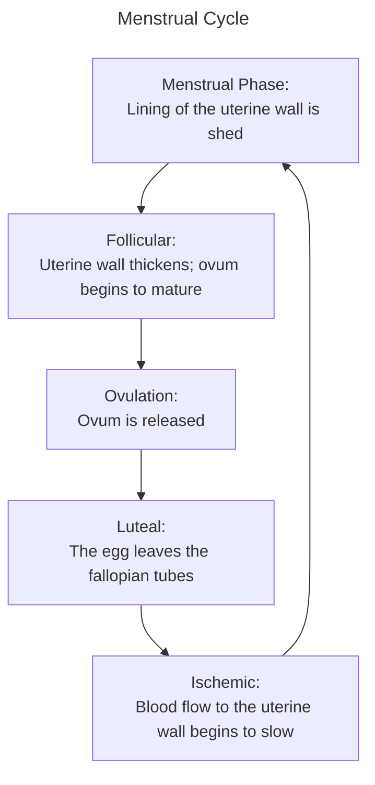

## Menstruation

__The signs/symptoms of menstruation include__:
- Abdominal cramps
- Bleeding
- Fatigue
- Back pain
- Bloating/water retention

__Menarche__: First menstruation

__Menopause__: The cessation of menstrual cycles

__Placenta__; "Afterbirth" that develops on the uterine wall. It is connected to the fetus via umbilical cord

__Umbilical Cord__: Tissue that connects placenta with fetus

__Amniotic sac__: Fluid-filled sac membrane in which the fetus develops

## Pregnancy
### Stages of Labor
1. __Dilation__
	Begins with the first uterine contraction and ends when the cevix is completely dilated. The mucous plug breaks down, the amniotic sac ruptures, and the contractions increase in frequency and intensity.

2. __Expulsion__
	Begins after dilation and ends with the delivery of the baby. The contractions happen and last longer, crowning occurs, and the perineum may tear.

3. __Placental__
	Begins after the baby is delivered and ends when the placenta is expelled. The placenta is usually expelled 5-20 minutes after the delivery of the child.

### Changes During Pregnancy

__Hormones during pregnancy__: Increase to support fetal development and to prepare the body for birth. However, this also puts the pregnant person at increased risk from trauma, bleeding, and some medical conditions.

__Respiratory rate during pregnancy__: Increases to account for the overal demand for oxygen due to metabolic demands and workload increases to support the developing uterus. These changes lead to an overall reduction in respiratory reserve and lead to a decreased ability to compensate during times of respiratory distress

__Blood volume during pregnancy__: Gradually increases to allow for adequate perfusion of the uterus and prepare for the blood loss during childbirth. Additionally, the number of red blood cells increase, the speed of clotting increases, and the patient's heart rate increases up to 20%

__Changes in the GI tract can lead to__:
- Gastroesophageal reflux
- Nausea
- Vomiting
- Aspiration

### Assessment

__Gynecologic SAMPLE History__:
- When was the patient's last menstrual period?
	- When is the baby's due date?
- Has there been any unusual vaginal bleeding or discharge?
	- How many other pregnancies?
	- How many pregnancies were live births?
	- Where the previous pregnancies vaginal or by caesarian section?
	- Any complications with the previous pregnancies?
	- Are there any known complications with this pregnancies?
	- Are they receiving regular prenatal care?

__Gravida__: Total number of pregnancies (including the present one)

__Parity__: Number of deliveries after 20 weeks of pregnancies

__Aborta__: Number of miscarriages prior to 20 weeks of pregnancy or induced abortions

__TPAL__:
- Number of full-term infants
- Number of preterm infants
- Number of abortions/miscarriages
- Number of living children

__Summary Obstetrical Questions__:
- Labor Questions:
	- Water broken?
	- Contractions?
	- Need to push?
- Background Pregnancy Question:
	- LMP?
	- GPA?
	- Prenatal Care

__When physically examining a potentially pregnant/pregnant woman, one should__:
- Throughly the abdomen
- Examine genitals if there is:
	- Excessive vaginal bleeding
	- Severe genital trauma
	- Abdominal pain or contractions
- Obtain baseline vital signs

### Transport Decision

__Only stay on scene for a pregnancy if__: Delivery seems imminent

## Specific Gynecological Emergencies

### Vaginal Bleeding

__Questions to ask when characterizing vaginal bleeding__:
- When did the bleeding start?
- Is there pain associated with the bleeding?
- Is his more, less, or equal to a normal menstrual period?
- How many pads has the patient gone through today? How many in the last hour?

__Other questions to ask related to vaginal bleeding__:
- When was their last menstrual cycle?
- Is there any change they could be pregnant?

__Probable causes of vaginal bleeding__:
- Abnormal menstruation
- Vaginal trauma
- Extopic pregnancy
- Spontaneous abortion
- Cervical polyps
- Cancer

__Especially when treating vaginal bleeding, it is important to__:
- Use obstetric pads to absorb blood
- Not try to place as any sort of bandage inside the vagina to stop the bleeding

### Sexually-Transmitted Diseases

__Symptoms of STIs include__:
- Mild lower abdominal pain
- Low fever
- Abnormal vaginal discharge
- Urinary symptoms
- Vaginal/abdominal pain during sex

__If not treated, STIs may__: Ascend into other reproductive organs and cause pelvic inflammatory disease (PID)

#### Bacterial Vaginosis
__Bacterial vaginosis occurs when__: Outside bacteria overgrow the normal bacteria within the vagina

__Bacterial vaginosis can make a patient__: More susceptible to additional infections

#### Chlamydia

#### Gonorrhea
__Gonorrhea occurs in__: Any mucosal surface involved in sexual contact

#### Pelvic Inflammatory Disease

__PID is a disease that__: Originates in the vagina, and later spreads into the uterus, fallopian tubes, and even onto the pelvis

__Symptoms of PID includes__:
- Peritonitis
- Fever
- Vaginal discharge
- Urinary issues

### Sexual Assault

__When tending to a potential sexual assault victim, it is important to__:
- Maintain a high regard for privacy and question the patient n a discreet manner
- If performing a rapid trauma assessment, cover the patient to protect privacy
- Never examine the genitalia of a sexual assault or rape victim unless there is profuce or life-threatening bleeding
- Preserve all evidence associated with a sexual assault or rape
- Handle the patient's clothing as little as possible

## Pre-Delivery Emergencies
### Maternal Cardiac Arrest
__If treating for cardiac arrest in a pregnant patient, EMTs may__: Displace gravid uterus to enhance venous return
### Pre-eclampia/Eclampsia

__Preeclampsia is a conditioned characterized by__:
- High blood pressure
- Swelling in the extremities
- Headaches
- Visual disturbances

__Eclampsia is a severe case of pre-eclampsia but also including__: Seizure activity, which in turn can cause premature labor, abruptio placenta (abrupt tearing of the placenta from the uterine wall), life threat to the fetus

### Supine Hypotensive Syndrome
__If the patient is in their third trimester, watch for__: Supine hypotensive syndrome

__Supine Hypotensive Syndrome occurs when__:
- The pressure of the enlarged uterus and weight compresses the vena cava, leading to a reduction of blood return and causing the patient to become hypotensive

### Seizures

__Transport patient on their _ if seizure occurs during third trimester__: Left side

### Ectopic Pregnancy

__Ectopic Pregnancy occurs when__ The fertilized egg implants in an area other than the uterus. The growing embryo and placenta eventually ruptures the tissue causing life-threatening hemorrhage.

__Ectopic rupture occurs during__: The first trimester, between 2-12 weeks

__Signs and symptoms of ectopic pregnancy includes__:
- Sudden sharp, abdominal pain to one side of the abdomen
- Vaginal bleeding
- Lower abdominal pain
- Tender, bloated abdomen
- Palpable mass in the abdomen
- Weakness or dizziness when standing or sitting
- Decreased BP and increased pulse rate
- Shock
### Spontaneous Abortion (Miscarriage)
__Spontaneous Abortion occurs when__: Delivery of the fetus and placenta occurs before it can survive on its own

__Spontaneous abortion occurs__: Before the 20th week

__Signs and symptoms of a miscarriage includes__;
- Cramping
- Moderate to severe vaginal bleeding
- Passage of tissues or clots

## Gestational Diabetes
__Gestational diabetes occurs when__: Pregnancy hormones impair the action of the mother's insulin causing high fetal blood sugar and high fetal insulin production

__Gestation diabetes causes__: Increased birth weight, risk of more difficult delivery and injury during delivery

### Abuse
__Pregnant women have an increased chance of being__: Victims of domestic violence and abuse

### Braxton-Hicks Contractions

__Braxton-Hicks Contractions occur as__: Non-delivery contractions; non-rhythmic and do not increase in intensity and frequency

### Vaginal Bleeding

__Vaginal bleeding during pregnancy can__: Represent a life-threatening condition for both the mother and fetus

__Vaginal bleeding during pregnancy can be caused by__:
- Placenta previa
- Abrutio Placenta
- Trauma

### Placenta Previa

__Placenta previa occurs when__: The placenta is abnormally implanted at the bottom of the uterus over the cervix. This displacement causes placental tears and subsequent bleeding

__The hallmark sign of placenta previa is__: Painless vaginal bleeding during the third trimester

__Predisposing factors include__:
- More than two previous deliveries
- Rapid succession of pregnancies
- Patient older than 35 years old
- Previous placenta previa
- History of early vaginal bleeding

### Abruptio Placenta

__Abruptio placenta occurs when__: There is an abnormal separation of the placenta from the uterine wall prior to birth. This jeopardizes both mother and baby by providing inadequate gas exchange between the mother and the fetus, and potential maternal blood loss can lead to hypovolemic shock

__Signs and symptoms of abruptio placenta includes__:
- Vaginal bleeding associated with pain
- Abdominal pain due to muscle spasms of the uterus
- Mid/lower back pain
- Presence of uterine contractions
- Tender abdomen on palpation
- Vaginal bleeding

__Predisposing Factors for Abruptio Placenta includes__;
- Hypertension
- Use of vasoconstrictive drugs
- Preeclampsia
- Previous births
- Previous abruption
- Short umbilical cord
- Premature rupture of the amniotic sac
- Diabetes mellitus
### Trauma
__Trauma to a pregnant patient is typically__: Moderate to severe blunt force to the abdomen, especially late in pregnancy that can damage or injure the fetus as well as the mother

### Ruptured Uterus
__A ruptured uterus occurs when__: The already weak and thin uterine wall tears, where the fetus can be released into the abdominal cavity

__The signs/symptoms of a ruptured uterus includes__:
- Tearing or shearing sensation in the abdomen
- Constant and severe abdominal pain
- Nausea and vomiting
- Shock
- Vaginal bleeding
- ranging from minor to severe
- Cessation of noticeable contractions
- Ability to palpate fetus in the abdominal cavity

__Predisposing factors for a ruptured fetus includes__:
- History of uterine rupture
- Abdominal trauma
- Large fetus
- History of birthing children
- Prolonged and difficult labor
- Previous C-section/abdominal surgery

## Active Labor and Normal Delivery

__When measuring contractions, measure from__: Beginning of the first contraction to the beginning of the next

### Preparation for a Field Delivery
__When preparing for a field delivery__:
- Take appropriate BSI:gloves, gown, mask, eye protection
- Avoid touching the vaginal area prior to actual delivery
- Do not allow the mother to use the bathroom
- Do not hold the mother's legs together to delay delivery
- Obtain the obstetrics kit
- Obtain equipment including:
	- Sterile gloves
	- Towels
	- Cord clamps
	- Scissors or Scalpel
	- Blankets
	- Bulb syringe
	- Sanitary
- Position the mother on their back with head supported and legs flexed
- Create a sterile environment around the vaginal opening

### Delivery
__When delivering a baby__:
1. Genrly place gloved gfingers on the bony part of the infant's skull when it crowns
2. Tear the amniotic sac if not already ruptured with fingers
3. Determine the position of the umbilical cord

### Initial Care of the Newborn
__When initally taking care of a newborn__:
- Tilt the shoulders to assist passing the pubic symphysis
- Support the newborn's body with your hands as he is delivered
- Grasp the feet as they are born
- If necessary, suction the mouth with a bulb syringe
- Dry, wrap, warm, and position the newborn
- Get APGAR score

### Placental Delivery
__For placental delivery__:
1. Observe for the delivery fo the placenta
2. Place the delivered placenta in a plastic bag to take to the hospital
3. Place one or two sanitary napkins over the vaginal opening
4. Record the time of delivery and transport the mother, baby, and placenta to the hospital

### Care for the Mother
__When caring for the mother post-delivery__:
- If possible, clean the mother before transport to the hospital
- Make sure a sanitary napkin is in place as there will be minor bleeding
- Keep mom and baby warm
- If they wish and are able, give the mother the baby and allow breastfeeding
- Massage the uterus by kneading the lower abdomen
- Prolapsed uterus may be replaced with a glovd hand
- Massage uterus to control bleeding

## Childbirth Emergencies
### Abnormal Delivery
__Abnormal delivery occurs when there is__:
- Any fetal presentation other than the normal crowning of the baby's head
- Abnormal color or smell of the amniotic fluid
- Labor before the 38th week of pregnancy
- Recurrence of contractions after the first baby is born
#### Prolapsed Cord
__A prolapsed cord is when__: After the rupture of the amniotic sac, umbilical cord is the presenting part. The cord may be compressed between the baby and the vaginal walls

__To stop a prolapsed cord birth__:
- Position the mother in the knee-chest position if it is safe to do
- Use Trendelenburg with hips elevated position alternatively
- Insert a serile gloved hand into the vaginal canal and gently lift the presenting part off of the umbilical cord, cover the umilical cord with a sterile towel moistened with saline solution
#### Breech Birth
__A breech birth occurs when__: The fetual buttocks or lower extremities are the presenting parts instead of the head, prolonging the delivery

__If the baby's buttocks are already out of the vagina__: Deliver it in the field

#### Limb Presentation
__A limb presentation occurs when__: One arm or leg is the first to protrude from the birth canal

__In a limb presentation birth__:
- Provide high flow oxygen
- Position the mother in a supine head-down position
- Do not attempt delivery
#### Interrupted Delivery
__For an interruped delivery, transport__: With legs in the air
#### Spina Bifida
__Spina Bifida is when__: A portion of the spinal cord may protrude outside of the vertebrae and possibly even outside of the body
Very easily seen on the newborn's back, especially the lumbar area

__To treat spina bifida__:
- Cover the open area with a moist, sterile compress after birth
- Prevent lowering the newborn's temperature by holding the baby against one's skin
#### Multiple Fetuses

### Meconium
__Meconium__: First fetal bowel movement, indicating a difficult labor for the baby
#### Nuchal Cord
__Nuchal cord occurs when__: The umbillical cord is wrapped around the neck
#### Shoulder Dystocia
__Shoulder dystocia occurs when__: The fetal shoudler is stuck behind the pubic symphyisis or the saccrum
#### Post-Partum Hemorrhage
#### Prolonged Delivery
#### Inverted Uterus
#### Postterm Pregnancy
#### Fetal Demise
#### Embolism
## Newborn Emergencies
__The most important thing to protect a newborn for is__: Heat loss and airway obstruction

### APGAR
__APGAR stands for__:
- Appearance: Skin should be pink
- Pulse: Greater than 100bpm
- Grimace: Flick soles of feet and observe facial expressions during suctioning
- Activity: Exhibit active flextion and extension of the extremities
- Respiration: Between 30-60 times a minute or exhibit a strong cry

__APGAR scores should be__: 7-8 at 1 minute, and 9-10 at 5-10 minutes

### Depressed Newborns