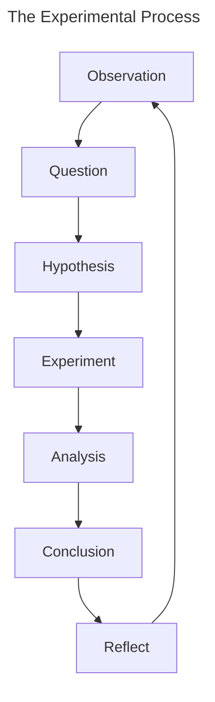

>[!important]
>*The experimental process is a systematic approach used in scientific research to investigate and understand phenomena, establish causal relationships, and draw valid conclusions*

## The Experimental Process

The steps of said process includes:
1. __Observe__
	1. review existing research and literature to understand the state of current knowledge
2. __Define your research questions__; what problems do you want to address?
3. __Formulate a clear and testable hypothesis that predicts the relationship between variables__
4. Once you have all the background necessary, __design the experiment__:
	1. Define:
		1. variables (independent/dependent variable(s))
		2. experimental groups
			1. sample collection methods (random sampling, blinding, etc.)
		3. materials and methods
	2. Select participants and subjects
	3. Collect data
5. __Process and analyze the collected data__
6. __Interpret your results in the context of your research question and hypothesis__
	1. Some important questions include:
		1. what is the relationship between variables?
		2. Is your hypothesis supported?
		3. what are the implications?
7. __Communicate your findings__
8. __Reflect and repeat__
	 *The experimental process is iterative; multiple experiments often contribute to a deeper understanding of a phenomenon. Follow-up studies can validate and extend your findings*
	Some questions to ask during this step includes:
	- what were the limitations of your experiment?
	- were there potential sources of error or areas for improvement?

>[!important]
>*Ethical considerations, proper documentation, and transparency are crucial throughout each step of the process*
## Types of Experimental Design and Data Collection
### Types of Research Study
- __Case__ studies look only at a single subject/cohort. The result is a detailed account of what is occurring within its real-life context. A limitation of case studies is that findings cannot be applied more generally to a population
- __Correlation__ studies that look for a relationship between two or more variables. Correlational studies do not establish causality, but rather a fundamental relationship between the two.
- __Longitudinal__ studies are useful for studying change over time, as they follow a cohort by measuring the same behavior multiple times over time. These tests often take a really long time and are affected by participant motivation.
- __Experimental__ studies are controlled so the researcher manipulates one variable to determine its effect on other variables. These studies are criticized for their lack of "real-world" authenticity, where the results from within a controlled environment cannot or does not translate into the real-world
	There are two main kinds of experimental studies:
	- __Randomized Group Design__: *Participants are randomly assigned either to receive a manipulation (the experimental group) or to a control group. The control group completes all the same steps as the experimental group, except they do not receive the manipulation that is under investigation. If the study is well-controlled, it can be concluded that the differences between the experimental and control groups at the end of the study are caused by the manipulation.*
	- __Single-case Design__: *Individual participants or a small cluster of participants provide their own control for comparison.*
- __Clinical trials__ are a specific type of randomized group experimental study, used mostly in medical or other clinical settings. Like experimental designs, their results do not always translate directly to a "real-life" setting.

### Validity in Experimental Design
- __Internal Validity__: Assesses whether the observed changes in the dependent variable can be confidently attributed to the manipulation of the independent variable rather than other factors.
- __External Validity__: Assess the degree to which the results accurately represent the outcomes that would occur in a broader population or context(s)

>[!important]
>*Differential Attrition: thte rate at which participants drop out of a study between groups*