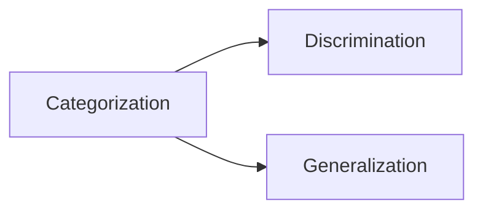
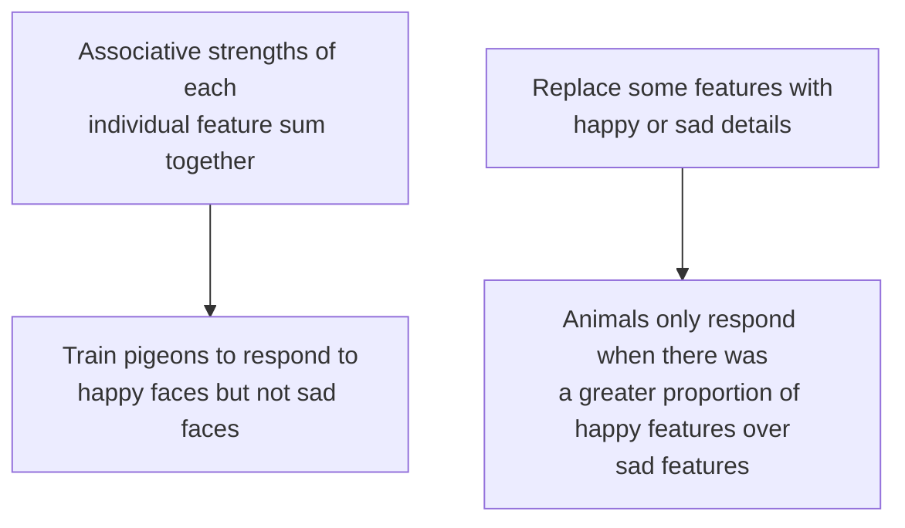

# X

__Discrimination__: The ability to discern between objects 

__Generalization__: The ability to find similarities between objects

>Discrimination and generalization are done through categorization
## Categorization
__Categorization__: Often polymorphous, where examples can encompass a wide array of features and stimuli and still belong to the category

>*Categorization is all about associative learning*

>*Animals can categorize natural as well as man made objects, an can even learn about things that they've never encountered*

>*Category learning "transfers" to other stimuli that haven't been associated with training*

>*The more exemplars trained as part of the original category, the better the transfer will be to new stimuli*

### Theories of Categorization
- __Feature Theory__: Animals learn which specific features associate with an expected outcome (or a lack of outcome, or a different outcome)
	- Each feature gains or loses associative strength
	- Animals respond based on current level of associative strength

- __Prototype Theory__: Animals form some sort of prototype of each category, and they will respond to new stimuli based on how similar it is to the prototype
	- Prototype represents "averages" of an object
	- *In effect, this is another type of feature theory*
	- Animals will respond to new stimuli based on shared features with the prototype
- __Exemplar Theory__: Animals remember each training experience, and respond to new stimuli to the extend that it is similar to its previous training
	- Animals learn entire configurations of stimuli and respond to new stimuli to the extend that they generalize to that entire configuration
### More on Generalization
>*Pavlov observed that conditioned responding to one CS could often generalize to other similar CS*

### Generalization Gradient
>*Animals will respond to new stimuli to the degree to which they are similar to the original training stimulus*

>*The steepness of the gradient depends on how much responding depends on a particular stimulus dimension*

>*The steepness of the generalization gradient varies with training*
# XI
## Mechanisms of Generalization

__Perceptual Similarity__: Animals respond to new stimuli to the degree to which they are similar to the original training stimuli

__Acquired Equivalence Through Shared:__
- Outcomes: *Stimuli that have been associated with similar outcomes in the past are treated as alike*
- Experience: *Stimuli that have been associated with similar responses in the past are also treated as alike*
>[!important]
>*Shared outcomes/experiences are categorized as such based on psychological similarity, not physical similarity*

>*Discrimination can often be learned between impressively similar stimuli through differential reinforcement and perceptual learning*

__Differential Reinforcement__: The formation of specific relationships between stimuli and outcomes
>*Other stimuli, even similar stimuli, may not produce the same outcome. This is true for both Pavlovian and operant conditioning.*
>
>*Specific relationships are formed between responses and outcomes through shaping and successive approximations*

__Perceptual Learning__: Mere exposure makes stimuli easier to discriminate
## In Summary
>*Learning processes can make physically similar stimuli different, or physically different stimuli similar*

## Inhibitory Learning

## Conditioned Inhibition
__Conditioned Inhibitors__: Conditioned responding is decreased due to a CS becoming associated with the absence of a US

>*Latent inhibition does not create an inhibitory CS*

>*Pre-exposing a CS does reduce its conditionability. However, these CSs fail the summation test. They do not cause responding to an excitatory CS to decrease, because a CS can only become inhibotry if it signals that an expected US won't occur*

>*Extinction does not create an inhibitory CS*

>*Extinction also involves less responding to the CS, but fails both the summation and retardation of acquisition tests*

### Learning

__X__ - conditioned inhibitor
__A__ - Stimulus

__Learning conditioned inhibitions occurs through__:
- Backward conditioning (US - X)
- Discriminative Conditioning (A - US, X - No US)
- Conditioned Inhibition (A - US, AX - No US)
	- Describes both the result and the procedure, where X signals that A will not be followed by a US, and X becomes a conditioned inhibitor even when its presented alone
	- It is the most fundamental and effective way of producing conditioned inhibition
- Explicitly Unpaired (X ... US)
	- A CS is presented alone, far away in time from a US
- Inhibition of Delay (XxXxXx - US)
	- The CS is very long - so the animal learns timing does not respond to the early part of the CS
### Measuring
#### Summation
>[!question]
>*How do we measure conditioned inhibition?*

>[!check]
>*Summation*

>*Watch out for a generalization decrement, which amy occur if excitatory respnding does not fully generalize to a compound stimulus presentation*

__Generalization Decrement__: A negative discrepancy between the response from the original stimulus and the new stimulus

>*A generalization decrement is a sign of external inhibition, not conditioned inhibition*

#### Retardation of Acquisition
>*Comparison of CS-US pair learning versus an X-US pair learning curve*

>*Watch our for latent inhibition, which may occur if previous exposure to X disrupts new learning about X*

