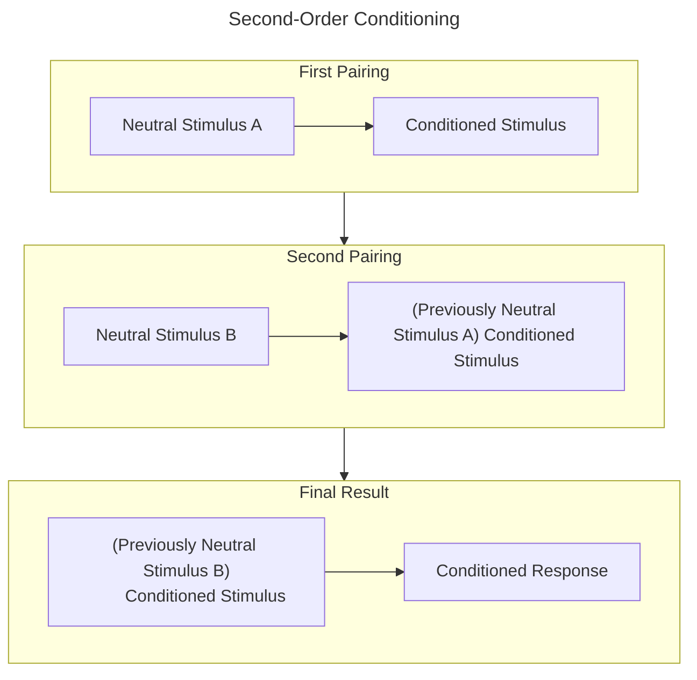
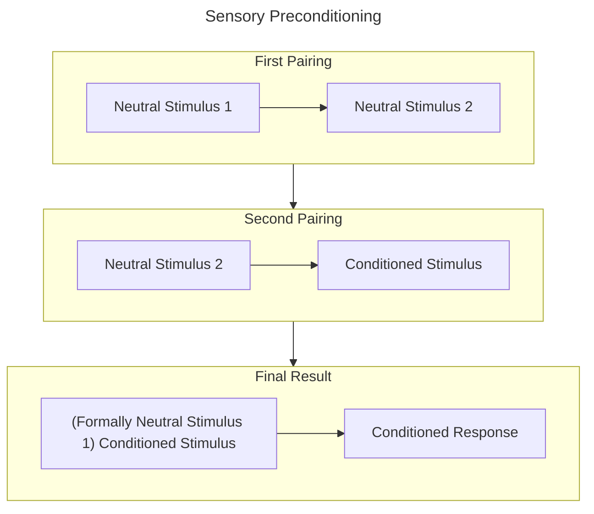

__Blocking__: Learning only occurs when the CS provides new information about the US. When it does not predict anything new, relatively little learning occurs

>*Blocking is important because it again suggests that conditioning does not simply happen because a CS and a US are paired*

__Unblocking__: Occurs when the US value is changed, which can leave room for conditioning to occur again

__Overshadowing__: Two CSs are paired to a US together, and if one CS is stronger/more salient than the other, it will prevent good conditioning of the other CS. In other words the stronger stimulus overshadows learning of the weaker stimulus

## Higher Order Conditioning
>*Stimuli can control responding without ever being paired directly with a US*

__Second-Order Conditioning__: Where the CS functions as a US in the line of new conditioning. This will only occur if the CS has been well conditioned




```mermaid
flowchart TD
```

__Sensory Preconditioning__: A form of second-order conditioning where two neutral stimuli are paired, then one is separately associated with the previous CS.



## Summary
>*Generalization, second-order conditioning, and sensory preconditioning all show organisms will respond to stimuli that have never been paired with a US under the right conditions*

