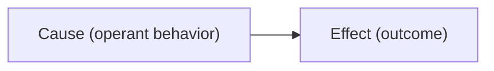
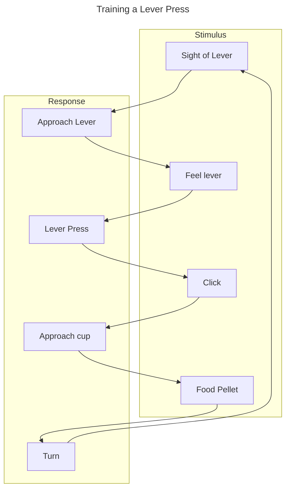

# 13
>In S-O associations, the subject does not control the delivery of the outcome. However, in S-R-O responses, the subject *does* control the delivery of the outcome

__B.F. Skinner__: Developed the Skinner Box (now more commonly refferred to as operant conditioning chambers), in which rats are free to manipulate the environment at will
## Law of Effect
__The Law of Effect__: Operant behaviors are linked to consequences

>*The law reminds us that operant learning generally works so that organisms will maximize benefits (good outcomes) and minimize costs (bad outcomes)*
### Types of Learning

|                               | __Good Outcome__                             | __Bad Outcome__                       |
| ----------------------------- | -------------------------------------------- | ------------------------------------- |
| __Behavior Produces Outcome__ | 
Reward Learning
 | 
Punishment
 |
| __Behavior Prevents Outcome__ | 
Omission
          | 
Omission
 |
### Reinforcement
__Reinforcement__: A situation in which a relation between an R and an O strengthens a response 
- __Positive__: Addition of a good outcome
- __Negative__: Removes a bad outcome

__Reinforcer__: An outcome that increases an operant response

### Punishment
__Punishment__: A situation in which a relation between an R and an O decreases the strength of a response
- __Positive__: Adding a bad outcome
- __Negative Punishment__: Removes a good outcome

|                               | __Good Outcome__                                    | __Bad Outcome__                                     |
| ----------------------------- | --------------------------------------------------- | --------------------------------------------------- |
| __Behavior Produces Outcome__ | 
Positive Reinforcement
 | 
Positive Punishment
      |
| __Behavior Prevents Outcome__ | 
Negative Punishment
      | 
Negative Reinforcement
 |
### Pavlovian Parallels to the Law of Effect

|                               | __Good Outcome__                                        | __Bad Outcome__                                         |
| ----------------------------- | ------------------------------------------------------- | ------------------------------------------------------- |
| __Behavior Produces Outcome__ | 
Approach Stimulus
      | 
Withdraw from Stimulus
 |
| __Behavior Prevents Outcome__ | 
Withdraw from Stimulus
 | 
Approach Stimulus
      |
## Reinforcers
__Primary Reinforcers__: Biologically reinforcing stimuli that are naturally desired — important for reproductive success

__Secondary Reinforcers__: Gain value by being associated with a primary reinforcer as a proxy

## Shaping
__Shaping__: The process of rewarding successive approximations of the current behavior

>*Shaping does not necessarily require the forethought of a teacher/experimenter; it occurs all the time in the natural world — it allows the animal to adapt to its environment*

>Shaping allows for the formation of complex behaviors

# 14
## Shaping (cont.)
__Superstition__: Occurs when an individual associates a specific behavior with a positive or negative reinforcement, even if there is no actual causal link between the two

## Chaining
__Chaining__: Reinforcement of individual responses occuring in a sequence to form a complex behavior

| Shaping                                                     | Chaining                                                                                      |
| ----------------------------------------------------------- | --------------------------------------------------------------------------------------------- |
| The eventual behavior differs from the initial behavior     | The eventual behavior includes the initial behavior, as one piece of a longer behavior string |
| The initial behavior must at least resemble the end product | Each step is a complete task that is chained to the next                                      |

## Schedules of Reinforcement
>*Most operant responses in the real world are not reinforced every time they occur, yet the behavior keeps them going on anyways*
>	*In fact, some responses actually strengthen when they are not always paired with a reinforcer*

>In an operant experiment, the experimenter controls:
>- How often the reinforcer is delivered
>- The response that leads to reinforcement
>whereas the subject controls:
>- How often they emit a response
>- The quality of a response

__Continuous Reinforcement__: Behavior is reinforced every time it occurs

__Partial/Intermittent Reinforcement__: Behavior is only reinforced sometimes at a:
- __Fixed Ratio__: Behavior is rewarded every nth response
- __Fixed Interval__: Behavior is rewarded on the first response following a fixed period
- __Variable Ratio__: Behavior is rewarded, on average, every nth response
- __Variable Interval__: Behavior is rewarded on the first response following a variable period time that centers around one average

### Schedules of Reinforcement and Behavior

__A fixed ratio schedule results in__: A consistent increase

__A variable ratio schedule results in__: A consistent increase that is steeper than an equivalent fixed ratio schedule (because the subject has some amount of control, resulting in more responses)

__A fixed interval schedule results in__: Behavior reflecting the timing of the reinforcers, where the subject responds only a little after each rewad, but the rate of responding picks up as the next scheduled reinforcer approaches

__Scalloping__: A pattern (relating to a fixed interval reinforcement schedule) characterized by low response rates after a reinforcement, followed by a gradual increase in response rate as the time for the next reinforcement approaches

__A variable interval schedule results in__: A steady rate of behavior, where time is less relevant in predicting reinforcer availability (since the subject cannot control outcome delivery, fewer responses result)
# 15
## Theories of Reinforcement
>*Theories allow us to test predictions about the world and behave appropriately in new and dynamic situations*

### Drive Reduction

__Drive__: An internal state of tension or arousal that arises from an unmet need
- __Primary__:  Physiological or biological need necessary for survival
- __Secondary__: Psychological, acquired through experiences

__Clark Hulls's Theory__: Reinforcers strengthen responding because they reduce drives, with the goal of maintaining homeostasis

>An issue with this theory is when outcomes that doen't reduce need/drive can still reinforce responding

### Premack Principle

__Premack Principle__: Reinforcement will occur when the behavior provides access to a more preferred behavior, and punishment will occur when the behavior leads to a less preferred response

>*The Premack principle predicts what things will reinforce other things. We can use a preference test to determine what outcomes will be reinforcing*

>*Importantly, the Premack principle also accepts large individual differences*

>*Although the principle is very clear that reinforcement effects should be predictable from prior preferences, it is not always easy to know how to determine those preferences

>*Preferences are influenced by many external variables*

>*Baseline preferences do not always ensure that something will be reinforcing.*

#### Testing
__How to test the Premack Principle?__:
1. Measure baseline preferences for different behaviors
2. Make a more preferred behavior contingent on a less preferred behavior
3. The reinforcing effect of an outcome on a behavioral response is predicted by the initial baseline probability preference for the outcome

### Behavioral Regulation Theory
__Behavioral Regulation Theory__: A subject is motivated to defend and regulate a certain distribution of activities, and will work for access to any behavior if access to that behavior is deprived below baseline

>*A major limitation: It is difficult to identify the underlying motivation for engaging a behavior*

### Selection By Consequences
__Selection by Consequences Theory__: Subject lets reinforcers select behaviors by weeding out the behaviors that are less useful, in other words, reinforcers prevent behavior from extinction; carries some parallels with theories of evolution.