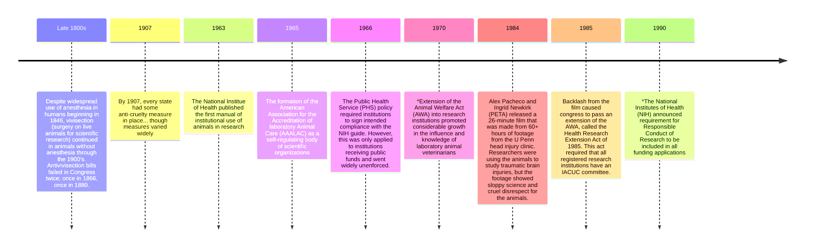

>*Learning is a process of within-generation adaptation, where behavior is changed through experience*

__Learning Theory__: A body of knowledge and principles that attempt to explain how learning occurs and how it can be optimized

>Learning theory is important to the understanding of human and animal behavior. Learning theory provides a framework for how to study learning processes in *both* human and animals.

>[!quote] According to ChatGPT:
>- *Psychological and Cognitive Understanding: Learning theories contribute to our understanding of human cognition, memory, and problem-solving. They provide insights into how the brain processes information. Researchers use these theories to formulate hypotheses, design experiments, and analyze data, contributing to the advancement of knowledge in the field.*
>- *Effective Teaching & Curriculum Development: Learning theories provide educators with a framework for understanding how students learn best. By understanding the underlying principles of learning, teachers can design more effective instructional strategies, select appropriate materials, and create engaging learning environment. Learning theories help in the design and development of curricula that align with established principles of learning. Educators can use these theories to structure the sequencing of content, select appropriate assessment methods, and adapt teaching approaches to suit diverse learners. Moreover, by aligning assessments with the principles of learning, educators can better evaluate the effectiveness of their teaching and make data-driven decisions to improve instruction.*
>- *Adaptive Learning: In today's technology-driven world, learning theories are used to develop adaptive learning systems and educational technology. These systems can personalize learning experiences by adapting content and activities based on their progress and needs, enhancing the efficiency and effectiveness of learning.*
>- *Problem Solving and Innovation: Learning theories can be applied to facilitate problem-solving and innovation. Understanding how people acquire new skills and knowledge can inform strategies for employee training, product development, and organizational change.*
>- *Lifelong Learning: Learning theory highlights the importance of lifelong learning and the adaptability of individuals to acquire new knowledge and skills throughout their lives. This perspective is especially relevant in today's rapidly changing world, where continuous learning is essential for personal and professional growth.*

>Animal learning research focuses more on behavior, less on theoretical/psychological constructs, and its questions relate more to how we process, cope with, and remember things to motivationally significant events

__C. Lloyd Morgan__ believed that animal intelligence is really just a slow series of progressions involving a lot of trial and error
- __Morgan's Canon / The Law of Parsimony__: *Behavior should never be explained with a higher-order mental process if it can be explained with a simpler explanation*

>[!question]
>*So, why bother with animals?*

>[!check]
>- *There are fundamental processes that are expressed in many species*
>- *The ideas studied by animal researchers aim to understand the most basic mechanisms through which learning occurs*
>- *Most animal and human researchers understand that in order for complex cognitions to arise, they first need to be formed out of simple associations*
>- *Animal experiments offer the most simplicity through experimental control, including environment, making it easy to run causal studies*

## Responsible Conduct of Research Using Animals (i.e., Ethics)

- __Late 1800s__: *Despite widespread use of anesthesia in humans beginning in 1846, vivisection (surgery on live animals for scientific research) continued in animals without anesthesia through the 1900’s. Antivivisection bills failed in congress twice: Once in 1866, once in 1880*
- __1907__: *By 1907, every state had some anti-cruelty measure in place... though measures varied widely*
- __1963__: *the National Institute of Health published the first manual of institutional use of animals in research*
- __1965__: *The formation of the American Association for the Accreditation of laboratory Animal Care (AAALAC) as a self-regulating body of scientific organizations*
- __1966__: *The Public Health Service (PHS) policy required institutions to sign intended compliance with the NIH guide. However, this was only applied to institutions receiving public funds and went widely unenforced.*
- __1970__: *Extension of the Animal Welfare Act (AWA) into research institutions promoted considerable growth in the influence and knowledge of laboratory animal veterinarians*
- __1984__: *Alex Pacheco and Ingrid Newkirk (PETA) released a 26-minute film that was made from 60+ hours of footage from the U Penn head injury clinic. Researchers were using the animals to study traumatic brain injuries, but the footage showed sloppy science and cruel disrespect for the animals.*
- __1985__: *Backlash from the film caused Congress to pass an extension of the AWA, called the Health Research Extension Act of 1985. This act required that all registered research institutions have an IACUC committee.*
- __1990__: *The National Institutes of Health (NIH) announced requirement for Responsible Conduct of Research to be included in all funding applications*

__Institutional Animal Care and Use Committee__ (IACUC): A federally mandated committee that oversees and evaluates all aspects of an institution's animal care and use, to ensure the proper care and welfare of animals involved in research.
- It is composed of research staff, and at least one member unaffiliated to the university, and a non-scientist
- This mandate applies to all teaching and research involving vertebrate animals
- Their responsibilities include
	- Training
	- Inspections
	- Reviews and approvals of research protocols
	- Environment maintenance (is the animal housing up to standard)

>[!question]
>*What does the IACUC consider when reviewing protocols and inspecting?*

>[!check]
>- Can the hypothesis be tested any other way
>- Are all staff members working with animals properly trained?
>- Is the researcher hitting the "Three R's"?

>*Particular attention is paid to minimizing pain and distress and finding alternatives to potentially painful research*

__The Three R's__ are:
- __Replacement__ by instead:
	- using mathematical models
	- using computer programs
	- *in vitro* experiments
	- using fruit flies/worms
	- using experiments with humans (surveys, etc.)
- __Reduction__ by:
	- sharing results
	- careful design and analysis
	- instead using imaging
- __Refinement__ of the experiment through:
	- using imaging
	- running shorter experiments
	- using better housing
	- implementing better equipment handling methods
	- providing better pain relief
- Additionally, __respect__ for the animals

## Tools for Analyzing Learning and Behavior
>*S-O learning helps you know what to expect from the world around you*
### Learning About Stimuli
>*We learn about stimuli through classical (or Pavlovian) conditioning*

__Classical Conditioning__: the method by which scientists study association formation
	*How are stimuli and the environment linked?*

>*Classical conditioning is fundamental to adaptation; it is how humans and animals learn to prepare for biologically significant events*

__Ivan Pavlov__
- Created an experiment to study the importance of learned reflexes by playing a metronome and giving them food.
	- Resulted in the metronome alone eliciting salivation
- Concluded that a a neutral, biologically irrelevant stimulus could elicit a response

>[!important]
>*S-O learning helps you know what to expect from the world around you*
>

>*By learning that a signal predicts an outcome, an animal is often able to make a response to the signal before the outcome actually happens.*

__Territorial Signals__: Signals that predict an imminent predator
	This lead to an increase in behaviors that aided performance in the confrontation

__Reproductive Signals__: Signals that predict an nearby potential mate
	This lead to a decrease in aggressive behaviors and inversely increased courtship behaviors

__Operant Conditioning__: "Naturally selects" behaviors through consequences
- Behaviors that lead to good outcomes tend to increase
- Behaviors that lead to bad outcomes tend to decrease

__B. F. Skinner__: Believed that psychologists should only study the empirical relationship between a stimulus and a response
- Defined reflex as the response following a stimulus
- Developed the Skinner Box
- Skinner was a determinist that believed that all behavior was dictated by learning principles (in other words, all behavior is directly related to the environment)
- Followed a "Brave New World" Approach to behavioral control
	- Positive reinforcement is the key to a humane approach to exert control over the masses
	- Said approach would solve human problems from technological advances
>[!important]
>*__Classical Conditioning__ helps you know what to expect from the world around you.*
>*__Operant Conditioning__ helps you determine the best course of action to obtain your goals.*

