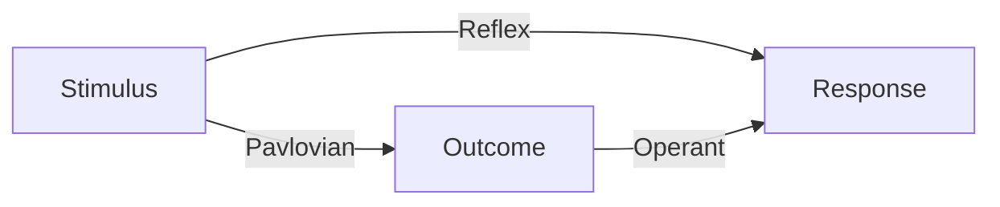

>*We learn about stimuli through classical conditioning*

>*We learn about responses through operant conditioning*

>[!important]
>*The biggest difference between an experiment on classical conditioning and...on operant conditioning is whether or not the subjects' behavior controls the delivery of the outcome*

>*Any situation involving biologically significant events or outcomes involves an opportunity to associate it with both behavior and with stimuli present in the environment*

>*While typically studied as separate phenomena, classical and operant conditioning are almost always working in tandem in any situation*

## Associations
Associations form the content of the mind, where simple sensory inputs are combined to create more complex ideas, which later become associated with one each other
### British Empiricism
>*The goal of many British Empiricists was to understand how experiences shapes people
>	Locke and Hume both believed that the mind is a blank slate that is "written on" through experience*

### How Associations are Formed

__David Hume's Contiguity__: Two sensory inputs will become associated if they occur closely together

>*As a general rule, the closer two events occur together in time, the more likely they are to be associated*

>*It all comes down to probability, temporal proximity indicates high probability that two events are linked*

__Empiricists also posited that items can__: become associated in other ways as well
- Similarity between items can lead to associations
- If the items are "dwelt upon" (rehearsed)
- If they have been experienced recently
## Learning in Any Situation

__Occasion setter__: Stimulus that provides information about whether a response (or another stimulus) will be associated with an outcome

>*Occasion setting illustrates another way in which behavior is nicely adjusted to ints environment*

>*In one of Skinner’s early experiments (1938), a rat was reinforced for lever pressing whenever a light was turned on, but NOT reinforced for lever pressing when the light was off*
>
>*The rat detected these different contingencies and began to lever press only when the light was on*
>
>*Skinner concluded that operants are not emitted in a vacuum; they occur in the presence of stimuli that set the occasion for them*

>[!important]
>*The feature must be informative about an S-O or R-O association to become an occasion setter*

>*Occassion setting is most likely to occur when the feature and target are presented serially. Thus, the target provides information about when the outcome is going to happen, and the occasion setter uniquely signals "whether or not" the outcome is going to follow the target.*

>*The serial period must be short enough that the feature , target, and US can all be associated.*

>[!important]
>*Occasion setters are not thought to elicit a response. They merely provide information about the relevance of a learned association.*

## Key Terms

__Target Stimulus__: The focus of the experimenter's attention

__Feature Stimulus__: The stimulus that tells the animal whether or not the outcome association is valid (i.e. the "occasion setter")

__Feature-positive Discrimination__: A protocol including some trial stimulus is presented with an outcome (+), and other trials where the stimulus is presented without the outcome (-). A second stimulus precedes the stimulus on the positive trials. Its presence allows the animal to learn to respond only on the positive trials

__Feature-negative Discrimination__: in this case, the second stimulus precedes the first stimulus on negative trials. Its presence allows the animal to learn to inhibit responding during the negative trials.

>[!important]
>*Stimuli can do more than enter into simple associations*
>
>*Modulation processes like occasion setting are fairly common in conditioning. thus, the performance one observes to a CS always depends to some extent on other stimuli in the background*
