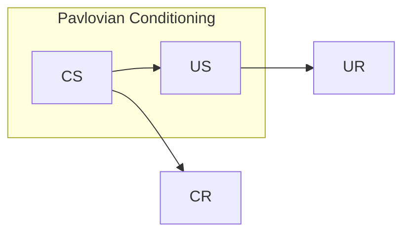

# 5
## Pavlovian Terminology
| __Term__                    | __Definition__                                                                                 |
| --------------------------- | ---------------------------------------------------------------------------------------------- |
| Unconditioned Stimulus (US) | Elicits a response naturally                                                                   |
| Unconditioned Response (UR) | Naturally elicited response in presence of US                                                  |
| Conditioned Stimulus (CS)   | Previously neutral stimulus that, through repeated pairings with US, come to elicit a response |
| Conditional Response (CR)   | Elicited by the CS following conditioning                                                      |

## Fear
__Fear Conditioning__: Association that leads to a fear response (such as freezing in mice).

__Fear conditioning elicits effects such as__:
		- Endorphins that cause a reduction in pain sensitivity
		- Stress hormones like cortisol and adrenaline
		- Increased blood pressure and heart rate
		- Increased blood flow from the heart to the limbs
## Extinction
__Fear Extinction__: The antithesis of fear acquisition

>[!important]
>*Extinction is new learning, and not forgetting or unlearning*

## Relapse
__Spontaneous Recovery__: Recovery due to passage of time

__Renewal__: Can occur when removed from the context where the extinction occurred

__Reinstatement__: Renewal that can occur due to contact with the unconditioned stimulus

# 6
>[!important]
>*Extinction is not forgetting or unlearning, it is learning something new*

>[!important]
>*What an animal does is not always a direct reflection of what it "knows", it is important to distinguish between performance and learning*

## Pavlovian Principles In The Clinic

>*Both Pavlovian and operant extinction have important clinical implications*

### Exposure Therapy

>*Expose patients with anxiety/fear disorders to things they fear and avoid. Through repeated exposures, anxiety lessens because they learn that the aversive outcome they are expecting is unlikely to actually occur.*

>*The skills and techniques learned in exposure therapy can also be used to manage addictive disorders. Patients are exposed to a craving or a drug associated cue without acting on it (using a substance).*

__Types of Exposure__:
- *Real Life*: Being exposed to a fear in real life
- *Imagined*: Vividly imagining a fear
- *Virtual reality*: Using virtual reality to be exposed to a fear
- *Interaceptive*: Bringing sensations into play in an effort to disconfirm the idea that physical sensations will lead to harmful events

## Strength in Conditioning

>*A number of factors affect whether or not conditioning when the CSs and USs are presented:*
>- *Timing*
>- *Contingency*
>- *Spacing*
>- *Novelty*
>- *Intensity*
>- *Motivation*
>- *Emotions*

### Timing

>*As a general rule, the closer two events occur together in time, the more likely they are to be associated. This reduced the likelihood that other stimuli will appear in the time gap between the CS and the US presentations*

>*Conditioning works best when the CS occurs before the US; the CS must signal that a US is about to happen*

 __Delay Conditioning__: The CS comes on and then ends with presentation of the US

__Trace conditioning__: The CS and US are separated by a gap (the "trace interval")

>[!question]
>Which conditioning schedule leads to stronger learning?

>[!check]-
>*Delay conditioning*

__Simultaneous Conditioning__: The CS and US are presented at the same time
	Because the CS does not signal that the US is about to occur in this arrangement, simultaneous conditioning often yields weak conditioning

__Backwards conditioning__: The CS follows, rather than precedes, the US in time
	This may actually produce inhibition of a conditioned response

### Contingency

>*A CS that has a positive contingency with the US will become an excitor*
>*A CS that has a negative contingency with the US will become an inhibitor*

__Excitation occurs when__: The US is more probable when the CS is on

__No Conditioning occurs when__: The probability of an US is the same whether the CS is on or off

__Inhibition occurs when__: The US is less probable when the CS is on

### Spacing of Trials

>[!important]
>*Spacing of trials leads to stronger conditioning*

>*It's all about the I/T ratio - larger ratios lead to better conditioning

>*Spacing allows rehearsal and consolidation without interference from subsequent trials*

### Novelty

>[!important]
>*Conditioning occurs most rapidly if the CS and US are new to the subject when conditioning first begins*

__Latent Inhibition__: Pre-exposure to a stimulus before it is paired during conditioning can interfere with learning

>*Latent inhibition can occur for either a CS or US, but is stimulus-specific*
### Intensity

__A "larger" US leads to__: Supporting more conditioning

>[!important]
>*The intensity of the US sets the upper limit of conditioning*

__A more salient CS__: Supports better conditioning

>[!warning]
>There are limits to saliency and its desired effect of "better conditioning" (e.g. a loud tone is salient, but a tone that's too loud can be frightening)
### Motivation

__Edward C. Tolman__: Conducted an experiment in the late 1800s
- Discovered that a rat's drinking increases if it is deprived of water, fed dry food, or injected with a salt solution.
	- Measures of "drinking" (lever-pressing) also increased
- __Intervening Variable__: A motivating factor that often simplifies an association flowchart

>[!warning]
>*Assuming a theoretical construct is a slippery slope.*
>- *It's okay to have theoretical psychological constructs...if they have a strong scientific behavior*

### Emotions

>[!important]
>Emotions act through previously mentioned mechanisms, rather than as its own

__Positive emotions can__: Enhance learning
>*When feeling happy, excited, or curious, the individual is more receptive to new information, leading to better encoding and retrieval of memories*

>*Positive emotions foster intrinsic motivation to learn*

__Negative emotions can__: Hinder learning
>*Stress, fear, or anxiety can narrow attention, making it difficult to concentrate on learning material and impacting cognitive performance*

>*Negative emotions can decrease motivation and lead to avoidance behaviors*

__Both positive and negative emotions can__: Influence memory consolidation
>*Emotionally charged experiences tend to be remembered more vividly due to the brain's heightened activity in the amygdala, a region associated with emotional processing*
# 7
## Prediction Error

__Prediction__: A state that contains information about the future

__Error__: A discrepancy between what is happening and what is predicted to happen

__Prediction error__: The difference between a US that is being received and the US that is predicted
- Positive: Something happens that wasn't expected (bigger/better than expected)
- Negative: Something doesn't happen that was expected (opposite/worse/less than predicted)

>*"Positive" and "negative" reflect the direction of change for neural activity*

Prediction error is not specific to dopamine neurons:
- __Visual Cortex Neurons__ can signal prediction errors related to visual discrepancies between anticipated and perceived visual information
- __Auditory Cortex Neurons__ can signal prediction errors related to sounds
- __Lateral habenula neurons__ may play a role in signaling negative prediction errors, particularly in aversive situations

>*Prediction errors do not mediate all forms of learning*

>*Everything that reduces value seems to reduce the signal*

>Prediction errors do not signal value, they signal surprise

## Rescorla - Wagner Model

>*Learning about a CS on any given conditioning trial will only occur if the US is surprising*

__Rescorla-Wagner Model__: Learning is conceptualized in terms of associations between CS and US

### Rescorla - Wagner Equation

$$
\Delta V = \alpha\beta(\lambda - V)
$$

Where:
- V = Associative strength
- alpha = value between 0 and 1, representing CS salience
- Beta = value between 0 and 1, representing US salience
- lambda = US magnitude, how much learning a given US will support

>*On any given trial in which the CS is presented, the change in associative strength is determined by the error term (ƛ - V) which measures how well the US is currently predicted by the CS*

>*Learning will occur until the US is perfectly predicted by the CS*

