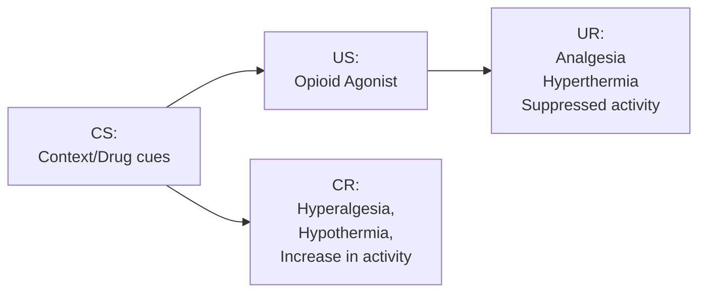

## Conditioning With Drugs
>*Drugs are powerful Unconditioned Stimuli*

Things like the:
- place(s) where drugs are taken
- people with whom drugs are taken
- stimuli involved in drug-takin rituals
...can become conditioned stimuli that signal the drug

>*Animals also form associations and will even press levers to get many of the drugs that are abused by humans*

__Conditioned Compensatory Response__: Functions to preserve equilibrium or prepare the organism for the upcoming US

>[!info]
>*Experiment:*
>- *Inject rats with morphine*
>- *Place them on a hot plate (mildly aversive)*
>- *Measure how long it takes them to lick paws*
>
>*Results:*
>- *A test in the same room where the rats experiences morphine produces similar levels of paw-licking*
>- *A test in a different room dramatically increases paw-licking*

>*Tolerance to a drug can protect an organism for overdose*

## Biological Preparedness

__Rationalism__: The mind comes prepared with a certain set of assumptions and scaffolding that helps it organize experience (Immanuel Kant)

__Biological Preparedness__: Some combination of events are learned more readily than others
>*Animals behave as if evolution has "prepared" them to associate certain events or stimuli*

__Conditioned Taste Aversion__: Pavlovian signals can tells us what not to ingest

>*Animals and humans can learn a conditioned taste aversion with a surprisingly long gap between exposure to the flavor*

>*Taste aversion can occur following just one CS-US pairing*

>[!important]
>*...the learning system (biological preparedness) is designed to promote evolutionary success*

__Stimulus Relevance__: Some US are more attributable to specific CS

>*In laboratory experiments, people associate an electric shock more readily with fear-relevant stimuli than with fear-irrelevant stimuli*

>*Behaviors that are more naturally associated with food are easier to learn for food reinforcement*