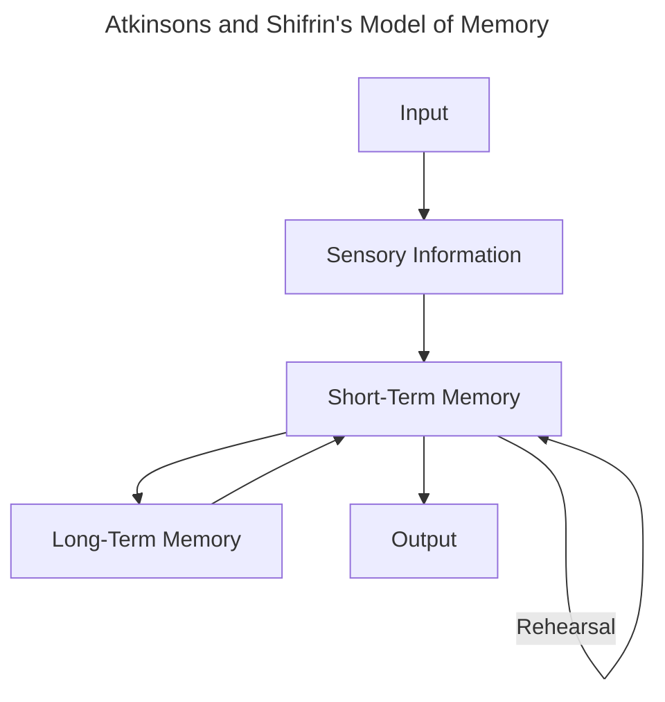
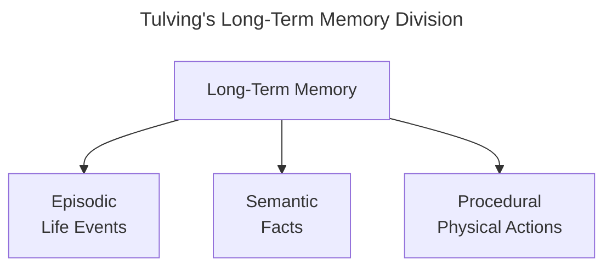
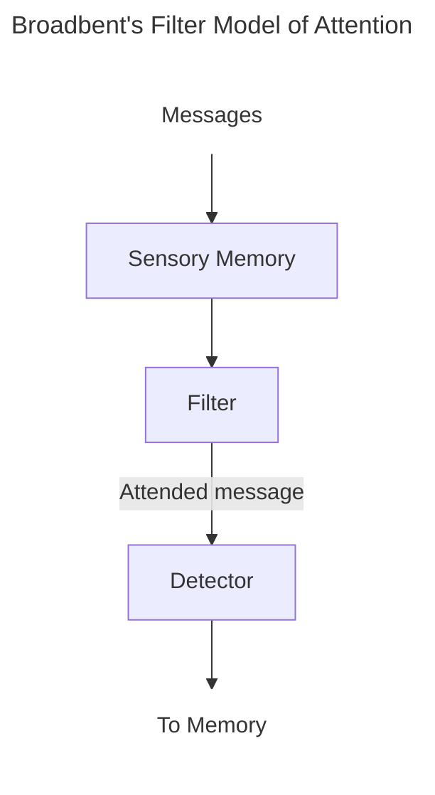
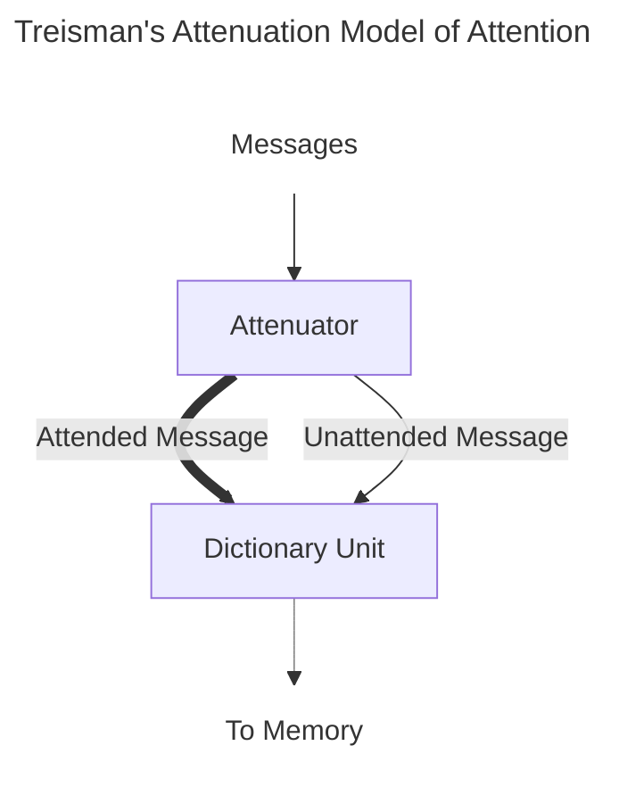
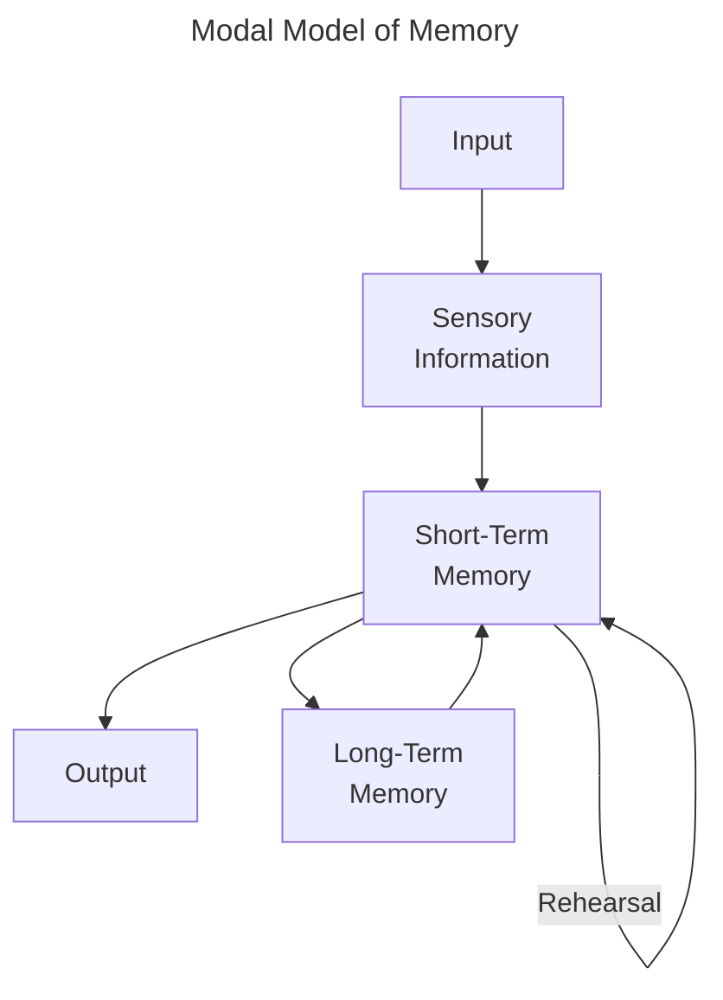
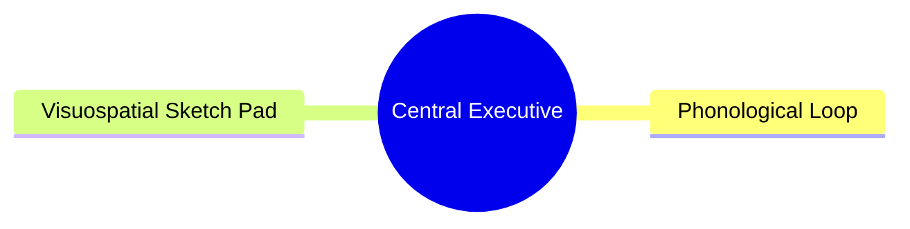
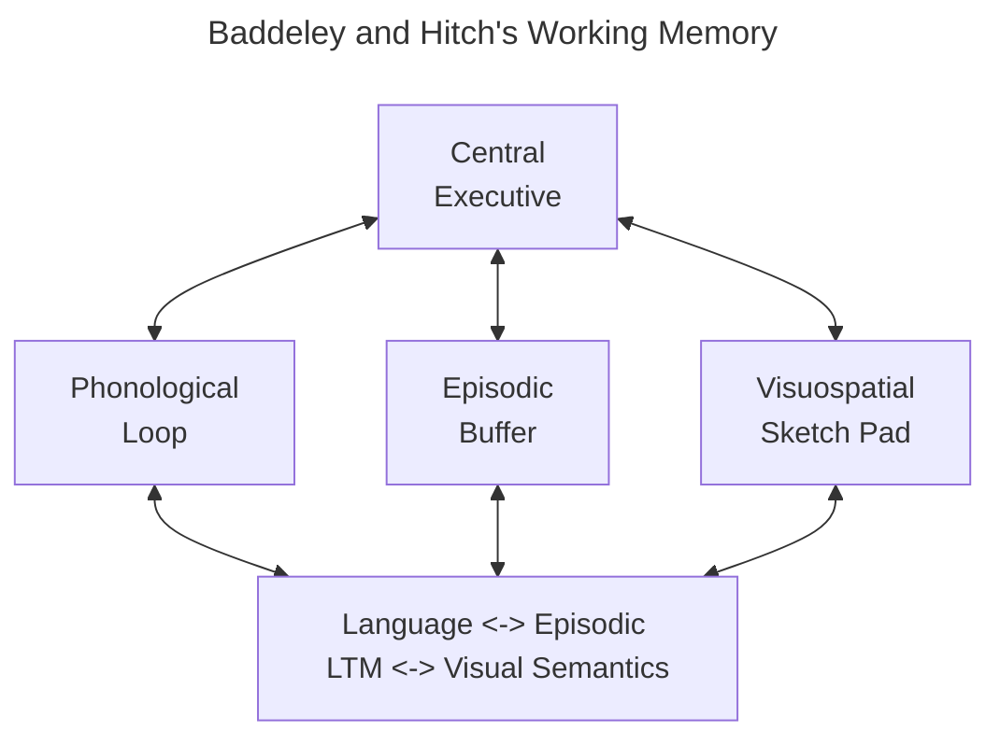

# Textbook
## Chapter 1
__Cognitive Psychology__: The study of mental processes, coined in 1967

__Fransicus Donders__: A Dutch physiologist
- In 1868, he performed the first cognitive psychology experiment (*How long does it take to make a decision?*)
	- Measured reaction time in two ways
		- Simple: Asking participants to push a button as quickly as they could after a stimulus presentation
		- Choice: Asking participants to push the left or right buttons after a left or right stimulus
	- Simple reaction time was calculated as $$\text{Simple Reaction Time} = \text{Stimulus Presentation Time} - \text{Behavioral Response Time}$$
		and decision time as $$\text{Decision Time} = \text{Choice Reaction Time} - \text{Simple Reaction Time}$$
- The result was a "decision" time of about 1/10 of a second
- His study did not measure mental responses directly. but inferred from behavior observations

>*The fact that mental responses cannot be measured directly, but must be inferred from observing behavior, is a principle that holds not only for Donder's experiment but for all research in cognitive psychology*

__Wilheim Wundt__: Founded the first psychology laboratory in 1879, founding structuralism as it is known today and known as the "father of experimental psychology"
- __Structuralism__: Experience is determined by combining basic elements of experience called sensations
- Wundt wanted to create a periodic table of the mind of all the "sensations" through analytic introspection
	- __Analytic Introspection__: Where trained participants described their experiences and thought processes in response to stimuli

__Hermann Ebbinghaus__: Best known for using quantitative measures for measuring memory
- Using himself as a subject, memorized nonsense syllables, then had a delay period before relearning the same syllables, measuring how long it took to learn and later relearn these syllables
	- __Savings__: The difference between the times he recorded
	- Ebbinghaus argued that the plot of percent savings by time (*savings curve)* provided a measure of forgetting

__William James__: An early American psychologist, taught Harvard's first psychology course
- Wrote one of the first textbooks on psychology based on his own observations which included topics on thinking, consciousness, attention, memory, perception, imagination and reasoning

__John B. Watson__: Founded behaviorism as a graduate student in the 1900s
- __Behaviorism__: Studies psychology as purely objective and experimental, studying behavior rather than introspection
- His most famous experiment was "Little Albert"

__Classical Conditioning__: The study of the unconscious relationship between stimuli

__B. F. Skinner__: Introduced operant conditioning
- __Operant Conditioning__: The study of behavior strengthening through reinforcement

__Edward Tolman__: initially a behaviorist, discovered *cognition* which changed the focus in psychology from behaviorism
- In 1938, he ran the rat maze experiment, where a rat explored a maze, then was placed at one point to find food at another point, Later, the rat was placed at yet another point, and still found the food despite this time not having any olfactory cues.
	- Tolman concluded that the rat develops a *cognitive map* while exploring the maze

__Noam Chomsky__: A linguist from MIT turned cognitive psychologist
- He saw language development as determined not by imitation or reinforcement but as an inborn biological program that transcends culture

__Cognitive Revolution__: A shift in psychology that started in the 1950s; a departure from the behaviorist approach that dominated previously
- Resulted in the information-processing approach to studying the mind
- This paradigm shift was due to the technology of the computer

__Information-Processing Approach__: Details an approach through tracing sequences of mental operations involved in cognition

__Artificial Intelligence__: Defined by John McCarthy in 1955 as an approach for making a machine act such that it would be considered "intelligent" if a human were acting as such

__Logic Theorist__: A machine created by Herb Simon and Alan Newell; the first computer program that created proofs for logic problems

__George Miller__: Wrote a paper where he asserted that there is a limit to the amount of information we remember ("7±2")

__Ulrich Neisser__: Wrote the first textbook acknowledging cognitive psychology in 1967
- Two main absences in this book include the study of higher processes and physiology

__Richard Atkinson/Shiffrin__: Two psychologists that proposed a model of memory in 1968
- __Sensory Memory__: Storage of incoming information/signals for milliseconds at a time
- __Short-Term Memory__: Holds information for seconds at a time; where some of sensory information makes it through
- __Long-Term Memory__: Holds information for longer periods of time, strengthened through rehearsal

__Main Early Physiological Psychology Movements__
- __Neuropsychology__: Studying behavior of those with brain lesions
- __Electrophysiology__: MEasuring electrical responses of the nervous system

__Positron Emission Tomography__: A big advancement in studying physiology in 1976 when it was first introduced
- Expensive and involves the injection of radioactive tracers
## Chapter 3
__Sensation__: When information from specific organs is transduced into a detectable signal to the nervous system

__Perception__: The transduction from sensation into conscious flow of thought that is perceived

__Computer Vision__: The process of making computers see and perceive objects like humans do
- First efforts towards this began in 1966 at MIT when scientists attached a camera to a computer and tried programming it to explain what was in its field of view
- In the 1980s, great efforts were focused towards creating algorithms for object recognition, leading to the foundation of the *International Journal of Computer Vision* in 1987
- Advancements continued into the 90s and 2000s in object recognition, as well as a rise in robotics, machine learning, and deep learning

__Machine Learning__: A form of artificial intelligence; using algorithms and statistical models to learn from data and improve task performance over time

__Deep Learning__: A form of artificial intelligence; by using neural networks many layers deep, the resulting dataset can be used to model large and complex patterns for tasks involving high-dimensional data

>*...perception requires the brain to interpret an object's image after it lands on the retina.*

>*...determining its image on the retina is a simple matter of determining how the shape is rotates or oriented in space...solved by extending imaginary "guides"...into the eye*

__Inverse Projection Problem__: The task of perceiving an object as it projects a particular image onto the retina

__Occlusion__: When something is obscured from view

__Viewpoint Invariance__: The ability to recognize something regardless of viewpoint

__Bottom-Up Processing__: Also known as data-based processing, it occurs when perception begins with information from receptors rather than cognition

__Top-Down Processing__: Also known as knowledge-based processing, it occurs when perception is preceded by a person's previous knowledge/expectations

__Speech Segmentation__: The ability to separate a string of words into conversations with a start and an end

__Transitional Probabilities__: The likelihood that one sound will follow with another word

__Statistical Learning__: The study of language characteristics including transitional probabilities
- Can also relate to vision and the study of what is usually perceived in the environment

__Hermann von Heimholtz__: A physicist who made important contributions within multiple science disciplines
- One of his most important contributions to perception was the idea that the image on the retina is ambiguous
	- The perceptual system decides the image is a specific thing based on the likelihood principle and the unconscious inference
		- __Likelihood Principle__: We perceive the object that is most likely to have caused the pattern of stimuli we have received due to unconscious inference
		- __Unconscious Inference__: Perceptions are a result of unconscious assumptions/inferences
>*An important feature of Heimholtz's proposal is that this process of perceiving what is most likely to have caused the pattern on the retina happens rapidly and unconsciously*

__Gestalt Approach__: Drawing roots from Wundt's structuralism, the gestalt approach rejects structuralism and instead asserts there is a set of principles that explain how certain elements are grouped together to create larger perceptions

__Max Wertheimer__: Credited for the origins of Gestalt psychology
- On a train ride towards a vacation in 1911, he bought a stroboscope, which works by creating the illusion of movement by alternating two slightly-different pictures rapidly
- His most important conclusions were that
	- Apparent movement cannot be explained by sensations because there is nothing in the dark space between the flashing lights
	- The whole is different than the sum of its parts

__Apparent Movement__: Perceived motion despite nothing actually moving through rapid changes in light and darkness

__Principles of Perceptual Organization__: A set of rules (heuristics) proposed by Gestalt psychologists that explains how parts of a scene can become one larger unit(s)
- __Good Continuation__: Points that (when connected) result in straight or smoothly curving lines are seen as belonging together
- __Pragnanz__: Stimulus patterns are perceived as a single most simple as possible structure
- __Similarity__: Similar things appear grouped together

>*This idea that the principles are "built in" is consistent with the Gestalt psychologists' idea that although a person's experience can influence perception, the role of experience is minor compared to the perceptual principles*

>*Modern perceptual psychologists take experience into account by noting that certain characteristics of the environment occur frequently.*

__Regularities__: Characteristics that occur in the environment regularly, categorized into
- __Physical__
- __Semantic__

__Oblique Effect__: Vertical and horizontal (straight) orientations can be perceived more easily than slanted orientations

__Light-From-Above Assumption__: A heuristic that assumes light always comes from above

__Scene Schema__: A heuristic that assumes what is likely to be contained in a particular setting

__Bayesian Inference__: Named after Thomas Bayes; the idea is that our estimate of the probability of an outcome is determined by
- the __Prior__: Initial belief about the probability
- __Likelihood__: The extent to which new information supports the prior

>*The approaches of Heimholtz, regularities, and Bayes all share the idea that we use data about the environment, gathered through our past experiences in perceiving, to determine what is out there...The Gestalt psychologists, in contrast, emphasized the idea that the principles of organization are built in

>*...experiencing certain stimuli over and over can actually shape the way neurons respond*

__Experience-Dependent Plasticity__: The shaping of neurons through experience

__Fusiform Face Area__: An area in the temporal lobe that contains many neurons that respond to visual expertise, specifically faces

__D. F.__: A 34-year-old woman who suffered damage to her temporal lobe from CO_2 poisoning
- As a result of her brain damage, she could not rotate a card to match different orientations of a slot in an experiment
- However, she could mail a card by rotating a letter to fit it through the slot

__Perception Pathway__: A neural path from the occipital lobe to the temporal lobe associated with the perception and recognition of objects
- The "what"

__Action Pathway__: A neural pathway from the occipital lobe to the parietal lobe associated with the processing of actions
- The "where"

__Mirror Neurons__: A group of neurons in the premotor cortex that respond when somebody else carries out an action and when the subject themselves mirror the other subject
- Originally discovered in monkeys but may be also present in humans
## Chapter 4
>*Modern research on attention began in the 1950s with the introduction of Broadbent's filter model of attention*

__Attentional Capture__: The rapid shifting of attention caused by strong stimuli

__Dichotic Listening__: A study technique where different stimuli are presented to each ear

__Shadowing__: Repeating the words as they are heard

__Moray (1959)__: Led to the discovery of the "cocktail party" effect
- __Cocktail Party Effect__: The ability to focus on one stimulus while filtering out the rest

__Broadbent's Model of Attention__:

__Treisman's Attenuation Model of Attention__:

__Priming__: A change in response to a stimulus caused by the previous presentation of the same or a similar stimulus
- __Repetition__: When an initial presentation of a stimulus affects the person's response to the same stimulus when it is presented later
- __Lexical__: Priming that involved the meaning of words

__Late Selection Model of Attention__: Proposes that information is processed for its meaning before attention is given selectively

__Perceptual Load__: Relates to the difficulty of a specific task (low- versus high-load tasks)

__Load Theory of Attention__: The ability to ignore task-irrelevant stimuli has proportional relationship to the load of the task the person is carrying out

__In cognitive psychology, there are two types of attention__:
- __Endogenous__: Attention that is focused voluntarily on a stimulus in a sustained, goal-driven manner
- __Exogenous__: Attention that is involuntarily directed towards in a more transient and fleeting manner

__Stroop Effect__: Naming the ink color of a word is slower and more error-prone if the word's color and meaning are incongruent

__Fixation__: A pausing of the eyes on places of interest while observing a scene

__Saccadic Eye Movement__: Movements of the eye from one fixation from one thing to another

__Overt Attention__: Shifting of attention by movement of the eyes

__Stimulus Salience is determined by__: Bottom-up processes that determine attention to elements of a scene

__Saliency Map__: A map of a scene divided by stimuli

__Scene Schema__: A person's previous knowledge that contributes

__Covert Attention__: Occurs when attention is shifted without moving the eyes

__Pre-cueing__: A technique where a cue directs attention to a specific location i the visual field before a target appears

__Same-Object Advantage__: Occurs when the enhancing effect of attention spreads throughout an object, such that the attention to one object results in the facilitation of processing other places on an object
## Chapter 5
>*Memory, like attention, comes in many forms.*

__Memory__: The process involving the retention, retrieval, and the use of information after the original data is no longer present

__Modal Model of Memory__: Presented by Richard Atkinson and Richard Shiffrin (1968), proposes three kinds of memory (denoted as its __structural features__)
 - Sensory Memory: The initial stage where all incoming information is held for seconds or less than
 - Short-Term Memory: Holds five to seven items for about 15-20 seconds
 - Long-Term Memory: Holds large amounts of information for years, up to death
 - Control processes include
	 - __Rehearsal__: Repetition fo a stimulus over and over
	 - Making a stimulus more memorable
	 - Focusing attention on interesting or important information

>*One thing that becomes apparent...is that components of memory do not act in isolation*

__Control Processes__: Dynamic processes associated with the memory structure that can be controlled by somebody; differ from person to person

__Sensory Memory__: The retention of the effects of sensory stimulation

__Persistence of Vision__: The continued perception of a visual stimulus even after it is no longer present. lasting only a fraction of a second

__Sperling__ (1960): Conducted a study with an interest in knowing how much information people can take from briefly presented stimuli
- In said study, he flashes an array of letters for 50 milliseconds, then asks participants to record as many letters as possible
- Used the whole report method; resulting in participants reporting on average 4.5 letters out of 12
- Later he changed it up, using a partial report method combined with an auditory cue after the presentation of the letter array, which people reported about 3.3 letters from
	- He concluded that people saw about 82 percent of the matrix (3.3/4) but could only report part of said percent since the stimulus memory faded
- Finally, he devised an additional experiment to determine how long the fading takes by delaying the auditory cue over a series of different intervals, such that the graph produced (`Delay of tone` x `Percentage of letters available to participant`) results in a logarithmic shape
- *Conclusions*: A short-lived sensory memory system stores all/most of the information that is perceived
	- Decay is within less than a second

__Whole Report Method__: Participants report as many letters as possible from the entire 12-letter display
__Partial Report Method__: Participants report as many letters as possible from a row from the matrix presented based on the auditory cue presented afterwards
__Partial Delay Report Method__: Participants report as many letters as possible from a matrix presented followed by a delayed audio cue presented afterwards

__Iconic Memory__: Corresponds to the sensory memory stage (Modal Memory)
__Echoic Memory__: Corresponds to the sensory memory stage as well
- Lasts a few seconds longer than the iconic memory

__Short-Term Memory__: The system involved in storing small amounts of information for a brief period, most of which is lost before long-term consolidation
- Defined by cognitive psychologists to last about 15-20 seconds
	- John Brown (1958) used the method of recall to determine the duration, by presenting participants with three letters followed by three numbers
		- They later had to recall the three letters followed by a time interval of 3-18 seconds
		- Participants could recall about 80 percent of the three-letter groups after 3 seconds, which decreased to 12 percent after 18 seconds

>*...estimates for how many items can be held in the STM range from four to nine*

__Digit Span__: The number of digits a person can remember

__George Miller__ (1956): Coined the range of short term memory in his paper *The Magical Number Seven, Plus or Minus Two*
- Also introduced the idea of chunking

__Change Detection__: Detecting differences between images that are presented one after another

__Steven Luck and Edward Vogel__ (1997): Measured the capacity of short-term memory using change detection methods
- The results show that performance is almost perfect when the differences are noticeable and not in large quantities, but falter as soon as more than three objects change
- *Conclusion*: Participants can retain about four items in short-term memory

__Chunking__: The combination of small units into larger and/or more meaningful ones
__Chunk__: A collection of elements that are strongly associated with one another, and weak as an individual unit

__Story Mnemonic__: Using random items to create a meaningful order of a story

__K. Anders and Colleagues__ (1980): Ran an experiment where S.F., a college student, improves his memory span from 7 digits up to 79 digits through training in chunking and mnemonics

>*...some researchers have suggested that rather than describing memory capacity in terms of "number of items", it should be described in terms of "amount of information"*

__George Alvarez and Patrick Cavanagh__ (2004): Using Luck and Vogel's change detection procedure as a basis, they conducted an experiment instead using more complex shapes in addition to the simple squares used previously
- They found that the participants' ability to differentiate was based on the complexity of the stimuli (colored squares memory capacity was significantly greater than cubes)

>*The amount of information that can be held in STM is impacted by the attention paid to relevant information and the effective suppression of distracting information*

>*...we could compare it (STM) to a container like a leaky bucket that can hold a certain amount of water for a limited amount of time*

>*...capacity for STM may serve a functional purpose: to help us predict future sensory input. This means out leaky bucket likely leaks on purpose at least*

__Baddeley and Hitch__ (1974): Introduced the idea of working memory as opposed to previous more static models of memory
- __Working Memory__: A limited-capacity system for temporary storage and manipulation of information for complex tasks such as comprehension, learning, and reasoning
- *Conclusion*: Memory is dynamic and consists of several components that can function separately, including the
	- __Phrenological Loop__: Holds verbal and auditory information through its substructures
		- __Phonological Store__: Has a limited capacity and stores information for seconds at a time
		- __Articulatory Rehearsal Process__: Responsible for rehearsal that keeps items in the phonological store from decaying
	- __Visuospatial Sketch Pad__: Holds visual and spatial information
	- __Central Executive__: Where the major work of working memory occurs; pulling information from long-term memory and coordinating information between the phrenological loop and its structures and the visuospatial sketch pad, focusing 

>*...Working memory is concerned with the manipulation of information that occurs during complex cognition*

__Phonological Similarity Effect__: The confusion of letters or words that sound similar

__Word Length Effect__: When memory for lists of words is better for short words

__Articulatory Suppression__: When a person is prevented from rehearsing items to be remembered by repeating an irrelevant sound, such that it overloads the phrenological loop

__Visual Imagery__: The creation of visual images in the mind in the absence of a physical visual stimulus

__Perseveration__: Repeatedly performing the same action or thought even if it is not achieving the desired goal

>*A typical behavior of patients with frontal lobe damage is perserveration*

__Episodic Buffer__: Can store information and is connected to the LTM

>*The history of research on working memory and the brain has been dominated by one structure: the prefrontal cortex (PFC)*

__Phineas Gage__: Survives an accident where a tamping rod goes through his head

__Delayed-Response Task__: A monkey holds information in its working memory during a delay period
- If their prefrontal cortex is removes, their performance drops to chance level

>*...the PFC is important for holding information for brief periods*

>*The idea that information can be held in working memory by neural activity...fits with the idea that neural firing transmits information in the nervous system...some researchers have proposed that information can be held during the delay by a mechanism that does not involve continuous firing*

__Stokes__ (2015): Information can be stored by short term changes in neural networks
- During the activity state, neurons start firing briefly due to incoming information that is to be remembered and encoded into working memory
- Later in the synaptic state, connections between neurons are strengthened when the neurons cease firing, causing what Stokes calls the activity-silent working memory
	- __Activity-Silent Working Memory__: Short term changes in neural network connectivity; a hypothetical mechanism for holding information in working memory
	- This ASWM lasts only a few seconds as working memory
- When the same memory is retrieved later, the same group of neurons fires in a similar pattern
- *Conclusion*: Information is held in memory not by continuous nerve firing but by a brief change in the connectivity of neurons in a network

>*...information can be stored in the nervous system by changes in the connections in neural networks*

__Distributed Representation__: Several regions of the brain are involved in working memory

__Meredyth Daneman and Patricia Carpenter__ (1980): Carried out one of the early experiments on individual differences in working memory capacity by developing a test for working memory capacity in the reading span test
- __Reading Span Test__: Participants read a series of 13 to 16 word sentences, then immediately are asked to recite the last word in each sentence as it occurred
	- The average reading span was from 2 to 5
	- Results were highly correlated with previous reading comprehension tasks and verbal SAT scores
- *Conclusion*: Working memory capacity is a crucial source of differences in reading comprehension

>*However, individuals with good working memory ability but high testing anxiety may observe a decrease in SAT scores since cognitive resources needed for attention and working memory are divided between the exam and testing anxiety*

__Edmund Vogel et. al.__ (2005): Conducted an experiment that focused on the control of attention in the central executive to determine more specifically what differences in working memory capacity influences intelligence
- Separated participants into two groups based on a working memory test, then given a number of items depending on said test with a change detection procedure
- Their event-related potential (how much space was used in working memory) was measured
- The ERP in both groups was the same, however when distractors were added to the experiment, the lower-test group had much more ERP activity, meaning that the higher-test group had much better efficiency in ignoring distractors
	- In other words, the higher-test group had better central executive function
- *Conclusion*: Higher-capacity participants are better at tuning out distractors

__Cognitive Control__: A set of functions which allow people to regulate their behavior and attentional resources
- In other words, the effective use of endogenous attention while limiting or suppressing exogenous attention
## Chapter 6
__Long-Term Memory__: The system responsible for storing information for long periods

>*Beginning in the 196, a great deal of research was conducted that was designed to distinguish between short-term and long-term processes*

__Serial Position Curve__: A plot of the percentage of words recalled versus its position in the list
- Created by presenting a list of words to a participant, one after another. After the last word, the participant writes down all the word they remember (serially or otherwise)
- The result is in a curve that shows that people are more likely to remember words presented at the beginning of a sequence

__Primacy Effect__: Enhanced memory for words presented at the beginning of a list
- A possible explanation of said effect is that people have time to rehearse words at the beginning of a sequence and "transfer" it to long-term memory before the short-term circuit became overloaded

>*...participants begin rehearsing the first word right after it is presented...When the second word is presented, attention becomes spread over two words, and so on;*

__Dewey Rundus__ (1971): Tested the idea of primacy effect and its relation to having more time to rehearse words at the beginning of a list
- Gave participants 20 words to learn at a rate of 1 word every five seconds, then asked them to write them down. Afterward, he did the same for a second list of words, except in between words he asked them to repeat the words (regardless of choice and order). When plotting both graphs against each other (*serial position by percent recalled* and *serial position by mean number of rehearsals*), the first third or so of the graphs almost align with each other
- *Conclusion*: The primacy effect is related to the longer rehearsal time available for words at the beginning of the list

__Recency Effect__: Stimuli presented at the end of a sequence is better remembered

__Murray Glanzer and Anita Cunitz__ (1966): Tested the idea of the recency effect
- Created a serial position curve, then in another experiment had participants recall the last word of the list after making them recite the list backwards
	- The recitation backwards as soon as the list was said was to prevent recitation
- This resulted in an elimination of the recency effect
- *Conclusion*: The recency effect is due to the storage of recently presented items in STM

__Coding__: The form in which stimuli is represented

__Delos Wickens et. al.__ (1976): An example of semantic coding in short term memory
- Participants were presented with words related to either fruits or professions, listening to three words from said group, then counting back for fifteen seconds, then recalling the three words, with the idea that there is proactive interference between counting backwards and the recitaiton of the words
- __Proactive Interference__: Previously learned information interferes with learning new information
- For the fruits group, results went lower as each trial went on due to interference due to the meaning of the words. For the profession group, each trial's results went down due similarly, until they were given fruits as well, which increased significantly the results once again. This effect is known as __release from proactive interference__
- *Conclusion*: Placing words into categories involving1 the meanings of the words, so this represents the effect of semantic coding in short-term memory

__Jacqueline Sachs__ (1967): Performed an experiment that represents semantic encoding in long-term memory
- Participants listened to a tape recording of a passage and then measured their recognition memory to determine whether they remembered the exact wording of sentences or just the overall meaning by being presented with a sentence and being asked if it was a part of the passage after a brief delay
	- Participants often selected the correct response, but selecting sentences that have a similar meaning but different wording was also common
- *Conclusion*: Specific wording is forgotten but the general meaning can be remembered for a long time

__Recognition Memory__: The process for identification of a stimulus by measuring a stimulus during a study period and later present the same stimulus along with others that were not presented
- Different from recall since in a recall test, the person must produce the item to be recalled

| Coding Type | Short-Term Memory                                                             | Long-Term Memory                                                           |
| ----------- | ----------------------------------------------------------------------------- | -------------------------------------------------------------------------- |
| Visual      | Holding an image in the mind to reproduce a visual pattern that was just seen | Visualizing what something looked like when you took a trip there long ago |
| Auditory    | Representing the sounds of letters in the mind after just hearing them        | Repeating a song in mind that you've heard before                          |
| Semantic    | Placing words in an STM task into categories based on meaning                 | Recalling the general plot of a novel you read last week                   |
>*There is evidence that STM and LTM are separated in the brain, but also there is some evidence for overlap*

__Patient H.M.__: Underwent an experimental procedure intended to eliminate his epilepsy by having a bilateral medial temporal lobectomy
- Parts removes included the hippocampus, amygdala, and three regions of the cortex (parahippocampal, entorhinal, and piriform)
- Suffered from anterograde amnesia
- STM remained intact
- His procedure led to an understanding in the role of the hippocampus' role in long-term memory formation
- Practiced mirror drawing often
	- He improved despite feeling like he was always mirror drawing for the first time due to his anterograde amnesia

__Anterograde Amnesia__: An inability to create new memories

__Patient K.F.__: Suffered damage to his parietal lobe
- His resulting reduced STM (seen in his reduces digit span and recency effect) was contrasted by his intact LTM

>*These two cases (H.M. and K.F. establish a double dissociation between STM and LTM*

__Charan Ranganth and Mark D'Esposito__ (2001): Investigated whether the hippocampus has a role in holding information for short periods
- A sample face was presented for one second, followed by a delay period of seven, then a test face is presented. The participants then had to decide if the two faces matched. Participants were split into two condition: novel (faces differed each time) and familiar (seeing the same faces they had seen before) faces
- The results showed increased activity in the hippocampus for novel faces during the delay, but changes only slightly for familiar faces
- *Conclusion*: The hippocampus and other medial temporal lobe structures also play some role in STM

__Episodic Memory__: Memory structure for experiences
- Also involves its own unique experience in mental time travel (experiencing traveling back in time to reconnect with events that happened in the past)

__Semantic Memory__: Memory structure for facts
- Involves its own experience of accessing knowledge about the world that does not have to be tied to a personal experience

__Patient K.C__: Received severe damage to his hippocampus and its surrounding structures in a motorcycle accident
- As a result he lost his episodic memory but not his semantic memory

__Patient L.P.__: Suffered encephalitis and subsequent damage that left her without semantic memory
- Could still make new episodic memories, just couldn't access earlier ones

>*These cases, taken together, demonstrate a double dissociation between episodic and semantic memory*

__Brian Levine et. al.__ (2004): Conducted a brain imaging experiment to identify areas of the brain mapped to episodic and semantic memory
- Participants kept diaries on audiotape describing every personal events and facts, then had then played back to themselves later while in a fMRI machine
- *Conclusion: While there can be some overlap between activation caused by episodic and semantic memories, they are quite different still*

__Autobiographical Memory__: memory for specific events from a person's life; this kind of memory is both episodic and semantic memory in nature
- __Personal Semantic Memories__: Semantic components of autobiographical memory

__Robyn Westmacott and Morris Moscovitch__ (2003): People's knowledge about public figures is more significant if there is both semantic and episodic memories attached to them

>*...forgetting is not always an "all-or-nothing" process*

__Remember/Know Procedure__: Participant are presented with a stimulus they have encountered before and are asked to indicate if they remember the circumstances when they encountered it, or if the stimulus is familiar but don't remember experiencing it

__Semanticization of Remote Memory__: Loss of episodic details for memories long ago

>*...the knowledge that makes up your semantic memories is initially attained through personal experiences that are the basis of episodic memories, but your memory for these experiences often fades, and only semantic memory remains.*

__Prospective Memory__: Used to remember and perform planned action at some point in the future; the memory for future goals

__Donna Rose Addis et. al.__ (2007): Used fMRI to determine how the brain is activated by remembering the past and imaging the future
- Results show the same brain areas were active for both remembering the past and thinking about the future
- *Conclusion*: __Constructive Episodic Simulation Hypothesis__: Episodic memories are extracted and recombined to construct simulations

__Mindfulness__: A cognitive skill of sustained attention to the present
- Intermittent mindfulness practice can increase general well-being as well as sell-efficacy (the belief that one can reach their goals)
- However, some suggest that mindfulness does not increase well-being and can in fact reduce cognitive performance
	- Since mindfulness can increase prefrontal control of the limbic system can lead to emotional blunting of all emotions (positive and negative)

__Explicit Memories__: Consciously experienced
- Also known as declarative since they can be explicitly stated

__Implicit Memory__: No conscious experience of
- Also known as non-declarative

__Procedural Memory__: Also known as skill memory; Involved skills and the memory for doing things
- Enable us to carry out skilled acts without thinking about what we are doing

__Patient L.S.J.__: A violinist whose hippocampus damage caused a loss of episodic memory
- Her memory improved as she practiced new pieces of music but had no memory of practicing the piece
- Further testing showed that she lost her previous knowledge (of art for example), but could still explicitly remember procedural questions

__Expert-Induced Amnesia__: A skill that is well-practiced is carried out as if it happens automatically by someone who has rehearsed it well (an "expert")

__Priming__: The presentation of one stimulus (priming stimulus) can change the way a person responds to another (test stimulus)
- Different kinds of priming include
	- *Repetition*: When the test stimulus is similar to the priming stimulus

__Peter Graf et. al.__ (1985): Tested the priming stimulus with patients such as
	- Patients with Korsakoff's syndrome (associated with alcohol abuse; eliminated the ability to form new LTMs)
	- Patients without amnesia who were being treated for amnesia
	- Patients without amnesia who had no history of alcoholism
- Participants had to read a 10-word list and rate how much they liked each word, then had to recall the words through recall (explicit memory) or a word completion test (implicit memory)
	- The word completion test contained the first three letters of the 10 words as well as the first three of 10 words they had not seen before
- Results show that
	- Patients with Korsakoff's recalled fewer words than the two other (control) groups, however they performed on par in the word-completion test

__Propaganda Effect__: People are likely to rate statements they have heard before as being true just on the merit of having been seen before
## Chapter 7
__Encoding__: The process of acquiring information and transferring it to memory

__Retrieval__: The process of remembering information that has been stored in long-term memory

__Maintenance Rehearsal__: Rehearsal through autonomic repetition

__Elaborative Rehearsal__: Rehearsal through effortful connection to other previously-acquired information, with particular efforts towards the meaning of a term

__Levels of Processing Theory__: Proposed by Fergus Craik and Robert Lockhart; Memory is dependent on the depth of processing that an item receives
- *Processing depth* is distinguished between
	- __Shallow Processing__: Little attention to meaning; attention to a word's physical features
	- __Deep Processing__: Closer attention to a word's meaning and its relation to other information

__Fergus and Craik__ (2002): Presented words to participants, then separated based on the questions asked:
- If a word was capitalized (for shallow processing)
- If it rhymed with another word provided (deeper processing)
- If it fit into a sentence (fill-in-the-blank) (deepest processing)
- *Results*: People who were asked about physical features performed less desireably than those who were asked about rhyming, and even less so than those who were asked to fill-in-the-blank
- *Conclusion*: Deeper processing is associated with better memory

>*The basic idea behind levels of processing theory... memory retrieval is affected by how items are encoded*

__Paired Associate Learning__: A learning task where participants are first presented pairs of words, then a word from each pair is shown and its pair is asked to be recalled

__Gordon Bower and David Winzenz__ (1970): Performed a paired-associate learning procedure (Presented a list of 15 pairs of nouns for five seconds)
- One group was told to silently repeat the pairs to themselves; another group was asked to form a mental picture with the two words "interacting" with one another
- *Results*: Participants who created images remembered more than twice as many images as the other group
- *Conclusion*: Visual imagery enhances memory and retrieval

__Self-Reference Effect__: Memory for a word is improved by relating the word to oneself

__Eric Leshikar et. al.__ (2015): Participants studied a series of adjectives on a screen for about three seconds each, then separated into two groups: the *self condition* (asked if the adjective described themselves) and the *common condition* (asked if the word was commonly used)
- Following the study phase, the participants were told to indicate whether they remembered the words from before
- *Results*: Memory was better for the self condition than the common condition
- *Possible Conclusions*:
	- Words can become linked to themselves because of how well-known we are to ourselves
	- Statements that result in richer, more detailed representations in a person's mind result in better memory

__Generation Effect__: Memory for material is better when a person generates the material themselves rather than passively receiving information

__Norman Slameka and Peter Graf__ (1978): Participants studied a list of word pairs in two ways: as a *read group* (simply reading the group of words) and a *generate group* (filled in the blank with their own word that matches the word provided)
- Afterwards participants were presented with the first word and asked to indicate the second word in the pair
- *Results*: Participants who generated the second word in the pair reproduced 28 percent more word pairs than participants who had just *read* the word pairs
- *Conclusion*: Taking a more active role in one's own memorization helps memory retrieval

__Retrieval Cue__: Help to remember information stored in memory

__Gordon Bower et. al.__ (1969): Presented items to be learned in a concept map of different categories; each a minute long, then asked to recite the items
- One group saw a hierarchically-organized map, whereas the others saw the map in a random order
- *Results*: The group with the random concept map were only able to remember 21 words across four maps as opposed to the 73 from all four concept maps
- *Conclusion*: Organizing material to be remembered results in substantially better recall

__John Bransford and Marcia Johnson__ (1972): Asked participants to read a grammatically-correct but confusing passage and look at a picture related to the passage; half the participants saw the image before the passage, and the other group vice-versa
- *Results*: Participants who saw the image before the passage remembered double the information as their counterparts
- *Conclusion*: The ability remember material depends on how that material is encoded into the mind

__James Nairne__ (2010): Participants imagined they were stranded in a foreign grassland without any basic survival materials, then presented a list of words to rate each word and how relevant it would be to survival. Later they were given a surprise memory test
- *Results*: Reading the words while performing the "survival" task resulted in better memory than other elaborative measures
- *Conclusion*: Survival Processing is a powerful tool for encoding items into memory

>*Other researchers have, however, shown that memory is also enhanced by relating words to situations that our ancestors did not experience...it may simply be that imaging situations that involve survival can enhance memory*

__Retrieval Practice Effect__: Practicing memory retrieval increases elaboration, which increases performance on memory tasks

__Jeffrey Karpicke and Henry Roediger__ (2008): English-speaking participants who spoke Swahili studied a list of 40 Swahili-English word pairs, then were shown one half of the pair and asked for its counterpart. 
-  After the first study-and-test period they were divided into three groups
	- Those who continued to study-and-test until all the words were remembered
	- Those who continued to study only the words that were previously not remembered when tested, but testing all the words nonetheless everytime
	- Those who continued to study all words but only tested on words not previously remembered
	- *Results*: The first and second groups had similar performance when tested a week later (81 percent) compared to the third group's average (36 percent)
	- *Conclusion*: Encoding relies on techniques that result in elaborative processing

__Testing Effect__: Enhanced performance on a memory test caused by being tested on the material to be remembered

__Spacing Effect__ (Distributive Practice): The advantage in performance caused by short study sessions separated by breaks from studying

__Fluency__: Repetition that causes reading to be easier and easier

__Familiarity Effect__: Familiarity causing rereading to be interpreted as knowledge or memory of something

__Sarah Peterson__: Studied participants' highlighting habits
- *Results*: 82 percent of students highlight their notes; yet there is no difference in performance between highlighting/not highlighting when tested on the material

__Timo Mantyla__ (1986): Presented participants with a list of 504 nouns, then told to associate three words with each noun.
- They were tested by presenting either their self-generated or other-participant-generated associated words (retrieval cues) and asked to remember the word associated with said word
- *Results*: When presented with their own retrieval cues, they remembered 91 percent of the words, as opposed to the 55 percent from the other cues
	- With a control group that were tested similarly but had not been shown the nouns, they could only remember 17 percent of nouns
- *Conclusion*: Retrieval cues provide extremely effective information for memory retrieval especially when self-generated

__Encoding Specificity__: Memory is encoded along with its context

__D. R. Godden and Alan Badderley__ (1975): Known as the diving experiment; groups studied words either underwater or on land, then tested by dividing the groups such testing took place on either land or water
- *Results*: Recall best occurred when encoding and retrieval occurred in the same location
- *Conclusion*: Study in an environment similar to the environment in which you will be tested

__Harry Grant et. al.__ (1998): Participants read an article on psychoimmunology while wearing headphones which were either playing nothing or background noise.
- Half of each group was tested in either the quiet or noise conditions
- *Result*: Participants did better when the testing condition matched the study conditions
- *Conclusion*: Its better to study in conditions matching the testing conditions

__State-Dependent Learning__: Learning is encoded and associated with an internal state of being

__Eric Eich and Janet Metcalfe__ (1989): Participants were asked to think positive or negatively while listening to correlating music, then rating their mood during encoding, studying after they rated their mood wither really happy or sad
- After two days, the same procedure of getting participants happy or sad repeated, then they were given a test of the words they previously studied
- *Results*: Participants did better when their mood matched their mood during encoding
- *Conclusion*: Memory is better when a person's mood during retrieval matches the mood during encoding

__Donald Morris et. al.__ (1977): Participants heard a sentence (with a word replaced by the word "blank") then a target word. They then had to say yes or no based on their condition;
- Participants were divided into two conditions:
	- *Meaning*: The sentence target completes the sentence in a way where it makes logical sense (*The \_ is...*)
	- *Rhyme*: The sentence target completes the sentence such that it makes it true (*\_ rhymes with...*)
- Participants were tested by presenting a series of test words serially and tested by being asked if the test word rhymed with one of the target words previously presented
- *Result*: Those who focused on rhyming during encoding remembered more words when tested (49 percent) than those in the other condition (33 percent)
- *Conclusion*: Retrieval is better if the same cognitive tasks are involved during both encoding and retrieval
	- Contradicts the levels of processing theory, where those who experienced deeper processing (according to the theory) did not perform as well as those who performed "shallow processing" methods.
		- In other words, deeper processing at encoding does not always result in better retrieval

__Transfer-Appropriate Processing__: When the type of task that occurs during encoding matches the type of task that occurs during retrieval, leading to enhanced memory

__Mnemonic__: Any technique used to improve encoding, retention, and/or retrieval of information: can be either
- Verbal: Using words to create language-related associations to aid in memory through
	- Acronyms
	- Acrostic: Repurposing the first letter of a word to create a phrase or sentence
- Visual
	- Method of Loci (Memory Palace): A familiar place is imagined, then items to be remembered are "placed" within said place
		- Retrieval involves reimagining this place with the items that were "placed"
	- Method of Association: Associating an item to be remembered with a visual representation

__Verbatim Memory__: An ability to recall information precisely as it was presented

>*Memory has a history... while every experience created the potential for a new memory, new memories are fragile and can therefore be disrupted*

__Georg Muller and Alfons Pilzecker__ (1900): Participants learned two lists; one group learned them one right after another ("immediate" condition) and the other waited six minutes before being presented the nest list ("delay" condition)
- *Results*: The delay condition resulted in remembering 48 percent, as opposed to the 28 percent of the other condition
- *Conclusion*: New memories are very fragile and subject to change at the slightest disturbance at any step before consolidation and reconsolidation
	- Presenting the second list immediately after the first prevented the formation of a stable memory

__Consolidation__: The process that converts new memories from their inherent fragile state to a stabler one
- Fragility implies vulnerability to disruption and change
- Consolidation relies on physical mechanisms between synapses and neural circuits through processes such as
	- __Synaptic Consolidation__: Structural changes at the level of synapses
		- Takes minutes or hours
	- __Systems Consolidation__: Structural changes at the level of neural networks
		- Gradual; takes place over months or years

>*The fact that synaptic consolidation is relatively fast, and systems consolidation is slower does not mean we should think of them as two stages of a process that occur one after the other...Instead, they occur together...but at different speeds and levels of the nervous system.*

__Donald Hebb__ (1948): Proposed that learning and memory are represented in the brain as physical changes in neurons' synapses
- Repeated activity between action potentials and the resulting neurotransmitter release between neurons causes structural changes, greater transmitter release, and increased firing
- Experiences can be recorded by the changes that occur between hundreds or thousands of synapses that are activated around the same time 
- His theory was a catalyst for modern research on the physiology of memory
	- Led to the discovery that activity at a synapse caused a sequence of chemical reactions, resulting in protein synthesis and synapse structural changes

>*More recent research has focused on systems consolidation...*

__Reactivation__: Activity between the hippocampus and cortex

__Standard Model of Consolidation__: Connections between the hippocampus and cortical regions are inherently strong, yet intercortical connections are inherently weak. As reactivation occurs, hippocampal-cortical connections weaken and intercortical connections strengthen, such that eventually only intercortical connections remain
- Hippocampal activity is crucial during early memory encoding and consolidation/reconsolidation
- Reactivation leads to direct connections between various cortical regions

__Asaf Gilboa et. al.__ (2004): Participants were shown photographs of themselves engaged in various activities over their lifetimes to elicit episodic memories
- *Result*: The hippocampus was activated during the retrieval of both recent and remote episodic memories
- *Conclusion*: Support the multiple trace model of consolidation

__Multiple Trace Model of Consolidation__: In early stages of consolidation, the hippocampus communicated with cortical regions and continues active communications with the cortical regions even for remote memories

__Indre Viskontas et. al.__ (2009): Participants viewed pairs of stimuli while getting fMRIs, then told to imagine the pairs interacting with one another.
- 10 minutes and a week later (separately) they were shown the same stimuli again (along with some other pairs not previously shown) and asked to respond either saying they
	- Remembered the pair from when it was originally presented
	- Know the pair but don't remember when it was presented
	- Don't remember the pair
- *Results*: There were more remember responses after 10 minutes, and half of those responses remained after a week
	- Physiologically, the hippocampus response remained high for pairs remembered after ten minutes and a week (RR responses), but dropped to nearly zero for those remembered after ten minutes but only known after a week (RK responses)
- *Conclusion*: The response of the hippocampus can change over time
	- The hippocampus responds to episodic memories and changes over time but only for stimuli that have lost their episodic character

__Heidi Bonnici et. al.__ (2012): Participants recollect recent events in their lives (occurring two weeks earlier) and remote events (occurring ten years earlier); both events with the criteria of being clear and vivid memories.
- A week later were asked to remember three recent and three remote memories while receiving fMRI scans.
	- Additionally, they were asked to rank the vividness of the memories; only vivid memories were selected and studied using multivoxel pattern analysis
- *Result*: Recalling memories activates several structures activates structures across the brain, including the hippocampus, even for remote memories
	- The prefrontal cortex specialized in remote memories
	- The hippocampus activated for both recent and remote memories
		- The posterior hippocampus focused more on remote memories
- *Conclusion*: The hippocampus continues to be important even for more established and remote memories

__Steffan Gais et. al.__ (2006): High school students learned a list of 24 English-German vocabulary words, then a group went to sleep within three hours of studying while the other waited ten hours before sleeping
- Groups were both tested 24 to 36 hours after sleeping
- *Results*: Students who slept after studying forgot less material than students in the awake group
- *Conclusion*: Sleeping shortly after learning enhances memory

>*Why does going to sleep...enhance memory? A reason might be that going to sleep eliminated environmental stimuli that could interfere with consolidation. Another reason might be that consolidation appears to be enhanced during sleep*

__Ines Wilheim et. al.__ (2011): Participants learned a task and were told that they would be tested on said task ("expectant" condition) or on a different task later after a night's sleep ("unexpectant" condition)
- *Results*: Memory performance after sleep indicated that the expectant group performed significantly better than the unexpectant group
- *Conclusion*: Sleeping after learning strengthens more important memories through consolidation

__Reconsolidation__: When a memory is retrieved and reactivated, it reenters the same fragile stat as when it was consolidated the first time

__Karim Nader et. al.__ (2000): Classically conditioned a rat to a tone-shock (freezing) condition, then injected with
- The rat was then placed in one of three conditions
	- The rat is injected with anisomyacin (an antibiotic that inhibits protein synthesis; preventing changes at the synapse) before tone-shock pair consolidation occurs, leading to a lack of conditioning
	- The rat learns the pairing uninhibited, but received anisomyacin before presenting the tone
	- The rat learns the pairing uninhibited, and received anisomyacin while the tone was being presented
- *Result*: The third condition causes the same lack of conditioning as the first condition
- *Conclusion*: A memory is susceptible to being changed at retrieval

__Almut Hupbach et. al__ (2007): Participants were presented with 20 objects, then placed into a blue basket, with the experimenter telling them to pay close attention, then tested to recall the items.
- Two days later they were separated into two groups
	- One ("reminder") group asked to remember the previous procedure, and presented and tested on 20 more objects, except they were placed on table and not into a basket
	- The other group did the same, except they were not asked to remember the previous experiment
- Two days after that, they were all tested on the first day's objects
- *Results*: The reminder recalled 36 percent of the first list and mistook 24 percent from the second list, whereas the no-reminder group recalled 45 percent of the objects from List A, and mistakenly recalled only five percent of objects from list B
- *Conclusion*: Memories can be integrated with one another simply by recalling and reconsolidating memories while consolidating new ones

__Temporal Context Model__: The temporal context of past experiences cues and retrieves memories, since items are encoded sequentially based on temporal proximity and order
## Chapter 8
__Autobigraphical Memory__: Specific experiences of our lives that are important and encoded
- Both multidimensional and more vivid than other kinds of memory

__Robert Cabeza et. al.__: (2004): Participants took pictures on digital cameras of their school, then shown their own pictures and someone else's photos of the same location, then repeated a few days later with some other photos they had never seen before
- Cabeza took fMRIs of the participants as they determined whether the photos were theirs or somebody elses
- *Results*: Many of the same structures were activated throughout the study (medial temporal lobe, parietal cortex areas).
	- When seeing ones own photos, there was an increased activation of the prefrontal cortex (associated with processing of the self) and the hippocampus (associated with recollection)
- *Conclusion*: Looking at one's own photos can elicit memories of taking the picture and activate a larger network of the brain than just looking at a photo somebody else took

__Reminiscence Bump__: People over 40 have enhanced memory from events from adolescence and early childhood compared to other periods of their lives. There are three main hypotheses for this effect:
- __Self-Image Hypothesis__: Memory is enhanced for events that occur as a person's self-image is developing
- __Cognitive Hypothesis__: Periods of rapid change, followed by a period of stability, leads to stronger encoding of memories during periods of rapid change
- __Cultural Life Script Hypothesis__: Events of a person's life are easier to recall when they begin to fit the typical script for one's life depending on one's culture

__Youth Bias__: Most notable events of one's life is perceived to occur when the person is young

__Amygdala__: A subcortical structure involved in processing emotional aspects of an experience or memory

__Flashbulb Memories__: Memory for a circumstance that surround hearing about shocking and highly-charged eventsr
- Feel like they are particularly vivid and accurate
- Can be caused by
	- __Narrative Rehearsal Hypothesis__: Events aren't remembered because of a special mechanism (like flashbulb memories) but more simply because they are exposed to it over and over again
- Flashbulb memories are both special in the sense that they are vivid and likely to be remembered, but also just like any other memory in the sense that it can be manipulated

__Nostalgia__: A memory that involves a sentimental affection for the past

__Music-Enhanced Autobiographical Memories__ (MEAMs): Involuntary memories elicited by listening to music

__Proust Effect__: A phenomonon in which olfactory stimuli trigger vivid and emotional memories, first coined by Marcel Proust after describing the smell of a madeleine while eating it

__Constructive Nature of Memory__: Memories are constructed based on perceived reality in addition to expectations, other knowledge, and other life experiences

__Source Monitoring__: The process of determining where knowledge comes from

__Source Monitoring Error__: Misattribution the source of a memory or experience
- Very common; often unconscious

__Cryptomnesia__: Unconscious plagiarism of the work of others
- Common in amnesia and artistic endeavors

__Larry Jacoby et. al.__ (1989): Participants read several made-up non-famous names and were tested either immediately after or a day later. The test involved discerning names that were famous in a list including the made-up non-famous names they were previously shown along with those not shown
- *Result*: The delayed test group were more likely to name the non-famous made up people than the group tested immediately after despite both being told that the non-famous names they were exposed to would appear
- *Conclusion*: Source monitoring issues can lead to misleading realities

__Illusory Truth Effect__: Repeated presentation of a statement leads to a perception of truth

__Fluency__: The easy with which a statement can be remembered

__Repeated Reproduction__: A procedure that involves participants reproducing stimuli on repeated occasions at increasing intervals after the initial production to test memory

__Frederick Bartlett__ (1932): Knwon as the "War of the Ghosts" experiment; Participants read a Canadian folklore story, then were asked to repeatedly reproduce the story
- *Results*: At increasing intervals time between tests, the story became more inaccurate, adding and omitting certain details
	- Some of these inaccuracies could be seen as a reflection of the participants' own cultures
- *Conclusion*: As time passes, memory can become a more holistic retrieval such that information from multiple sources can become integrated into one perceived truth

__Pragmatic Inference__: Reading a sentence causes somebody to expect something not explicitly said/implied, but expected through previous experience and expectations

__Schema__: A person's previous knowledge of a particular current experience or situation. Particular schemas include
- __Script__: The expected sequence of actions in a particular current situation or experience

>*False memories arise from the same constructive processes that produce true memories*

__Misinformation Effect__: Misleading information presented after an event manipulates how somebody retrieves the memory later
- __Misleading Postevent Information__: Said information that causes the misinformation effect
- Can be explained as a source monitoring error

__Infantile Amnesia__: An inability to recall memories that occurred early in life
- Can be attributed to a lack of development in brain structures important to memory, or as memory decay through adolescence and adulthood

__Weapons Focus__: The tendency to focus attention on a weapon
- Causes a fixation on the weapon itself and poorer memory for other details of the situation

__Post-Identification Feedback Effect__: Increased confidence of memory recall due to confirming feedback

__Good Lineup Procedures__:
- Inform witnesses that the perpetrator may not be in the lineup
- Use "fillers", or people that look similar to the suspected perpetrator
- Conduct with somebody who does not know about the case
- Have witnesses rate confidence immediately after the lineup

__Cognitive Interview__: Lets the witness talk with minimum interruption and allowing for minimal manipulation from the interviewee

__Retrograde Amnesia__: Loss of memory prior to an injury or traumatic event

__Graded Amnesia__: Loss of memory most severe for events right before the injury or traumatic event, and less so for more remote memories

__Chronic Traumatic Encephalopathy__ (CTE): A progressive neurodegenerative disease stemming from repeated head injuries
- Causes memory loss, behavioral changes, and cognitive decline
- Associated with contact sports and military combat

__Anterograde Amnesia__: An inability to form new memories

__Hyperthymesia__: A highly superior autobiographical memory
## Chapter 9
__Knowledge__: Explicit awareness of obtained information

__Conceptual Knowledge__: Explicit awareness that allows for categorizations and predictions

__Concept__: The mental representation of a class of items and its rules/characteristics

__Category__: An organization of all possible examples of a particular concept

__Categorization__: The process of deciding which objects belong in what category
- __Definitional Approach__: An item is categorized based on it matching a certain definition of said category
	- __Family Resemblence__: All items in a category resemble one another
		- Coined by Ludwig Wittgenstein to deal with the issue that definitions don't represent all items in the category, allowing for variations within categories whilst not violating the definition
- __Prototype Approach__: An item is categorized by comparing an object to its related prototype
	- Coined by Eleanor Rosch from the family resemblence idea
- __Exemplar Approach__: An item is categorized by its similarity to other objects
	- Advantages include easier consideration of outlier cases and variable categories

__Sentence Verification__: A participant is asked to determine whether a sentence is true or false

__Prototype__: A typical member of the category
- Typicality is the average features that are experienced from said object
- Prototypical objects have
	- High family resemblence
	- Verified rapidly through sentence verification
	- Named first when asked to list the most prototypical members of a category
	- Affected more by priming

__Exemplar__: Existing members of a category

__Hierarchical Organization__: Larger categories are divided into more specific categories, each getting one level where one category is above multiple categories
- __Superordinate/Global Level__: The highest and most general category level
- __Basic Level__: Below the superordinate level, above the subordinate level
	- Going from basic to the global level results in a great loss of specific detail/defining features whereas going below it results in little increase of the same definitions
- __Subordinate Level__: The most specific and lowest level

>*Generally. people with more expertise and familiarity with a particular category tend to focus on the more specific information...associated with the specific level*

__Semantic Network Approach__: Concepts are arranged in networks, with nodes representing concepts/categories connecting to similar nodes/concepts/categories with properties indicated for each node
- First modeled by Allan Collins and Ross Quillan, who wanted to model memory for computers
- Hierarchical inherently because concepts are leveled such that more specific concepts are at the bottom and more general ones are at the top
- __Cognitive Economy__: Storing shared properties at a higher level-node, such that it is more efficient and saves space
	- Exceptions are added at lower nodes as needed
- Statements that require further travel between nodes results in longer reaction times
- __Spreading Activation__: Activity that spreads out along any link in a semantic network
	- The resulting activations makes concepts primed and ready to be retrieved
- *Criticisms*: Does not explain the typicality effect (faster reaction types for more typical members of a category); cognitive economy may not exist since properties may be stored at the node directly

__Lexical Decision Task__: Participants decide quickly if a stimulus is a word or nonword

__Connectionism__ (Parallel Distributive Processing): Concepts are represented in networks that themselves are modeled after neural networks

__Connectionist Approach__: Based in connectionism and its approach to creating computer models for representing cognitive processes
- __Units__: Inspired by and represent neurons
	- __Input Unit__: Activated by stimuli from the environment/experiementer
	- __Hidden Units__: Any unit between the input and output units
	- __Output Unit__: The final unit output in the network
- __Connection Weight__: Functions essentialy as inhibitors/excitors of the next unit
- Connections between units translate to axons in the brain
- Activation between units depends on the signal that originates in the input unit and connection weights throughout the network
- Unlike the semantical approach, features and characteristics are denotes by activity in the attribute units on the far right, as well as the pattern of activity within the network
- Learning is characterized by an adjustment of weights
	- __Error Signal__: The difference between an output signal of a particular stimulus and the stimulus that actually represents said stimulus
	- __Back Propagation__: When the error signal is transmitted backwards through the network to adjust the weights
- Networks are not completely disrupted by physical damage
	- __Graceful Degradation__: Performance gradually declines when physical components of the brain are damaged
- Networks can explain the generalization of learning by predicting properties of different items we have never seen by comparing to those we have seen

__Category-Specific Memory Impairment__: An inability to identify one type of object while retaining the ability to identify other objects in similar categories

__Sensory-Functional Hypothesis__: Categorization between living and nonliving ob jects depends on a memory system which has separate circuits for processing sensory attributes and overall function

__Multiple-Factor Approach__: Based in the idea of distributed representation, multiple factors are searched and to decide how concepts are divided within a category

__Semantic Category Approach__: Semantic information is stores in different neural circuits for specific categories

__Embodied Approach__: Concepts are based on the reactivation of sensory/motor processes when the object is interacted with

__Semantic Somatopy__: Words can be associated to parts of the body and the corresponding location of the brain associaated with said part of the body

__Semantic Dementia__; A general loss of knowledge for all concepts
- Usually due to damage in the anterior temporal lobe (also associated with savant syndrome)
## Chapter 10
__Visual Imagery__: Vision in the absence of a visual stimulus

__Mental Imagery__: The ability to recreate senses without the physical stimuli usually necessary

__Imagination__: The ability of the mind to be creative and resourceful

>*...mental imagery does not have to be visual*

>*...imagery provides a way of thinking that adds another dimension to the verbal techniques usually associated with thinking*

__Wilheim Wundt__:
- Proposed there are three levels of emotions:
	- Images
	- Sensations
	- Feelings
- Since images accompany thought, studying said images is a way of studying thinking

__Imageless Thought Debate__: Is thought possible in the absence of images?

__Galton__ (1883): Observed that people who have great difficulty forming visual images were still quite capable of thinking
- *Conclusion*: Imagery is not required for thinking

__Propositional__: Information stored using language and symbols

__Spatial__: Information processed in relation to location
- Related to the dorsal pathway ("where")

__Depictive__: Information depicted visually in relation to object qualities/recognition
- Related to the ventral pathway ("what")

__Paivio__ (1963): Participants were exposed to groups
- *Results*: 
	- __Conceptual Peg Hypothesis__: Concrete nouns create images that other words can associate strongly with, even if the words are not closely related
- *Conclusion*: It is easier to remember concrete nouns with physical manifestations that can be imagined than abstract nouns

__Shepard and Metzler__ (1971): Participants saw a series of two pictures and indicated whether they were the same or different objects
- Using mental chronometry techniques, the researchers measured the reaction difference in deciding two similar objects (of two different angles) are similar or different to one another
- *Results*: The reaction time was proportional to the angle between the two images
	- This study was one of the first to apply quantitative methods to studying imagery
		- Also the first to suggest that imagery and perception may share similar mechanisms
- *Conclusion*: Participants mentally rotated the views to determine whether it matched the other one

__Mental Scanning__: A person scans a mental image in their mind

__Kosslyn__ (1973): Participants memorized a picture of an object and then created an image of said object in their mind and fixate on a specific part of the image. Using said image, they were asked to look for another part of said object
- If said part was found on the object, they pressed a "True" button; otherwise they pressed the "False" button
- *Results*: It took longer for participants to find parts that are farther away from the first fixated part of the image compared to parts closer by
- *Conclusion*: Imagery (like perception) is spatial
- *Counterargument*: Glen Lea in 1975 proposed that the resuls were because, as participants scanned the image, they found other interesting parts that acted as distractors and increased reaction time

__Kosslyn et. al__ (1978): Performed another experiment where participants scanned two places on a map of an island
- *Results/Conclusion*: Supported the idea purported originally that imagery is spatial

__Imagery Debate__: Is imagery based on spatial or propositional mechanisms?

__Propositional Theory__: Proposed by Zenon Pylyshyn in 1973, contradicting Kosslyn's theory
	- Just because imagery is experiences spatially does not mean the underlying representation in the brain is spatial as well; in other words an epiphenomenon
	- Instead, imagery involves propositional representations

__Epiphenomenon__: An experience that accompanies the real mechanism but is not a part of said mechanism

__Propositional Representation__: Relationships between objects are represented by symbols (such as equations) or statements

__Spatial Relationship__: Different parts of an image can be described as corresponding to a specific location in space

__Depictive Representation__: More broadly, relationships between objects are represented as a sum of specific parts on said objects

__Kosslyn__ (1978): Participants imagined two animals next to each other and close enough so that the larger of the two took most of the visual field. The participants were asked if said animal had a specific feature to respond as quickly as possible.
- Participants also did a mental walk task, estimating the distance at which they begin to experience overflow (when the image fills the visual field or when the image edges begin to become fuzzy)
- *Results*: When repeated (the smaller animal becoming the larger animal paired with an even smaller animal), participants created larger images of the rabbit
	- Participants answered questions about the rabbit quicker when it filled more of the visual field
	- For the mental walk task, overflow was achieved earlier for larger animals than for smaller animals
- *Conclusions*: Images are spatial (like perception)

__Mental Walk Task__: Participants form a mental image of an object and imagine walking towards it

__Perky__ (1910): Participants were asked to visualize an image on an empty screen; the screen was not blank but rather had a very dim projection.
- *Results*: Participants' description of the images matched the projection on the screen
	- Participants did not notice the non-empty screen, but rather mistook the actual picture for a mental image
- *Conclusion*: Perception and imagery share similar mechanisms
	- Later experiments similar to this show that imagery can affect perception

__Kreiman__ (2000): Participants (patients with electrodes planted in regions of the medial temporal lobe) were shown images and measured firing rates across said regions
- *Results*: Neurons fired rapidly for images of objects but not of faces
	- Similarly, the same results occurred when imagining the same objects and faces
- *Results*: The coining of "imagery neurons" and the finding of a possible physical mechanism for imagination

__Imagery Neurons__: Fire rapidly during perception and imagery processes

__Le Bihan et. al.__ (1992): Participants were shown images and asked to imagine them as well while in an fMRI machine
- *Results*: Activity in the striate cortex increased for both conditionsa
- *Conclusion*: Perception and imagery both activate the visual cortex

__Kosslyn et. al.__ (1995): Participants were placed in a brain scanner and asked to create small, medium, and large visual images mentally
- *Results*: Activity was centered posteriorly for smaller images, and moved more medially as the image grew larger
	- This topographical map matches similar to experiments where participants physically saw similar images
- *Conclusion*: Imagery and perception result in topographically-organized brain activation

__Topographic Map__: Each point of a certain stimulus causes activity at a specific brain location
- Points located next to each other on the stimulus causes activity at points next to each other at said brain area

__Ganis et. al__ (2004): Using fMRIs to measure neuron activation, participants observed a drawing of an object (Perception) or imagined a picture previously shown (Imagery)
- Afterwards, both groups were asked a question related to the object perceived or imagined
- *Results*: Perception and imagery both activate similar regions in the frontal lobe
	- Perception activates more of the visual cortex towards the back of the brain than Imagery
- *Conclusion*: There exists some similarities yet some important differences between brain activations for perception and imagery
	- Later studies also show a decreased response in some regions associated with non-visual stimuli
		- Some suggest this is because visual images are more fragile than real perception

__Johnson and Johnson__ (2014): Using MVPA techniques, presented four different scenes to participants in a scanner
- *Results*: The classifier predicted the correct pictures on 63% of the trials
	- The classifier trained on predicting what the participant was imagining was 55%
- *Conclusion*: A lot of work remains to be done before classifiers can accurately predict what a person is perceiving

>*Promising research has found that classifiers are able to use activity in area V4 of the cisual cortex to predict behavioral performance related to imagery of specific colors*

__Kosslyn et. al.__ (1999): Presented TMS to the visual cortex while participants were carrying out either a perception (briefly viewing a display of shapes in quadrants and asked to compare shapes in two of the quadrants) or imagery (similar to the perception task, instead imagining the shown image) task
- Reaction time was measured for when TMS was applied to the visual region of the brain for both conditions and when TMS was applied to another part of the brain
- *Results*: Stimulation causes participants to respond more slowly both for perception and for imagery
- *Conclusion*: Brain activity in the visual cortex plays a causal role in both perception and imagery

__M.G.S__: A woman who had her right occipital lobe removed due to sever epilepsy
- The mental walk task (done before and after the procedure)resulted in a change from 15 feet to 35 feet
	- This result is because removing a part of the visual cortex reduces the field of view
- *Conclusion*: The visual cortex is also important for imagery

__Unilateral Neglect__: Damage to the parietal lobes causes the patient to ignore objects in one half of the visual field

__R.M.__: Suffered damage to his occipital and parietal lobes
- Could recognize objects and draw accurate pictures of objects before him, but could not draw during tasks involving mental imagery

__C.K.__: Suffered from visual agnosia
- Could draw from memory but could not recognize objects in front of him
- He could not recognize his own drawings later on

>*The apparent paradox highlights the difficulty in interpreting neuropsychological results. For one thing, the damage in individual cases varies greatly between individuals...much of the research that presents evidence for an overlap between perception and imagery also acknowledges that the overlap is only partial*

>*Most psychologists...have concluded that imagery and perception are closely related and share some (but not all) mechanisms*

__Chalmers and Reisberg__ (1985): Participants are asked to create mental images of ambiguous figures, then asked to see in another way contrary to the way originally seen
- *Results*: Participants could not flip the image when holding a mental image
- *Conclusion*: It is harder to manipulate mental images than perceptual images

__Finke et. al.__ (1989): Participants imagined a capital letter D. then rotate it 90 degrees to the left and place another letter J at the bottom
- *Results*: Participants report seeing an umbrella
- *Conclusion*: Mental images that are simple can be manipulated more easily

__Francis Galton__: Suggests that there are individual differences in which people can vividly remember and imagine familiar scenes

__Kozhevnikov et. al.__ (2005): Presented a questionnaire designed to determine preference for using imagery versus other strategies when solving problems, qualified as Visualizers or Verbalizers
- Visualizers were given tests to measure spatial and object imagery such as the paper folding test and vividness of visual imagery questionnaire
- *Results*: The results of the specific spatial/object imagery tests were inverse; high spatial imagery predicts low object imagery and vice-versa

__Spatial Imagery__: The ability to imagine spatial relations such as layouts and divisions of space

__Object Imagery__: The ability to imagine visual details, features, or whole objects

__Paper Folding Test__: Participants view a piece of paper being folded, poked a hole in, then determine what it would look like unfolded
- Used to measure spatial imagery

__Vividness of Visual Imagery Questionnaire__ (VVIQ): Participants rate the vividness of mental images created
- Used to measure object imagery

__Kozhenikov et. al.__ (2007): Participants presented a physics exam to students without a physics background
- *Conclusion*: Spatial ability is related to solving many types of physics problems

__Aphantasia__: An inability to mentally imagine anything
- Coined by Zeman and colleagues in 2015
- Affects about 4 percent in the population
- Objective diagnosis is difficult due to participant biases
- Can indirectly affect autobiographical memory
## Chapter 11
__Language__: A system of communication that uses sounds or symbols to enable the expression of feelings, thoughts, ideas, and experiences

__Communication__: A system for exchanging information between individuals
- Does not have to be verbal (like behavior or chemicals like pheromones)

>*Communication is ubiquitous in the animal kingdom. Many animals make sounds, perform behaviors, and produce smells to share information with others*

>*Language is a human-specific ability. As impressive as some animal communication is, it is much more rigid than human language...One of the properties of human language is...creativity*

__Alphabet__: A standardized set of letters or symbols representing individual sounds

__Syllabary__: Syllables are represented with symbols

__Logographic System__: Symbols represent whole words and unbound morphemes (Chinese characters for example)

__Hierarchical Nature of Language__: Language consists of a series of small components that can be combined to form larger units

__Rule-Based Nature of Language__: Components of language are to be arranged in specific allowed ways

__B.F. Skinner__: Published a book called Verbal Behavior in 1957
- Proposed language is learned through reinforcement, since language is learned by being rewarded for appropriate usage and punished otherwise

__Noam Chomsky__: Published a book called Synactic Structures
- Unlike Skinner, he proposes that language is hardwired in our genes
- Language can be a means of studying cognitive properties
- Also wrote a negative review of Skinner's book in 1959, where he argues that children produce sentences that they have never heard and thus never reinforced
	- Served as an important catalyst for psycholinguistics

__Psycholinguistics__: The study of the psychological processes behind language acquisition and processing
- How do people understand spoke and written language?
- How language represented in the mind?
- How do people produce language?
- How is language learned?

__Lexicon__: The collection of words known

__Semantic__: The meaning of language

__Lexical Semantics__: The meaning of words

__Word Frequency Effect__: We react more rapidly to words more seen than low frequency words
- A word's frequency influences how we process the words

__Lexicon Decision Task__: Participants decide as quickly as possible whether strings of letters are words or nonwords
- Research with said task indicates that there is a slower response to low-frequency words

__Rayner and Duffy__ (1986): Participants read sentences while their eyes were being tracked for fixations that could occur between high-frequency words and other words
- *Results*: Frequencies were 5.1 times per million for low-frequencies and 122.3 times per million for high-frequency words
- *Conclusion*: Previous experience with words can influence the ability to access meaning

__Pollack and Pickett__ (1964): Recorded the conversations of participants who sat in a room waiting for an experiment, then were presented with single words from their previous conversations
- *Results*: Participants could only identify only half the words
- *Conclusion*: Words are more difficult to understand when taken out of context and presented alone

__Speech Segmentation__: The process of perceiving individual words within the continuous flow of speech

__Lexical Ambiguity__: When a word can have more than one meaning

__Tanenhaus et. al.__: Participants were exposed to a series of audios where...
- The study is modeled after a lexical priming procedure
- *Results*: Significant priming effect (faster reaction time) for the primed word identification
	- Effects disappeared after 200ms

__Lexical Priming__: Priming by presenting a word followed with another word that is similar

__Meaning Dominance__: Some meaning fo the words occur more often than other

__Biased Dominance__: One meaning of a word is more likely than others

__Balanced Dominance__: A word's meanings are all equally likely

>*The difference between biased and balanced dominance influences the way people access the meanings of words as they read them*

__Semantic Satiation__: The repetition of a word or phrase results in temporarily lost
- Short in duration; can usually change due to moving on to another thought or topic

__Syntax__: The structure of a sentence

__Parsing__: Meaning created by grouping of words into phrases
- Involves the understanding each word as it occurs 

__Garden Path Sentences__: Sentences that appear to mean one thing but end up meaning another

__Temporal Ambiguity__: When the meaning of a sentence is ambiguous because a number of meanings are possible

__Garden Path Model of Parsing__: Reading a sentence and its subsequent parsing is based on heuristics
- When the heuristics are wrong, we revisit the "path" by which we decided or predicted the sentence and correct
- These heuristics are syntax-based principles
- *Counterarguments*: Syntactical rules do not always act alone in correcting; other factors apply in the process of parsing

__Principle of Late Closure__: When encountering a new word, the parsing mechanism assumes that this word is part of the current phrase
- Every new word adds to the current phrase as long as possible

>*Information contained in the words of a sentence, and the context within which a sentence occurs, is used to make predictions about how the sentence should be parsed*

__Constraint-Based Processing__: Semantics and other factors (along with syntax) operate simultaneously to determine parsing
- Factors may include word meaning, story and scene context, memory load, and prior experience with language

__Visual World Paradigm__: Determines how subjects process information by measuring eye movements and carrying out intentionally ambiguous instructions

__Subject-Relative Construction__: A sentence construction in which the subject of the main clause is also the subject in the embedded clause

__Bransford and Johnson__ (1973): Participants read passages and tested them their memory of the passage
- *Results*: When presented with a passage that combined information from the passage with additional information (but never actually appeared), most participants indicated they had seen it before.
- *Conclusions*: We infer things based on what we read

__Narrative__: Story that progresses from one event to another

__Coherence__: The representation of a text in the mind that makes clear relations between parts of text to thte main topic of a story

__Anaphoric Inference__: Predictions based on connecting an object or person in one sentence as the subject of the following sentences

__Instrument Inference__: Predicting the tools/methods used while reading/listening

__Causal Inference__: Predicting the events described in one sentence because of the events of previous sentences

>*Inferences create connections that are essential for creating coherence in texts*

__Situation Model__: A mental representation of what a text is about, simulating the perceptual and motor movement and characteristics of the objects and actions in a story

__N400__: An ERP that occurs due to semantic processing
- Stronger when a word in a sentence is unexpected

>*This link between action words and activation of action regions in the brain area suggests a physiological mechanism that may be related to creating situation models as a person reads a story*

__Given-New Contract__: A speaker should construct sentences such that they include two kinds of information: given information (previously known) and new information (information that is being heard for the first time)
- Reflects the collaborative nature of conversations

__Common Ground__: The mental knowledge and beliefs shared among people conversing

__Referential Communication Task__: Two people exchange information in a conversation in a task involving the naming and identification of something
- Used in common ground studies

__Entrainment__: Creating common ground between people such that their mannerisms and behaviors mirror one another

__Syntactic Coordination__: People use similar grammatical constructions when having a conversation

__Syntactic Priming__: Hearing a statement with a particular syntactic construction increases the changes that a following statement will mirror its construction

__Theory of Mind__: The ability to understand what others think, feel, or believe

>*Most people who are bilingual learned both languages at roughly the same time*

>*The success of sequential bilingualism is also dependent on means, opportunity, and motive*

__Advantages of Bilingualism__:
- Contributes to building cognitive reserve (an ability to withstand age-related cognitive decline)
- Metalingistic awareness (an ability of manipulating language structures and conventions; reflecting a deeper understanding of language systems)
- Promotes cognitive flexibility (an ability to switch between different tasks, rules, or mental acts)
- Improved attentional control

__Disadvantages of Bilingualism__:
- Increased difficulty in retrieving vocabulary items (tip-of-the-tongue phenomenon)
- Slower lexicon access speed
- Language attrition (proficiency in one language decreases due to decreased exposure and use)
- Harder to separate the two languages (cross-language activation)

__Speech Disfluency__: A break or disruption in the flow of speech
## Chapter 12
__Problem__: An obstacle between a present state and a goal

>*One of the central ideas of the Gestalt approach is that success in solving a problem is influenced by how it is represented in the person's mind*

__The Circle Problem__: Posed by Gestalt psychologist Wolfgang Kohler; Given a circle with a radius of 10, a circle divided in four equal parts, determine the hypotenuse of a circumscribed triangle
- Solving the problem does not require math, but rather restructuring the visual's representation in the mind

__Restructuring__: The process of changing a mind's representation of a problem
- Gestalt principles say it is the key mechanism of problem solving
	- Also says restructuring requires insight

__Insight__: Sudden comprehension, realization, or problem solution that involves reorganization that was not initially obvious

__Metcalfe and Wiebe__ (1987): Gave participants insight and non-insight problems and asked them to rate how close they were to a solution (based on "warmth" (hot/cold))
- Designed with the idea to differentiate between insight and non-insight problems
	- Initially hypothesized that participants feel when progressing into an insight problem versus not an insight problem
- *Results*: For insight problems, warmth scores remained low until a breakthrough, whereas for non-insight problems, warmth scores increased linearly
- *Conclusions*: Insight problems rely on a breakthrough to be solved unlike other problems

>*Evidence also shows that "aha" problems can involve analytical linear processes*

__Fixation__: People's tendency to focus on a specific characteristics of the problem that keeps them from arriving
- __Functional Fixedness__: Focusing on the familiar uses of an object, inhibiting from learning about new ones

__The Candle Problem__: Two groups are presented with candles and the objects needed to mount a candle on a wall without dripping wax on the floor
- Participants presented with the materials in boxes (the same boxes needed to create the support) found it more difficult to solve the problem compared to those presented with the materials outside the box

__Two String Problem__: Participants must tie two strings hanging from the ceiling together
- Participants were given a pair of pliers to use
	- More than half of participants could not solve it because of functional fixedness of the pliers

__Mental Set__: A preconceived notion of how to approach a problem determined by previous experiences

__Water Jug Problem__: Participants have to figure out how to obtain a certain amount of water provided three jugs that altogether do not add up to said amount
- Participants were set into two groups

>*Derived from Newell and Simon; A problem has an initial state (the conditions set at the beginning of the problem) and a goal state (the solution to set problem). In addition there*

__Tower of Hanoi Problem__: Three discs are stacked on the leftmost of three pegs; the goal is to move all the discs to the rightmost peg
- The main ruies are
	- Discs are moved one at a time from one peg to another
	- A disc can be moved only when there are no discs on top of it
	- The larger disc can never be placed on top of a smaller disk

__Means-End Analysis__: A way of problem-solving aiming to minimize the amount of steps between initial and goal states
- Important terms are:
	- __Initial State__: The conditions at the beginning of a problem
	  __Goal State__: The conditions that are met when a problem have been solved
	- __Operators__: Rules, in other words, for alloted moves towards a problem's solution
	- __Intermediate State__: The various conditions that exist along the pathways between the initial and goal states
	- __Problem Space__: The sum of initial, intermediate, and goal state(s) for a particular defined problem
- Means-end analysis, in other words, is a way of creating subgoals towards the goal state, effectivelt turning intermediary stages into more achievable subgoal states

>*One of the main contributions of Newell and Simon's approach to problem-solving is that it provided a way to specify the possible pathways from the initial to goal states*

>*Research has shown that there is more to problem-solving than specifying the problem space and subgoals*

>*How a problem is stated can affect its difficulty*

__Mutilated Checkboard Problem__: A checkboard has its two corners removed: can dominoes cover all the squared regardless?
- Impossible since removing two corners makes it impossible
- The idea behind this problem is that participants find it easiest to determine it on a checker-board that emphasized differences the most (from left-to-right, bread/butter, black/pink, a checkerboard with black and pink squares, and a blank slate)
	- Bread/butter solved it twice as fast

__Think-Aloud Protocol__: Participants verbalize what they are thinking while solving a problem
- The main goal is to determine what a person is attending to while solving a problem

__Analogical Problem-Solving__: Making an analogy to help solve a problem
- A solution to the target problem is set as analogous to the solution for another solved source problem
- The steps for said thought process are
	1. Noticing there is an analogous relationship between the problem and another
	2. Mapping the correspondence between the source problem and the target problem
	3. Applying the mapping to generalize a parallel solution

>*Noticing and mapping are the most difficult steps in analogical problem-solving*

__Radiation Problem__: Used in analogous problem-solving analogies, such that

__Analogical Encoding__: The process by which two problems are compared to determine similarities

__Gentner and Goldin-Meadow__ (2003): Participants are taught about tradeoff (negotiation/bartering x for y) and contingency (proposing a better deal if something desireable happens, otherwise the other person's deal is upheld). Afterwards, two group of participants were shown cases either showcasing the contingency or tradeoff strategy
- They were asked to compare these two cases to arrive at a successful negotiation
- *Results*: Participants tended to use the negotiation strategy emphasized in previously
- *Conclusions*: Comparing source material is an effective way to achieve analogical encoding due to forced attention towards the problem's features

__Analogical Paradox__: While it is difficult to apply analogies in laboratory research and studies, people apply analogies regularly easily in real life situations

__Experts Solving Problems__:
- Possess more knowledge In the fields
	- A study with chess master versus beginner show experts excel at real-life positions, but no better in random positions
- Knowledge is organized differently than novices
- Spend more time analyzing problems
	- Get off to a "slow" start because they spend time trying to understand the problem

>*Expertise is only an advantage in the expert's specialty*

>*One disadvantage is that knowing about established facts in a field may make experts less open to new ways of solving a problem*

__Divergent-Thinking__: Thinking that is open-ended and involves a large number of potential solutions
- Considered the cornerstone of creativity (not all that it can be)
- Creativity, in other words, is anything human-made that is in some way novel and has potential for utility
	- Defines well the idea of utilitarian creativity, but not of art mediums

__Problem Solving__ (Basadur et. al., 2000): Proposes four stages with two steps each
1. Problem-generation
	1. Problem finding
	2. Fact finding
2. Problem Formulation
	1. Problem Definition
	2. Idea-finding
3. Problem Solving
	1. Evaluation and Selection
	2. Planning
4. Solution implementation
	1. Selling the idea
	2. Taking action

__Group Brainstorming__: Where people trying to solve a problem are encourages to express ideas freely
- Encourages people to freely express all and any ideas; manifests "thinking outside the box"

__Creative Cognition__: A technique used to train people to think creatively by Finke

__Pre-inventive Forms__: Objects created in creative cognition experiments that precede the creation of a creative finished object

>*Finke demonstrated not only that you do not have to be an inventor to be reative, but also that many of the processes that occur during creative cogntion are similar to cognitive processes from other areas of cognitive psychology*

__Nine-Dot Problem__: Nine dots are arranged in a square pattern, in which the task is to draw four straight lines through all nine dots without lifting the pen from the paper
- Difficult in part due to Gestalt predispositions to group

__Left Anterior Temporal Lobe__: Associated with low-level groupings
- When inhibited through Transcranial Direct Current Simulation, participants perform on par with others who were told they need to draw lines outside the box (within the nine-dots problem)

__Kounios et. al.__ (2006): Participants were fitted with electrodes to an EEG, then shown three words. They were then asked which word combined with either of the other two words made a new word/phrase (*Compound Remote Association Problem*).
- Participants who solved it indicated whether they solved it by insight
- *Results*: Half of people could solve it within thirty seconds; half of said people solved it through insidht
	- Half of solvers showed Increased activity in the frontal lobe just before said ""insight"; the other half showed activity in the occipital lobe
- *Conclusions*: Neuronal activity during a preparatory interval before participants solved the problems predicts "insight"

__Neuronal Networks Associated with Creativity__:
- Default Mode Network (Also known as the Imagination Network)
- Executive Control Network

__Incubation__: The phenomenon of getting ideas after taking a break from an activity

__Alternate Uses Task__: Assess creativity by asking the person to think of unusual uses for an object
- Increased mind wandering increases AUT performance
	- In other words, mind-wandering processes facilitate creative incubation

__Daydreaming__: A form of mindwandering:
- Volutional: Choosing to disengage from other tasks to pursue internal streams of thought

__Solitude__: Can provide a distraction-free space to give the mind space to create ideas

__Mindfulness__: In the present, focusing on the moment intentionally
- Achieved through mediation
	- __Focused Attention Meditation__: Characterized by the simple procedure of focusing on breathing
		- Decreases distractions and subsequently creativity
	- __Open Monitoring Meditation__: Characterized by paying attention to whatever comes into the mind
## Chapter 13
__Inductive Reasoning__: The process of drawing out general conclusions based on specific observations and evidence; specific cases determine a general case
- Good inductive arguments have the following characteristics:
	- *Representation*: Gather a variety of observations on different subjects under set categories
	- *Quality*: Relies on a large amount of consistent observations

__Heuristic__: A mental shortcut that allows for a fast best-guess solution to problem
- Can take on many forms
	- __Availability__: Thoughts that come up first are judged as more probable than others
	- __Representativeness__: Two events are classified as similar the more an event resembles the other

__Illusory__ (Spurious) __Correlation__: A false relationship between two events that appears to exist
- Can result in stereotypes due to generalization of false relationships

__Base Rate__: The proportions of different categories in a population
- Failure to consider leads to errors of reasoning

__Farmer/Engineer Study__: Participants were presented with a scenario involving 70 farmers and 30 engineers, and asked what percentage there was of picking an engineer
- Some participants were also given a description of a man in said group
- *Results*: Adding the description increased the estimated chances
- *Conclusions*: Base rate information is ignored when presented with descriptive information

__Conjunction Rule__: The probability of two events together cannot be higher than the probability of any one of those events alone.
- In other words, for any two events $A$ and $B$, $A \cap B ≤ A \land A \cap B ≤ B$
- Violation of the conjunction heuristic is usually due to the representative heuristic

__Law of Large Numbers__: The larger the number of subjects drawn from a population, the more representative the resulting group will be of said population

__Myside Bias__: Confirmation bias leads to hypothesis testing in such a way that proves their own opinion and attitude correct

__Confirmation Bias__: People look for information that conforms their hypothesis and ignores information that refutes it
- Confirmation bias explains three specific cognitive effects
	- *Belief Perseverance*: Own beliefs persists even after evidence is presented on the contrary
	- *Attitude Polarization*: Differing beliefs become more extreme or polarized
	- *Irrational Primacy Effect*: Greater reliance is placed on information obtained around the time a belief was established

__Backfire Effect__: individual support for a particular viewpoint becomes stronger when faced with corrective facts opposing their viewpoint

__Bias Bias__ (Bias Blind Spot): The tendency for people to recognize biases in individuals more easily than ourselves

__Deductive Reasoning__: Determines whether a conclusion logically follows the premises: general principles determine a specific case
- __Syllogism__: A series of three statements; two premises and a conclusion
- __Premise__: General principles by which a conclusion is achieved
- __Validity__: Quality of a syllogism, determined by whether the conclusion follows logically from its premises

__Belief Bias__: A tendency to think a syllogism is true or untrue based on if its conclusion is believable

__Mental Model Approach__: Determines syllogism validity by creating mental images of deductive problems based on its premises
- __Mental Model__: A specific situation represented in a person's mind

__Conditional Syllogism__: Syllogisms whose first premise is an "if...then" statement
- The main kinds of conditional syllogisms are
	- *Modus Ponens*: A conclusion follows from two premises $p \implies q$ 
		- Valid and judged correctly almost always
	- *Modus Tollens*: $\lnot q \implies \lnot p$
		- Valid; judged correctly about 60% of the time
	- Invalid; judged correctly about 40% of the time
		- $q \implies p$
		- $\lnot p \implies \lnot q$

>*In logic, you can only move "forward" from the "if" (Modus Ponens) or "backward" from a "not" (Modus Tollens). Trying to go backward from a positive result or forward from a negative start leads to a fallacy.*

__Wason Four-Card Problem__: Four cards are presented; each card has a letter on one side and a number on the other side, and two presented cards have either a letter or a number
- Tests conditional syllogism reasoning skills
- An extrapolation involving beer/soda and younger/older ages shows more success rates because it involves familiar rules

__Falsification Principle__: To test a rule, it is necessary to look for situations that would falsify the rule

__Permission Schema__: If a person satisfies a specific condition, they get to carry out an action
- This schema is easier to map onto something when the conditions involved are more familiar than abstract

__Expected Utility Theory__: Assumes people are perfectly rational beings
- Utility is defined as the outcomes that achieve a person's goals
- This model is used by economists and such

__Expected Emotions__: Feelings that a person expects to feel after a decision and its outcome

__Risk Aversion__: The tendency to avoid taking risks

__Incidental Emotion__: Emotions not caused by having to make a decision directly

__Status Quo Bias__: Tendency to do nothing when faced with making a decision
- Participation in opt-in procedures is less than in opt-out procedures

__Risk-Aversion Strategy__: A decision-making strategy governed by the idea of avoiding risk
- Often used when a problem is stated in terms of gains

__Framing Effect__: Decisions are influenced by how they are stated
- When a choice is framed in terms of gains, people tend to be risk-averse, whereas when in terms of losses people are risk-taking

__Neuroeconomics__: Combines research in psychology, neuroscience, and economics to study brain activity in decision making related to gains and losses

__Ultimatum Game__: A player (*proposer*) is given some money and makes a deal to another (*responder*) as to how the money is to be split. If a deal is struck, the money is split between them, otherwise no money is given to either
- In a study, some people reject the offer made to them on the basis of being unfair
	- However, when presented by computers, people reported less disatisfaction (as shown in lower right anterior insula activation compared to their human counterpart)

>*The prefrontal cortex also serves an important role in implementing the cognitively demanding decision of rejecting offers*

>*The insula also predicted purchase decisions, but in a different way; the insulawas particularly active when participants viewed excessively priced items, and this activation predicted decisions not to purchase*

# Coglabs
## Decision Making
This experiment used the questions in Kahnemann and Tversky (1984) to reveal properties of human decision making. On each trial you were given an opening description of a situation and then two options from which you chose one. Each problem was actually part of a pair of problems. There were two sets of five problems. Every problem in one set had a corresponding problem in the other set.

The problems were specially constructed so that the two problems of each pair were essentially the same problem. The difference between paired problems was in the presentation of the description or the choices. By looking at differences in preferred choices across the problem pairs, we can identify certain properties of human decision making.

The independent variable in this experiment was the problem. The dependent variable was the proportion of participants who choose the different options. The data in this experiment are only interesting when combined across participants in your class or global data.

The tables below list the problem statements, choice A, and choice B. The text below the table discusses the expected pattern of results and its significance.

### Problem 1

|Problem Set|Problem statement|Choice A|Choice B|
|---|---|---|---|
|1|Imagine the country is preparing for the outbreak of an unusual disease, which is expected to kill 600 people. Two alternative programs to combat the disease have been proposed. Assume that the exact scientific estimates of the consequences are as follows:|If Program A is adopted, 200 people will be saved.|If Program B is adopted, there is a one third probability that 600 people will be saved and a two thirds probability that no people will be saved.|
|2|Imagine the country is preparing for the outbreak of an unusual disease, which is expected to kill 600 people. Two alternative programs to combat the disease have been proposed. Assume that the exact scientific estimates of the consequences are as follows:|If Program A is adopted, 400 people will die.|If Program B is adopted, there is a one third probability that nobody will die and a two thirds probability that 600 people will die.|

A bit of reflection reveals that choice A and B are the same for both problems. Since 600 people are expected to die from the disease, selecting choice A leads to 200 people being saved and 400 people dying. Similarly, the probabilities in choice B are identical across the two problems.

However, we expect to find that people in with problem set 1 prefer option A, the sure saving of 200 people. On the other hand, people in problem set 2 will tend to choose option B, with the probability of nobody dying. When similar choices are presented as gains (saving people), most people prefer the sure gain (choice A) over the probabilistic gain (choice B). This is called _risk-avoiding_ behavior. When similar choices are presented as losses (people dying), most people prefer the probabilistic loss (choice B) over the sure loss (choice A). This is called _risk-seeking_ behavior. Thus, which option people chose can be manipulated by the presentation of the results as gains or losses.

### Problem 2

|Problem Set|Problem statement|Choice A|Choice B|
|---|---|---|---|
|1|Consider the following two-stage game. In the first stage there is a 75% chance to end the game without winning anything and a 25% chance to move into the second stage. If you reach the second stage you have a choice between the following options. Your choice must be made before the game starts, i.e., before the outcome of the first stage is known. Please indicate the option your prefer.|A sure win of $30.|An 80% chance to win $45.|
|2|Which of the following options do you prefer?|A 25% chance to win $30.|A 20% chance to win $45.|

Once again, choices A and B are actually identical. The 25% chance to move in to the second round of the problem in set 1 correspond exactly to the 25% chance to win $30 in the problem in set 2. The probabilities go through similarly for choice B. What is predicted to happen is that people essentially ignore the probability of moving to the second round in problem set 1 and then compare the sure gain against the probabilistic gain. These participants should be risk-avoiding and chose A. The participants in problem set 2 cannot ignore the probabilities and tend to prefer choice B because it has a higher expected value.

### Problem 3
|Problem Set|Problem statement|Choice A|Choice B|
|---|---|---|---|
|1|Imagine that you are about to purchase a jacket for $250 and a calculator for $30. The calculator salesman informs you that the calculator you wish to buy is on sale for $20 at the other branch of the store, located 20 minutes away. Would you make a trip to the other store?|Yes|No|
|2|Imagine that you are about to purchase a jacket for $30 and a calculator for $250. The calculator salesman informs you that the calculator you wish to buy is on sale for $240 at the other branch of the store, located 20 minutes away. Would you make a trip to the other store?|Yes|No|

The difference in these problems is in the cost of the calculator and jacket. We predict that more people will be willing to make a trip to save $10 on a $30 calculator than on a $250 calculator. This is a bit odd because in either case, the person is spending a total of $280 at one store and saves $10 by going to the other store. The effect demonstrates two properties. First, people seem to isolate the gain to the particular item rather than relating it to the entire purchase. Second, the value of the saving appears to be proportional to the cost of the item. Thus, saving $10 on a $30 calculator is worth more than saving $10 on a $250 calculator.

### Problem 4

|Problem Set|Problem statement|Choice A|Choice B|
|---|---|---|---|
|1|Imagine that you have decided to see a play and paid the admission price of the $20 ticket. As you enter the theater, you discover that you have lost the ticket. The seat was not marked, and the ticket cannot be recovered. Would you pay $20 for another ticket?|Yes|No|
|2|Imagine that you have decided to see a play where admission is $20 per ticket. As you enter the theater, you discover that you have lost a $20 bill. Would you still pay $20 for a ticket for the play?|Yes|No|

The difference in these problems is in what is lost before entering the theater. The different preferences demonstrate a kind of mental accounting. We predict that in problem set 1, the loss of the ticket corresponds to a mental loss of entrance to the theater and that people are less likely to agree to pay twice for the play. In problem set 2, the loss of $20 is not marked for entrance to the theater, so people are willing to buy a ticket. Of course, in both problems, the person ends up with the same situation, they either have a ticket and $40 less money or have no ticket and $20 less money.

### Problem 5
|Problem Set|Problem statement|Choice A|Choice B|
|---|---|---|---|
|1|Would you accept a gamble that offers a 10% chance to win $95 and a 90% chance to lose $5?|Yes|No|
|2|Would you pay $5 to participate in a lottery that offers a 10% chance to win $100 and a 90% chance to win nothing?|Yes|No|

The only difference between these problems is that in problem set 1, the $5 is presented as a characteristic of losing the gamble, while in problem set 2 the $5 is presented as the cost of entering the lottery. We predict that people will be more willing to participate in the lottery than to take the gamble.

### How robust is this effect? Are there limits to this effect?

The results are usually robust, but they do not occur for every participant. Your own data may deviate from the expected pattern because people make their choices based on their own individual experiences and needs. The interesting patterns in the data are expected to be revealed only when looking at responses from a fairly large number of participants.

This line of work is significant for more than just general knowledge about decision making. Retail stores structure their products and displays to influence the kinds of decisions you make while shopping. Advertisers work to present their products in the most positive light, and campaigns work overtime to influence who you choose in an election.

The importance of this line of work can be emphasized by noting that Kahneman won a share of the 2002 Noble Prize in Economics (Tversky did not share the prize because Nobel laureates must be living at the time the prize is awarded)
## Encoding Specificity
There were two parts. In Phase I, you saw a list of word pairs, such as car-PORT. The first word (in lowercase letters) was a cue, and the second word (in UPPERCASE LETTERS) was the target. In Phase II, you were again shown a pair of words. Your task was to decide if the word shown in uppercase was one of the words previously shown in uppercase in Phase I.

The independent variable in this experiment was the type of cue at study and the type of cue at test (either weak or strong). The dependent variable was the proportion of times you correctly judged that the test probe was on the list.

The designations 'weak' and 'strong' for the cues are used only to indicate pre-existing strength of the cue to elicit the target. For example, "fruit" is a weak cue for "flower" because when you ask people to say the first word that pops into their head when they hear this cue, it is rarely "flower". In contrast, "bloom" is a strong cue for flower; people frequently respond "flower" after hearing the word "bloom".

The 'lure' items are there because we used a recognition test and needed to present some items that had not been seen before.
### What do we predict participants will do? Why?
You should be more accurate recognizing the target when the cue at encoding was the same as the cue at retrieval than when it was different. The original purpose of Thomson and Tulving (1970) was to demonstrate that a weak cue (as defined above) is not always a weak cue: Depending on the experimental conditions, a weak cue at study can yield better performance than a strong cue at study, depending on the cues given at test.
### How robust is this effect? Are there limits to this effect?
The effect is quite robust but depends on the extent to which the cue and the target were processed together. If you ignored the cue, then the effect will most likely not be seen.
## Levels of Processing
There were two parts to this experiment. In Phase I, you saw a word and a made one of three types of judgments. The first type of judgment (letter processing) was to decide if the word was in uppercase or lowercase. The second type of judgment (rhyme processing) was to decide if two words rhymed. The third type of judgment (semantic processing) was to decide if one word had a similar meaning as another. Your accuracy in making each of these judgments is shown in the left side of the figure and labelled 'Encoding'.

In Phase II (the memory test phase), you saw a series of words, half of which had been shown in Phase I (the encoding phase). For each word, you were asked to indicate if it had been shown in Phase I. Words that were not shown in Phase I are called 'lures'.

The independent variable in this experiment was the level of processing induced by the orienting task: shallow (the letters task), medium (the rhyme task), and deep (the semantic task). The dependent variable was the proportion of times the word was correctly recognized as being in Phase I. These data are shown in the middle part of the figure and labelled 'Memory' for each type of processing task, letter, rhyme, or semantic. Also shown is accuracy for lures or new items on the memory test.
### What do we predict participants will do? Why?
People should correctly recognize more words with the deep processing task and fewest words with the shallow processing task. The reason is that on a standard recognition task, most people use semantic information as a cue to retrieval, and the type of processing most appropriate for a semantically-driven task is also semantic processing at test.
### How robust is this effect? Are there limits to this effect?
The effect is quite robust and is not limited to recognition tests. However, the effect can be altered if the test is changed. For example, if the test asked you whether there was a word on the list that rhymed with a particular test item, you would do better for those items you made a rhyme judgment on in Phase I than the items that you processed deeply.
## Memory Judgement
In Phase I, you saw a list of words, some shown in a large font, some shown in small font, and some shown once and some shown twice. You were asked to judge how well you would recognize the word on a later memory test. In Phase II, you were given a recognition test: half the words were from Phase I and half were new.

The independent variables were the font size and the number of presentations. The dependent variables are accuracy on the recognition test and accuracy of your memory prediction.
#### What do we predict participants will do? Why?
You should underestimate the effect of number of presentations and should overestimate the effect of font size on your memory performance.
#### How robust is this effect? Are there limits to this effect?
The basic effect is quite robust: in general, people are not very good at predicting which variables will affect their memory and which will not. However, this is an experiment in which previous knowledge of metamemory can affect the outcome.
## Mental Rotation
On each trial, you saw two 3-D block shapes. The two shapes were either identical, or one was a mirror image of the other. One shape was also rotated clockwise , 0, 20, 40, 60, 80, 100, or 120 degrees relative to the orientation of the other shape. Your task was to determine whether the two shapes were the same or different. You were asked to respond as quickly as possible. If you made a mistake (e.g., you said the stimuli were different when they were the same), the trial was repeated (with different stimuli) later in the experiment.

The independent variable in this experiment was the degree of rotation. The dependent variable was the response time.
### What do we predict participants will do? Why?

You should find that your response time increases as the amount of rotation also increases. On the graph, the curve for same shape stimuli should be nearly straight lines. Shepard found a similar effect when the stimuli were different (mirror images), but his subjects were highly trained on the task. More likely, the curve for different shapes will not vary consistently with changes in rotation.
### How robust is this effect? Are there limits to this effect?

The effect is quite robust, although often more trials (or more practice) is needed to see true linear functions. In addition, the device recording the response times needs to be accurate.
## Muller-Lyer Illusion
On each trial, two vertical lines were shown. One line had the outward-drawn wings to make the Müller-Lyer stimulus, and was always the same size. The other (comparison) line had no wings and its length varied from trial to trial. Your task was to choose which vertical line was longer on a given trial.

The independent variable in this experiment was the length of the comparison line (the line without wings). The dependent variable was the proportion of trials in which you reported that the Müller-Lyer line was longer than the comparison line.

#### What do we predict participants will do? Why?

The graph, below, plots the proportion of trials in which the Müller-Lyer line was reported as longer than the comparison line. The Müller-Lyer line was always 100 pixels long. The x-axis gives the pixel length of the comparison line. Typically, proportion of judgments are close to zero on the left of the plot and increase toward one on the far right. The Müller-Lyer illusion is that the line with wings appears to be longer than a line without wings. To determine if the illusion is present in your data, find the point on the y-axis that corresponds to 0.5 and imagine a horizontal line beginning at this point and going to the right. Find where this imaginary line meets the plotted line. Then, determine the value on the x-axis. If the value on the x-axis is 100, there is no illusion. If the value on the x-axis is more than 100, then the illusion is present.
#### How robust is this effect? Are there limits to this effect?

The Müller-Lyer illusion is one of the most studied illusions in cognitive psychology. It has been replicated thousands of times. The strength of the illusion can be varied by changing the properties of the line, the wings, and context in which the stimuli are placed.
## Simon Effect
On each trial, a red or green square was shown to the left or right of fixation. Your task was to press the a key on the left side of the keyboard (or tap a button on the left side of the screen) if the square was green and to press a key on the right side of the keyboard (or tap a button on the right side of the screen) if the square was red. Trials with incorrect responses were repeated.

The independent variable in this experiment was the location of the square (left or right). The dependent variable was the time (response time) between the appearance of the square and your key-press.
#### What do we predict participants will do? Why?
Although the task requires you to attend only to the color of the square, people are almost invariably influenced by the location of the square as well. When the location of the square and the location of the matching key press have the same relative position (e.g., a green square on the left side of the screen), the response time tends to be faster than when they have different relative positions (e.g., a red square on the left side of the screen). The difference between response times is the Simon effect
#### How robust is this effect? Are there limits to this effect?
The Simon effect is generally quite small (tens of milliseconds). Nevertheless, it is found in many different situations. It might seem that such a small effect can hardly be important. However, there are many situations in which a person has to respond to a small flashing light. The Simon effect can be repeated thousands of times a day and lead to more significant durations.

Also, there are some special situations in which even a few milliseconds can make a difference. Many emergency situations in aircraft, for example, are indicated by the sudden appearance of a light. A pilot must be able to respond quickly to such an indicator, and accounting for the Simon effect can play an important role in the design of a cockpit.
## Spatial Cueing
Each trial began with an arrow that pointed to the left or right, or no arrow at all. The arrow was an inconsistent indicator of where the target stimulus would appear. On 80% of the trials with an arrow, the stimulus appeared where the arrow pointed. On trials without the arrow, the stimulus appeared either to the left or right of the display with equal probability.

The target stimulus was a red square. Your task was to respond to the appearance of the red square as quickly as possible. The independent variable was the type of cue used. The cue could be neutral (not an arrow), valid (an arrow that pointed where the target actually appeared), or invalid (an arrow that points opposite to where the target actually appeared). The dependent variable was the response time between the appearance of the target and your response.
### What do we predict participants will do? Why?
Your response time should be fastest for valid cues, slowest for invalid cues, and intermediate for neutral cues. This pattern of results indicates that one effect of attention is to process information more quickly. The valid cue allows you to move attentional focus to where the target will appear and respond to the stimulus more quickly. The invalid cue causes you to move attention to the incorrect side and thus you process the target more slowly.
### How robust is this effect? Are there limits to this effect?
The effects are not usually very large (less than 100 ms). Nevertheless, they can be used to explore properties of visual attention. For example, the times to make responses are so quick that they happen before eye movements to the stimulus. This indicates that attention can be focused without necessarily moving the eyes.
## Sternberg Task
On each trial, you saw 1, 3, or 5 numbers for 1.2, 3.6, or 6 seconds (respectively). Then, 1 to 3 seconds later, a single number was shown. Your task was to indicate as quickly and as accurately as possible whether this probe number was in the list just presented.

The independent variable is the number of digits in the memory set (1, 3, or 5). The dependent variable is the speed with which you made a correct decision.
### What do we predict participants will do? Why?

Your results are in the graph below which plots response time as a function of memory set size, with separate curves for "Present" and "Absent" trials. You should find that both curves increase with set size, and that the curves are nearly straight lines. Sternberg found that the "Present" and "Absent" curves were nearly superimposed, but you may not find that to be true. (Sternberg's participants had more practice and were paid to be highly motivated.) Your data would agree with Sternberg's general findings if your curves were parallel. If your curves diverge as set size increases, your data are not consistent with Sternberg's general findings
### How robust is this effect? Are there limits to this effect?

Your results may differ because this lab doesn't give you nearly as much practice as Sternberg's original participants had.
## Suffix Effect
On each trial, you heard the digits 1-9 presented in random order and were asked to recall the numbers in the same order in which they were presented. Some trials ended with a tone and some with the digit zero.

One independent variable is the type of suffix, speech or nonspeech. A second independent variable is the serial position of each digit. The dependent variable is the proportion of digits correctly recalled in order.
### What do we predict participants will do? Why?

There should be no difference between the tone and suffix conditions for the early serial positions, but there should be a difference at the end of the list. In particular, you should do very well at recalling the last item when it was followed by a tone, but you should do very poorly when the item was followed by a speech suffix.
### How robust is this effect? Are there limits to this effect?

The suffix effect is very robust. For example, a number of studies have examined whether you can habituate or get used to the suffix and, if so, whether its potency to disrupt memory can be reduced. So far, the studies have all shown no significant reduction. Put another way, if you had the patience to sit through 500 lists, your ability to recall the last item would still be affected by a suffix despite all of the practice.
## Visual Search
On each trial, circles and squares of various colors were shown on the screen. Your task was to determine whether or not there was a green circle among the shapes.

For the first set of trials (feature search), the other distractor shapes were all blue. For the other set of trials (conjunctive search), some of the other shapes were blue circles and others were green squares.

The independent variables in this experiment were (1) the type of search (feature or conjunctive), the number of distractor shapes, and whether the target is present or absent. The dependent variable was the response time between the appearance of the stimuli and your response.
#### What do we predict participants will do? Why?

The results are broken down by the type of search and whether the target was present or absent. For feature searches, the response time should not change as the number of distractor shapes increases. This should be true both for when the target is in the frame ("Feature, Present") and for when the target is not in the frame ("Feature, Absent"). For conjunctive searches, the response time should increase as the number of distractor shapes increases. For the conjunctive searches, the rate of increase should be faster when no target is in the frame ("Conjunction, Absent") than when the target is in the frame ("Conjunction, Present").

The pattern of results for the conjunctive searches is consistent with the idea that attentional focus is moved around from shape to shape. Each focus on a shape takes time to judge whether it is the target or not. This explains why search time increases with the number of distractor shapes. If the target is found, the search stops. On the other hand, if the target is not present, you must search all the shapes. This explains why the target-absent trials take longer than the target-present trials.

The pattern of results for the feature searches suggests that there is little need for movement of attention from shape to shape. Instead, the properties of the target are able to quickly draw attention to the target (e.g., because it is the only green item).
### How robust is this effect? Are there limits to this effect?

The pattern of results is usually very robust.
## Word Superiority
On each trial, you saw two stimuli, either two words or two nonwords. The words or nowwords could be the same or could differ by one letter. Your task was to indicate whether they were the same or different.

The independent variable is whether the two stimuli were words or nonwords. Two dependent variables were measured: The proportion of times you correctly responded same or different and the mean time to make that response.
### What do we predict participants will do? Why?
You should find that you were more accurate and faster to respond to the words than to the nonwords.
### How robust is this effect? Are there limits to this effect?
The effect is quite robust if English is your native language. If your native language is not English, then the size of the effect will depend on how familiar you are with the particular words used, but the effect would be observed if you were tested in stimuli appropriate for your language.