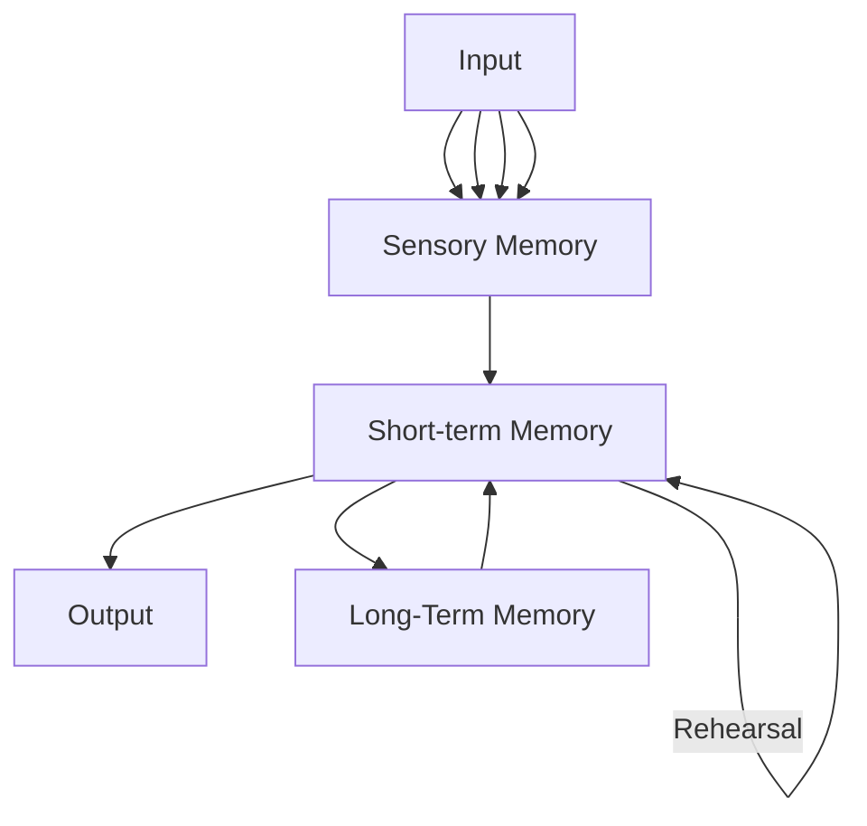

__Modal Model of Memory__: 'Modal' implies that some part of this model exists

__Simple Span Task__: Show numbers, then cover it up and ask to recite
- Capacity is around 5-9 items

__Change Detection__: Limited to about 3-4

__Absolute Identification__: Present a one dimensional stimuli, learning parts of said stimuli along a continuous series, then ask which stimuli is which