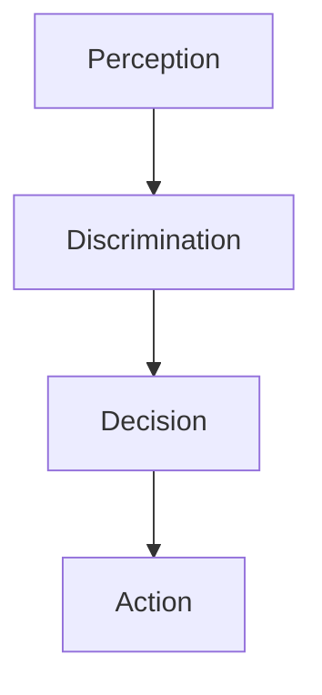

__What happens between a visual stimulus and a key-press response__:
1. Light hits the retina
2. Retinal neurons react
3. Signal propagates to the brain
4. Complicated stuff happens
5. Motor cortex issues a command
6. Signal propagates to your hand
7. Muscles contract

__Mental Chronometry__: A way of studying information-processing by Franciscus Donders
1. Build a noematachograph (thought-speed recorder)
2. Manipulate the cognitive demands of a task
3. Measure the effect on response times

__Subtractive Method__: Suppose there is a series of "processing stages", denoted as

- The primary issues is that it assumes the brain processing things in a strict step-by-step methodology and that inserting/changing one cognitive processes does not affect the others

>*Vision is an active process, and the retinal image is constantly changing*

