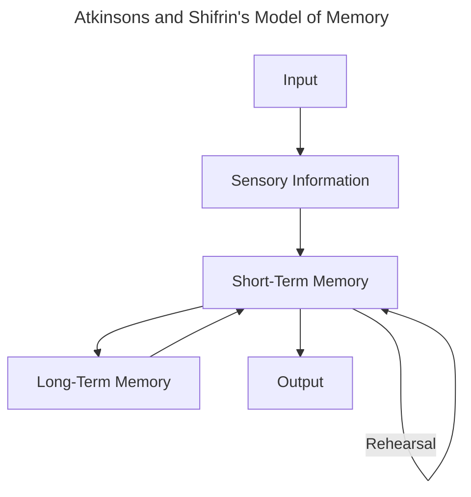
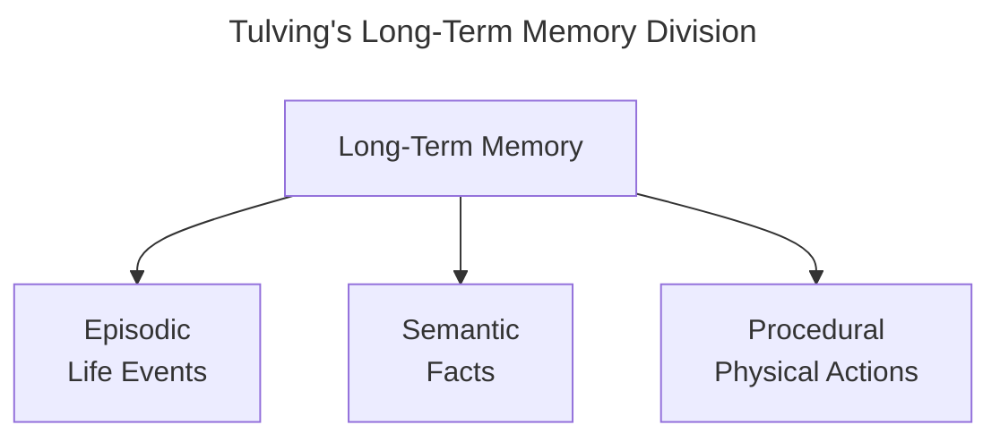

__Cognitive Psychology__: The study of mental processes, coined in 1967

__Fransicus Donders__: A Dutch physiologist
- In 1868, he performed the first cognitive psychology experiment (*How long does it take to make a decision?*)
	- Measured reaction time in two ways
		- Simple: Asking participants to push a button as quickly as they could after a stimulus presentation
		- Choice: Asking participants to push the left or right buttons after a left or right stimulus
	- Simple reaction time was calculated as $$\text{Simple Reaction Time} = \text{Stimulus Presentation Time} - \text{Behavioral Response Time}$$
		and decision time as $$\text{Decision Time} = \text{Choice Reaction Time} - \text{Simple Reaction Time}$$
- The result was a "decision" time of about 1/10 of a second
- His study did not measure mental responses directly. but inferred from behavior observations

>*The fact that mental responses cannot be measured directly, but must be inferred from observing behavior, is a principle that holds not only for Donder's experiment but for all research in cognitive psychology*

__Wilheim Wundt__: Founded the first psychology laboratory in 1879, founding structuralism as it is known today and known as the "father of experimental psychology"
- __Structuralism__: Experience is determined by combining basic elements of experience called sensations
- Wundt wanted to create a periodic table of the mind of all the "sensations" through analytic introspection
	- __Analytic Introspection__: Where trained participants described their experiences and thought processes in response to stimuli

__Hermann Ebbinghaus__: Best known for using quantitative measures for measuring memory
- Using himself as a subject, memorized nonsense syllables, then had a delay period before relearning the same syllables, measuring how long it took to learn and later relearn these syllables
	- __Savings__: The difference between the times he recorded
	- Ebbinghaus argued that the plot of percent savings by time (*savings curve)* provided a measure of forgetting

__William James__: An early American psychologist, taught Harvard's first psychology course
- Wrote one of the first textbooks on psychology based on his own observations which included topics on thinking, consciousness, attention, memory, perception, imagination and reasoning

__John B. Watson__: Founded behaviorism as a graduate student in the 1900s
- __Behaviorism__: Studies psychology as purely objective and experimental, studying behavior rather than introspection
- His most famous experiment was "Little Albert"

__Classical Conditioning__: The study of the unconscious relationship between stimuli

__B. F. Skinner__: Introduced operant conditioning
- __Operant Conditioning__: The study of behavior strengthening through reinforcement

__Edward Tolman__: initially a behaviorist, discovered *cognition* which changed the focus in psychology from behaviorism
- In 1938, he ran the rat maze experiment, where a rat explored a maze, then was placed at one point to find food at another point, Later, the rat was placed at yet another point, and still found the food despite this time not having any olfactory cues.
	- Tolman concluded that the rat develops a *cognitive map* while exploring the maze

__Noam Chomsky__: A linguist from MIT turned cognitive psychologist
- He saw language development as determined not by imitation or reinforcement but as an inborn biological program that transcends culture

__Cognitive Revolution__: A shift in psychology that started in the 1950s; a departure from the behaviorist approach that dominated previously
- Resulted in the information-processing approach to studying the mind
- This paradigm shift was due to the technology of the computer

__Information-Processing Approach__: Details an approach through tracing sequences of mental operations involved in cognition

__Artificial Intelligence__: Defined by John McCarthy in 1955 as an approach for making a machine act such that it would be considered "intelligent" if a human were acting as such

__Logic Theorist__: A machine created by Herb Simon and Alan Newell; the first computer program that created proofs for logic problems

__George Miller__: Wrote a paper where he asserted that there is a limit to the amount of information we remember ("7±2")

__Ulrich Neisser__: Wrote the first textbook acknowledging cognitive psychology in 1967
- Two main absences in this book include the study of higher processes and physiology

__Richard Atkinson/Shiffrin__: Two psychologists that proposed a model of memory in 1968
- __Sensory Memory__: Storage of incoming information/signals for milliseconds at a time
- __Short-Term Memory__: Holds information for seconds at a time; where some of sensory information makes it through
- __Long-Term Memory__: Holds information for longer periods of time, strengthened through rehearsal

__Main Early Physiological Psychology Movements__
- __Neuropsychology__: Studying behavior of those with brain lesions
- __Electrophysiology__: MEasuring electrical responses of the nervous system

__Positron Emission Tomography__: A big advancement in studying physiology in 1976 when it was first introduced
- Expensive and involves the injection of radioactive tracers

>*Modern cognitive psychology...features an increasing amount of research on cognition in "real-world cognition*

>[!abstract]
>1. *Cognitive psychology is the branch of psychology concerned with the scientific study of the mind*
>2. *The mind creates and controls mental capacities such as perception, attention, and memory*
>3. *The work of Donders (simple versus choice reaction time) and Ebbinghaus (the forgetting curve for nonsense syllables) are examples of early experimental research on the mind*
>4. *Because the operation of the mind cannot be observed directly, its operation must be inferred from what we can measure, such as behavior or physiological responding. This is one of the basic principles of cognitive psychology*
>5. *The first laboratory of scientific psychology, founded by Wundt in 1879, was concerned largely with studying the mind. Structuralism was the dominant the mind*
>6. *William James, in the United States, used observations of his own mind as the basis of his textbook, *Principles of Psychology*.*
>7. *In the first decades of the 20th century, John Watson founded behaviorism, partly in reaction to structuralism and the method of analytic introspection. His procedures were based on classical conditioning. Behaviorism's central tenet was that psychology was properly studies by measuring observable behavior, and that invisible mental processes were not valid topics for the study of psychology*
>8. *Beginning in the 1930s and 1940s, B. F. Skinner's work on operant conditioning ensured that behaviorism would be the dominant force in psychology throughout the 1950s*
>9. *Edward Tolman called himself a behaviorist but studied cognitive processes that were out of the mainstream of behaviorism*
>10. *The cognitive revolution involved a paradigm shift in how scientist thought about psychology, and specifically the mind*
>11. *In the 1950s, several events led to a decline in the influence of behaviorism and a reemergence of the study of the mind, known as the cognitive revolution. These events included the following: (a) Chomsky's critique of Skinner's Book *Verbal Behavior*; (b) the introduction of the digital computer and the idea that the mind processes information in stages, like a computer; (c) Cherry's attention experiements and Broadbent's introduction of flow diagrams to depict the processes involved in attention; and (d) interdisciplinary conferences at Dartmouth and the Massachussets Institude of Technology*
>12. *Even after the shift in psychology that made studying the mind acceptable, out understanding of the mind was limited, as indicated by the contents of Neisser's (1967) book. Notable developments in cognitive psychology in the decades following were*
>	- *Development of more sophisticated models*
>	- *Research focusing on the physiological basis of cognition*
>	- *Concern with cognition in the real world*
>	- *The role of knowledge in cognition*
>13. *Two strategies that may help in learning the chapter in the text are to read the study hints in Chapter 7, which are based on some of the things we know about memory research, and to realize that the text is constructed like a story, with basic ideas or principles folloed by supporting evidence*