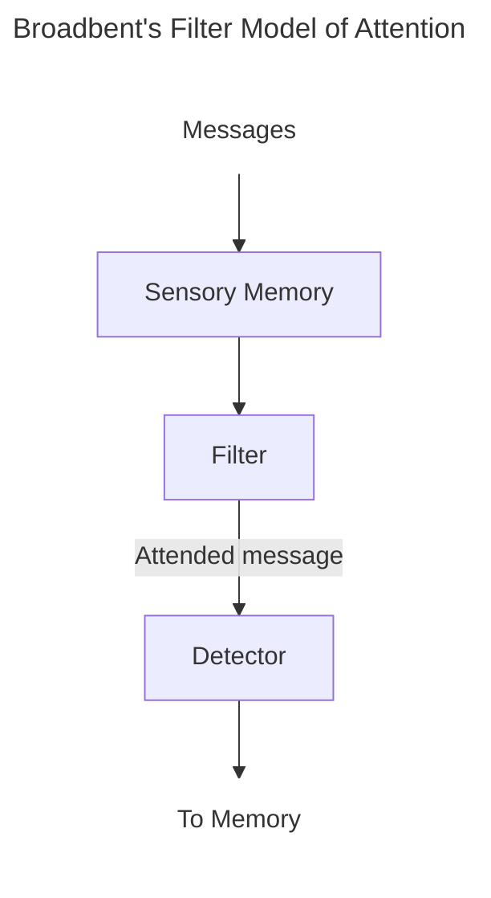
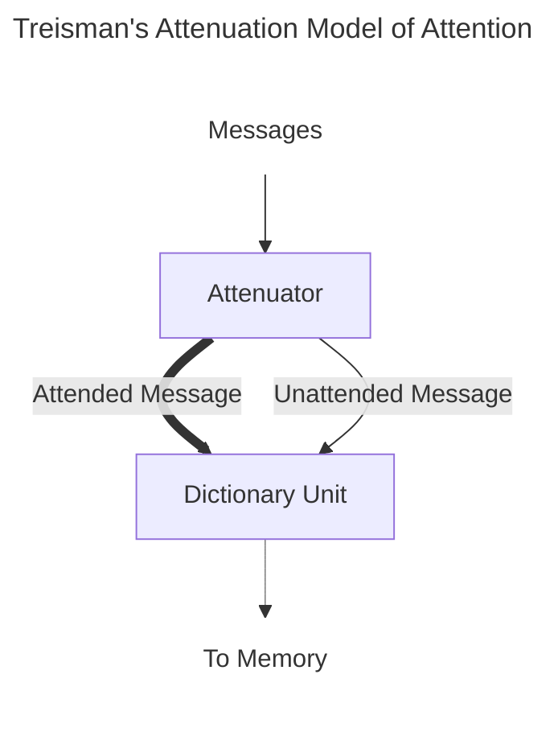

>*Modern research on attention began in the 1950s with the introduction of Broadbent's filter model of attention*

__Attentional Capture__: The rapid shifting of attention caused by strong stimuli

__Dichotic Listening__: A study technique where different stimuli are presented to each ear

__Shadowing__: Repeating the words as they are heard

__Moray (1959)__: Led to the discovery of the "cocktail party" effect
- __Cocktail Party Effect__: The ability to focus on one stimulus while filtering out the rest

__Broadbent's Model of Attention__:

__Treisman's Attenuation Model of Attention__:

__Priming__: A change in response to a stimulus caused by the previous presentation of the same or a similar stimulus
- __Repetition__: When an initial presentation of a stimulus affects the person's response to the same stimulus when it is presented later
- __Lexical__: Priming that involved the meaning of words

__Late Selection Model of Attention__: Proposes that information is processed for its meaning before attention is given selectively

__Perceptual Load__: Relates to the difficulty of a specific task (low- versus high-load tasks)

__Load Theory of Attention__: The ability to ignore task-irrelevant stimuli has proportional relationship to the load of the task the person is carrying out

__In cognitive psychology, there are two types of attention__:
- __Endogenous__: Attention that is focused voluntarily on a stimulus in a sustained, goal-driven manner
- __Exogenous__: Attention that is involuntarily directed towards in a more transient and fleeting manner

__Stroop Effect__: Naming the ink color of a word is slower and more error-prone if the word's color and meaning are incongruent

__Fixation__: A pausing of the eyes on places of interest while observing a scene

__Saccadic Eye Movement__: Movements of the eye from one fixation from one thing to another

__Overt Attention__: Shifting of attention by movement of the eyes

__Stimulus Salience is determined by__: Bottom-up processes that determine attention to elements of a scene

__Saliency Map__: A map of a scene divided by stimuli

__Scene Schema__: A person's previous knowledge that contributes

__Covert Attention__: Occurs when attention is shifted without moving the eyes

__Pre-cueing__: A technique where a cue directs attention to a specific location i the visual field before a target appears

__Same-Object Advantage__: Occurs when the enhancing effect of attention spreads throughout an object, such that the attention to one object results in the facilitation of processing other places on an object