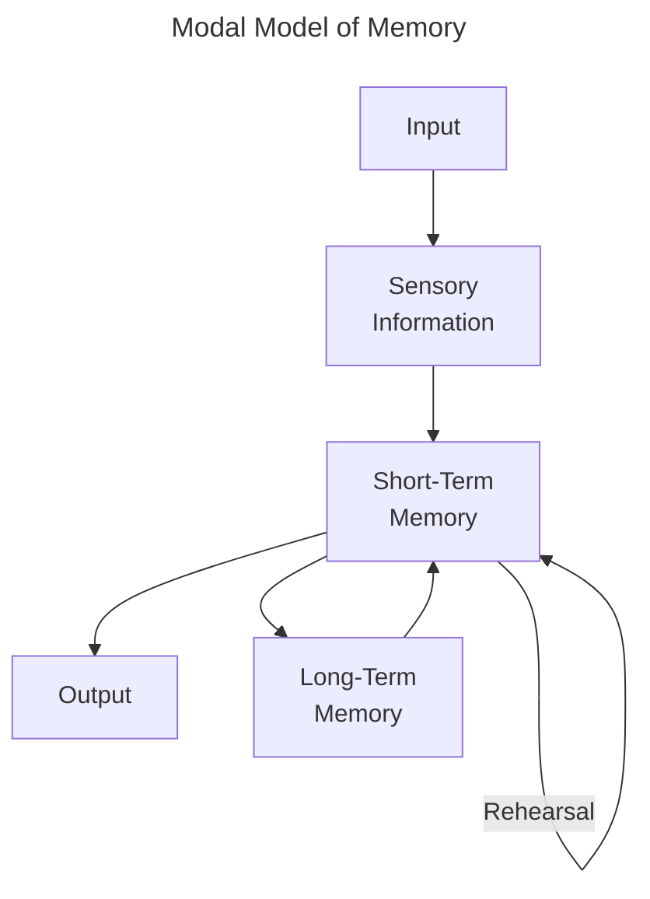
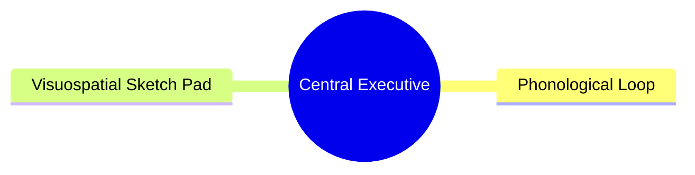
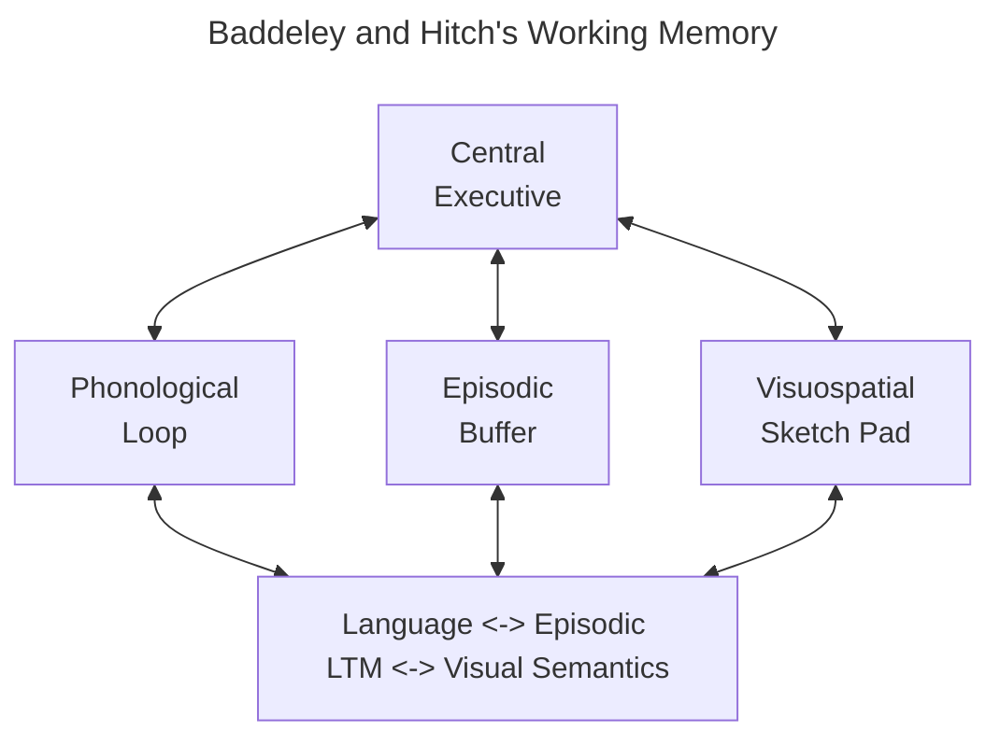

>*Memory, like attention, comes in many forms.*

__Memory__: The process involving the retention, retrieval, and the use of information after the original data is no longer present

__Modal Model of Memory__: Presented by Richard Atkinson and Richard Shiffrin (1968), proposes three kinds of memory (denoted as its __structural features__)
 - Sensory Memory: The initial stage where all incoming information is held for seconds or less than
 - Short-Term Memory: Holds five to seven items for about 15-20 seconds
 - Long-Term Memory: Holds large amounts of information for years, up to death
 - Control processes include
	 - __Rehearsal__: Repetition fo a stimulus over and over
	 - Making a stimulus more memorable
	 - Focusing attention on interesting or important information

>*One thing that becomes apparent...is that components of memory do not act in isolation*

__Control Processes__: Dynamic processes associated with the memory structure that can be controlled by somebody; differ from person to person

__Sensory Memory__: The retention of the effects of sensory stimulation

__Persistence of Vision__: The continued perception of a visual stimulus even after it is no longer present. lasting only a fraction of a second

__Sperling__ (1960): Conducted a study with an interest in knowing how much information people can take from briefly presented stimuli
- In said study, he flashes an array of letters for 50 milliseconds, then asks participants to record as many letters as possible
- Used the whole report method; resulting in participants reporting on average 4.5 letters out of 12
- Later he changed it up, using a partial report method combined with an auditory cue after the presentation of the letter array, which people reported about 3.3 letters from
	- He concluded that people saw about 82 percent of the matrix (3.3/4) but could only report part of said percent since the stimulus memory faded
- Finally, he devised an additional experiment to determine how long the fading takes by delaying the auditory cue over a series of different intervals, such that the graph produced (`Delay of tone` x `Percentage of letters available to participant`) results in a logarithmic shape
- *Conclusions*: A short-lived sensory memory system stores all/most of the information that is perceived
	- Decay is within less than a second

__Whole Report Method__: Participants report as many letters as possible from the entire 12-letter display
__Partial Report Method__: Participants report as many letters as possible from a row from the matrix presented based on the auditory cue presented afterwards
__Partial Delay Report Method__: Participants report as many letters as possible from a matrix presented followed by a delayed audio cue presented afterwards

__Iconic Memory__: Corresponds to the sensory memory stage (Modal Memory)
__Echoic Memory__: Corresponds to the sensory memory stage as well
- Lasts a few seconds longer than the iconic memory

__Short-Term Memory__: The system involved in storing small amounts of information for a brief period, most of which is lost before long-term consolidation
- Defined by cognitive psychologists to last about 15-20 seconds
	- John Brown (1958) used the method of recall to determine the duration, by presenting participants with three letters followed by three numbers
		- They later had to recall the three letters followed by a time interval of 3-18 seconds
		- Participants could recall about 80 percent of the three-letter groups after 3 seconds, which decreased to 12 percent after 18 seconds

>*...estimates for how many items can be held in the STM range from four to nine*

__Digit Span__: The number of digits a person can remember

__George Miller__ (1956): Coined the range of short term memory in his paper *The Magical Number Seven, Plus or Minus Two*
- Also introduced the idea of chunking

__Change Detection__: Detecting differences between images that are presented one after another

__Steven Luck and Edward Vogel__ (1997): Measured the capacity of short-term memory using change detection methods
- The results show that performance is almost perfect when the differences are noticeable and not in large quantities, but falter as soon as more than three objects change
- *Conclusion*: Participants can retain about four items in short-term memory

__Chunking__: The combination of small units into larger and/or more meaningful ones
__Chunk__: A collection of elements that are strongly associated with one another, and weak as an individual unit

__Story Mnemonic__: Using random items to create a meaningful order of a story

__K. Anders and Colleagues__ (1980): Ran an experiment where S.F., a college student, improves his memory span from 7 digits up to 79 digits through training in chunking and mnemonics

>*...some researchers have suggested that rather than describing memory capacity in terms of "number of items", it should be described in terms of "amount of information"*

__George Alvarez and Patrick Cavanagh__ (2004): Using Luck and Vogel's change detection procedure as a basis, they conducted an experiment instead using more complex shapes in addition to the simple squares used previously
- They found that the participants' ability to differentiate was based on the complexity of the stimuli (colored squares memory capacity was significantly greater than cubes)

>*The amount of information that can be held in STM is impacted by the attention paid to relevant information and the effective suppression of distracting information*

>*...we could compare it (STM) to a container like a leaky bucket that can hold a certain amount of water for a limited amount of time*

>*...capacity for STM may serve a functional purpose: to help us predict future sensory input. This means out leaky bucket likely leaks on purpose at least*

__Baddeley and Hitch__ (1974): Introduced the idea of working memory as opposed to previous more static models of memory
- __Working Memory__: A limited-capacity system for temporary storage and manipulation of information for complex tasks such as comprehension, learning, and reasoning
- *Conclusion*: Memory is dynamic and consists of several components that can function separately, including the
	- __Phrenological Loop__: Holds verbal and auditory information through its substructures
		- __Phonological Store__: Has a limited capacity and stores information for seconds at a time
		- __Articulatory Rehearsal Process__: Responsible for rehearsal that keeps items in the phonological store from decaying
	- __Visuospatial Sketch Pad__: Holds visual and spatial information
	- __Central Executive__: Where the major work of working memory occurs; pulling information from long-term memory and coordinating information between the phrenological loop and its structures and the visuospatial sketch pad, focusing 

>*...Working memory is concerned with the manipulation of information that occurs during complex cognition*

__Phonological Similarity Effect__: The confusion of letters or words that sound similar

__Word Length Effect__: When memory for lists of words is better for short words

__Articulatory Suppression__: When a person is prevented from rehearsing items to be remembered by repeating an irrelevant sound, such that it overloads the phrenological loop

__Visual Imagery__: The creation of visual images in the mind in the absence of a physical visual stimulus

__Perseveration__: Repeatedly performing the same action or thought even if it is not achieving the desired goal

>*A typical behavior of patients with frontal lobe damage is perserveration*

__Episodic Buffer__: Can store information and is connected to the LTM

>*The history of research on working memory and the brain has been dominated by one structure: the prefrontal cortex (PFC)*

__Phineas Gage__: Survives an accident where a tamping rod goes through his head

__Delayed-Response Task__: A monkey holds information in its working memory during a delay period
- If their prefrontal cortex is removes, their performance drops to chance level

>*...the PFC is important for holding information for brief periods*

>*The idea that information can be held in working memory by neural activity...fits with the idea that neural firing transmits information in the nervous system...some researchers have proposed that information can be held during the delay by a mechanism that does not involve continuous firing*

__Stokes__ (2015): Information can be stored by short term changes in neural networks
- During the activity state, neurons start firing briefly due to incoming information that is to be remembered and encoded into working memory
- Later in the synaptic state, connections between neurons are strengthened when the neurons cease firing, causing what Stokes calls the activity-silent working memory
	- __Activity-Silent Working Memory__: Short term changes in neural network connectivity; a hypothetical mechanism for holding information in working memory
	- This ASWM lasts only a few seconds as working memory
- When the same memory is retrieved later, the same group of neurons fires in a similar pattern
- *Conclusion*: Information is held in memory not by continuous nerve firing but by a brief change in the connectivity of neurons in a network

>*...information can be stored in the nervous system by changes in the connections in neural networks*

__Distributed Representation__: Several regions of the brain are involved in working memory

__Meredyth Daneman and Patricia Carpenter__ (1980): Carried out one of the early experiments on individual differences in working memory capacity by developing a test for working memory capacity in the reading span test
- __Reading Span Test__: Participants read a series of 13 to 16 word sentences, then immediately are asked to recite the last word in each sentence as it occurred
	- The average reading span was from 2 to 5
	- Results were highly correlated with previous reading comprehension tasks and verbal SAT scores
- *Conclusion*: Working memory capacity is a crucial source of differences in reading comprehension

>*However, individuals with good working memory ability but high testing anxiety may observe a decrease in SAT scores since cognitive resources needed for attention and working memory are divided between the exam and testing anxiety*

__Edmund Vogel et. al.__ (2005): Conducted an experiment that focused on the control of attention in the central executive to determine more specifically what differences in working memory capacity influences intelligence
- Separated participants into two groups based on a working memory test, then given a number of items depending on said test with a change detection procedure
- Their event-related potential (how much space was used in working memory) was measured
- The ERP in both groups was the same, however when distractors were added to the experiment, the lower-test group had much more ERP activity, meaning that the higher-test group had much better efficiency in ignoring distractors
	- In other words, the higher-test group had better central executive function
- *Conclusion*: Higher-capacity participants are better at tuning out distractors

__Cognitive Control__: A set of functions which allow people to regulate their behavior and attentional resources
- In other words, the effective use of endogenous attention while limiting or suppressing exogenous attention