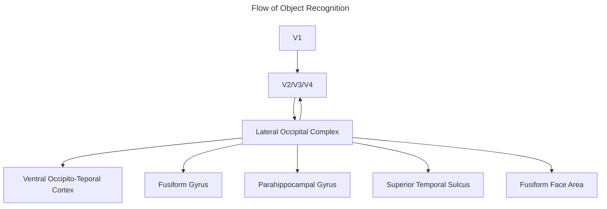

__Ventral Stream__: Composed of the occipital into the temporal lobe (the "what" stream of processing)
- Responsible for object and face knowing and subsequently naming and knowing
- Its main structures include the
	- Lateral Occipital Complex
	- Fusiform gyrus
	- Collateral sulcus
	- Parahippocampal gyrus
	- Superior Temporal Sulcus
	- Fusiform Face Area

__Lateral Occipital Complex__: Functionally defined for its sensitivity to complex shape and object structure

__Fusiform Gyrus__: Anatomically defined as lateral to the collateral fissure
- Composed of other functionally defined areas such as the
	- __Fusiform Face Area__: Specializes in face recognition
	- __Fusiform Body Area__: Specializes in body recognition (and body traits)
	- __Visual Word Form Area__: Specializes in written word and letter string recognition
		- Least researched area thus far

__Parahippocampal Gyrus__: A medial ventral temporal lobe structure, containing the functionally defined
- __Parahippocampal Place Area__: Responds specifically to traits of settings (places, environments, etc.)
	- Operates in parallel with inferior temporal cortex processing

__Hierarchical Coding Hypothesis__: Complex stimuli are represented in a hierarchy of neurons where higher-level neurons process higher-level complexities, whereas lower-level neurons process more basic stimuli
- The higher you go in structure, the more specific the stimuli has to be to trigger said structure
- Recognition is a sequential activation

__Gnostic Neuron__: Also known as the "grandmother" cell

__Ensemble Encoding Hypothesis__: Complex information is represented by the specialized and simultaneous firing of a group of neurons
- Similar objects activate overlapping populations of neurons due to shared features
- Recognition is a collective activation

__Prosopagnosia__: The inability to recognize faces despite otherwise normal vision

__Visual Agnosia__: The inability to recognize and identify familiar objects despite otherwise normal vision

