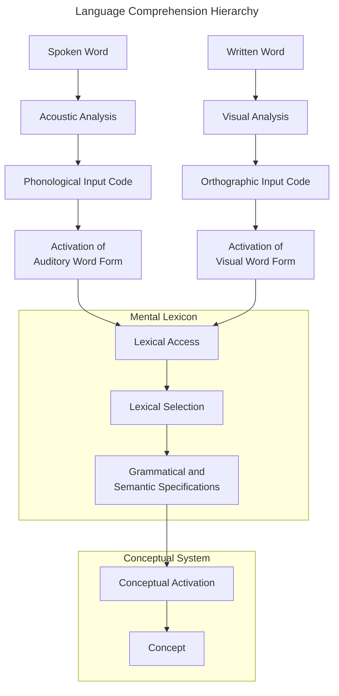
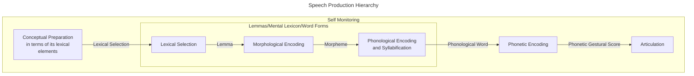

>*Language is dynamic: social pressures can lead to changes*

>*Language exists independent of any cultural construct; learning a language is inevitable*

__Speech__: A unique human ability to communicate via language
- Speech is unique not only because of our specialized vocal tracts, but also because of our unique ability to learn and use grammar and syntax

>*Chomsky argues that language is a standard equipment for humans; full-blown language is unique to humans*

>*No evidence for any non-human's ability to implement grammar in their own communication*

>*Language is a natural endowment shaped by the environment; in other words it is innately-guided learning*

__Language Acquisition Device__: A mental module that is specifically for learning grammar
- Coined by Noam Chomsky
- In other words, a mental grammar module exists
	- *Virtually every sentence that a person utters or understands is a brand new combination of words, Language cannot be a repertoire of response*
- The module is essentially a program that can build an infinite amount of words from a limited set of words
- In other words, language is a genetically-set ability

__Language Genes__:
- *FOXP2*: Linked to developmental verbal dyspraxia when missing
	- Fine motor control deficits for the lower half of the face
	- Speech is difficult
	- Morphology/Verbal/Cognitive deficits
	- May support procedural vocal learning
	- Expressed in the striatum in the basal ganglia
		- Implies procedural learning processes
	- Mutation of said gene in songbirds disrupts song learning
	- When implemented in mice, it increases dendrite length and plasticity in the striatum
	- Results indicate it supports procedural learning as well
- *CNTNAP2*: Linked to specific language impairment

>*Language dominantly lies in the left hemisphere processes for ~97% of people. Right-hemisphere can also process language, but results in mute or severely impaired grammar and awareness*

__Broca's Area__: Important for language production
- Located in the left inferior frontal gyrus; pars operularis (Broca's Area 44)/pars triangularis (Broca's Area 45)

__Wernicke's Area__: Important for language comprehension
- Located in the posterior portion of the superior temporal gyrus; part of Broca's Area 42

__Language Perception__: Also known as verbal comprehension; the reception and comprehension and decoding of language's input

__Language Production__: Also known as verbal fluency; the expressive encoding and production of language's output

__Stroke Damage__: Divided into two different kinds
- *Structural*: Visible from a CT scan
	- In said cases, tissue is likely completely dead and destroyed
- *Metabolic*: Visible from a PET scan; CT/fMRI may not show the extent of processing damage
	- With metabolic damage, function may return to afflicted regions provided they are not lesioned

__Broca's Aphasia__: Also known as non-fluent aphasia; a condition characterized by the patient knowing what they want to say, but being unable to get it out
- Symptoms include anomia (word-finding difficulty), agrammatism (deficits in grammar production/perception), and speech apraxia (saying words accurately and smoothly)

__Heschl's Gyrus__ (Transverse Temporal Gyrus): Located in the auditory cortices
- Separated by frequencies increasing from the anteriormost to the posterior

__Wernicke's Aphasia__: Also known as fluent aphasia; a condition characterized by a deficit between words and their meanings (lexical-semantic)
- Occurs in large temporal lobe lesions

>*Cognitively, sign-language relies on the same processes as spoken language, with subtle reliance on visual perceptual processing*

__Sign Language Aphasia__: Occurs in two different types
- Left frontal hemisphere damage -> Expressive Aphasia
- Left temporal hemisphere damage -> Receptive Aphasia

__Wernicke-Lichtheim-Geschwind Aphasia Model__: Tried to model and localize certain aphasias
- Inaccurate and largely ignored as of recent; networks are not localized but expansive and shared

__Voxel-Based Lesion Symptom Mapping__ (VLSM): Used to identify key brain regions underlying a neuropsychological deficits, combining structural imaging of brain lesions with neuropsychological tests to categorically diagnose and score participants
- A percentage of voxels shows damage in the patient group

__Fluency Lesions__: Primarily in the insula and arcuate fasciculus

__Comprehension Lesions__: Primarily in the middle temporal gyrus and dorsolateral pre-frontal cortex

>*In both fluency and comprehension aphasias, primary lesions are near but not exactly on Broca's/Wernicke's areas*

>*No patients had damage to only the Broca's/Wernicke's area and also had their corresponding aphasias*

__Important Anatomy__:
- Basal Ganglia/Cerebellum: Linguistic computation
- Insula: Speech production and repetitive phrases
- Right Temporal Lobe: Word level processes
- Anterior Superior Temporal Gyrus: Phrase-level processes
- Inferior Parietal Lobe: Verbal working memory

__Phoneme__: Smallest unit of sound in a language

__Morpheme__: Smallest grammatical unit

__Lexicon__: Set of words in a language

__Acoustic Sensitivity__: Areas of the brain more sensitive to sounds in general 
- Primarily the Auditory Cortices
    
__Speech Sensitivity__: Areas of the brain more sensitive to speech specifically
- More focused in the Superior Temporal Sulcus
    
__Ventral and Dorsal Streams__:
- Ventral: Towards the Posterior Inferior Temporal Lobe; processes meaning
- Dorsal: Towards the Premotor Cortex and Prefrontal Cortex; processes phonology and syntax

__Language Network__: A resting-state fMRI shows that language is more complex on the left side

__Phonology__: The smallest and shortest possible sounds of which speech is made of

__Semantics__: The meaning of words

__Syntax__: The study of grammar and its mental representation(s)

>*English has about 44 phonemes; 20 vowels and 24 consonant sounds*

__Speech Generation__:
1. Lungs move air into the airway
2. The air then generates acoustic waves in the vocal folds
3. Frequencies and sound changes based on how one changes their vocal tract
4. A formant is formed and outputted

>*Frequency is inversely linear to energy*

__Formant__: The pitch generated in the vocal fold plus the vocal tract shape
- In a spectogram, the first 2-3 formants are sufficient for phoneme identification 

__Spectrogram__: A plot of time by frequency, where the color's intensity is based on the formant's amplitude

__F2 Transition__: A quick shift at the beginning of a sound (the second formant of a phoneme) 
- Informs the brain where the sound is in relation to the mouth

__Voice Onset Time__ (VOT): The delay between a consonant voicing and the start of vocal cord vibration
- *Voiced consonants* shows both formants beginning at the same time
- *Unvoiced consonants* show formants starting with a delay interval between them

__Frequencies of Consonant Phonemes__:
- *Labials*: Formed at the lips
	- Its F2 transition is characterized by a logarithmic-like slant upwards
- *Alveolars*: Created when the tongue touches the ridge behind the teeth
	- Its F2 transition is characterized by a gradual slant downwards
- *Velars*: Created when the back of the tongue touches the palate
	- Its F2 transition is characterized by a steep slant downwards

>*Phoneme change depends on the speaker and the context between and within words*

__Coarticulation__: Phonemes do not exist just as isolate individual units but as concurring units that overlap in time

>*Speakers shape their vocal tracts to produce the end of one phoneme while also preparing for the start of the next*

>*Computer speech did not have coarticulation; phonemes were produced independently*

>*Normal speech uses coarticulation; without it we sound unnatural and weird*

__Phonology Processing__: Lower-order phonemes and sound processing occurs bilaterally along the Superior Temporal Sulcus
- Words specifically are processed in the left-hemisphere middle temporal gyrus, angular gyrus, and temporal pole

__McGurk Effect__: A mismatch between a sound and visual movement from the mouth; the brain "invents" a third completely different sound to compensate for the dissonance
- "Speech is an illusion"

>*Word and semantic-level information influences phoneme perception*

>*Randomizing letters in between words has little to no effect on the ability of skilled readers to understand text*

__Visual Word Form Area__: In the left hemisphere; superior and posterior to the fusiform face area

__Alexia__: An impaired ability to read

__Agraphia__: An impaired ability to write

>*Alexia and agraphia are doubly dissociated*

>*The visual word form area connects to other parts of the language network, whereas the fusiform face area connects to other areas of visual perception*

__Dual-Route Reading Mode__: Proposes that reading processes can be divided into two different modules; direct and indirect
- *Direct* (Orthographical/Lexical): A word as written is recognized as a visual object
- *Indirect* (Non-lexical): A word as written is converted into graphemes (letters) and then phonemes, then finally recognized as an auditory object

__Types of Dyslexia__:
- *Surface Dyslexia*: An overregularization of words, such that similar words are not distinguished
	- Considered a visual processing problem (direct)
- *Deep/Phonological Dyslexia*: An inability to read words not already recognized
	- Leads to an exclusive reliance on orthographic/direct route

__Semantic Information__: The meaning of a word

__Syntactic Information__: The rules for how words are combined to form sentences

__Word Form Information__: Can be
- *Orthographic/Visual*: How words are recognized as whole (visual objects)
- *Phonological*: A set of phonemes that can be sounded out

__Lexical Access__: The output of the perceptual system activates word representations in the mental lexicon
-  Many words can be accessed at once

__Lexical Selection__: From the resulting lexical access, one specific word is selected

__Lexical Integration__: When a word is semantically and syntactically integrated with other word through context

>*For speech production, the hierarchy is the inverse of its speech counterpart*

__Semantic Network__: The way meaning is stored as concepts
- Meanings are represented as nodes in an interconnected network
- Not strictly verbal; however most concepts are closely tied to language
	- We verbalize these concepts through word, and thus store them in said language

__Semantics and Temporal Lobe__: Activity in the temporal lobe when naming things depends on how general or specific the naming is
- Domain-level naming results in equal amounts of firing across the posterior portion, and decreases more anteriorly depending on how general the naming is

__Anomia__: A condition characterized by an inability to name something despite knowing the function of said object
- There is no deficit in comprehension or repeating words

__N400__: An ERP signal occuring when perceiving semantic anomalies
- Occurs 400ms after stimulus presentation in central and parietal sites of the brain
- Specific to semantics rather than grammar/syntax

>*Sentences can be decomposed into phrases representing parts of speech*

__Left Anterior Negativity__ (LAN): An ERP signal occurring after a syntactic violation
- Occurs about 100-300ms after a phrase structure violation (incorrect morpheme)
- Left lateralized; adjacent to the speech/comprehension centers of the brain

__P600__: A positive ERP response for syntactic anomalies
- Occurs 600 seconds after syntactical re-analysis due to word agreement errors
	- "finer details"
- Primarily detected in the parietal lobe (perhaps posterior temporal lobe due to Wernicke's area adjacency)

>*None of these ERP signals is specific to language*