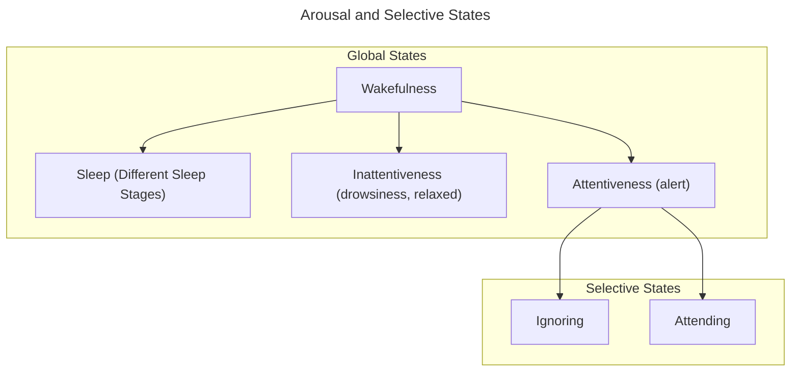

__Attention__: An engagement of mechanisms that allow for continued processing of an attended object
- Some processing occurs without attention, yet most cognition requires attention
- WIthout attention, cognitive processes don't get done well or at all
- Two main properties
	- *Limited*: One cannot attend to everything at once
		- Limited cognitive resources meas that there is competition constantly between stimuli and tasks
	- *Selective*: Attention can be directed to what one consciously is interesting

>*Unlike attention that is selective, arousal is a global bodily effect*

__Cocktail Party Effect__: A form of auditory selective attention; in a room full of verbal stimuli (people talking around you), auditory attention is focused to the person you are talking to and not to everybody else
- Changes that aren't noticed include semantic content (as well as language) and backward speech changes
	- However, when a speaker's volume, intonation, or gender changes, it is automatically noticed cognitively
	- This separation between these two suggest that there is some top-down/bottom-up dichotomy between said processes

__Dichotic Listening__: Subject(s) listen to two different audios (one in each channel) and asked to focus and shadow (repeat the audio out loud) it

__Early Selection__: ERP data suggests that there is a spike as early as 100ms when comparing attended to unattended experiment trials
- __N1 Effect__: The brain amplifies the signal related to an attended auditory stream

__Oddball Paradigm__: A classic way of measuring attention; present participant(s) with a series of "boring" stimuli, with a "target" stimuli presented every once in a while
- Can be used in conjunction with ERP to measure attention as it relates to neural activity

__Late Selection__: ERP data with the Oddball Paradigm suggests that there is a spike in activity when discerning between stimuli
- __P300 Effect__: The brain amplifies neural signals related to a unique stimuli, suggesting that there is conscious effort to discern stimuli especially since it occurs after the N1 effect
	- The area between the lines of (standard/target) suggest there is a statistical difference between attention without a unique stimuli and the latter.

__Exogenous Attention__: Alerts us to changes in the world through changes not consciously controlled
- Works as a reflex; a bottom-up process

__Endogenous Attention__: Alerts us to changes in the world by cognitively attending to something; works on a conscious level
- Functions as a top-down process

__Inattentional Blindness__: Salient stimuli goes undetected due to endogenous attention blocking out other present stimuli
- Known as "looking but not seeing"

>*To see an object we must attend to it. If we don't attend to it, we may not know that it exists*

>*Most failures of the attentional system occurs without any awareness of the failures*

__Change Blindness__: Changes can go unnoticed similar to inattentional blindness due to endogenous attention mechanisms blocking other present stimuli
- Transient signals masked by other transients

__O'Regan, Rensink, Clark__ (1997): Two images (with a single change between) separated by a blank image can lead to attention not cued
- Without the blank image, changes are attended to

>*We rely heavily on exogenous attention to detect changes. Object changes usually produce a transient signal that attracts our attention, which in turn permits us to detect change.*

>*Perception encodes much less than we think. We rely on the external world to hold most stimulus information*

__Kinds of Attention__:
- Spatial: A "spotlight"
- Feature-Based: A single qualifier makes a group of objects attentionally-enhanced
- Object-Based

__Attention Experiment Rules__;
- Keep stimuli the same across conditions
- Hold eye position and external factors constant
- Only vary what is meant to be attended to
	- Often means just one specific thing

__Overt Attention__: Specifically looking at the attended object
__Covert Attention__: Relying on peripheral vision to pay attention to something without looking at it directly

>*Eye position is separable from attention*

__Spotlight Metaphor/Model__: Participants are asked to stare at a point (in the middle of a screen) then asked to read letters that surround said point
- *Results*: Overt attention is on the point in the middle of the screen, whereas covert attention is on a selective grouping of letters
- *Conclusions*: The whole screen cannot be attended to; only a specific area (spotlit by covert attention) can be focused on

__Spatial Cueing Task__: Participants are told to attend to a side of the screen while being presented cues/targets/distractors
- Cues were presented in the middle (indicating either side, or if it indicated neither/both: *neutral*), then the target/distractor is presented either on the same side as indicated (*valid*) or not (*invalid*)
- *Results*: ERP studies show that there is a stronger neural response when attending to the non-cued side starting at around 100ms (P1)
	- Implies there is a larger focus required to attend to the opposite side
	- When attention is reoriented, there is a cost in reaction time
	- Invalid spatial cueing leads to a reorientation of attention in the right temporoparietal junction
		- In other words, salient stimuli interrupts the Dorsal Attention Network and reorients attention

__Spatial Attention Study__ (in monkeys): When shown and told to focus on either a blue rectangle or a non-blue rectangle, the respective receptive fields respond when the blue rectangle is attended to, such that it acts as if only the blue rectangle was being presented
- *Conclusion*: High-level neurons shrink their response fields according to attention processes

__Attention Modulation__: When specifically attending to something, all levels of neuron hierarchies respond accordingly, such that even the highest-level neurons shrink their receptive fields
- For lower-levels (V1/V2), overt eye tracking matters the most since they possess already small receptive fields
- Attention modulates even at the lowest level in the Lateral Geniculate Nucleus

__Feature Attention Study__ (in monkeys):

__Attentional Control__: Focused primarily in the parietal and frontal cortex networks as well as the superior colliculus

__Attentional Action__: Focused all over the brain including the thalamus

>*Attention is a network function; happens globally*

__Systems of Attention__:
- *Directed Attention Network* (Dorsal): Focuses attention
	- Endogenous; self-directed cognitive attention
	- Anatomically two important structures are the Interparietal sulcus/superior parietal lobule and the frontal eye fields (in the frontal cortex)
- *Orienting System* (Ventral): Alerts to salient stimuli outside of attentional focus
	- Can disengage from current focus
	- Exogenous; stimulus-driven attention
	- Anatomically focused in the temporal parietal junction and the ventral (pre-)frontal cortex (inferior frontal gyrus/medial frontal gyrus)

>*Systems compete for scarce attentional resources; within each system, objects compete for attention*

>*Ventral/dorsal attentional pathways are anatomically due to fasciculi*

__Superior Longitudinal Fasciculus__: Related to the Systems of Attention
- SLF I: Dorsal Attention Network
- SLF III: Ventral Attention Network

>*Parietal neurons are stimulus driven but attention leads to a stronger response*

__Disengaging Attention__: Ventral Network is activated when reorienting for invalid spatial cues, as well as when salient stimuli capture attention

__Endogenous-Exogenous Model of Attentional Control__: The Ventral and Dorsal Networks of Attention work with one another to focus and redirect attention as necessary
- Effects are stronger in the right parietal lobe
- Ventral acts as a "breaker" for the dorsal network's focused attention

__Default Mode Network__: Unlike the dorsal network, activity decreases during directed attention behaviors
- Acts inversely to the dorsal network's neural activity

__Saccade__: Eye movements, characterized as unconscious jerk movements

>*Eye position dwells on the most interesting parts of a scene*

__Saliency Map__: A bottom-up theory; parts of an image attract attention more effectively than others based on how different said part is different from its surrounding parts
- The related mapping of image interest is based on unconscious processes
	- Low level visual processes serially extracts salient parts of an image
		- Competition for attention between similarly-salient parts occurs as the whole image is processed
	- *Winner-Takes All*: Whatever has the highest concentration of competition for stimuli gets overtly attended to first
- Theoretically located in the superior colliculus
	- Pulvinar?

__Priority Map__: A more top-down theory; attention is overtly given based on stimulus salience as well as goals/values and where we have previously already looked
- A more cognitive approach than the Saliency Map
	- Combines bottom-up and top-down processes
- Theoretically anatomically located in the intraparietal sulcus

__Premotor Theory of Attention__: Attention is based on the planning of eye movement
- Attention shifting processes and goal-directed action are closely linked (since they share similar neural structures)
	- Overt and covert shifts in attention are linked as well
- *A covert shift of attention if similar to a saccadic eye movement without the physical eye movement*

>*Frontal eye field stimulation mimics the effects of paying attention to an object*

>*FEF stimulation also decreases the perceptual threshold*

>*FEF contains both eye movement and visual neurons*

>*Attention tasks that don't require eye movements modulated visual but not movement neurons, arguing against the Premotor Theory of Attention*

Neurological Deficits in Attention:
- __Hemispatial Neglect__: Usually seen for right hemiphere neglect, such that leftmost space of vision is ignored
	- Not a sensory or motor deficit, but rather a processing deficit
	- Occurs across multiple means of senses; not just vision
	- Occurs as a result of (in left-side neglect) Right Hemisphere damage to Parietal and Frontal lobes
	- Typically occurs from strokes
	- Neglect also depends on which reference frame is damaged
		- __Egocentric__: Left-right are defined relative to the position of oneself
			- Egocentric neglect is related to damage in the intraparietal lobe and the temporoparietal junction
		- __Object Centered__: Left-right are defined by the attended object, regardless of its position in space
			- Object-centered neglect is related to damage in the superior temporal gyrus
- __Extinction__: Considered a weaker form of neglect, where competition between hemispheres can lead to circumstantial neglect
	- Unlike neglect, extinction remains even 
- __Balint's Syndrome__: Damage to both hemisphere resulting in major deficits in directing attention
	- *Simultagnosia*: Can only perceive one object at a time
		- Multiple colors are perceived only if one object at a time is perceived
	- Also results in major deficits in disengaging position
	- Generally little to no control of gaze position
	- Bilateral lesions from strokes is extremely rare

__Line Bisection__: A neurological study where participants are given a bunch of horizontal lines and asked to draw bisecting lines through them
- In neglect patients, the left half of the lines are neglected
	- Additionally, the lines are slanted to the right (\\)

__Mental Imagery__: A neurological study where participants imagine a well-known setting and asked to describe the image
- Can also be asked to describe the same setting from a changed viewpoint, such that the image described includes new aspects of the same setting

>*Hemispatial neglect lesions do not occur in the dorsal attention network, but rather the ventral network*

__Superior Colliculus__: Controls overt visual attention through eye movements

__Pulvinar__: Controls covert visual attention and filters out distractors

__Basal Ganglia__: Responsible for attentional switching

__Akinesia__: The inability to produce volitional movement

__Parkinson's Disease__: A gradual loss of dopamine-producing neurons in the SNc (substantia nigra para compacta)
- Symptoms include
	- Resting tremors
	- Rigidity
	- Postural instability
	- Hypokinesia
	- Freezing
	- Bradykinesia\
- Treatments include the use of L-dopa and DBS