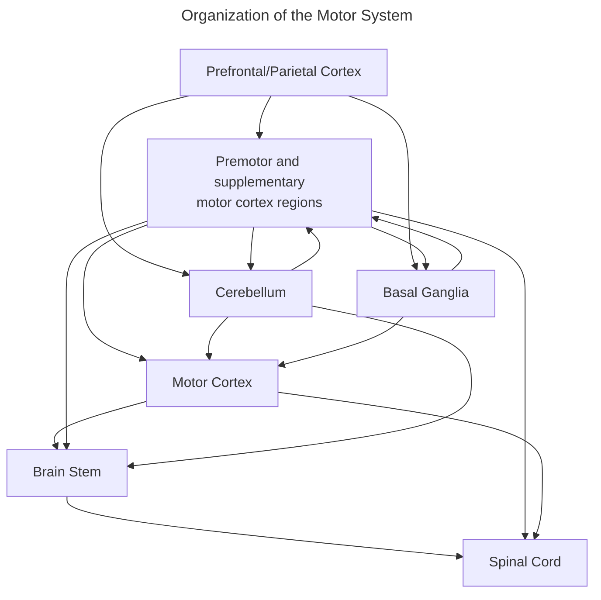
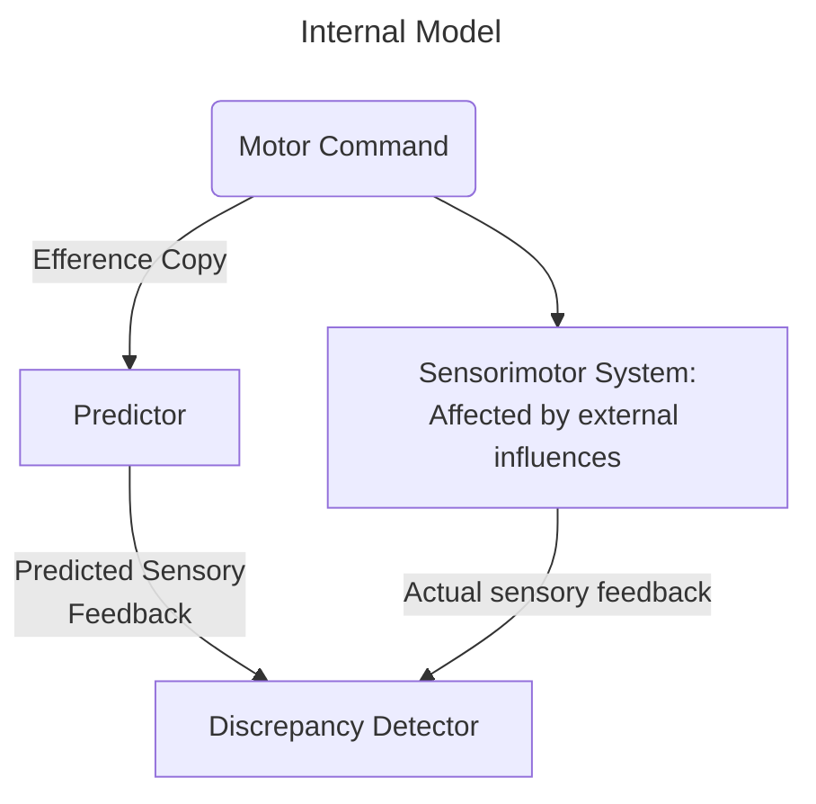

__Primary Motor Cortex__: Brodman's Area 4

__Supplementary Motor Area__: Dorsal Brodman's Area 6

__Premotor Cortex__: Ventral Brodman's Area 6

__Frontal Eye Field__: Brodman's Area 8

__Parietal Eye Field__: Brodman's Area 7

__Parietal Reach Region__: Brodman's Area 5/7

__Broca's Area__: Includes motor aspects of speech; Brodman's Area 44/45

__$\alpha$-Motor Neuron Cells__: Primarily located in the spinal cord and in the brainstem
- Activate muscle fibers
- Codes for and captures muscle movements as endpoints

__Acetylcholine__ (aCh): Makes muscle fibers contract

__Motor Unit__: A motor neuron and all the muscle fibers that it innervates
- The amount of muscle fibers attached to a motor unit depends on where the muscle neuron innervates

__Marey__ (1890): Used an electromyogram to measure membrane potential changes in muscles resting/active
- Used intramuscular electrodes, but can also use surface electrodes
- *Results*: Electrical activity meant that muscles were being contracted
	- However, muscle contractions also produced electrical changes themselves

>*Spikes in neural activity means that muscle is active*

__Ventral Horn__: A longitudinal gray matter column within the spinal cord
- Primarily contains motor neurons that activate voluntary muscles

__Muscle Map__: The more medial motor neurons in the ventral horn innervate more proximal muscles in the body, where the more distal muscles are innervated by the more lateral motor neurons
- Flexors and contracting muscles are similarly divided in the ventral horn (flexors are more dorsally/contractors are more ventrally)

__Stretch Reflex__: When muscle spindles senses stretching in the muscle, sensory signals are transmitted through the dorsal root of the spinal cord, activating $\alpha$ motor neurons and makign the muscle 

>*Supraspinal structures not necessary for basic motor patterns of stepping (as shown in cat experiements where their spinal cord was cut at the brainstem)*

__Central Pattern Generator__: Autonomous neural networks in the spinal cords
- Generates autonomic rhythmic motor behavior

>*Even when neurons were cut at their dorsal roots, walking behaviors continues*

>*Passive movement of limbs can initiate stepping*

__Paraplegia__: Loss of control of the lower limbs

__Quadriplegia__: Loss of control of all four limbs

>*Epidural stimulation in paraplegics can produce rhythmic movements consistent with walking; fine control of movement not yet achieved*

__Tonic Signaling__: Consistent neural firing/activity
__Rhythmic Signaling__: Sporadic neural activity

__Amyotrophic Lateral Sclerosis__ (ALS): A progressive motor neuron disease affecting the lateral horn of the spinal cord specifically affecting voluntary movement neurons, inevitably leading to death
- Cognitive function unimpaired
- Causes unknown: ~15% of people have congenital ALS

>*Most motor neurons decussate on their way to the spinal cord with exception of the motor neurons from the cerebellum*

__Corticospinal Tract__: Where pyramidal tract neurons (from the motor cortex) make direct contact with the brainstem

__Extrapyramidal Tract Neurons__: Originate in the midbrain/medulla

__Rostral Subdivision__: CST neurons end on spinal interneurons
- Found in most mammals

__Caudal Subdivisions__: CST neurons terminate on alpha motor neurons
- Probably due to tool use, requiring dexterous contorl of hands

__Hemiplegia__: Loss of voluntary movement
- Contralateral to lesion (in the primary motor cortex)

__Hemiparesis__: Motor weakness

__Effector__: A body part that is moved

__Primary Motor Cortex__: Mixed with effector-specific Ihardwired to specific parts of the body) and effector-independent zones
- Hand, feet, and mouth are key effector-specific zones

__Integrate-Isolate Model__: Similar to the homunculus, maps specific parts of the body to certain parts of the brain
- Unlike the homunculus, there are concentric integration zones where the torso and map jumps were

 __Equilibrium Point Hypothesis__: "Force" is not a motor command; motor commands are rather a shift in equilibrium between agonist and antagonist muscles
 - Found in studies in monkeys whose dorsal root sensory signals were cut, then performed an endpoint control experiment, where pressure was pressed against an extended arm
	 - Same endpoint results, just delayed results

>*Single motor cortex neurons are not coding the endpoint of a movement, but rather movement direction coded*

>*Individual neurons are broadly-tuned in the motor cortex; they fire for multiple different directions/angles*

>*Direction movement is captured as a low-level stimuli in the M1*

__Population Vector__: In the motor cortex, each neuron has its own preferred direction. Each neuron is its own vector pointing in said direction
- When determining what direction something is, the brain will take votes from all neurons, and in the end decides based on which vector vote wins (which neuron fires the most)

>*For motor cortex population vectors, the motor cortex codes movement directions before movement even begins*

>*For Superior Colliculus population vectors, inactivation of part of the map results in an altered motor readout*

__Brain-Computer Interface__: Records from a population of neurons in the brain, decodes using machine learning to predict future signals for behaviors like pressing a lever
- The main issue with promising approaches like these is that current implementations cannot measure all 86 billion neurons
	- BCI also relies heavily on external computer's processing power
- Useful for patients with little to no motor output or deaf/blind individuals
- Alternatives to BCI include ECog arrays or non-invasive EEGs

__Cerebellum__: Responsible for adaptive corrective motor control, as well as fine motor control
- No direct synaptic connection to the cortex
- Receives input via the pons, and outputs via the thalamus
- Timing of agonist/antagonist muscles is critical to smooth muscles movements
	- Antagonist muscles are activated without waiting for feedback stimuli, meaning that the process after agonist movement is automatic
- __Cerebellar Atrophy__: Loss of fine control and coordination
- __Cerebellar Ataxia__: loss of motor coordination due to feedback signals being disrupted

__Basal Ganglia__: Responsible for proceduralization of motor behavior
- Composed of five important structures:
	- Striatum
		- Caudate Nucleus
		- Putamen
	- Globus Pallidus
	- Subthalamic Nucleus
	- Substantia Nigra
- Receives inputs from M1, S1, and Frontal Cortex, and outputs to the Globus Pallidus
	- Also outputs to an inhibtory part of the Substantia Nigra
	- These inputs are inhibited by the basal ganglia until an action is taken, when the strongest neural signal is allowed through (disinhibited) through the direct pathway
	- Additionally, 
- Responsible for gating motor information from the cerebral cortex

__internal Model__: A model for cerebellum and motor control; the cerebellum learns what should happen during any given motor movement
- Efference Copy: A copy of a signal sent when a motor command is sent

__Parkinson's Disease__: An increased inhibition of the thalamus

__Huntington's Disease__: A neurodegenerative genetic disorders characterized by hyperkinesia and subcortical dementia (deficits in cognitive executive function and memory)
- Usually attributed to the Basal Ganglia Striatum due to inhibitory neuron loss in the indirect pathway
	- Also due to the substantia nigra, hippocampus, and cortical layers 3, 5, and 6

__Apraxia__: Loss of a motor skill due to left hemisphere damage
- A loss of motor planning; higher level disorder compared to ataxia
- A more anterior lesion results in loss of skilled movement but can recognize it from seeing it, whereas a more posterior lesion loses the ability to recognize it as well

__Motor Command Neurons__: Located in the premotor cortex; fire when making plans to or making a motor command regardless of posture and body orientation

__Mirror Neurons__: Cells respond to an action whether or not it was actually performed or just observed

>*Observing the actions of others leads us to rely on higher order motor regions to interpret the actions*