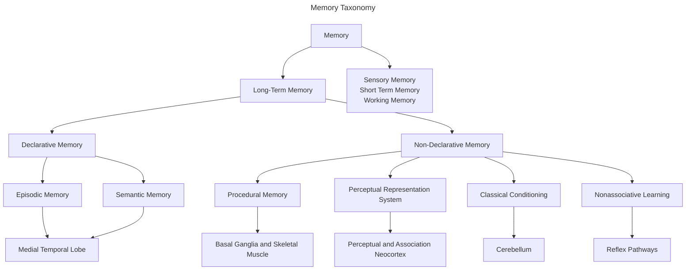
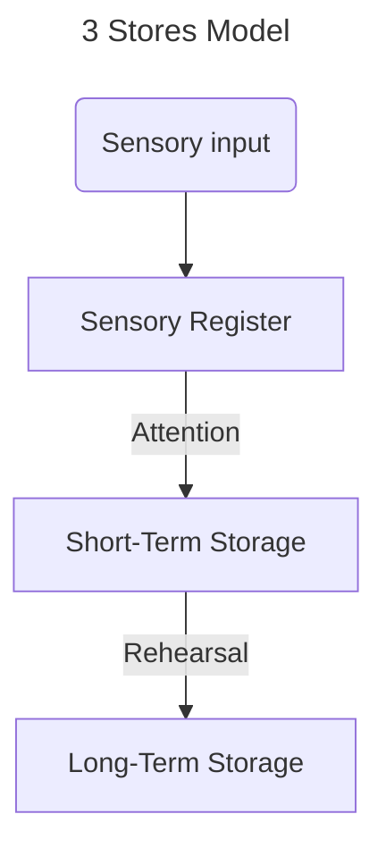
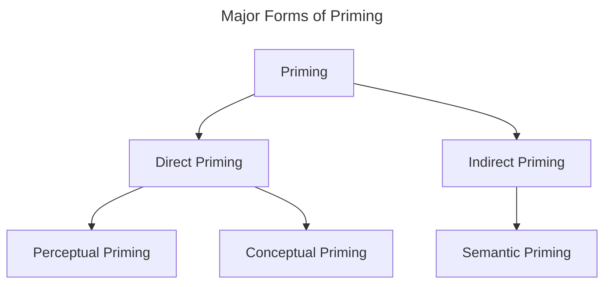

__Medial Temporal Lobe__: A combination of structures
- Hippocampus
	- Inputs primarily from the perrhinal cortex
- Amygdala
- Parrhinal Cortex
- Entorrhinal Cortex
- Parahippocampal Cortex

__Explicit Memory__: Requires conscious recollection 
- Includes recognition and recall

__Implicit Memory__: Used in stored knowledge without conscious awareness or use of previous experience

| Types of Memory          | Time Course             | Capacity            | Consciously Aware? | Mechanism of Loss      |
| ------------------------ | ----------------------- | ------------------- | ------------------ | ---------------------- |
| Sensory                  | Milliseconds to seconds | High                | No                 | Decay                  |
| Short-term/Working       | Seconds to minutes      | LImited (7±2 items) | Yes                | Interference and decay |
| Long-Term Nondeclarative | Minutes to years        | High                | No                 | Primarily interference |
| Long-Term Declarative    | Minutes to years        | High                | Yes                | Primarily Interference |

__Amnesia__: Severe loss of memory

__Head Trauma__: Not all memory is lost
- __Retrograde Amnesia__: Forgetting what happened in the past
- __Anterograde Amnesia__: Inability to form memories after trauma

__Psychogenic Amnesia__: Amnesia due to psychological trauma
- __Dissociative Fugue State__:

__Childhood Amnesia__: A normal development outcome where few early childhood memories remain in adulthood

__H.M.__: A side effect of his surgery was anterograde amnesia, as well as declarative memory formation
- His information transfer processes between short-term and long-term memory
- fMRIs later revealed there was some posterior hippocampus remained

__R.B.__: Hippocampal damage due to an ischemic event during surgery resulted in damage to CA1 pyramidal cells in the hippocampus
- Medial Temporal Lobes intact; anterograde amnesia as well as retrograde amnesia for 1-2 years before the events

__Clive Wearing__: Encephalitic damage resulted in bilateral damage to hippocampus interior frontal and temporal lobes
- Had an impaired working memory as well as retrograde and anterograde amnesia

__Alzheimer's Disease__: Degenerative memory loss through widespread brain damage
- Starts early in the medial temporal lobes
- Amyloid plaques between neurons form neurofibrillary tangles within neurons
	- Leqembi (antibodies) show promise in reducing amyloid plaques

__Medial Temporal Lobe Lesion__ (in monkeys): Monkeys were tested using the delayed non match-to-sample paradigm
- __Delayed Non Match-to-Sample Paradigm__: Participant is shown a stimulus, followed by a delay, and then has to choose a new stimulus (unlike the original) to receive the reward
- *Results*: Larger lesions resulted in more memory impairment
- *Conclusions*: The hippocampus is a vital part of memory consolidation, but the surrounding areas also support and are important

__Hebb's Rule__: Cells that fire together, wire together
- Long-term potentiation studies in the entorrhinal cortex proved this rule years later
	- Electrical stimulation resulted in a long-term increase in excitatory responses; weak and infrequent stimulation that doesn't drive post-synaptic cells resulted in a decrease in potentials

__NMDA__ (N-Methyl-D-Aspartic Acid): Relies on pre-synaptic glutamate and post-synaptic depolarization to trigger a calcium-ion influx, which in turn triggers long-term potentiation

__Theories of Hippocampal Memory Function__:
- __Cognitive Map Theory__: The hippocampus holds a representation of our spatial environment
	- Memory-guided navigation system
	- Specific cells in the hippocampus map specific areas/locations in space, and other cells in the entorhinal cortex map to specific frequencies/shapes/phases
		- __Place Cells__: Map to specific locations; located in the hippocampus
		- __Grid Cells__: Map to specific frequencies/shapes/phases; located in the entorhinal cortex
			- Each fires for a hexagonal pattern of space
- __Relational Memory Theory__: The hippocampus makes associations between things (not exclusive to places/spaces)
- __Episodic Memory Theory__: The hippocampus creates episodic memories specifically

__BIC Model__ (Binding of Items and Context): Related to the Relational Memory Theory; a continuation fo the what/where visual pathways
- *What* (Ventral): Into the Perirhinal Cortex
- *Where* (Dorsal): Into the Parahippocampal Cortex
- The hippocampus sits atop the hierarchy, dividing the work into the two pathways
	- In charge of general relational encoding

__Relational Memory__ (Odor Associations/Transitive Inference in Rodents): Rodents were conditioned between four odors, such that there is a hierarchy in odor rewarding $(A > B > C > D > E$), then tested on a pairing of stimuli that have not been previously put together (e.g. $B \& D$)
- *Results*: Lesioned rats (in the fornix) in the transitive inference test distinguish less (about 50%) than the control group
	- When tested with two previously-paired stimuli, the rats performed equally across both groups
- *Conclusions*: Damaging the fornix does not negatively impact the learning of simple associations
	- However, the hippocampal formation is critical for relational memory, and implicitly the learning of higher-level associations

__K.C.__: Suffered extensive damage to the hippocampus bilaterally, medial temporal lobes, dorsolateral prefrontal cortex, as well as his occipital and parietal lobes.
- Suffered both retrograde and anterograde amnesia
	- Has no episodic memories but semantic memories remain intact
	- Learns new semantic information slowly

__Developmental Amnesia__: Occurring in childhood, episodic memory formation is impaired
- Semantic memory is intact
- IQ remains in the low-average range

__Semantic Dementia__: A loss of all linguistic and non-linguistic semantic memory
- Non-verbal episodic memory remains intact
- Occurs due to left temporal lobe atrophy
- Unlike Alzheimer's disease, semantic dementia is more localized unilaterally

>*For memory to work, the encoding, storage, and retrieval components must all work together*

__Standard Model of System Consolidation__:
1. Information is processed throughout the brain and brought together from the prefrontal cortex/posterior parietal cortex into the hippocampus to form a memory trace
2. Over time the hippocampus strengthens connections between cortical areas, making it easier to retrieve said memory trace
3. During retrieval, the brain relies on cortical connections and the hippocampus depending on how strong the memory is; stronger memories rely less on the hippocampal structure

__Subsequent Memory Paradigm__: A method used to study memory encoding and distinguish memory formation from memory loss
1. In the encoding phase, participants undergo a brain scan (fMRI) while viewing a series of stimuli (e.g., words, images)
2. After a delay, the participants are given a memory test on the stimuli presented
3. Afterwards, researchers look back at the neural data recorded during the encoding phase, They sort the brain activity into two categories; data recorded while presented with stimuli that was later recalled and data recorded for stimuli that was forgotten

>*High activation in the Left Lateral PFC is often associated with semantic processing (thinking about the meaning of a stimulus).
>High activation in the Right Lateral PFC is frequently linked to organized monitoring and spatial processing.*

__Encoding Specific Objects__:
- Words -> Left Frontal Cortex
- Faces -> Right Frontal Cortex
- Nameable Objects -> Both Frontal Cortices

__Ribot's Law__: Older memories are more likely to persist, while more recent memories are vulnerable
- Memories exist on a temporal gradient, such that older memories are stronger/more robust with the passage of time
- Implies memory consolidation processes

__Memory Consolidation__: The set of processes by which memories become more stable over time
- *Time Scales of Consolidation*:
	- Minutes: Depends on the protein synthesis
		- Considered synaptic consolidation
	- Days: Depends partly on sleep processes
	- Years: Depends on the hippocampus
		- Considered systemic consolidation

__Neural Replay__: Similar spatial temporal pattern activity occurs when sleeping/resting
- In other words, brain activity suggests that the brain "replays" the same activity when resting; a "re-encoding" of a memory

__Multiple Trace Model fo Consolidation__: Divides memory into two different kinds of memory
- *Semantic*: Works similar to the Standard Model of Memory
	- In other words, context-free memories rely on cortical modules after consolidation over time
- *Episodic*: Unlike the Standard Model, said memories always rely on the hippocampus
	- In other words, contextually-rich memories will always rely on both cortical modules and the hippocampus for retrieval

__Reconsolidation__: Retrieval of memories leads to a renewed storage with newly-acquired context
- Reconsolidation changes the memory
	- Good reconsolidation results in integration of new information/stronger consolidation
	- Evil: Can lead to memory corruption/false memories

__False Memory__: A recalled memory of an event that did not actually happen due to memory corruption or manipulation by presenting new information later
- The existence of false memories implies that memories can be planted unwillingly, such that those with said memories believe they are remembering events that never actually happened
- Memories with low attention encoding and childhood memories are susceptible to be corrupted

__Reactivation During Memory Retrieval__: Participants are given different stimuli that activates specific sensory-specific cortices (audio -> auditory cortices, etc.) and then tested with written tests
- *Results*: Retrieval activates sensory-specific cortices, even if the retrieval process physically doesn't match the stimulus presentation mean
- *Conclusion*: The brain doesn't just store a fact; it stores an experience, and retrieval includes the recreation of said experience in the brain

>*Encoding and retrieval vary in their anatomic processes, despite having several neighboring and shared anatomy*

__Three Stores Model__ (Atkinson and Shiffrin): Memory begins with sensory inputs, passes through three different registers and storages, ending with long-term memory
- Predicts that all memories depend on short-term memory
	- Damage to short term memory damages all forms of long-term memory
- Considered widely incorrect

>*There is evidence for a double dissociation between short-term and long-term memory*

__K.F.__: Can form new declarative memories but could not hold words in working memory
- Had a lesion in his left lateral parietal lobe

__H.M.__: Had an intact working memory with deficits in acquiring new declarative information
- Had bilateral lesions in his medial temporal lobe
- Could learn perceptual and motor tasks, but was not consciously aware that he had learned them
	- In other words, his procedural learning was intact

>*K.F.'s deficits show that there are separate forms of short-term memory*

__Baddeley's Working Memory Model__: There is a central executive center dividing short-term memory into three specific looping subsystems that correspond to its specific subset of long-term memory
- The three subsystems are
	- Visuospatial Sketchpad
		- Associated with the left frontal lobe
	- Phonological Loop
		- Associated with the Dorsal Fronto-parietal lobe
	- Episodic Buffer
		- Associated with the medial temporal lobe

__Cowan Model of Working Memory__ (Embedded Process Model): Short-term and long-term memory storage is actually one large long-term memory space, where short-term memory is actually just an activated part of the long-term memory space
- The central executive (also known as the *focus of attention*) is a specific center in the short-term space with a capacity of about four items, representing what one is consciously aware of

__Skill Learning__ (Procedural Learning): A slow form of learning requiring repetition and many trials
- Relies on the striatum and basal ganglia; independent of the hippocampus
- Once an expert in a skill, its application requires little in the way of cognitive resources
- Can manifest itself in motor, perceptual, and cognitive skills

__Declarative Memory__: A quick form of learning that is cognitively demanding in practice

__Priming__: A form of implicit memory
- Aids retrieval of long-term memories
- Largely depends on pre-existing long-term memories
- Anatomically centered in the neocortex
- Aligns with the Cowan Model of Working Memory

__Conditioning__: A form of learning driven by punishment and rewarding systems
- Anatomically focused in the cerebellum and amygdala for classical conditioning

__Serial Reaction Time Task__: Participants are directed to press a sequence of buttons as fast and accurately as possible
- Reaction time is measured
- Implicitly the sequences repeat such that (indirectly) they learn the sequence and get faster at pressing the sequence
- Patients with basal ganglia damage show impairment in this task

__Weather Prediction Task__: Participants are shown different cards that predict certain odds without being told what they predict
- Participants ideally learn what the cards predict eventually
- Used for measuring probabilistic classification learning (pattern recognition)
	- For amnesiacs, this task is hard but achievable, whereas for Parkinson's patients learning is impossible
	- For this task, the medial temporal lobe is activated since it relies on declarative skill learning

>*In amnesiacs, episodic memory is severely impaired, whereas for Parkinson's patients it remains intact*

>*A double dissociation exists between the weather prediction task and paired-association task: the former activates more of the medial temporal lobe since it is a test on declarative memory, whereas a paired-association learning task activates the striatum more since it is about implicit procedural learning.*

__Word Stem Completion Task__: Participants sudy a list of words, then complete the words based on a provided list of word stems
- Participants who were pre-exposed to a list of words are more likely to use the studied words

__Granola-Jacuzzi Experiment__: H.M. was shown two different kinds of words; words he had learned after his surgery ("new") and words he had previously known before ("old") and tested for his priming abilities
- *Results*: Normal priming for old words, no priming ability for the new words
- *Conclusions*: Forming new words requires declarative memory capabilities, whereas priming does not
	- Priming, in other words, works on long-term memories (implicit memories)

__Classical Conditioning__: An innate reflex is learned and associated with an unrelated stimulus
- Purely predictive; animal's behavior does nto alter the reward/punishment outcome

__Operant Conditioning__ (Instrument Learning): A complex behavioral response is paired with a stimulus, where subjects learn to associate between them
- Controlled; behavior determines reward/punishment

>*Cerebellar damage impairs eyeblink conditioning*

>*Fear conditioning relies on the amygdala*

__Non-Associative Learning__ (Non-Hebbian): No association is required for learning to occur
- The main forms of Non-Hebbian learning is *habituation* and *sensitization*
	- __Habituation__: Reduced response to repeated stimulus
	- __Sensitization__: Increased response to repeated stimulus

