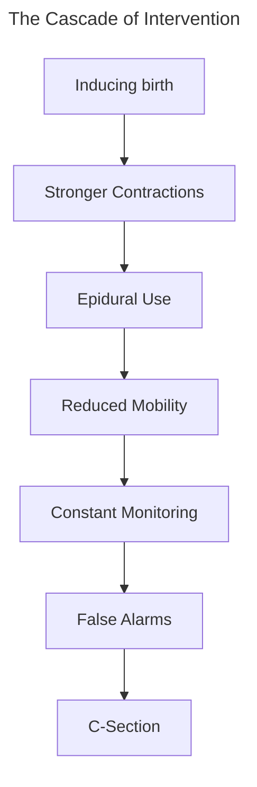

__Historic Changes in Childbirth__:
- Pre-1900s: Births were primarily at home, assisted by midwives
- Early-mid 1900s: Shift towards hospital births and physician-led care
- Post-WWII: Hospital births become the standard for birthing

__Medical Model of Childbirth__: Birth is managed through monitoring and safety, with the physician as the primary authority in the process
- The body is an unreliable system; childbirth is inherently risky
- Medical intervention is what keeps the process safe

__Medicalization__: Non-medical processes become defined as medical problems
- GIves way for physician intervention through monitoring and treatment

>*Medicalization shifts authority from individuals to medical professionals*

__Overmedicalization__: Medicalization more than necessary without improved outcomes
- Results in the routinization of medical interventions in low-risk pregnancies, standardization of monitoring, and higher reliance on medical procedures

__Maternal Mortality__: A death during pregnancy and/or within 42 days postpartum due to pregnancy or its management
- 31%: During pregnancy
- 17%: During delivery
- 52%: Postpartum
	- 19%: 1-2 days after
	- 21%: 7-42 days after
	- 12%: 43 days - 1 year after

>*The US has the highest maternal mortality rates among developed countries, with rates increasing since 2000, suggesting the medicalized US system does not result in better outcomes*

>*Black women are 2-3x more likely to die from childbirth-related causes compared to their White counterparts, and even higher for American Indian/Alaskan Native women*

>*The US has double the rate of C-sections compared to WHO guidelines*

>*Intervention begets interventions*

>*Studies show low rates of maternal-requested cesareans, yet significant rates for pressured C-sections and overall increased C-section rates.*

>*High C-section rates are primarily explained through system- and provider-based factors*

>*Black women are often treated as higher risk and receive the most C-sections not explained by patient preference*

>*1-in-6 women report experiencing mistreatment as mothers-to-be. About 65% of doulas and nurses reported witnessing mistreatment*

__Obstetric Violence__: Coerced or non-consensual medical procedures due to forces loss of autonomy in childbirth
- Manifests itself in both physical and psychological harm such as
	- Birth trauma
	- Postpartum depression
	- PTSD
	- Loss of agency

>*Evidence shows midwifery-led care leads to comparable or better maternal outcomes compared to physician-led care*

>*A successful birth should be framed as to include the mental and physical health of both parent and child, as well as being informed and autonomous*

