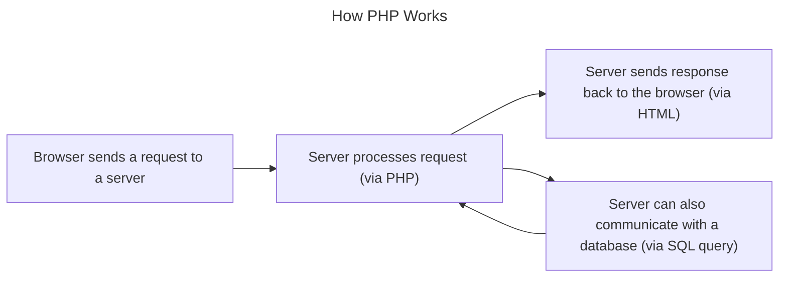

>*A popular general-purpose scripting language that is especially suited to web development*

>*PHP is known for its simplicity, speed, and flexibility*

__PHP__ (formerly Personal Home Page, now PHP Hypertext Preprocessor)

>*PHP can be written alongside HTML*

[link](https://share.goodnotes.com/s/7jJAEmeKUBYNted3hJ1T4R)
